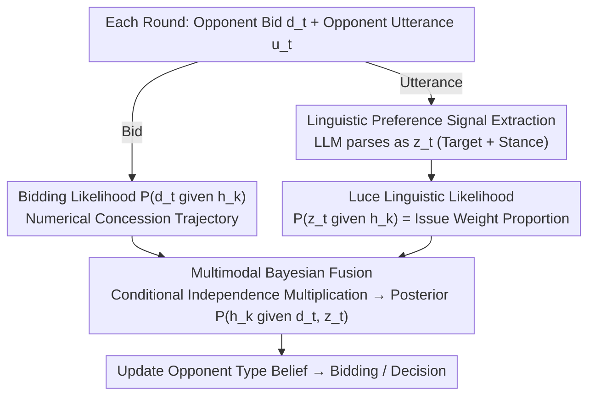

# Preference Estimation via Opponent Modeling in Multi-Agent Negotiation

**Conference**: ACL 2026 Findings  
**arXiv**: [2604.15687](https://arxiv.org/abs/2604.15687)  
**Code**: None  
**Area**: Video Understanding  
**Keywords**: Opponent modeling, Bayesian inference, preference estimation, multi-party negotiation, LLM linguistic signals

## TL;DR

Proposes a preference estimation method that integrates LLM-extracted natural language preference signals into a Bayesian opponent modeling framework. By combining qualitative cues with quantitative bidding information through a linguistic likelihood function in multi-party multi-issue negotiations, the Full Agreement Rate (FAR) is improved from 37% to 62%.

## Background & Motivation

**Background**: Automated negotiation in multi-party multi-issue scenarios relies heavily on accurate opponent modeling. Traditional methods based on the BOA architecture estimate opponent utility functions from numerical bidding history using Bayesian learning.

**Limitations of Prior Work**: (1) Purely numerical methods fail to capture qualitative preference information in natural language dialogues, resulting in incomplete information; (2) Although LLMs understand semantics, directly using LLMs for preference reasoning lacks strategic consistency and is unstable in long negotiations; (3) LLM reasoning complexity grows exponentially as the volume of information increases.

**Key Challenge**: Rich qualitative information in language (e.g., "Issue A is more important to me") cannot be utilized by traditional numerical models, whereas LLMs lack a structured belief-updating mechanism.

**Goal**: Design a preference estimation method that integrates linguistic signals into a structured Bayesian framework, achieving both semantic understanding and probabilistic inference.

**Key Insight**: Utilize LLMs to extract structured preference signals (target issue/option + stance) from utterances, and subsequently transform them into a probabilistic likelihood function via the Luce Choice Axiom to be fused with bidding likelihood for Bayesian updates.

**Core Idea**: Linguistic likelihood $\times$ Bidding likelihood $\rightarrow$ Bayesian posterior update, unifying qualitative and quantitative information within a probabilistic framework.

## Method

### Overall Architecture

Traditional BOA architectures focus solely on the opponent's numerical bidding history to reverse-engineer utility functions, ignoring qualitative statements like "Issue A is more important to me." This work enables the Bayesian framework to process two streams of evidence: in each negotiation round, the agent receives both the opponent's bid $d_t$ and the utterance $u_t$. Bidding follows the standard numerical likelihood, while the utterance is first parsed by an LLM into a structured preference signal $z_t$ and then converted into a linguistic likelihood. Both likelihoods are multiplied over the same hypothesis space $\{h_k\}$ to update the posterior $P(h_k \mid d_t, z_t)$. The LLM is responsible only for "semantic parsing and structuring," while actual belief updating is handled by the probabilistic framework. This leverages the rich information of language without being compromised by the instability of LLM reasoning.

### Key Designs

**1. Linguistic Preference Signal Extraction: Rendering sentences into computable structured signals rather than direct numerical estimation**

Directly asking an LLM to output numerical estimates of opponent utilities often leads to drift and strategic inconsistency over long negotiations. Consequently, this method narrows the LLM's responsibility to a specific task it excels at: parsing the utterance $u_t$ into a signal $z_t$ containing two attributes—Target (pointing to an issue/option or a comparison between items) and Stance (preference, opposition, etc.). This ensures the LLM outputs discrete, enumerable semantic labels rather than a continuous value requiring calculation, establishing all subsequent probabilistic operations on clean, structured input.

**2. Linguistic Likelihood based on Luce Choice Axiom: Converting preference labels into probabilities over the hypothesis space**

Once signal $z_t$ is obtained, the model must determine the probability of this utterance occurring if the opponent were indeed of type $h_k$. This work utilizes the Luce Choice Axiom from selection theory: for signals like "prefer issue $i_x$," the likelihood is the ratio of that issue's weight to the total weight under $h_k$:

$$P(z_t \mid h_k) = \frac{w_x^{(k)}}{\sum_m w_m^{(k)}},$$

Comparison signals ($i_x$ is more important than $i_y$) and opposition signals are constructed using similar relative weight logic. The advantage of the Luce Axiom is that it serves as a standard model for mapping evaluation values to selection probabilities; issues with higher weights are more likely to be "selected for mention," providing theoretical support for translating linguistic cues into likelihood functions.

**3. Multimodal Bayesian Fusion: Assuming conditional independence to allow complementary evidence to multiply in the posterior**

While bids reveal quantitative concession trajectories, language reveals qualitative priorities. This method connects them using a Naive Bayes assumption—that bid $d_t$ and linguistic signal $z_t$ are conditionally independent given a specific hypothesis. Thus, the posterior is proportional to the product of both likelihoods and the prior:

$$P(h_k \mid d_t, z_t) \propto P(d_t \mid h_k)\cdot P(z_t \mid h_k)\cdot P(h_k).$$

Although conditional independence is a simplification, it makes fusion computationally feasible. Furthermore, as bids and language carry complementary information, each compensates for dimensions missed by the other; experiments show a reduction in MSE from 189 (bidding only) to 159, reflecting this complementarity.

### Loss & Training

A model-free approach is used, with GPT-4.1 serving as the utterance parser. Bayesian updates are performed entirely online.

## Key Experimental Results

### Main Results

6-party, 5-issue sports facility construction negotiation scenario (average of 500 experiments):

| Method | FAR (Full Agreement Rate) | PAR (Partial Agreement Rate) | LAR (Potential Agreement Rate) |
|------|-----------------|-----------------|-----------------|
| Base-LLM | 0.37 | 0.76 | 0.97 |
| Base-OM (all) | 0.56 | 0.92 | 0.99 |
| LLM-PE (all) | 0.32 | 0.69 | 0.93 |
| **Ours (all)** | **0.62** | **0.89** | **0.98** |

### Ablation Study

| Method | Preference Estimation MSE (Avg) | Description |
|------|-------------------|------|
| Ours | **159** | Linguistic + Numerical Fusion |
| Base-OM | 189 | Numerical Bidding Only |
| LLM-PE | 163 | Direct LLM Inference |

### Key Findings

- Reciprocal modeling (all) shows a significant improvement over single-party modeling (p1) (FAR 0.46 $\rightarrow$ 0.62), indicating strong multi-party synergistic effects.
- Direct LLM-PE reasoning performs worse than pure numerical methods (FAR 0.32 < 0.56), validating the necessity of the proposed structured framework.
- The fusion of linguistic signals reduces MSE from 189 to 159, resulting in more accurate and balanced estimation distributions.

## Highlights & Insights

- The hybrid paradigm of "**LLM extraction + Bayesian inference**" is highly insightful—it utilizes the semantic capabilities of LLMs without relying on their reasoning consistency, using a mathematical framework to ensure structured updates.
- **Clever application of the Luce Choice Axiom**—naturally mapping preference weights to selection probabilities, providing a theoretical foundation for converting linguistic signals to likelihood functions.

## Limitations & Future Work

- Opponent utterances are assumed to be sincere, without considering deception or bluffing.
- The method was validated in a single scenario; its generalization across diverse scenarios requires further testing.
- The hypothesis space grows factorially with the number of issues, necessitating approximation algorithms for larger scales.

## Related Work & Insights

- **vs Base-LLM**: Pure LLM negotiation lacks structured preference tracking, leading to inconsistent strategies during long negotiations.
- **vs LLM-PE**: Direct LLM inference for numerical preferences is unreliable (FAR only 0.32), requiring the constraints of a probabilistic framework.

## Rating

- Novelty: ⭐⭐⭐⭐ The integration of linguistic signals with a Bayesian framework is novel.
- Experimental Thoroughness: ⭐⭐⭐ Only a single scenario with 500 experiments was tested; scenario diversity is limited.
- Writing Quality: ⭐⭐⭐⭐ Clear formalization and intuitive illustrations.
- Value: ⭐⭐⭐⭐ Provides a valuable paradigm for applying LLMs in structured decision-making.

<!-- RELATED:START -->

## Related Papers

- [\[ICML 2026\] EduMirror: Modeling Educational Social Dynamics with Value-driven Multi-agent Simulation](../../ICML2026/multi_agent/edumirror_modeling_educational_social_dynamics_with_value-driven_multi-agent_sim.md)
- [\[NeurIPS 2025\] MetaMind: Modeling Human Social Thoughts with Metacognitive Multi-Agent Systems](../../NeurIPS2025/multi_agent/metamind_modeling_human_social_thoughts_with_metacognitive_multi-agent_systems.md)
- [\[ACL 2026\] Towards Self-Improving Error Diagnosis in Multi-Agent Systems](towards_self-improving_error_diagnosis_in_multi-agent_systems.md)
- [\[ACL 2026\] MATA: Multi-Agent Framework for Reliable and Flexible Table Question Answering](mata_multi-agent_framework_for_reliable_and_flexible_table_question_answering.md)
- [\[ACL 2026\] MAGEO: From Experience to Skill — Multi-Agent Generative Engine Optimization via Reusable Strategy Learning](from_experience_to_skill_multi-agent_generative_engine_optimization_via_reusable.md)

<!-- RELATED:END -->
