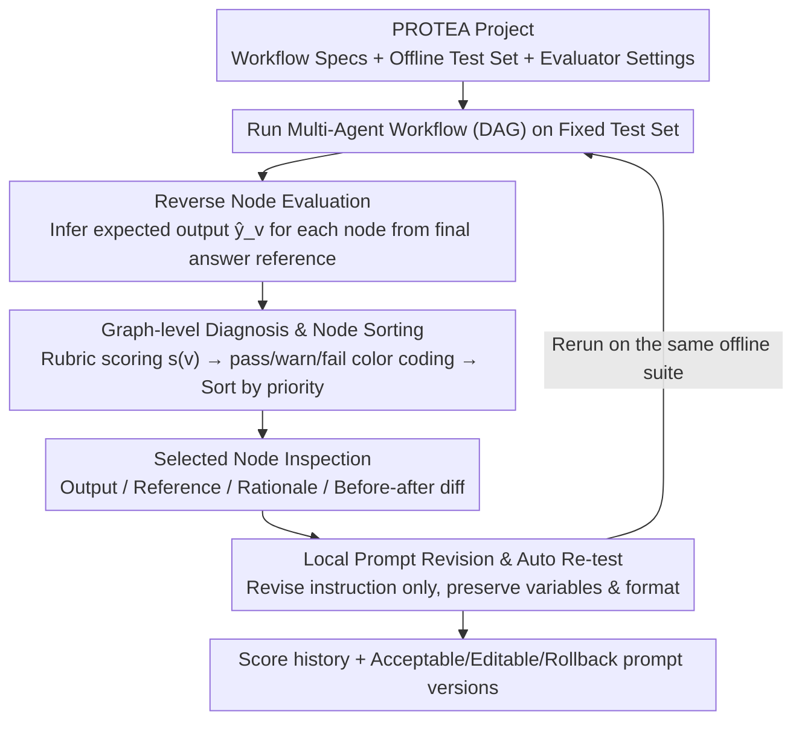

# PROTEA: Offline Evaluation and Iterative Refinement for Multi-Agent LLM Workflows

**Conference**: ACL2026  
**arXiv**: [2605.18032](https://arxiv.org/abs/2605.18032)  
**Code**: Unpublished  
**Area**: LLM Agent / Multi-Agent Workflow / Prompt Debugging  
**Keywords**: Multi-agent workflow, offline evaluation, node assessment, prompt iteration, LLM-as-a-judge

## TL;DR
PROTEA is an offline debugging platform for multi-agent LLM workflows that localizes performance degradation to specific nodes through node-level evaluation, reverse-generation of intermediate expectations, and editable prompt revisions to enable closed-loop verification.

## Background & Motivation
**Background**: LLM applications are increasingly shifting from single prompts to workflow graphs composed of specialized LLM calls for intent analysis, retrieval, planning, ranking, and generation. Frameworks like AutoGen and LangGraph facilitate this graph-based development, making system outputs more controllable.

**Limitations of Prior Work**: The cost of multi-node decomposition is debugging difficulty. When a final answer is incorrect, the root cause may lie in an upstream intermediate output that is subsequently amplified by downstream nodes; developers must sift through long traces, guess which node to modify, and manually revise prompts and rerun.

**Key Challenge**: Most existing evaluation frameworks provide end-to-end scores, and observability platforms record traces, but the closed loop from "evaluation evidence to localized repair to regression verification" still relies on manual effort. In real-world products, ground truth is often only available for the final answer, without references for each intermediate node.

**Goal**: Construct a unified interface that allows developers to run multi-agent workflows on fixed offline test sets, evaluate intermediate nodes, locate bottlenecks, view editable prompt revisions, and immediately compare behavior and score trajectories before and after modifications.

**Key Insight**: PROTEA does not attempt to fully automate workflow structure optimization. Instead, it focuses on the developer-in-the-loop debugging experience: the system is responsible for generating evidence and candidate revisions, while the human is responsible for inspecting, editing, accepting, or rolling back changes.

**Core Idea**: Infer "what should have been produced" for each intermediate node back from the final answer reference. Grade these nodes using node-level rubrics, color-code them on the workflow graph, and convert evaluator rationales into local prompt revisions.

## Method
The core of PROTEA is an evaluate → inspect → revise → re-evaluate loop on a fixed test set. It treats a multi-agent workflow as a DAG where each node has its own prompt, inputs/outputs, and evaluation criteria. After execution, it saves complete traces, node scores, rationales, generated references, and prompt versions, making every iteration comparable and reproducible.

### Overall Architecture
A PROTEA project consists of three parts: workflow specifications (importable from saved projects or LangGraph), offline test sets (with final answer references), and evaluator settings for each node (including rubrics, judge prompts, and thresholds). After loading the project, the developer runs the current workflow, triggering Auto Evaluate, which displays the pass/warn/fail status of each node on the graph. Upon selecting a node, a side panel displays the node output, reference, evaluation rationale, suggested revision, and before/after prompt diff. Once the developer accepts or edits a revision, the system reruns the same test set and displays the score history.

### Key Designs
**1. Reverse Node Evaluation: Creating inspectable expectations for every node without intermediate labels**

Real-world teams rarely maintain references for every intermediate node in a workflow. Final errors often originate in an upstream node and are amplified downstream, yet developers usually only possess the final answer label. PROTEA’s solution is to decompose end-to-end supervision into localized targets: for node $v$ in the DAG, the system synthesizes its instruction, output format, position in the graph, the requirements of its direct children, and the final answer reference to generate $\hat{y}_v$ as the expected output. Priorities are clear—the final node uses the final answer reference directly, intermediate nodes prioritize manual node references if available, and otherwise fallback to reverse-generated results or node-specific formats. While reverse generation is not identical to human ground truth, it anchors the vague judgment of "the final answer is worse" into a checkable objective of "what you should have produced," significantly lowering the barrier to diagnosis.

**2. Graph-level Diagnosis and Node Sorting: Visualizing "where to look first" without making final decisions for the developer**

The most time-consuming part of debugging multi-node workflows is reading long traces from the beginning to guess which node needs adjustment. PROTEA has each node's evaluator score multiple criteria $\sigma_d(v) \in [0,1]$, which are weighted into a node score $s(v) \in [0,1]$. These are categorized using default thresholds: $s(v) \ge 0.8$ is pass, $\ge 0.55$ is warn, otherwise fail. The interface sorts nodes by fail, warn, and pass, with lower scores within the same category ranked first. These thresholds are intentionally simple; the goal is not to package a continuous judge score as an absolute truth, but to provide a starting point for humans to focus their attention—the status and rationale provide clues, while the decision to modify remains with the developer.

**3. Local Prompt Revision and Auto Re-test: Turning rationales into adoptable, editable, and reversible changes with immediate regression**

Automated prompt optimization often slides into uncontrollable black-box searches where it is unclear what was actually changed. PROTEA strictly limits modifications to the selected node: the prompt-revision module receives the current instruction, evaluation rationale, and improvement suggestions to produce a revised instruction and a short explanation, while strictly maintaining variable names and output formats and avoiding leaking test content into the prompt. After the developer accepts (or manually edits) the revision, the system reruns the same offline suite and presents behavior changes and score trajectories via before/after diffs. Because changes are small, boundaries are clear, and diffs are provided, these revisions naturally fit into team reviews and regression management rather than unconstrained prompt searching.

### Loss & Training
PROTEA is a system tool and does not train new models; its "optimization objectives" are derived from node-level judge scores and final task metrics on offline test sets. The automated iteration mode, Auto Loop, repeats the evaluate → revise → re-evaluate cycle for a fixed number of rounds, but only retains a prompt revision if repeated checks confirm improvement and stable behavior.

The evaluation itself follows a rubric-based LLM-as-a-judge approach: comparing node outputs to references yields criterion scores, an overall score, a rationale, and a direction for improvement. The paper identifies a failure boundary—for near-binary metrics like numerical exact-match, evaluator feedback becomes too sparse (either perfect or zero, with no gradient), requiring the introduction of partial-credit criteria such as intermediate facts, reasoning steps, or format validity to provide usable feedback.

## Key Experimental Results

### Main Results
PROTEA was used for developer-in-the-loop iterations on two production-adjacent internal workflows and a small-scale quantitative evaluation via an automated iteration stress test.

| Scenario | Workflow Scale | Metric | Initial Performance | After PROTEA | Note |
|------|------------|------|----------|-----------|------|
| Corp Doc Check | 5 nodes | item-level accuracy | 64.3% | 83.9% | Revisions mostly focused on making intermediate outputs explicit and tightening node rubrics |
| Conv Rec/Match | 6 nodes | Hit@5 | 0.30 | 0.38 | Final references helped track constraint propagation via reverse node evaluation |
| User Study | 6 developers | Qualitative feedback | N/A | Approved | Key value: graph localization, node rationale, and before/after revisions |

### Ablation Study
The automated iteration stress test used 11 workflows independently generated by an LLM based on documentation; all 11 could run end-to-end. The quantitative table focuses on 5 workflows where initial prompts were intentionally weak to allow room for auto-improvement, comparing the no-rewrite baseline with the best score from three rounds of Auto Loop.

| Workflow | No-rewrite baseline | Auto Loop best | Gain | Note |
|--------|---------------------|----------------|------|------|
| HTTP log triage | 0.307±0.029 | 0.648 | +0.341 | Automated revisions brought clear improvement |
| Course scheduling | 0.186±0.001 | 0.800 | +0.614 | Largest improvement |
| Incident ticket | 0.333±0.110 | 0.840 | +0.507 | Significant improvement in structured output/constraints |
| Refuse/clarify | 0.208±0.027 | 0.390 | +0.182 | Improved but by a smaller margin |
| Word problem | 0.000±0.000 | 0.000 | 0.000 | Exact-match numerical metrics provide no partial feedback |

### Key Findings
- On the internal document checking task, PROTEA increased accuracy from 64.3% to 83.9%, demonstrating that node-level evidence effectively supports manual prompt refinement.
- On the recommendation workflow, Hit@5 increased from 0.30 to 0.38; though the gain is smaller, it directly relates to final recommendation quality, showing that reverse references assist in constraint propagation analysis.
- In the automated iteration, 4 out of 5 minimal-prompt workflows exceeded the no-rewrite baseline, with 3 achieving a Gain over 0.3; however, the word problem task failed entirely, exposing the limits of near-binary evaluation signals.
- In the user study, 6 experienced developers specifically valued graph-level localization, per-node rationale, and editable before/after prompt revisions, indicating the paper's contribution is more about "development loop design" than a standalone algorithm.

## Highlights & Insights
- Reverse node evaluation is practical: It acknowledges that missing intermediate references is the norm and uses final answers and graph structure to generate "good enough, checkable" local expectations rather than requiring perfect initial labeling.
- PROTEA integrates evaluation, traces, prompt versions, and rerun comparisons in a single interface, reducing the time-consuming context switching inherent in multi-agent debugging.
- The pass/warn/fail threshold design, while simple, is human-friendly; it avoids masquerading a continuous judge score as absolute truth and instead functions as a "worth looking here" prompt.
- The automated mode retains the human-in-the-loop philosophy: even with Auto Loop, the system emphasizes fixed suites, stable behavior, and regression comparison rather than unconstrained prompt searching.

## Limitations & Future Work
- PROTEA currently primarily supports fixed DAG workflows and local prompt revisions; it does not handle cyclic control flows, supervisor-based coordination, or long-term interactive agents.
- LLM-as-a-judge calibration remains a core risk. Different judges, rubrics, or inherent randomness can affect node status; production deployment requires multi-judge agreement and manual auditing.
- Reverse-generated node references are only candidate expectations and may back-project biases from the final answer onto upstream nodes; the interface allows manual editing, but the paper lacks large-scale calibration experiments.
- Future versions could support architecture-level edits, such as adding nodes, reconnecting dependencies, auto-generating partial-credit rubrics, and exporting prompt versions to CI regression suites.

## Related Work & Insights
- **vs OpenAI Evals / lm-evaluation-harness / promptfoo**: These tools excel at end-to-end measurement and regression but typically do not localize failures to specific workflow nodes; PROTEA focuses on graph-level diagnosis and local repair.
- **vs LangSmith / Phoenix / Langfuse**: Observability platforms provide traces and prompt management, whereas PROTEA further integrates node evaluation, reverse references, and revision suggestions into the same closed loop.
- **vs DSPy / OPRO / APE**: Auto-prompt optimization focuses on searching under an objective function; PROTEA focuses on how developers understand, audit, and compare changes within specific multi-node workflows.
- **Insight**: Evaluation for complex LLM applications should not merely report final scores but should anchor diagnostic evidence at the node level and ensure every prompt modification is recorded with before/after regressions on the same suite.

## Rating
- Novelty: ⭐⭐⭐⭐☆ Reverse node evaluation and the closed loop for graph-level prompt revision address real multi-agent debugging pain points.
- Experimental Thoroughness: ⭐⭐⭐☆☆ Includes two production-adjacent cases, auto stress tests, and user studies, but internal task details are not fully reproducible due to confidentiality.
- Writing Quality: ⭐⭐⭐⭐☆ Clear system flow and honest discussion of limitations; methods and formulas serve the interface design without over-complication.
- Value: ⭐⭐⭐⭐⭐ Highly practical for teams maintaining multi-node LLM workflows, specifically as an offline regression and prompt review tool.

<!-- RELATED:START -->

<!-- RELATED:END -->

## Related Papers

- [\[AAAI 2026\] FinRpt: Dataset, Evaluation System and LLM-based Multi-agent Framework for Equity Research Report Generation](../../AAAI2026/multi_agent/finrpt_dataset_evaluation_system_and_llm-based_multi-agent_framework_for_equity_.md)
- [\[ACL 2026\] AgenticEval: Toward Agentic and Self-Evolving Safety Evaluation of Large Language Models](agenticeval_toward_agentic_and_self-evolving_safety_evaluation_of_large_language.md)
- [\[ACL 2026\] Seeing the Whole Elephant: A Benchmark for Failure Attribution in LLM-based Multi-Agent Systems](seeing_the_whole_elephant_a_benchmark_for_failure_attribution_in_llm-based_multi.md)
- [\[ACL 2026\] Social Dynamics as Critical Vulnerabilities that Undermine Objective Decision-Making in LLM Collectives](social_dynamics_as_critical_vulnerabilities_that_undermine_objective_decision-ma.md)
- [\[ACL 2026\] Conjunctive Prompt Attacks in Multi-Agent LLM Systems](conjunctive_prompt_attacks_in_multi-agent_llm_systems.md)

<!-- RELATED:END -->
