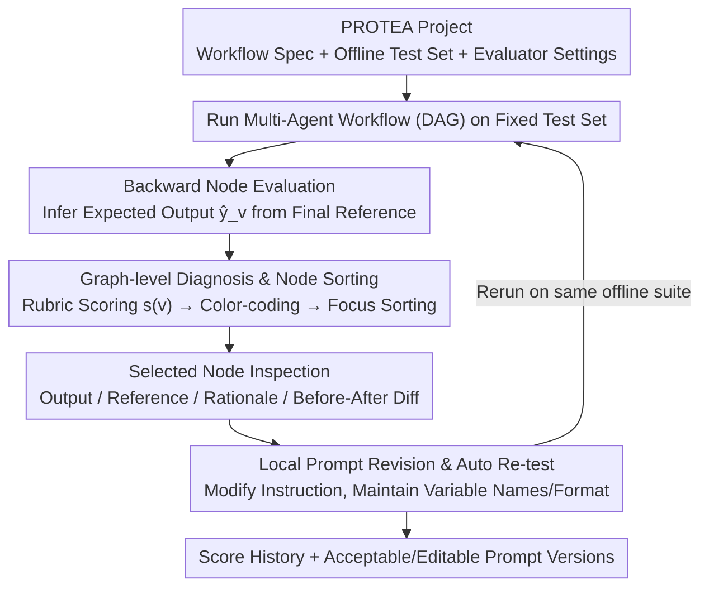

# PROTEA: Offline Evaluation and Iterative Refinement for Multi-Agent LLM Workflows

**Conference**: ACL2026  
**arXiv**: [2605.18032](https://arxiv.org/abs/2605.18032)  
**Code**: Not publicized  
**Area**: LLM Agent / Multi-Agent Workflows / Prompt Debugging  
**Keywords**: Multi-Agent Workflow, Offline Evaluation, Node Assessment, Prompt Iteration, LLM-as-a-judge

## TL;DR
PROTEA is an offline debugging platform for multi-agent LLM workflows. It localizes the cause of degraded final answers to specific nodes through node-level evaluation, backward-generated intermediate expectations, and editable prompt revisions, enabling a closed-loop verification of modification effects.

## Background & Motivation
**Background**: LLM applications are increasingly shifting from single prompts to workflow graphs composed of specialized LLM calls for intent analysis, retrieval, planning, ranking, and generation. Frameworks like AutoGen and LangGraph facilitate this graph-based development, making system outputs more controllable.

**Limitations of Prior Work**: The cost of multi-node decomposition is debugging difficulty. When the final answer is incorrect, the root cause may lie in an upstream intermediate output amplified by downstream nodes. Developers must manually parse long traces, guess which node to modify, update prompts, and rerun the system.

**Key Challenge**: Existing evaluation frameworks primarily provide end-to-end scores. While observability platforms log traces, the closed loop from "evaluation evidence to local repair to regression verification" still relies on manual effort. In real-world products, ground-truth labels are often available only for the final answer, not for every intermediate node.

**Goal**: Construct a unified interface that allows developers to run multi-agent workflows on fixed offline test sets, evaluate intermediate nodes, locate bottlenecks, view editable prompt revisions, and immediately compare behavior and score trajectories before and after modifications.

**Key Insight**: PROTEA does not attempt fully automated optimization of workflow structures. Instead, it emphasizes a developer-in-the-loop debugging experience: the system produces evidence and candidate revisions, while humans inspect, edit, accept, or roll back changes.

**Core Idea**: Infer "what should have been produced" for each intermediate node backward from the final answer reference. Use node-level rubrics for scoring, color-code nodes (red/yellow) on the workflow graph, and convert evaluator rationales into local prompt revisions.

## Method
The core of PROTEA is an evaluate → inspect → revise → re-evaluate loop on a fixed test set. It treats the multi-agent workflow as a Directed Acyclic Graph (DAG) where each node has its own prompt, inputs/outputs, and evaluation criteria. After execution, it saves full traces, node scores, rationales, generated references, and prompt versions to allow for comparison and replay across iterations.

### Overall Architecture
A PROTEA project consists of three parts: workflow specifications (imported from projects or LangGraph), offline test sets (with final answer references), and evaluator settings for each node (including rubrics, judge prompts, and thresholds). After loading the project, the developer runs the workflow to trigger Auto Evaluate, which displays pass/warn/fail states on the graph. Selecting a node opens a panel showing outputs, references, evaluation rationales, suggested revisions, and before/after prompt diffs. Once the developer accepts or edits a revision, the system reruns the test suite and displays the score history.

### Key Designs
**1. Backward Node Evaluation: Creating Inspectable Expectations Without Intermediate Labels**

Real-world teams rarely maintain references for every intermediate node. Errors often originate upstream and amplify downstream, leaving developers with only final answer labels. PROTEA decomposes end-to-end supervision into local targets: for a node $v$ in the DAG, the system generates $\hat{y}_v$ as the expected output by synthesizing its instruction, output format, graph position, downstream requirements, and the final answer reference. Priority is clear—final nodes use final references, intermediate nodes use manual node references if available, falling back to backward-generated results or format-based fallbacks. While not perfect ground truth, this converts vague "final answer failure" into checkable per-node objectives, lowering the diagnostic barrier.

**2. Graph-level Diagnosis and Node Sorting: Visualizing "Where to Look First"**

The most time-consuming part of debugging multi-node workflows is guessing which node failed by reading long traces. PROTEA evaluates each node against multiple criteria to produce scores $\sigma_d(v) \in [0, 1]$, aggregated into a node score $s(v) \in [0, 1]$. Simple thresholds are applied: $s(v) \ge 0.8$ is a **pass**, $\ge 0.55$ is a **warn**, otherwise **fail**. The UI sorts nodes by fail, warn, then pass status. This thresholding provides a starting point for human intervention rather than presenting a judge score as absolute truth.

**3. Local Prompt Revision and Auto Re-testing: Converting Rationales into Actionable, Editable Changes**

Automated prompt optimization often leads to uncontrollable black-box searches. PROTEA strictly limits modifications to the selected node: the prompt-revision module receives the current instruction, rationales, and suggestions to produce a revised instruction and a brief summary. It enforces stability in variable names and output formats and prevents "leakage" of test-specific content into the prompt. After the developer accepts or edits the revision, the system reruns the offline suite and presents behavior changes and score trajectories via before/after diffs.

### Loss & Training
PROTEA is a system tool and does not train new models. Its "optimization objective" is derived from node-level judge scores and final task metrics on offline test sets. An **Auto Loop** mode repeats the evaluate → revise → re-evaluate cycle for a fixed number of rounds but only retains revisions if checks show genuine improvement and stable behavior.

Evaluation utilizes rubric-based LLM-as-a-judge. Comparisons between node outputs and references yield criterion scores, overall scores, a rationale, and a direction for improvement. The study notes that for binary metrics like exact-match, evaluator feedback becomes too sparse (zero or one), requiring partial-credit criteria like intermediate facts or formatting validity to provide useful gradients.

## Key Experimental Results

### Main Results
PROTEA was evaluated using developer-in-the-loop iterations on two production-proximate internal workflows and a small-scale quantitative assessment via an automated stress test.

| Scenario | Workflow Scale | Metric | Initial Performance | After PROTEA | Note |
| :--- | :--- | :--- | :--- | :--- | :--- |
| Enterprise Doc Check | 5 Nodes | item-level accuracy | 64.3% | 83.9% | Revisions focused on explicit intermediate outputs. |
| Dialogue Matching | 6 Nodes | Hit@5 | 0.30 | 0.38 | Backward evaluation helped track constraint propagation. |
| User Study | 6 Developers | Qualitative Feedback | N/A | High Acceptance | Value found in localization and before/after diffs. |

### Ablation Study
The automated stress test used 11 workflows generated independently by LLMs from documentation. The quantitative table focuses on 5 workflows where initial prompts were intentionally weak, comparing a no-rewrite baseline with the best score from three Auto Loop rounds.

| Workflow | No-rewrite baseline | Auto Loop best | Gain | Note |
| :--- | :--- | :--- | :--- | :--- |
| HTTP log triage | $0.307 \pm 0.029$ | 0.648 | +0.341 | Clear improvement from auto-revisions. |
| Course scheduling | $0.186 \pm 0.001$ | 0.800 | +0.614 | Largest improvement gained. |
| Incident ticket | $0.333 \pm 0.110$ | 0.840 | +0.507 | Improved structural output/constraints. |
| Refuse/clarify | $0.208 \pm 0.027$ | 0.390 | +0.182 | Moderate improvement. |
| Word problem | $0.000 \pm 0.000$ | 0.000 | 0.000 | Exact-match provides no partial feedback. |

### Key Findings
- PROTEA increased accuracy from 64.3% to 83.9% in internal doc checking, demonstrating that node-level evidence effectively supports manual prompt refinement.
- In recommendation workflows, Hit@5 improved from 0.30 to 0.38; though the gain was smaller, it showed that backward-generated references help analyze constraint propagation.
- In 4 out of 5 "weak prompt" workflows, the system outperformed the baseline; however, it failed on mathematical word problems, exposing the limitations of near-binary evaluation signals.
- User studies revealed that experienced developers prioritize graph-level localization and per-node rationales over fully automated optimization, confirming the value of the "development loop" design.

## Highlights & Insights
- **Practicality of Backward Evaluation**: It acknowledges that intermediate references are usually missing and uses final answers and graph structure to generate "good enough" local expectations.
- **Reduced Context Switching**: By integrating evaluation, traces, prompt versions, and reruns into one UI, PROTEA reduces the most time-consuming part of multi-agent debugging.
- **Human-Centric Design**: The pass/warn/fail thresholds are designed to provide a starting point for human inspection rather than masquerading as absolute truth.
- **Stability and Regression**: Even in auto-mode, the system emphasizes fixed suites and regression comparisons rather than unconstrained prompt searching.

## Limitations & Future Work
- PROTEA currently supports fixed DAG workflows and local prompt revisions, not handling cyclic control flows, supervisor-based coordination, or long-term interactive agents.
- **LLM-as-a-judge Calibration**: Risks include judge bias and stochasticity. Production deployment requires multi-judge agreement and human auditing.
- **Reference Accuracy**: Backward-generated references are only candidate expectations and might back-project biases from the final answer to upstream nodes.
- **Future Directions**: Supporting architectural edits (e.g., adding nodes/edges), automated generation of partial-credit rubrics, and exporting prompt versions to CI regression suites.

## Related Work & Insights
- **vs. OpenAI Evals / promptfoo**: These tools excel at end-to-end measurement but do not localize failures to specific nodes. PROTEA focuses on graph-level diagnosis.
- **vs. LangSmith / Langfuse**: While these observability platforms manage traces and prompts, PROTEA integrates node evaluation and backward references into a closed loop.
- **vs. DSPy / OPRO**: These focus on search-based optimization. PROTEA focuses on how developers understand, audit, and compare changes within complex workflows.
- **Insight**: Evaluation for complex LLM applications should not just report final scores but should push diagnostic evidence down to the node level and record every prompt change with its corresponding regression history.

## Rating
- **Novelty**: ⭐⭐⭐⭐☆ Backward node evaluation and the graph-level revision loop directly address real-world multi-agent pain points.
- **Experimental Thoroughness**: ⭐⭐⭐☆☆ Includes production-proximate cases and user studies, though some internal task details are restricted.
- **Writing Quality**: ⭐⭐⭐⭐☆ Clear systemic flow and honest assessment of limitations.
- **Value**: ⭐⭐⭐⭐⭐ Highly practical for teams maintaining multi-node LLM workflows, especially as a tool for offline regression and prompt review.

<!-- RELATED:START -->

## Related Papers

- [\[AAAI 2026\] FinRpt: Dataset, Evaluation System and LLM-based Multi-agent Framework for Equity Research Report Generation](../../AAAI2026/multi_agent/finrpt_dataset_evaluation_system_and_llm-based_multi-agent_framework_for_equity_.md)
- [\[ACL 2026\] AgenticEval: Toward Agentic and Self-Evolving Safety Evaluation of Large Language Models](agenticeval_toward_agentic_and_self-evolving_safety_evaluation_of_large_language.md)
- [\[ICML 2026\] Smarter Saboteurs, Better Fixers: Scaling & Security in Linear Multi-Agent Workflows](../../ICML2026/multi_agent/smarter_saboteurs_better_fixers_scaling_security_in_linear_multi-agent_workflows.md)
- [\[ACL 2026\] Social Dynamics as Critical Vulnerabilities that Undermine Objective Decision-Making in LLM Collectives](social_dynamics_as_critical_vulnerabilities_that_undermine_objective_decision-ma.md)
- [\[ACL 2026\] Conjunctive Prompt Attacks in Multi-Agent LLM Systems](conjunctive_prompt_attacks_in_multi-agent_llm_systems.md)

<!-- RELATED:END -->
