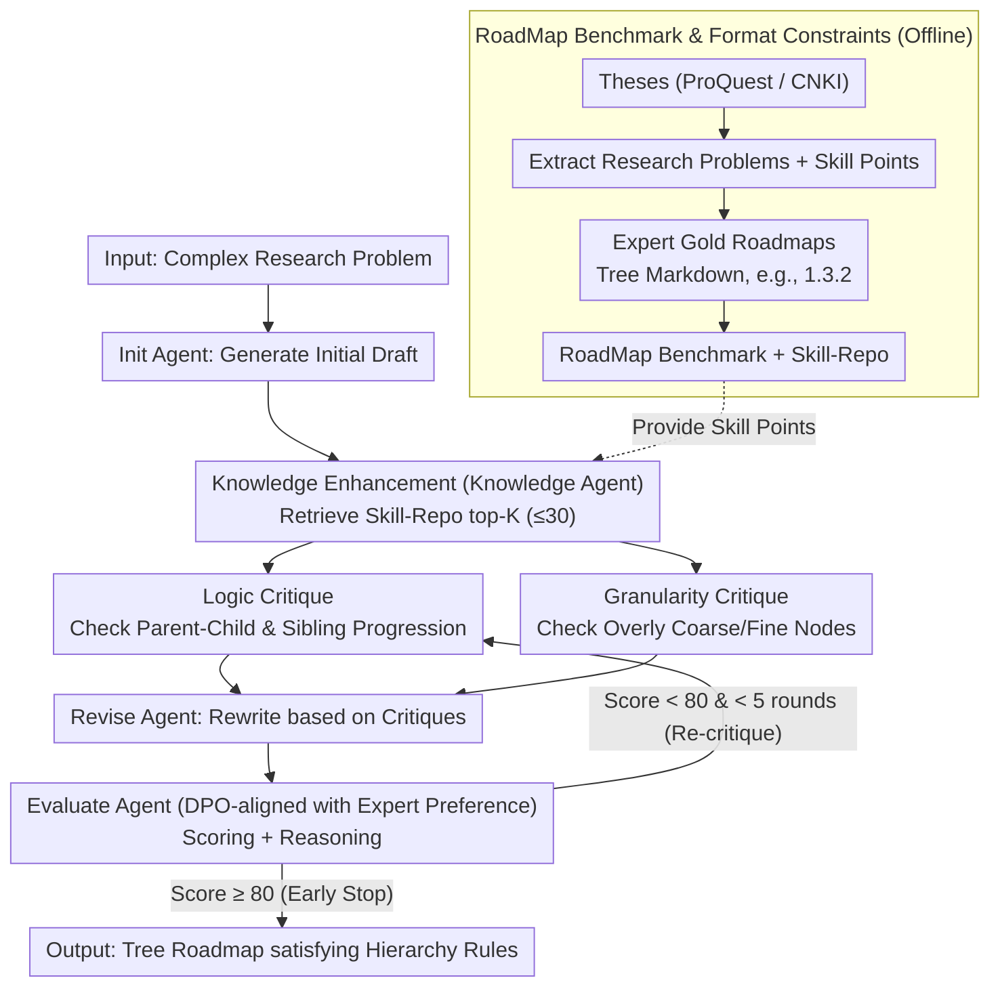

# RoadMapper: A Multi-Agent System for Roadmap Generation of Solving Complex Research Problems

**Conference**: ACL2026 Findings  
**arXiv**: [2604.27616](https://arxiv.org/abs/2604.27616)  
**Code**: https://github.com/BUPT-Reasoning-Lab/RoadMapper  
**Area**: LLM Evaluation / Multi-Agent Systems / AI for Science  
**Keywords**: Research Roadmap Generation, Multi-Agent, DPO Evaluator, Structured Content Generation, RoadMap Benchmark

## TL;DR
Ours proposes the RoadMap research roadmap generation benchmark and the RoadMapper multi-agent system. By forming a closed loop with knowledge retrieval, logic/granularity critiques, revision, and a DPO evaluator, it improves performance by 7-9 points on average over direct prompting for complex research problems in Chinese and English, while significantly reducing the time cost for expert roadmap design.

## Background & Motivation
**Background**: Researchers often use tables, flowcharts, knowledge graphs, or mind maps to organize complex knowledge. However, such structured content mostly serves information display rather than decomposing a research problem into an executable, hierarchically clear solution route. Existing LLMs can write proposals, list steps, or perform long-text QA, but specialized task definitions and evaluation benchmarks for "how to solve complex research problems step-by-step" are still lacking.

**Limitations of Prior Work**: Manual roadmaps require experts to consult vast professional knowledge and undergo iterative revisions, which is costly and time-consuming. When prompted directly to generate roadmaps, LLMs tend to suffer from three issues: insufficient expertise, unreasonable task decomposition, and chaotic logical relationships between nodes. Especially in scientific research, a roadmap is not a simple list but must balance depth, breadth, execution order, and coverage of key steps.

**Key Challenge**: Roadmap generation requires both expert-level domain knowledge and project-management-style structural consistency and logical progression. A single prompt struggle to simultaneously handle knowledge completion, hierarchical decomposition, logical verification, granularity control, and stopping judgment. Therefore, it is necessary to decompose the complex generation process into multiple collaborative sub-roles.

**Goal**: The authors first define the research roadmap generation task and construct the RoadMap benchmark. Based on this benchmark, RoadMapper is designed to place the LLM into a "critique-revise-evaluate" iterative loop after knowledge enhancement. Finally, the quality and efficiency of roadmaps are validated using automated metrics, ablation studies, and expert evaluations.

**Key Insight**: The paper observes that high-quality roadmaps often resemble the abstraction of graduate theses by experts: theses naturally contain research problems, key technologies, and solution paths. Therefore, the authors extract research problems and skill points from Master's and PhD theses, then guide experts to generate "golden roadmaps," forming a data source that combines professional depth with structural constraints.

**Core Idea**: A multi-agent system decomposes roadmap generation into six roles: initial draft, knowledge enhancement, logical critique, granularity critique, revision, and evaluation. A DPO-trained evaluator learns expert preferences, enabling the system to generate structured answers that more closely resemble expert roadmaps within limited iterations.

## Method
The key to RoadMapper is not simply wrapping an agent framework, but formalizing the "research roadmap" as a verifiable Markdown tree and designing the data, retrieval, evaluation, and iteration mechanisms around this format. The entire process consists of two layers: an offline layer to construct RoadMap and Skill-Repo, and an online layer where RoadMapper generates roadmaps for new research problems.

### Overall Architecture
The input is a complex research problem, and the output is a tree-structured roadmap satisfying Markdown hierarchical rules. The system begins with the Init Agent generating an initial draft, followed by the Knowledge Agent retrieving relevant skill points from Skill-Repo to supplement the roadmap. It then enters an iterative loop (max 5 rounds): the Logic Critique Agent checks parent-child and sibling logic, the Granularity Critique Agent checks if nodes are too coarse or fine, and the Revise Agent rewrites the roadmap based on both critiques. The Evaluate Agent determines if the passing standard is met. If the evaluator gives an acceptance result, it enters early stopping; otherwise, it proceeds to the next round.

The RoadMap benchmark is derived from Master's and PhD theses from ProQuest and CNKI. The authors filtered papers by publication time, author status, and university strength, used Gemini 2.5 Flash to extract core research problems and skill points, and then had experts generate golden roadmaps. The final dataset includes 1,705 golden roadmaps, 8,436 skill points, 10 research areas, and 5 research types, covering both Chinese and English.

### Key Designs
**1. RoadMap Benchmark and Format Constraints: Standardizing the task into an evaluable tree structure.**
Without strong format constraints, models easily write roadmaps as simple suggestion lists, making structural quality incomparable. Ours defines every roadmap as a Markdown tree where each line includes a hierarchy, number, and title. Numbers must satisfy hierarchical relationships (e.g., `1.3.2`), where parent-child nodes represent refinement and siblings represent parallel or progressive steps. This format enables the calculation of structural metrics like DegreeScore and DepthScore. The benchmark data from ProQuest and CNKI ensures professional depth and structural constraints by leveraging the "problem-technology-path" structure inherent in academic theses.

**2. Knowledge Enhancement and Dual Critique Agents: Diagnosing roadmaps from three distinct perspectives.**
The typical flaws of a roadmap—insufficient expertise, illogical node relationships, and improper granularity—stem from different root causes. RoadMapper separates these: the Knowledge Agent retrieves top-K skill points (up to 30) from Skill-Repo to supplement professional depth; the Logic Critique Agent focuses specifically on parent-child refinement and sibling progression; and the Granularity Critique Agent handles node density. Decoupling logic and granularity ensures that each piece of feedback is focused on a specific axis rather than vague generalities.

**3. DPO-trained Evaluate Agent with Early Stopping: Teaching the system "when to stop."**
A common issue in multi-agent iteration is "over-editing," where excessive rounds damage the structure. Ours equips the Evaluate Agent with a stopping judgment aligned with expert preferences. Using Qwen3-32B, candidate evaluations were generated, and 7 experts voted for the best and second-best evaluations to construct 818 preference pairs. DPO was used to align the evaluator with expert standards. During inference, if the score reaches the threshold of 80, the process stops. Choosing the "second-best" as the negative sample forces the model to learn subtle professional judgments rather than just distinguishing between obviously good and bad outputs. Results show convergence in approximately 1.64 / 1.51 rounds, saving 36.5% time and 45.8% tokens compared to ReConcile.

### Loss & Training
Training is only conducted for the Evaluate Agent. Given preferred and non-preferred evaluation samples from experts, DPO is employed to increase the probability of the preferred output and decrease the non-preferred output relative to a reference model. Negative samples are specifically chosen from "second-place" votes to force the model to learn fine-grained evaluation criteria. During inference, the maximum iteration is set to 5, the passing score is 80, and the Knowledge Agent retrieves a maximum of 30 skill points.

## Key Experimental Results

### Main Results
The paper compares Direct Prompting, Best-of-N, CoT, ReConcile, DyLAN, and RoadMapper across 11 models using StepScore, LogicScore, DegreeScore, DepthScore, and an Average score.

| Base Model | Method | EN Avg | CN Avg | Overall Avg | Main Conclusion |
|-------|------|--------|--------|-------------|----------|
| Llama 3.1 8B | Direct Prompting | 61.24 | 60.01 | 60.62 | Small models are weak in both structure and content. |
| Llama 3.1 8B | RoadMapper | 67.68 | 67.95 | 67.82 | Overall gain of 7.20 points. |
| Llama 3.3 70B | Direct Prompting | 63.16 | 61.04 | 62.10 | StepScore for CN split is only 38.16. |
| Llama 3.3 70B | RoadMapper | 70.69 | 70.20 | 70.45 | Gain: 7.53 (EN), 9.16 (CN). |
| DeepSeek-V3.2 | Direct Prompting | 71.03 | 73.20 | 72.12 | Strong models still limited by direct prompting. |
| DeepSeek-V3.2 | RoadMapper | 79.14 | 80.08 | 79.61 | Gain: 8.11 (EN), 6.88 (CN). |

### Ablation Study

| Configuration | StepScore | LogicScore | DegreeScore | DepthScore | Avg. |
|------|----------|------------|-------------|------------|------|
| w/o Knowledge Agent | 45.44 | 59.60 | 73.11 | 88.76 | 66.73 |
| w/o Logic Critique Agent | 48.29 | 56.94 | 74.17 | 88.46 | 66.97 |
| w/o Granularity Critique Agent | 47.51 | 58.74 | 74.80 | 87.37 | 67.11 |
| w/o DPO | 49.83 | 60.20 | 74.67 | 88.25 | 68.24 |
| RoadMapper | 51.28 | 62.37 | 77.37 | 90.77 | 70.45 |

### Key Findings
- **Knowledge Agent** is most critical for covering key steps; removing it drops StepScore from 51.28 to 45.44.
- **Logic Critique Agent** contributes most to LogicScore; removing it drops LogicScore to 56.94.
- **Early Stopping** mechanism achieves high quality in ~1.6 rounds, saving significant time and tokens compared to ReConcile.
- **Expert Pairwise Evaluation** shows GPT-4o mini matches experts 93% of the time, and RoadMapper outperforms baselines in 86% of cases.

## Highlights & Insights
- The most valuable contribution is creating a complete "Task-Benchmark-Method-Metric" loop. Many agent papers only show system performance; this defines structural and evaluative dimensions for future research.
- The split of dual critique agents is practical: logical relationships and granularity are different axes of quality. Merging them would make feedback too vague.
- Using "second-best" as the negative sample for DPO is clever because roadmap evaluation involves subtle judgments rather than obvious mistakes.
- Use of structural metrics (Degree/Depth) moves beyond simple text similarity to measure the organizational logic of scientific plans.

## Limitations & Future Work
- RoadMap is derived from Master's/PhD theses, which may bias roadmaps toward academic narratives; industrial or cross-disciplinary roadmaps may differ and require further data.
- Content metrics (StepScore, LogicScore) rely on GPT-4o mini. While the expert matching rate is high, it may still inherit LLM-as-judge biases.
- High computational cost relative to direct prompting, although early stopping mitigates this for complex problems.

## Related Work & Insights
- **vs. Structured Content Generation**: Previous works focused on appearance; RoadMapper emphasizes the "executability" and guidance for solving problems.
- **vs. Generalized Multi-Agent Systems**: Unlike ReConcile or DyLAN, RoadMapper binds specific agent roles to roadmap error types (knowledge, logic, granularity).
- **Insight**: For scientific assistance systems, "generating an answer" is not always the goal; generating a checkable, iterative, and expert-adjustable intermediate structure is often more valuable.

## Rating
- Novelty: ⭐⭐⭐⭐☆
- Experimental Thoroughness: ⭐⭐⭐⭐☆
- Writing Quality: ⭐⭐⭐⭐☆
- Value: ⭐⭐⭐⭐⭐

<!-- RELATED:START -->

<!-- RELATED:END -->

## Related Papers

- [\[CVPR 2026\] Paper2Figure: A Multi-Agent Collaborative System for Figure Generation Towards Academic Research Paper](../../CVPR2026/multi_agent/paper2figure_a_multi-agent_collaborative_system_for_figure_generation_towards_ac.md)
- [\[AAAI 2026\] FinRpt: Dataset, Evaluation System and LLM-based Multi-agent Framework for Equity Research Report Generation](../../AAAI2026/multi_agent/finrpt_dataset_evaluation_system_and_llm-based_multi-agent_framework_for_equity_.md)
- [\[ICML 2026\] EngiAgent: Fully Connected Coordination of LLM Agents for Solving Open-ended Engineering Problems with Feasible Solutions](../../ICML2026/multi_agent/engiagent_fully_connected_coordination_of_llm_agents_for_solving_open-ended_engi.md)
- [\[ACL 2026\] Memory-Augmented LLM-based Multi-Agent System for Automated Feature Generation on Tabular Data](memory-augmented_llm-based_multi-agent_system_for_automated_feature_generation_o.md)
- [\[AAAI 2026\] AgentODRL: A Large Language Model-based Multi-agent System for ODRL Generation](../../AAAI2026/multi_agent/agentodrl_a_large_language_model-based_multi-agent_system_fo.md)

<!-- RELATED:END -->
