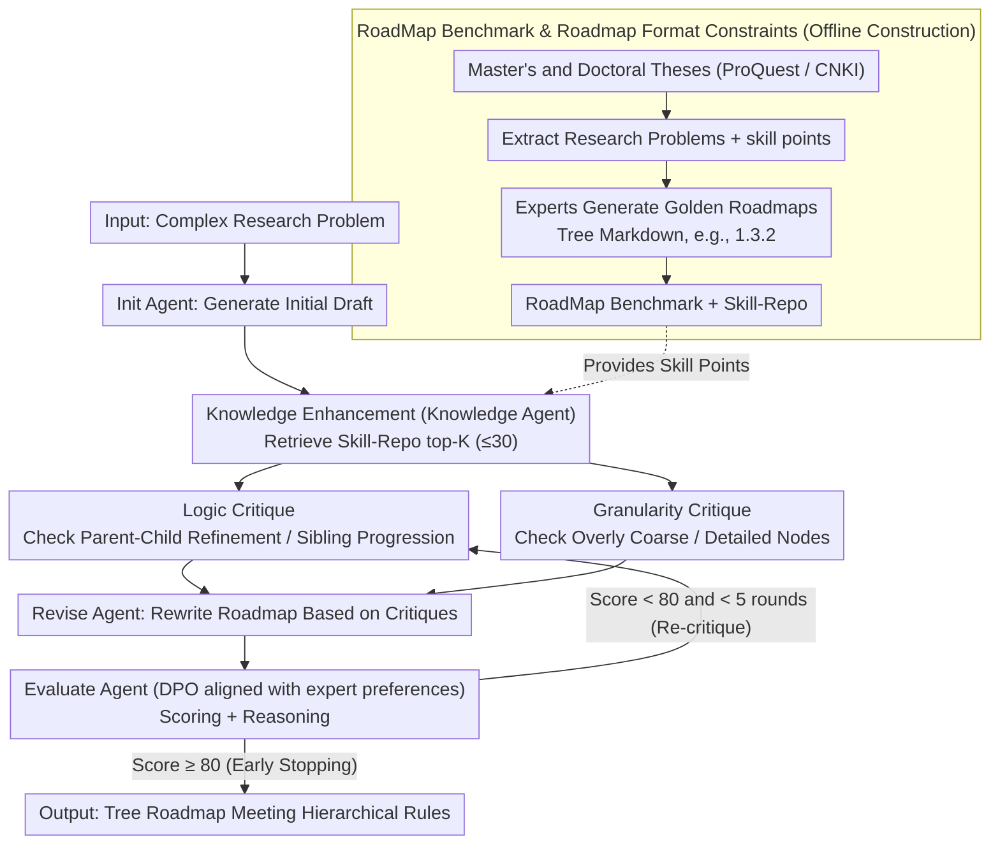

# RoadMapper: A Multi-Agent System for Roadmap Generation of Solving Complex Research Problems

**Conference**: ACL2026 Findings  
**arXiv**: [2604.27616](https://arxiv.org/abs/2604.27616)  
**Code**: https://github.com/BUPT-Reasoning-Lab/RoadMapper  
**Area**: LLM Evaluation / Multi-agent Systems / Scientific Research Assistant  
**Keywords**: Research Roadmap Generation, Multi-Agent, DPO Evaluator, Structured Content Generation, RoadMap Benchmark

## TL;DR
This paper proposes the RoadMap research roadmap generation benchmark and the RoadMapper multi-agent system, which forms a closed loop consisting of knowledge retrieval, logic/granularity critiques, revision, and a DPO evaluator. On complex Chinese and English research problems, it improves performance by an average of 7-9 points compared to direct prompting and significantly reduces the time cost for experts to design roadmaps.

## Background & Motivation
**Background**: Researchers often use tables, flowcharts, knowledge graphs, or mind maps to organize complex knowledge. However, these structured contents mostly serve information presentation rather than decomposing a research problem into an executable, hierarchically clear solution route. Existing LLMs can write plans, list steps, or perform long-text QA, but there is a lack of specific task definitions and evaluation benchmarks for roadmap generation targeting "how to solve complex research problems step-by-step."

**Limitations of Prior Work**: Manual roadmaps require experts to consult vast professional knowledge and undergo repetitive revisions, which is high-cost and time-consuming. When prompting LLMs directly to generate roadmaps, three issues frequently arise: insufficient professional knowledge, unreasonable task decomposition, and chaotic logical relationships between nodes. Especially in scientific research scenarios, a roadmap is not a common list; it must balance depth of knowledge, breadth of knowledge, execution order, and coverage of key steps.

**Key Challenge**: Roadmap generation requires both expert-level domain knowledge mastery and project-management-style structural consistency and logical progression. A single prompt struggle to handle knowledge completion, hierarchical decomposition, logical verification, granularity control, and stopping judgment simultaneously. Therefore, the complex generation process needs to be decomposed into multiple collaborative sub-roles.

**Goal**: The authors first define the research roadmap generation task and construct the RoadMap benchmark. Then, based on this benchmark, they design RoadMapper, allowing the LLM to enter a "critique-revise-evaluate" iterative loop after knowledge enhancement. Finally, the quality and efficiency of the roadmaps are verified through automatic metrics, ablation studies, and expert evaluations.

**Key Insight**: High-quality roadmaps often originate from expert abstractions of graduate theses, as theses naturally contain research problems, key technologies, and solution paths. Therefore, the authors extract research problems and skill points from master's and doctoral theses, which experts then guide to generate "golden roadmaps," forming a data source with both professional depth and structural constraints.

**Core Idea**: A multi-agent approach is used to decompose roadmap generation into six roles: "Initial Draft, Knowledge Enhancement, Logic Critique, Granularity Critique, Revision, and Evaluation." A DPO-trained evaluator is used to learn expert preferences, enabling the system to generate structured answers closer to expert roadmaps within limited iterations.

## Method
The key to RoadMapper is not simply applying an agent framework but formalizing the "research roadmap" into a verifiable tree-like Markdown format first, then designing data, retrieval, evaluation, and iteration mechanisms around this format. The entire process consists of two layers: the offline layer for building RoadMap and Skill-Repo, and the online layer for using RoadMapper to generate roadmaps for new research problems.

### Overall Architecture
The input is a complex research problem, and the output is a tree-like roadmap satisfying Markdown hierarchical rules. The system starts with an Init Agent generating an initial draft, followed by a Knowledge Agent retrieving relevant skill points from the Skill-Repo to augment the roadmap. Subsequently, it enters an iterative loop of up to 5 rounds: a Logic Critique Agent checks the logic of parent-child and sibling nodes, a Granularity Critique Agent checks if nodes are too coarse or too fine, and a Revise Agent rewrites the roadmap based on both types of critiques. Finally, an Evaluate Agent determines if the passing standard is met. If the evaluator gives an acceptance result, it stops early; otherwise, it proceeds to the next round.

The RoadMap benchmark is derived from master's and doctoral theses from ProQuest and CNKI. The authors filtered papers by publication time, author identity, and university strength, used Gemini 2.5 Flash to extract core research problems and skill points, and had experts generate golden roadmaps. The final dataset includes 1,705 golden roadmaps, 8,436 skill points, 10 research areas, and 5 research types, covering both Chinese and English.

### Key Designs
**1. RoadMap Benchmark and Roadmap Format Constraints: Establishing the "Research Roadmap" as an Evaluable Tree Structure**

Without strong formatting constraints, models tend to write roadmaps as common suggestion lists, making structural quality difficult to compare. Thus, this paper mandates that each roadmap be represented as a Markdown tree: each line includes levels, numbering, and titles. Numbering must satisfy hierarchical relationships like `1.3.2`, where parent-child relationships represent refinement and siblings represent parallel or progressive steps. This format enables the calculation of structural metrics like DegreeScore and DepthScore. Evaluation considers text content, depth, degree, and key step coverage. The benchmark data includes 1,705 golden roadmaps and 8,436 skill points across 10 research areas and 5 types, derived from graduate theses.

**2. Knowledge Enhancement and Dual Critique Agents: Dedicated Diagnosis for Three Types of Roadmap Errors**

Typical roadmap issues—insufficient professional knowledge, chaotic node logic, and overly coarse or fine granularity—stem from different root causes. A single critique agent often provides vague feedback. This paper splits the diagnosis: the Knowledge Agent retrieves top-K skill points from the Skill-Repo (capped at 30 during inference) to expand the draft, improving "knowledge depth and breadth." The Logic Critique Agent specifically checks if parent-child nodes have direct refinement relationships and if siblings are truly parallel or progressive, focusing on "logic." The Granularity Critique Agent checks for excessive splitting or overly dense information, managing "granularity."

**3. DPO-trained Evaluate Agent and Early Stopping: Teaching the System "When to Stop"**

A common problem with multi-agent iteration is never-ending revisions, where increasing rounds can actually destroy the structure. This paper equips the Evaluate Agent with a stopping judgment aligned with expert preferences. Candidate evaluations were generated using Qwen3-32B, and 7 experts voted on the best and second-best evaluations to construct 818 preference pairs. DPO was used to align the evaluator with expert standards. During inference, if the score reaches a threshold of 80, it stops early; otherwise, it proceeds (up to 5 rounds). Notably, the negative sample was chosen as the "second-highest vote" rather than the worst candidate, forcing the model to learn subtle professional judgments between the best and the nearly-best.

### Loss & Training
Training is only conducted for the Evaluate Agent. Given preferred and non-preferred evaluations from expert preference samples, DPO is applied to increase the probability of the preferred output and decrease the probability of the non-preferred output relative to a reference model. During inference, the maximum number of iterations is set to 5, the passing score to 80, and the Knowledge Agent retrieves a maximum of 30 skill points.

## Key Experimental Results

### Main Results
The paper compares Direct Prompting, Best-of-N, CoT, ReConcile, DyLAN, and RoadMapper across 11 models using StepScore, LogicScore, DegreeScore, DepthScore, and an average score.

| Base Model | Method | English Avg | Chinese Avg | Overall Avg | Main Conclusion |
|--------|------|--------|--------|-------------|----------|
| Llama 3.1 8B | Direct Prompting | 61.24 | 60.01 | 60.62 | Small models are weak in structure and content |
| Llama 3.1 8B | RoadMapper | 67.68 | 67.95 | 67.82 | Overall Gain: 7.20 |
| Llama 3.3 70B | Direct Prompting | 63.16 | 61.04 | 62.10 | StepScore on Chinese split only 38.16 |
| Llama 3.3 70B | RoadMapper | 70.69 | 70.20 | 70.45 | English Gain: 7.53, Chinese Gain: 9.16 |
| DeepSeek-V3.2 | Direct Prompting | 71.03 | 73.20 | 72.12 | Strong models still limited by direct prompting |
| DeepSeek-V3.2 | RoadMapper | 79.14 | 80.08 | 79.61 | English Gain: 8.11, Chinese Gain: 6.88 |

### Ablation Study

| Setting | StepScore | LogicScore | DegreeScore | DepthScore | Avg. | Description |
|------|----------|------------|-------------|------------|------|------|
| w/o Knowledge Agent | 45.44 | 59.60 | 73.11 | 88.76 | 66.73 | StepScore drops 5.84 without knowledge enhancement |
| w/o Logic Critique Agent | 48.29 | 56.94 | 74.17 | 88.46 | 66.97 | LogicScore drops most significantly |
| w/o Granularity Critique Agent | 47.51 | 58.74 | 74.80 | 87.37 | 67.11 | Lack of granularity control affects overall structure |
| w/o DPO | 49.83 | 60.20 | 74.67 | 88.25 | 68.24 | DPO contributes ~2.21 points on average |
| RoadMapper | 51.28 | 62.37 | 77.37 | 90.77 | 70.45 | Full system achieves highest across all metrics |

### Key Findings
- The Knowledge Agent is crucial for key step coverage; without it, StepScore drops from 51.28 to 45.44, proving that roadmaps require professional skill points beyond structural templates.
- The Logic Critique Agent contributes most to LogicScore, verifying the necessity of parent-child and sibling relationship checks.
- The early stopping mechanism achieves high quality in ~1.64 / 1.51 iterations on average, saving 36.5% time and 45.8% tokens compared to ReConcile.
- Pairwise evaluations by 7 experts showed that GPT-4o mini has a 93% match rate with experts, and RoadMapper outperformed baseline methods in 86% of cases.

## Highlights & Insights
- The most valuable contribution is the complete loop of "Task Definition + Benchmark + Method + Metrics." Unlike many agent papers that only show system effects, this work defines the roadmap structure and evaluation dimensions for future research.
- The split of dual critique agents is practical: logic and granularity are different axes of roadmap quality. Merging them into one critic results in vague feedback.
- The choice of the "second-highest vote" as the negative sample for DPO is clever, as roadmap evaluation often involves subtle professional judgments rather than obvious binary correctness.
- The system is designed around evaluator stopping, knowledge retrieval, and structural metrics rather than pure prompt engineering, making it more controllable.

## Limitations & Future Work
- The RoadMap benchmark primarily comes from graduate theses, which may bias the results toward the narrative style of academic degrees over industrial R&D or interdisciplinary projects.
- Content metrics (StepScore, LogicScore) rely on GPT-4o mini, which might inherit preferences and stability issues from LLM-as-a-judge.
- Computing costs are higher than direct prompting; while early stopping reduces overhead, it remains unsuitable for batch processing of low-value, short questions.

## Related Work & Insights
- **vs. Structured Content Generation**: Early work focused on information display (text-to-table, mind maps). RoadMapper emphasizes executable roadmaps for solving problems, extending evaluation to key steps and logical relationships.
- **vs. General Multi-Agent Discussion**: Unlike ReConcile or DyLAN, RoadMapper assigns agent roles based on specific roadmap error types (logic vs. granularity) and utilizes an expert-aligned evaluator.
- **vs. Long-form QA Evaluation**: This work adopts LLM-as-a-judge but introduces structural metrics and key step labeling, indicating that complex generation requires dual evaluation of content and structure.

## Rating
- Novelty: ⭐⭐⭐⭐☆ (The task definition and benchmark are new; agent components are standard but combined specifically for research roadmaps.)
- Experimental Thoroughness: ⭐⭐⭐⭐☆ (Main experiments, ablation, efficiency, and expert evaluation are comprehensive.)
- Writing Quality: ⭐⭐⭐⭐☆ (Structure is clear; data construction and agent roles are well-explained.)
- Value: ⭐⭐⭐⭐⭐ (Directly inspires research assistance, educational planning, and complex task decomposition.)

<!-- RELATED:START -->

## Related Papers

- [\[AAAI 2026\] FinRpt: Dataset, Evaluation System and LLM-based Multi-agent Framework for Equity Research Report Generation](../../AAAI2026/multi_agent/finrpt_dataset_evaluation_system_and_llm-based_multi-agent_framework_for_equity_.md)
- [\[ICML 2026\] EngiAgent: Fully Connected Coordination of LLM Agents for Solving Open-ended Engineering Problems with Feasible Solutions](../../ICML2026/multi_agent/engiagent_fully_connected_coordination_of_llm_agents_for_solving_open-ended_engi.md)
- [\[ACL 2026\] Memory-Augmented LLM-based Multi-Agent System for Automated Feature Generation on Tabular Data](memory-augmented_llm-based_multi-agent_system_for_automated_feature_generation_o.md)
- [\[AAAI 2026\] AgentODRL: A Large Language Model-based Multi-agent System for ODRL Generation](../../AAAI2026/multi_agent/agentodrl_a_large_language_model-based_multi-agent_system_fo.md)
- [\[ACL 2026\] PaperMentor: A Human-Centered Multi-Agent Writing Tutor for AI Research Papers on Overleaf](papermentor_a_human-centered_multi-agent_writing_tutor_for_ai_research_papers_on.md)

<!-- RELATED:END -->
