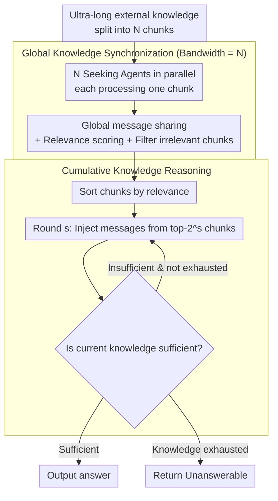

# Scaling External Knowledge Input Beyond Context Windows of LLMs via Multi-Agent Collaboration

**Conference**: ACL 2026  
**arXiv**: [2505.21471](https://arxiv.org/abs/2505.21471)  
**Code**: [GitHub](https://github.com/THUNLP-MT/ExtAgents)  
**Area**: LLM Agent  
**Keywords**: Context Window Expansion, Multi-Agent Collaboration, External Knowledge Scaling, Multi-hop QA, Knowledge Synchronization

## TL;DR

Ours proposes the ExtAgents multi-agent framework to overcome the performance bottleneck where existing multi-agent methods degrade when external knowledge input exceeds the context window. By implementing global knowledge synchronization (information exchange among all Seeking Agents) and cumulative knowledge reasoning (progressive injection of filtered knowledge into the Reasoning Agent), the framework achieves significant improvements in multi-hop QA and long summary generation tasks.

## Background & Motivation

**Background**: With advancements in post-training reasoning and information retrieval, LLMs can integrate more retrieved knowledge within their context windows to solve complex tasks, where increasing knowledge typically yields better performance.

**Limitations of Prior Work**: When the volume of external knowledge exceeds the context window, direct truncation leads to information loss; RAG is limited by ranking errors that miss critical evidence; and context compression discards subtle cues. Distributed multi-agent approaches (e.g., LLM×MapReduce) represent a new paradigm, but experiments show their performance stagnates or decreases as knowledge volume increases.

**Key Challenge**: Existing multi-agent orchestration suffers from two bottlenecks—(1) Small knowledge synchronization bandwidth, where each agent only accesses messages from 2 neighbors, requiring multiple rounds to synchronize global information; (2) Redundant reasoning context, as cramming all messages into the Reasoning Agent leads to information overload.

**Goal**: Design a scalable multi-agent framework where task performance continuously improves with the volume of external knowledge input, even when it exceeds the context window.

**Key Insight**: Simplify agent roles into two categories (Seeking + Reasoning) and design global synchronization and cumulative reasoning mechanisms to address the two bottlenecks.

**Core Idea**: Seeking Agents perform global exchange and score chunk relevance (Bandwidth = N). The Reasoning Agent performs cumulative reasoning by progressively adding top-k knowledge over multiple rounds to avoid one-time information overload.

## Method

### Overall Architecture

ExtAgents addresses the anomaly where "performance drops despite increased external knowledge when exceeding context windows." It partitions ultra-long input into $N$ chunks, assigns each chunk to a Seeking Agent, and refines multi-agent roles into two types. The pipeline first executes **Global Knowledge Synchronization**: all Seeking Agents process their respective chunks in parallel, share messages globally, and score the relevance of their chunks to the query. This is followed by **Cumulative Knowledge Reasoning**: the Reasoning Agent does not ingest all messages at once but instead introduces knowledge progressively starting from the highest-relevance chunks, doubling the volume each round. It determines whether the current knowledge is sufficient to answer until a result is produced or knowledge is exhausted. Since the Seeking phase is independent, the framework is highly parallelizable.

### Key Designs

**1. Global Knowledge Synchronization (Bandwidth = N): Giving every agent a global view in one step**

The first bottleneck of existing multi-agent orchestration is narrow synchronization bandwidth—Chain of Agents is a sequential relay with a bandwidth of 2, and LLM×MapReduce is $O(L/|m|)$. Each agent only sees a few messages from neighbors, requiring multiple rounds for global synchronization, which leads to information degradation. ExtAgents allows messages from all Seeking Agents to be shared in a global space, where the bandwidth equals the number of agents $N$. Each agent processes its local chunk, scores its relevance to the query, and can simultaneously filter out obviously irrelevant chunks. This completes global information exchange in a single round, avoiding the degradation caused by multi-round relays.

**2. Cumulative Knowledge Reasoning: Incremental scaling by relevance to avoid info overload**

The second bottleneck is reasoning context redundancy—shoving all messages into a reasoning agent, as in LLM×MapReduce, causes key evidence to be submerged in noise. ExtAgents allows the Reasoning Agent to receive chunks based on relevance ranking: in round $s$, it reads messages from the top-$2^s$ chunks (1 in round 0, 2 in round 1, 4 in round 2, etc.). After each round, it judges if the knowledge is sufficient. If not, the volume doubles; if sufficient, it stops. This progressive injection ensures the Reasoning Agent focuses on a small amount of highly relevant information in each round without needing to digest all noise immediately.

**3. ∞Bench+ Enhanced Benchmark: Eliminating "solvable by truncation" samples**

The authors discovered that many problems in the original ∞Bench could be answered by scanning only an 8k token window, which fails to test cross-document aggregation and artificially inflates the performance of simple truncation. ∞Bench+ filters out these "solvable within 8k" samples, retaining only multi-hop questions requiring cross-document evidence: En.QA was filtered from 351 to 157 samples and augmented to 294; Zh.QA was filtered from 189 to 56 samples and augmented to 184. This refinement ensures the conclusion that "only ExtAgents scales with knowledge volume" is credible.

### An Example: Cumulative Reasoning with 256k Knowledge

Suppose the input is ~256k tokens, split into 8 chunks for 8 Seeking Agents. In the global synchronization phase, 8 agents read their chunks in parallel and share relevance scores. Assume chunks 3 and 6 are ranked highest. In cumulative reasoning, the Reasoning Agent reads top-1 (chunk 3) in round 0 and finds evidence insufficient. In round 1, it expands to top-2 (adding chunk 6). Combining the two pieces of evidence completes the multi-hop reasoning, and an answer is produced. The redundant information from the other 6 chunks never enters the reasoning context. If knowledge is exhausted without finding an answer, the framework returns "Unanswerable."

## Key Experimental Results

### Main Results (∞Bench+ En.QA, gpt-4o-mini)

| Method | 8k input | 32k input | 128k input | 256k+ input |
|------|---------|----------|-----------|------------|
| Truncation | ~30 | ~35 | ~38 | N/A |
| LLM×MapReduce | ~32 | ~33 | ~34 | ~32 |
| ExtAgents | ~33 | ~38 | ~43 | **~46** |

### Key Findings
- ExtAgents is the only method where performance continuously improves as knowledge volume increases, even beyond the 128k context window.
- LLM×MapReduce performs worse than truncation once the context window is exceeded, exposing its bottleneck.
- ExtAgents is equally effective on HotpotQA (multi-hop QA with large knowledge bases), verifying generalizability.
- It demonstrates advantages in long summary generation tasks.
- High parallelism ensures efficiency, as Seeking Agents are fully parallelizable.

## Highlights & Insights
- **Valuable Problem Definition**: Clearly defines the problem of "scaling external knowledge beyond context windows" and constructs an evaluation framework.
- **Precise Bottleneck Analysis**: Attributes the failure of prior methods to synchronization bandwidth and reasoning redundancy.
- **Simple and Effective Design**: Only two agent types and two mechanisms make it easy to understand and implement.
- **Independent Value of ∞Bench+**: Eliminates measurement bias in existing long-context benchmarks.

## Limitations & Future Work
- **Dependency on LLM APIs**: Requires multiple LLM calls, increasing costs.
- **Simple Chunking Strategy**: Uses basic splitting; more intelligent semantic chunking has not been explored.
- **Limited Evaluation Coverage**: Primarily validated on QA and summary generation; other long-context tasks remain untested.
- Future Directions: Advanced chunking strategies, integration with RAG, and post-training for agent collaboration capabilities.

## Related Work & Insights
- **vs LLM×MapReduce**: SOTA multi-agent method that suffers performance degradation when scaling knowledge; ExtAgents overcomes this via global sync and cumulative reasoning.
- **vs Chain of Agents**: A sequential method with bandwidth=2, offering poor scalability.
- **vs RAG**: Limited by retrieval ranking errors, RAG cannot guarantee that all critical evidence is selected.

## Rating
- Novelty: ⭐⭐⭐⭐ Meaningful problem definition; dual design of global sync and cumulative reasoning is highly targeted.
- Experimental Thoroughness: ⭐⭐⭐⭐ Validated across multiple tasks and models with ∞Bench+ construction and efficiency analysis.
- Writing Quality: ⭐⭐⭐⭐ Clear formal definitions and systematic bottleneck analysis.
- Value: ⭐⭐⭐⭐ Provides a practical training-free solution for ultra-long context reasoning in LLMs.

<!-- RELATED:START -->

## Related Papers

- [\[AAAI 2026\] KDR-Agent: A Multi-Agent LLM Framework for Multi-Domain Low-Resource In-Context NER via Knowledge Retrieval](../../AAAI2026/multi_agent/a_multi-agent_llm_framework_for_multi-domain_low-resource_in-context_ner_via_kno.md)
- [\[CVPR 2026\] Visual Document Understanding and Reasoning: A Multi-Agent Collaboration Framework with Agent-Wise Adaptive Test-Time Scaling](../../CVPR2026/multi_agent/visual_document_understanding_and_reasoning_a_multi-agent_collaboration_framewor.md)
- [\[ACL 2026\] Multi-Agent Reasoning Improves Compute Efficiency: Pareto-Optimal Test-Time Scaling](multi-agent_reasoning_improves_compute_efficiency_pareto-optimal_test-time_scali.md)
- [\[ACL 2025\] Beyond Frameworks: Unpacking Collaboration Strategies in Multi-Agent Systems](../../ACL2025/multi_agent/beyond_frameworks_multi_agent_collaboration.md)
- [\[ACL 2026\] ConSensus: Multi-Agent Collaboration for Multimodal Sensing](consensus_multi-agent_collaboration_for_multimodal_sensing.md)

<!-- RELATED:END -->
