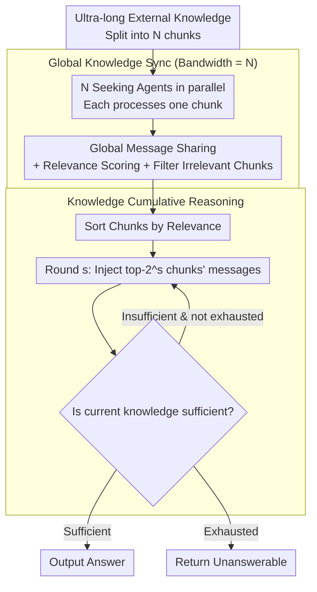

# Scaling External Knowledge Input Beyond Context Windows of LLMs via Multi-Agent Collaboration

**Conference**: ACL 2026  
**arXiv**: [2505.21471](https://arxiv.org/abs/2505.21471)  
**Code**: [GitHub](https://github.com/THUNLP-MT/ExtAgents)  
**Area**: LLM Agent  
**Keywords**: Context Window Extension, Multi-Agent Collaboration, External Knowledge Scaling, Multi-hop QA, Knowledge Synchronization

## TL;DR

The authors propose ExtAgents, a multi-agent framework that addresses the performance bottleneck where existing multi-agent methods fail to scale when external knowledge exceeds the context window. By implementing global knowledge synchronization (information exchange among all Seeking Agents) and cumulative reasoning (gradual injection of filtered knowledge into the Reasoning Agent), the framework significantly improves performance in multi-hop QA and long summary generation tasks.

## Background & Motivation

**Background**: Advances in post-training inference and information retrieval allow LLMs to integrate more retrieved knowledge within context windows to solve complex tasks. Generally, more knowledge leads to better performance.

**Limitations of Prior Work**: When external knowledge exceeds the context window, direct truncation causes information loss; RAG is limited by ranking errors that miss critical evidence; and context compression discards subtle clues. Distributed multi-agent approaches (e.g., LLM×MapReduce) offer a new paradigm, but experiments show their performance stagnates or declines as knowledge volume increases.

**Key Challenge**: Existing multi-agent orchestration suffers from two bottlenecks: (1) low synchronization bandwidth, where each agent only accesses messages from two neighbors and requires multiple rounds for global info-sync; and (2) redundant inference context, where cramming all messages into the Reasoning Agent causes information overload.

**Goal**: To design a scalable multi-agent framework where task performance continuously improves as external knowledge input increases, even beyond the context window.

**Key Insight**: Simplify agent roles into two categories (Seeking and Reasoning) and address the two bottlenecks via global synchronization and cumulative reasoning mechanisms.

**Core Idea**: Seeking Agents exchange messages globally and score chunk relevance (bandwidth = $N$). The Reasoning Agent performs cumulative reasoning by gradually increasing top-$k$ knowledge over multiple rounds to avoid one-time information overload.

## Method

### Overall Architecture

ExtAgents addresses the anomaly where performance drops as external knowledge exceeds the context window. It divides ultra-long input into $N$ chunks, assigns each to a Seeking Agent, and streamlines roles into two types. The pipeline begins with **Global Knowledge Synchronization**: all Seeking Agents parallelly process their chunks, share messages globally, and score the relevance of their chunks to the query. This is followed by **Knowledge Cumulative Reasoning**: the Reasoning Agent does not consume all messages at once. Instead, it starts with the highest-relevance chunks and doubles the amount of injected knowledge each round, checking if the current information is sufficient for an answer until the answer is found or knowledge is exhausted. Since the Seeking phase is independent, the framework is highly parallelizable.

### Key Designs

**1. Global Knowledge Synchronization (Bandwidth = $N$): Global visibility in one step**

The first bottleneck in existing multi-agent orchestration is narrow synchronization bandwidth—Chain of Agents is sequential (bandwidth = 2), and LLM×MapReduce is limited to $O(L/|m|)$. Each agent only sees a few neighbors' messages, requiring multiple rounds for global synchronization, leading to information degradation. ExtAgents allows all Seeking Agents to share messages in a global space, setting bandwidth to the number of agents $N$. Each agent processes its local chunk, scores relevance, and can flag irrelevant chunks. Global information exchange is thus completed in one round, avoiding degradation from multi-hop relaying.

**2. Knowledge Cumulative Reasoning: Gradual scaling to avoid overload**

The second bottleneck is inference context redundancy—stuffing all messages into the Reasoning Agent at once, as in LLM×MapReduce, causes key evidence to be buried in noise. ExtAgents requires the Reasoning Agent to receive chunks based on relevance ranking: in round $s$, it reads messages from the top-$2^s$ chunks (1 in round 0, 2 in round 1, 4 in round 2, etc.). After each round, it judges if the knowledge is sufficient. If not, the volume doubles; if so, it stops. This progressive injection keeps the Reasoning Agent focused on the most relevant information without immediate exposure to noise.

**3. $\infty$Bench+ Enhanced Benchmark: Eliminating "correct via truncation" samples**

The authors discovered that many problems in the original $\infty$Bench can be answered by scanning only the first 8k tokens, failing to test cross-document aggregation. This inflates the performance of simple truncation methods. $\infty$Bench+ filters these samples, retaining only multi-hop questions requiring global aggregation: En.QA was refined from 351 to 157 samples, plus additional long documents for a total of 294; Zh.QA was refined from 189 to 56, totaling 184 after additions. This purification ensures that the conclusion—"only ExtAgents improves with more knowledge"—is robust.

### An Example: Cumulative Reasoning with 256k Knowledge

Given an input of ~256k tokens split into 8 chunks for 8 Seeking Agents: In the global sync phase, 8 agents process chunks in parallel, share messages, and rank chunks. Assume chunks #3 and #6 are the most relevant. In cumulative reasoning, the Reasoning Agent reads top-1 (chunk #3) in round 0 and finds it insufficient. In round 1, it expands to top-2 (adding chunk #6). Combining both pieces of evidence enables multi-hop reasoning, and the agent outputs the answer. Redundant info from the other 6 chunks never enters the inference context. If knowledge is exhausted without an answer, the framework returns "unanswerable" rather than hallucinating.

## Key Experimental Results

### Main Results ($\infty$Bench+ En.QA, gpt-4o-mini)

| Method | 8k input | 32k input | 128k input | 256k+ input |
|------|---------|----------|-----------|------------|
| Truncation | ~30 | ~35 | ~38 | N/A |
| LLM×MapReduce | ~32 | ~33 | ~34 | ~32 |
| ExtAgents | ~33 | ~38 | ~43 | **~46** |

### Key Findings
- ExtAgents is the only method showing continuous performance gains as knowledge increases, even beyond the 128k context window.
- LLM×MapReduce performs worse than truncation once the context window is exceeded, exposing its bottleneck.
- ExtAgents effectively generalizes to HotpotQA (multi-hop QA over large knowledge bases).
- It demonstrates advantages in long summary generation tasks.
- High parallelism ensures computational efficiency during the Seeking phase.

## Highlights & Insights
- **Valuable Problem Definition**: First to explicitly tackle "scaling external knowledge beyond context windows" with a structured evaluation framework.
- **Precise Bottleneck Analysis**: Attributes failures of prior methods to specific bottlenecks: synchronization bandwidth and inference redundancy.
- **Simple and Effective Design**: Only two agent types and two mechanisms, making it easy to understand and implement.
- **$\infty$Bench+ Value**: Independent contribution in eliminating measurement bias in existing long-context benchmarks.

## Limitations & Future Work
- **Dependency on LLM APIs**: Multiple LLM calls increase operational costs.
- **Simple Chunking Strategy**: Uses basic splitting; more intelligent semantic chunking remains unexplored.
- **Limited Evaluation Coverage**: Primarily validated on QA and summary generation; other long-context tasks remain untested.
- Future directions include smarter chunking, integration with RAG, and post-training for agent collaboration.

## Related Work & Insights
- **vs LLM×MapReduce**: A SOTA multi-agent method that suffers performance drops when scaling knowledge; ExtAgents overcomes this via global sync and cumulative reasoning.
- **vs Chain of Agents**: A sequential method with bandwidth = 2, offering poor scalability.
- **vs RAG**: Limited by retrieval ranking errors; cannot guarantee global evidence selection.

## Rating
- Novelty: ⭐⭐⭐⭐ High value in problem definition; the dual design of global sync and cumulative reasoning is well-targeted.
- Experimental Thoroughness: ⭐⭐⭐⭐ Validated across multiple tasks and models with the construction of $\infty$Bench+.
- Writing Quality: ⭐⭐⭐⭐ Clear formal definitions and systematic bottleneck analysis.
- Value: ⭐⭐⭐⭐ Provides a practical, training-free solution for ultra-long context reasoning.

<!-- RELATED:START -->

## Related Papers

- [\[AAAI 2026\] KDR-Agent: A Multi-Agent LLM Framework for Multi-Domain Low-Resource In-Context NER via Knowledge Retrieval](../../AAAI2026/multi_agent/a_multi-agent_llm_framework_for_multi-domain_low-resource_in-context_ner_via_kno.md)
- [\[ACL 2026\] Topology Matters: Measuring Memory Leakage in Multi-Agent LLMs](topology_matters_measuring_memory_leakage_in_multi-agent_llms.md)
- [\[ACL 2025\] Beyond Frameworks: Unpacking Collaboration Strategies in Multi-Agent Systems](../../ACL2025/multi_agent/beyond_frameworks_multi_agent_collaboration.md)
- [\[CVPR 2026\] Visual Document Understanding and Reasoning: A Multi-Agent Collaboration Framework with Agent-Wise Adaptive Test-Time Scaling](../../CVPR2026/multi_agent/visual_document_understanding_and_reasoning_a_multi-agent_collaboration_framewor.md)
- [\[ACL 2026\] Multi-Agent Reasoning Improves Compute Efficiency: Pareto-Optimal Test-Time Scaling](multi-agent_reasoning_improves_compute_efficiency_pareto-optimal_test-time_scali.md)

<!-- RELATED:END -->
