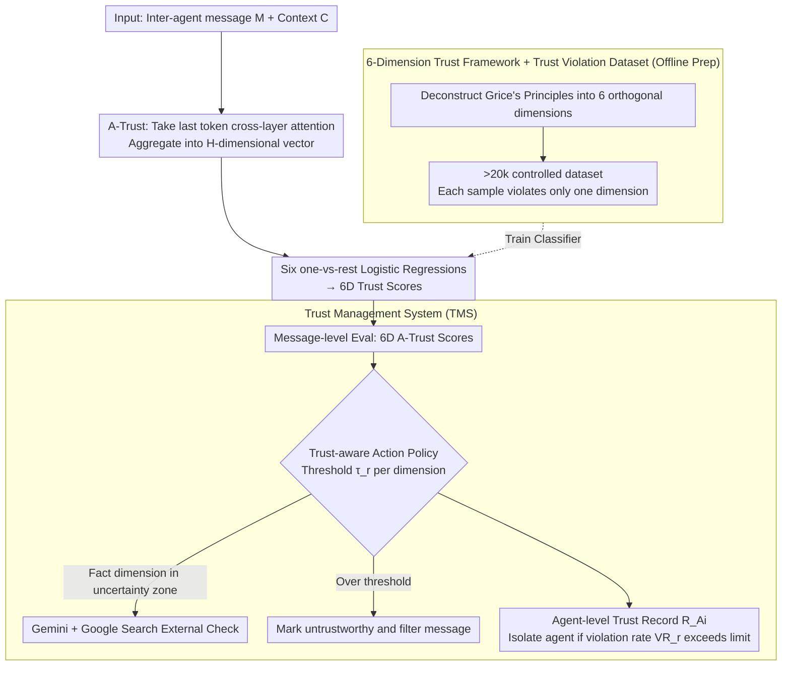

# To Trust or Not to Trust: Attention-Based Trust Management for LLM Multi-Agent Systems

**Conference**: ACL 2026  
**arXiv**: [2506.02546](https://arxiv.org/abs/2506.02546)  
**Code**: [GitHub](https://anonymous.4open.science/r/multi-com-1808)  
**Area**: Interpretability / Multi-Agent Security  
**Keywords**: LLM Multi-Agent Trust Management, Attention Pattern Analysis, Trustworthiness Evaluation, Malicious Message Detection, Trusted Communication

## TL;DR

This paper proposes the first comprehensive definition of "trustworthiness" for LLM Multi-Agent Systems (LLM-MAS) based on six orthogonal dimensions of Grice's Cooperative Principle. It discovers that LLM attention patterns can distinguish different types of trustworthiness violations, leading to the design of A-Trust, a lightweight evaluation method and an end-to-end Trust Management System (TMS) that improves malicious message detection rates to 77-90% under various attacks.

## Background & Motivation

**Background**: LLM multi-agent systems have demonstrated powerful capabilities in tasks such as code generation, mathematical reasoning, and scientific simulation, with Agent2Agent (A2A) protocols becoming increasingly popular. However, LLM agents accept all input information indiscriminately, lacking the information filtering capabilities typically held by humans.

**Limitations of Prior Work**: (1) LLM-MAS are highly vulnerable to malicious message attacks, including Adversary-in-the-Middle (AiTM), AutoInject, and NetSafe; (2) Existing works focus only on single aspects of trustworthiness (e.g., factual correctness or logical consistency), lacking a systematic multi-dimensional evaluation framework; (3) Prompt-based trust evaluation is affected by hallucinations, and external verification tools introduce latency while depending on external data quality.

**Key Challenge**: LLM attention patterns actually "perceive" untrustworthy information (exhibiting significantly higher attention weights), but the model's final output fails to utilize this signal—indicating a mismatch between attention patterns and output (a form of hallucination).

**Goal**: (1) Establish a multi-dimensional trustworthiness definition framework; (2) Utilize internal LLM attention signals for efficient trustworthiness evaluation; (3) Construct an end-to-end trust management system.

**Key Insight**: Beginning with Grice's Cooperative Principle to define six trust dimensions, it was found that violations in different dimensions produce unique patterns in LLM attention mechanisms, with specific attention heads being sensitive to particular violation types.

**Core Idea**: Extract cross-layer aggregated feature vectors from LLM multi-head attention weights to train lightweight logistic regression models for scoring the six trust dimensions, building a message-level and agent-level trust management system.

## Method

### Overall Architecture

The system consists of three layers: (1) **Trust Dimension Definition + Trust Violation Dataset**—a six-dimension framework and a controlled dataset of >20k samples; (2) **A-Trust Evaluation**—a lightweight classifier based on attention vectors; (3) **TMS Trust Management**—message-level evaluation → trust-aware action policy → agent-level trust records.

### Key Designs

**1. 6-Dimensional Trust Framework + Trust Violation Dataset: Deconstructing "trust" into six non-overlapping tasks to create analyzable data.**

The primary difficulty in existing trust evaluation is that untrustworthy samples often violate multiple dimensions simultaneously, making it impossible to determine what the model is truly sensitive to. Theoretically grounded in Grice’s Cooperative Principle, this work deconstructs trustworthiness into six orthogonal dimensions: factual accuracy, logical consistency, relevance, bias, language quality, and clarity. A controlled dataset of >20k samples was constructed where **each untrustworthy sample violates exactly one dimension**. The factual dimension utilizes FEVER, the bias dimension utilizes StereoSet, and the remaining four are generated via GPT-4o. This single-dimension violation design allows for clean dependency analysis of "which attention head corresponds to which dimension."

**2. A-Trust Attention-Based Trust Evaluation: Reading internal attention signals instead of model outputs.**

Prompt-based trust evaluation is prone to hallucinations, while external verification is slow and dependent on data quality. This work identifies a more reliable internal signal: LLMs assign significantly higher attention weights when reading untrustworthy messages. A-Trust converts this observation into features: for message $M$ and context $C$, it takes the attention weights of the last token relative to the message tokens, aggregated across layers into one scalar per head:

$$Attn^h(M) = \text{Mean}(\{Attn^{l,h}(M)\}_{l=1}^{L}),$$

These are concatenated into an $H$-dimensional feature vector. One-vs-rest logistic regression classifiers $(f_{\text{fact}}, \dots, f_{\text{clarity}})$ are then trained for each dimension, outputting a trust score in $[0,1]$. Logistic regression is used rather than heavier models because specific attention heads are already specialized for certain dimensions (e.g., head 2 for relevance, head 21 for clarity, head 27 for quality), making the signals linearly separable and suitable for real-time deployment.

**3. Trust Management System (TMS): Upgrading single message scoring into a closed-loop system for filtering and isolation.**

A trustworthiness score for a single message is insufficient to protect a system. TMS integrates three components into an end-to-end defense. First is **message-level evaluation**, calculating 6D A-Trust scores for every inter-agent message. Second is the **trust-aware action policy**, which sets thresholds $\tau_r$ for each dimension; messages exceeding thresholds are marked as untrustworthy and filtered. The factual dimension uses a dual-threshold strategy, calling Gemini-2.0-flash + Google Search for external verification if the score falls in an uncertainty zone. Third is the **agent-level trust record**, maintaining time-stamped records $R_{A_i}$ for each agent and calculating violation rates $VR_r$ within time windows for periodic evaluation. Message-level interception combined with long-term agent profiling allows for both blocking individual malicious messages and isolating persistently malicious agents.

### Example Scenario: Blocking a Malicious Message

Suppose agent $A_3$ in a Chain topology sends a message tampered with by an AiTM attack. TMS feeds this message and its context to LLaMA3.1-8B, extracts the last token's cross-layer attention, and generates an $H$-dimensional vector. Six logistic regression classifiers provide scores. It finds the "factual accuracy" score falls in the uncertainty zone, triggering the dual-threshold policy. After verification via Gemini + Google Search, the factual error is confirmed; the message is marked untrustworthy and filtered, never entering the context of downstream agents. Simultaneously, the violation is logged in $R_{A_3}$. If the violation rate $VR_r$ for $A_3$ exceeds the limit within the time window, the agent-level evaluation classifies it as malicious and isolates it from the network—an approach that achieved a 100% Malicious Agent Detection Rate (ADR) across all attacks in the paper.

### Loss & Training

A-Trust utilizes logistic regression and does not require complex training. For each dimension, 1500 positive and 1500 negative samples were selected via one-vs-rest sampling. Attention matrices were extracted using LLaMA3.1-8B-Instruct.

## Key Experimental Results

### Main Results

**Malicious Message Detection Rate (MDR) (Chain Topology, %)**

| Dataset | Method | AiTM ↑ | AutoTrans ↑ | AutoInj ↑ | NetSafe ↑ | Clean ↓ |
|--------|------|--------|------------|----------|----------|---------|
| MMLUPhy | A-Trust | **84.3** | **77.5** | **90.1** | **79.6** | 7.1 |
| | PPL | 43.1 | 51.8 | 57.9 | 50.5 | 4.8 |
| | Prompt | 52.9 | 57.7 | 55.3 | 50.3 | 9.4 |
| MATH | A-Trust | **84.1** | **79.3** | **85.6** | **80.4** | 7.3 |
| | PPL | 52.4 | 54.2 | 53.1 | 57.3 | 4.7 |
| | Prompt | 62.9 | 60.7 | 61.8 | 64.9 | 7.5 |

**Attack Success Rate (ASR) (Chain Topology, %, ↓ lower is better)**

| Dataset | Configuration | Clean | AiTM | AutoTrans | AutoInj | NetSafe |
|--------|------|-------|------|-----------|---------|---------|
| MMLUPhy | No trust | 41.7 | 92.5 | 69.3 | 62.6 | 67.7 |
| | A-Trust TMS | 43.8 | **14.1** | **51.4** | **47.1** | **46.4** |
| MATH | No trust | 47.6 | 93.6 | 69.8 | 67.2 | 68.2 |
| | A-Trust TMS | 50.6 | **18.4** | **54.2** | **55.2** | **59.2** |

### Ablation Study

- The agent-level trust record policy achieved a 100% Malicious Agent Detection Rate (ADR) across all types of attacks.
- A-Trust demonstrated clear separation between violations and non-violations across all six dimensions, whereas prompt-based methods struggled to differentiate in several dimensions (due to hallucinations).
- A-Trust significantly outperformed PPL and Prompt baselines across Chain, Complete, and Tree topologies.

### Key Findings

- LLM attention toward untrustworthy messages is significantly higher than toward normal messages—the model "perceives" anomalies but fails to act on them.
- Specific attention heads exhibit specialized responses to particular trust dimensions (e.g., head 2 → relevance, head 21 → clarity, head 27 → quality).
- Prompt-based trust evaluation suffers from severe hallucinations; internal attention signals are more reliable than model outputs.
- The ASR of AiTM attacks dropped most significantly (from 92.5% to 14.1%), proving that the message patterns of DoS-type attacks are the easiest to identify via attention.

## Highlights & Insights

- The discovery that "LLMs perceive untrustworthiness but fail to utilize that perception" reveals a mismatch between attention mechanisms and output—a new form of hallucination.
- The six-dimension framework based on Grice’s Principles provides a standardized evaluation language for LLM-MAS safety research.
- The minimalist design of logistic regression combined with attention vectors outperforms GPT-4o prompt evaluation—demonstrating that simple methods can surpass complex prompting.

## Limitations & Future Work

- The Trust Violation dataset was generated by GPT-4o (for four dimensions), which may introduce distributional bias.
- Adaptive attackers might learn to evade specific attention patterns; robustness needs further evaluation.
- The threshold strategy is relatively simple and does not account for correlations between dimensions.
- A-Trust was trained only on LLaMA3.1-8B; cross-model generalization has not been fully verified.

## Related Work & Insights

- **vs. Perplexity Evaluation**: Perplexity is a single scalar and cannot distinguish between different types of trustworthiness violations; A-Trust provides fine-grained 6D evaluation.
- **vs. Prompt-based Evaluation**: Vulnerable to LLM hallucinations and fails to distinguish violations from normal messages in multiple dimensions.
- **vs. FEVER/StereoSet**: These datasets only cover single dimensions (Fact/Bias); the Trust Violation dataset is the first 6D controlled benchmark.
- **vs. NetSafe**: NetSafe focuses on attack methods, while this work focuses on defense—making them complementary.

## Rating

- Novelty: ⭐⭐⭐⭐⭐ First attention-pattern-based trust management framework for LLM-MAS; the 6D definition fills a critical gap.
- Experimental Thoroughness: ⭐⭐⭐⭐⭐ 4 attacks × 4 datasets × 3 topologies + 3 baselines + agent-level eval + MetaGPT case study.
- Writing Quality: ⭐⭐⭐⭐ Complete framework with persuasive attention analysis visualization.
- Value: ⭐⭐⭐⭐⭐ Provides a practical and deployable solution for LLM-MAS security, especially critical in the era of A2A protocols.

<!-- RELATED:START -->

## Related Papers

- [\[ACL 2026\] Conjunctive Prompt Attacks in Multi-Agent LLM Systems](conjunctive_prompt_attacks_in_multi-agent_llm_systems.md)
- [\[ACL 2026\] CIA: Inferring the Communication Topology from LLM-based Multi-Agent Systems](cia_inferring_the_communication_topology_from_llm-based_multi-agent_systems.md)
- [\[ACL 2026\] Seeing the Whole Elephant: A Benchmark for Failure Attribution in LLM-based Multi-Agent Systems](seeing_the_whole_elephant_a_benchmark_for_failure_attribution_in_llm-based_multi.md)
- [\[ACL 2026\] SILO-BENCH: A Scalable Environment for Evaluating Distributed Coordination in Multi-Agent LLM Systems](silo-bench_a_scalable_environment_for_evaluating_distributed_coordination_in_mul.md)
- [\[ACL 2026\] MASFactory: A Graph-centric Framework for Orchestrating LLM-Based Multi-Agent Systems with Vibe Graphing](masfactory_a_graph-centric_framework_for_orchestrating_llm-based_multi-agent_sys.md)

<!-- RELATED:END -->
