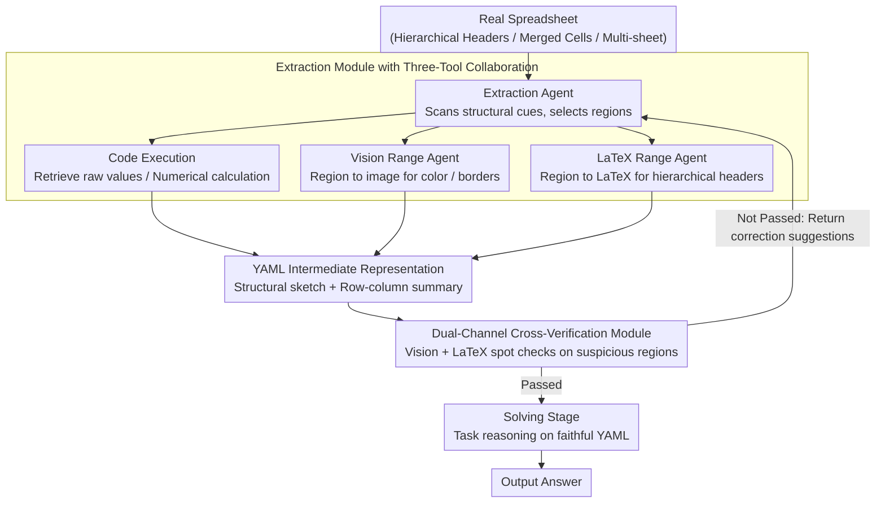

# Towards Robust Real-World Spreadsheet Understanding with Multi-Agent Multi-Format Collaboration

**Conference**: ACL 2026  
**arXiv**: [2604.12282](https://arxiv.org/abs/2604.12282)  
**Code**: [github](https://github.com/renhouxing/SpreadsheetAgent)  
**Area**: LLM / Natural Language Processing  
**Keywords**: Spreadsheet Understanding, Multi-Agent Framework, Multi-Format Reasoning, Structured Information Extraction, Progressive Reading

## TL;DR

Proposes SpreadsheetAgent, a two-stage multi-agent framework that achieves robust real-world spreadsheet understanding without exceeding LLM context limits through progressive regional reading and cross-verification using three formats: code execution, vision, and LaTeX.

## Background & Motivation

**Background**: Spreadsheets are the most common data format in business reporting, financial auditing, and scientific data management. While LLMs have advanced in table understanding via works like Chain-of-Table, TableGPT, and SheetAgent, most treat tables as pure text (Markdown/HTML/LaTeX), ignoring layout semantics.

**Limitations of Prior Work**: (1) Real spreadsheets contain rich visual cues such as hierarchical headers, multiple sheets, font colors, and merged cells, which pure text formats fail to capture completely; (2) Practical spreadsheets are enormous (thousands of rows/columns), exceeding the effective context processing capacity of LLMs; (3) Existing methods easily lose structural information when loading the entire table at once.

**Key Challenge**: The structural complexity and scale of spreadsheets far exceed the single-pass processing capability of LLMs. How to faithfully preserve layout semantics within a limited context budget is the core contradiction.

**Goal**: Design a progressive reading-reasoning paradigm to incrementally parse spreadsheets through multi-agent collaboration.

**Key Insight**: Adopt an "extraction-verification" iterative loop—an extraction agent incrementally parses local regions using code execution, vision, and LaTeX tools, while a verification agent cross-validates the faithfulness of the extracted results via vision and LaTeX channels.

**Core Idea**: Use YAML format as an intermediate representation to preserve structural semantics and reduce error propagation through multi-format redundant verification, ensuring downstream reasoning is based on a faithful structural representation.

## Method

### Overall Architecture

SpreadsheetAgent is a two-stage framework. **Structure Extraction Stage**: The Extraction Agent scans the spreadsheet, identifies structural cues like hierarchical headers, merged cells, and multiple sheets, and incrementally parses selected local regions using three tools: Code Execution, Vision Range Agent, and LaTeX Range Agent. It compresses content and layout into a structural sketch and row-column summary in YAML format. Meanwhile, a dual-channel cross-verification module performs spot checks on uncertain or structurally complex regions. If errors are found, it returns correction suggestions, forming an "extraction-verification-correction" loop until the representation is faithful. **Solving Stage**: The verified YAML intermediate representation is injected into the downstream context for task-driven reasoning to obtain the answer. This process avoids loading the entire table at once, thus preserving layout semantics within the LLM's context budget.

### Key Designs

1. **Extraction Module with Three-Tool Collaboration**: The extraction agent utilizes three auxiliary tools: Code Execution (precise parsing of raw values and numerical calculations), Vision Range Description Agent (converts selected regions to images for VLM to extract visual cues like colors and borders), and LaTeX Range Description Agent (converts regions to LaTeX tables to restore hierarchical headers and alignment structures). These cooperate to produce a compact intermediate representation.

2. **Dual-Channel Cross-Verification Module**: Instead of re-processing the whole table, the verification agent selectively focuses on uncertain or complex regions. The Vision Verification Agent renders the region as an image to check if the extraction matches the visual layout; the LaTeX Verification Agent renders the region as LaTeX to check structural faithfulness. Once both channels pass, verification is complete; otherwise, correction suggestions are returned for the next extraction round.

3. **YAML Intermediate Representation**: YAML (instead of JSON or free text) is chosen for structured extraction output because it is human-readable, supports nested structures, and is easy to parse. Experiments show that output format significantly affects downstream performance—YAML reduces ambiguity, ensures stable parsing, and improves compatibility with the task reasoner compared to JSON.

### Loss & Training

This is a reasoning framework and does not involve training. It uses GLM-4.5V as the VLM and Qwen3-Coder-480B as the LLM, with greedy decoding (temperature=0), a maximum of 4K tokens per round, and up to 20 rounds of tool calls.

## Key Experimental Results

### Main Results (SpreadsheetBench)

| Model | Soft Cell | Soft Sheet | Soft Overall | Hard Cell | Hard Sheet | Hard Overall |
|---|---|---|---|---|---|---|
| GPT-4o | 13.49 | 22.51 | 16.96 | 10.52 | 17.66 | 13.27 |
| ChatGPT Agent | 38.27 | 30.48 | 35.27 | - | - | - |
| GPT-OSS-120B | 30.78 | 27.64 | 29.57 | 24.96 | 23.93 | 24.56 |
| + SpreadsheetAgent | **41.30** | **33.14** | **38.16** | **32.80** | **29.34** | **31.47** |
| Qwen3-Coder-480B | 30.36 | 31.05 | 30.63 | 22.82 | 27.07 | 24.45 |
| + SpreadsheetAgent | **45.63** | **35.33** | **41.67** | **36.90** | **31.05** | **34.65** |
| Human Performance | 75.56 | 65.00 | 71.33 | 66.67 | 55.00 | 62.00 |

### Ablation Study (Qwen3-30B)

| Configuration | Soft Overall | Hard Overall |
|---|---|---|
| SpreadsheetAgent (Full) | 22.37 | 18.42 |
| w/o Tools & Verify | 20.18 | 16.01 |
| w/ JSON (replacing YAML) | 20.76 | 16.34 |
| w/o Structure | 19.70 | 15.46 |
| w/o Verify | 21.45 | 17.54 |
| w/o Vision Tool | 21.45 | 16.89 |
| w/o LaTeX Tool | 20.32 | 16.23 |
| w/o All (baseline) | 16.41 | 12.83 |

### Key Findings

- SpreadsheetAgent enables GPT-OSS-120B to outperform ChatGPT Agent by 2.89 absolute percentage points (38.16% vs 35.27%).
- Qwen3-Coder-480B + SpreadsheetAgent achieves the highest performance at 41.67%, but remains far below the human performance of 71.33%.
- The verification module contributes approximately 1 percentage point gain, while structure extraction contributes about 2.7 percentage points.
- The LaTeX tool contributes more than the vision tool (decreases of 2.05 vs 0.92 when removed).
- YAML format improves performance by 1.61 percentage points over JSON.

## Highlights & Insights

- **Progressive Reading Paradigm**: Unlike one-shot loading, it solves the scale problem through iterative regional reading while preserving layout semantics.
- **Verification is Easier than Solving**: The design philosophy of the verification module—making the model check existing results is more reliable than generating from scratch.
- **Multi-Format Redundancy**: Code, vision, and LaTeX formats are complementary; no single format can fully capture spreadsheet semantics.

## Limitations & Future Work

- A huge gap still exists compared to human performance (71.33%), indicating spreadsheet understanding is far from solved.
- Multi-round tool calls incur high computational overhead.
- The quality of correction suggestions from the verification module depends on the upper-bound capabilities of the VLM/LLM.
- Future work could explore Reinforcement Learning to optimize tool-calling strategies.

## Related Work & Insights

- Systematic improvements over multi-agent spreadsheet frameworks like SheetAgent and SheetMind.
- Incorporation of Chain-of-Table's step-by-step reasoning ideas within the structure extraction stage.
- The design of the verification module can be generalized to other information extraction tasks requiring faithfulness guarantees.

## Rating

- **Novelty**: ⭐⭐⭐⭐ The framework design of multi-format progressive reading + cross-verification is novel and sound.
- **Experimental Thoroughness**: ⭐⭐⭐⭐ Sufficient validation through multi-model comparisons, detailed ablations, and multiple benchmarks.
- **Writing Quality**: ⭐⭐⭐⭐ Clear framework descriptions and standardized algorithm pseudocode.
- **Value**: ⭐⭐⭐⭐ Provides significant impetus for real-world spreadsheet understanding requirements.

<!-- RELATED:START -->

## Related Papers

- [\[CVPR 2026\] MOTOR-Bench: A Real-world Dataset and Multi-agent Framework for Zero-shot Human Mental State Understanding](../../CVPR2026/multi_agent/motor-bench_a_real-world_dataset_and_multi-agent_framework_for_zero-shot_human_m.md)
- [\[ICLR 2026\] UIS-Digger: Towards Comprehensive Research Agent Systems for Real-world Unindexed Information Seeking](../../ICLR2026/multi_agent/uis-digger_towards_comprehensive_research_agent_systems_for_real-world_unindexed.md)
- [\[ICML 2025\] Is Your LLM-Based Multi-Agent a Reliable Real-World Planner? Exploring Fraud Detection in Travel Planning](../../ICML2025/multi_agent/is_your_llm-based_multi-agent_a_reliable_real-world_planner_exploring_fraud_dete.md)
- [\[ACL 2026\] Scaling External Knowledge Input Beyond Context Windows of LLMs via Multi-Agent Collaboration](scaling_external_knowledge_input_beyond_context_windows_of_llms_via_multi-agent_.md)
- [\[CVPR 2026\] Visual Document Understanding and Reasoning: A Multi-Agent Collaboration Framework with Agent-Wise Adaptive Test-Time Scaling](../../CVPR2026/multi_agent/visual_document_understanding_and_reasoning_a_multi-agent_collaboration_framewor.md)

<!-- RELATED:END -->
