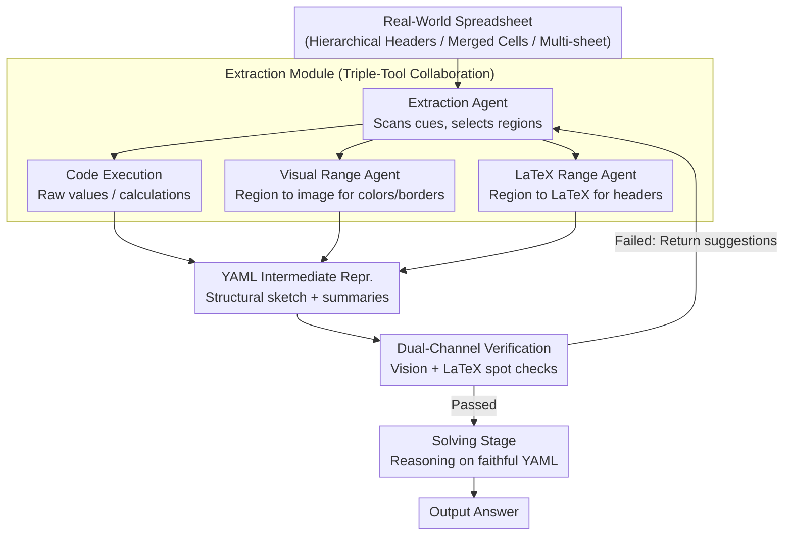

# Towards Robust Real-World Spreadsheet Understanding with Multi-Agent Multi-Format Collaboration

**Conference**: ACL 2026  
**arXiv**: [2604.12282](https://arxiv.org/abs/2604.12282)  
**Code**: [github](https://github.com/renhouxing/SpreadsheetAgent)  
**Area**: LLM / Natural Language Processing  
**Keywords**: Spreadsheet Understanding, Multi-Agent Framework, Multi-Format Reasoning, Structured Information Extraction, Progressive Reading

## TL;DR

Proposes SpreadsheetAgent, a two-stage multi-agent framework that achieves robust real-world spreadsheet understanding by performing progressive region reading and cross-verification using code execution, vision, and LaTeX formats, without exceeding LLM context limits.

## Background & Motivation

**Background**: Spreadsheets are the most common data format in corporate reporting, financial auditing, and scientific data management. While LLM-based table understanding works like Chain-of-Table, TableGPT, and SheetAgent exist, most treat tables as plain text (Markdown/HTML/LaTeX), ignoring layout semantics.

**Limitations of Prior Work**: (1) Real-world spreadsheets contain rich visual cues such as hierarchical headers, multiple sheets, font colors, and merged cells, which plain text formats fail to fully capture; (2) Actual spreadsheets are massive (thousands of rows/columns), exceeding the effective context capacity of LLMs; (3) Existing methods tend to lose structural information when loading the entire table at once.

**Key Challenge**: The structural complexity and scale of spreadsheets far exceed the single-pass processing capacity of LLMs. The challenge lies in faithfully preserving layout semantics within a finite context budget.

**Goal**: Design a progressive reading-reasoning paradigm that incrementally parses spreadsheets through multi-agent collaboration.

**Key Insight**: Adopt an "extraction-verification" iterative loop—an extraction agent incrementally parses local regions using code execution, vision, and LaTeX tools, while a verification agent cross-validates the faithfulness of the results through vision and LaTeX channels.

**Core Idea**: Use YAML as an intermediate representation to preserve structural semantics and utilize multi-format redundancy to reduce error propagation, ensuring downstream reasoning is based on a faithful structured representation.

## Method

### Overall Architecture

SpreadsheetAgent is a two-stage framework. **Structure Extraction Stage**: The Extraction Agent scans the spreadsheet, identifies structural cues like hierarchical headers, merged cells, and multiple sheets, and incrementally parses selected local regions using three tools: code execution, a visual range agent, and a LaTeX range agent. It compresses content and layout into a structural sketch and row/column summaries in YAML format. Meanwhile, a dual-channel cross-verification module performs spot checks on uncertain or complex regions. If errors are found, correction suggestions are returned, forming an "extraction-verification-correction" loop until the representation is faithful. **Solving Stage**: The verified YAML intermediate representation is injected into the downstream context for task-driven reasoning to generate the answer. Since the process avoids loading the entire table at once, layout semantics are preserved within the LLM's context budget.

### Key Designs

1.  **Extraction Module with Triple-Tool Collaboration**: The Extraction Agent utilizes three auxiliary tools: code execution (precision parsing of raw values and numerical calculations), a visual range description agent (converts selected regions to images for VLM to extract visual cues like colors/borders), and a LaTeX range description agent (converts regions to LaTeX tables to restore hierarchical headers and alignment structures). These work in tandem to produce a compact intermediate representation.

2.  **Dual-Channel Cross-Verification Module**: Rather than re-processing the entire table, the verification agent selectively focuses on uncertain or complex regions. The visual verification agent renders regions as images to check if extracted results match the visual layout; the LaTeX verification agent renders regions as LaTeX to check structural faithfulness. Once both channels pass, the result is verified; otherwise, correction suggestions trigger another extraction round.

3.  **YAML Intermediate Representation**: YAML is chosen (over JSON or free text) for structured output because it is human-readable, supports nested structures, and is easy to parse. Experiments show the output format significantly impacts performance—YAML reduces ambiguity, ensures stable parsing, and improves compatibility with task reasoners compared to JSON.

### Loss & Training

This is a reasoning framework and does not involve training. GLM-4.5V is used as the VLM and Qwen3-Coder-480B as the LLM, with greedy decoding (temperature=0), a maximum of 4K tokens per round, and up to 20 tool calls.

## Key Experimental Results

### Main Results (SpreadsheetBench)

| Model | Soft Cell | Soft Sheet | Soft Overall | Hard Cell | Hard Sheet | Hard Overall |
| :--- | :--- | :--- | :--- | :--- | :--- | :--- |
| GPT-4o | 13.49 | 22.51 | 16.96 | 10.52 | 17.66 | 13.27 |
| ChatGPT Agent | 38.27 | 30.48 | 35.27 | - | - | - |
| GPT-OSS-120B | 30.78 | 27.64 | 29.57 | 24.96 | 23.93 | 24.56 |
| + SpreadsheetAgent | **41.30** | **33.14** | **38.16** | **32.80** | **29.34** | **31.47** |
| Qwen3-Coder-480B | 30.36 | 31.05 | 30.63 | 22.82 | 27.07 | 24.45 |
| + SpreadsheetAgent | **45.63** | **35.33** | **41.67** | **36.90** | **31.05** | **34.65** |
| Human Performance | 75.56 | 65.00 | 71.33 | 66.67 | 55.00 | 62.00 |

### Ablation Study (Qwen3-30B)

| Configuration | Soft Overall | Hard Overall |
| :--- | :--- | :--- |
| SpreadsheetAgent (Full) | 22.37 | 18.42 |
| w/o Tools & Verify | 20.18 | 16.01 |
| w/ JSON (instead of YAML) | 20.76 | 16.34 |
| w/o Structure | 19.70 | 15.46 |
| w/o Verify | 21.45 | 17.54 |
| w/o Vision Tool | 21.45 | 16.89 |
| w/o LaTeX Tool | 20.32 | 16.23 |
| w/o All (baseline) | 16.41 | 12.83 |

### Key Findings

-   SpreadsheetAgent allows GPT-OSS-120B to outperform ChatGPT Agent by 2.89 absolute percentage points (38.16% vs 35.27%).
-   Qwen3-Coder-480B + SpreadsheetAgent achieves the highest score of 41.67%, but remains far below the human performance of 71.33%.
-   The verification module contributes roughly a 1% improvement, while structural extraction contributes about 2.7%.
-   The LaTeX tool contributes more than the vision tool (decreases of 2.05 vs 0.92 when removed, respectively).
-   YAML format provides a 1.61 percentage point boost over JSON.

## Highlights & Insights

-   **Progressive Reading Paradigm**: Unlike one-shot loading, iterative region reading solves scale issues while preserving layout semantics.
-   **Verification is Easier than Solving**: The design philosophy—having models check existing results is more reliable than generating them from scratch.
-   **Multi-Format Redundancy**: Code, vision, and LaTeX formats are complementary; no single format can fully capture spreadsheet semantics.

## Limitations & Future Work

-   A massive gap remains compared to human performance (71.33%), indicating spreadsheet understanding is far from solved.
-   Multiple rounds of tool calls incur high computational costs.
-   The quality of correction suggestions from the verification module depends on the upper-bound capabilities of the VLM/LLM.
-   Future work could explore Reinforcement Learning to optimize tool-calling strategies.

## Related Work & Insights

-   Systematic improvements on multi-agent spreadsheet frameworks like SheetAgent and SheetMind.
-   Reflects the step-by-step reasoning of Chain-of-Table within the structure extraction phase.
-   The verification module design can be generalized to other information extraction tasks requiring faithfulness guarantees.

## Rating

-   **Novelty**: ⭐⭐⭐⭐ The progressive multi-format reading and cross-verification framework is both novel and sound.
-   **Experimental Thoroughness**: ⭐⭐⭐⭐ Thoroughly validated across multiple models, detailed ablations, and benchmarks.
-   **Writing Quality**: ⭐⭐⭐⭐ Clear framework descriptions and standardized algorithmic pseudo-code.
-   **Value**: ⭐⭐⭐⭐ Provides significant advancement for the practical requirements of real-world spreadsheet understanding.

<!-- RELATED:START -->

## Related Papers

- [\[ICLR 2026\] ATLAS: Constraints-Aware Multi-Agent Collaboration for Real-World Travel Planning](../../ICLR2026/multi_agent/atlas_constraints-aware_multi-agent_collaboration_for_real-world_travel_planning.md)
- [\[ICLR 2026\] UIS-Digger: Towards Comprehensive Research Agent Systems for Real-world Unindexed Information Seeking](../../ICLR2026/multi_agent/uis-digger_towards_comprehensive_research_agent_systems_for_real-world_unindexed.md)
- [\[ICML 2025\] Is Your LLM-Based Multi-Agent a Reliable Real-World Planner? Exploring Fraud Detection in Travel Planning](../../ICML2025/multi_agent/is_your_llm-based_multi-agent_a_reliable_real-world_planner_exploring_fraud_dete.md)
- [\[CVPR 2026\] Visual Document Understanding and Reasoning: A Multi-Agent Collaboration Framework with Agent-Wise Adaptive Test-Time Scaling](../../CVPR2026/multi_agent/visual_document_understanding_and_reasoning_a_multi-agent_collaboration_framewor.md)
- [\[ACL 2026\] Scaling External Knowledge Input Beyond Context Windows of LLMs via Multi-Agent Collaboration](scaling_external_knowledge_input_beyond_context_windows_of_llms_via_multi-agent_.md)

<!-- RELATED:END -->
