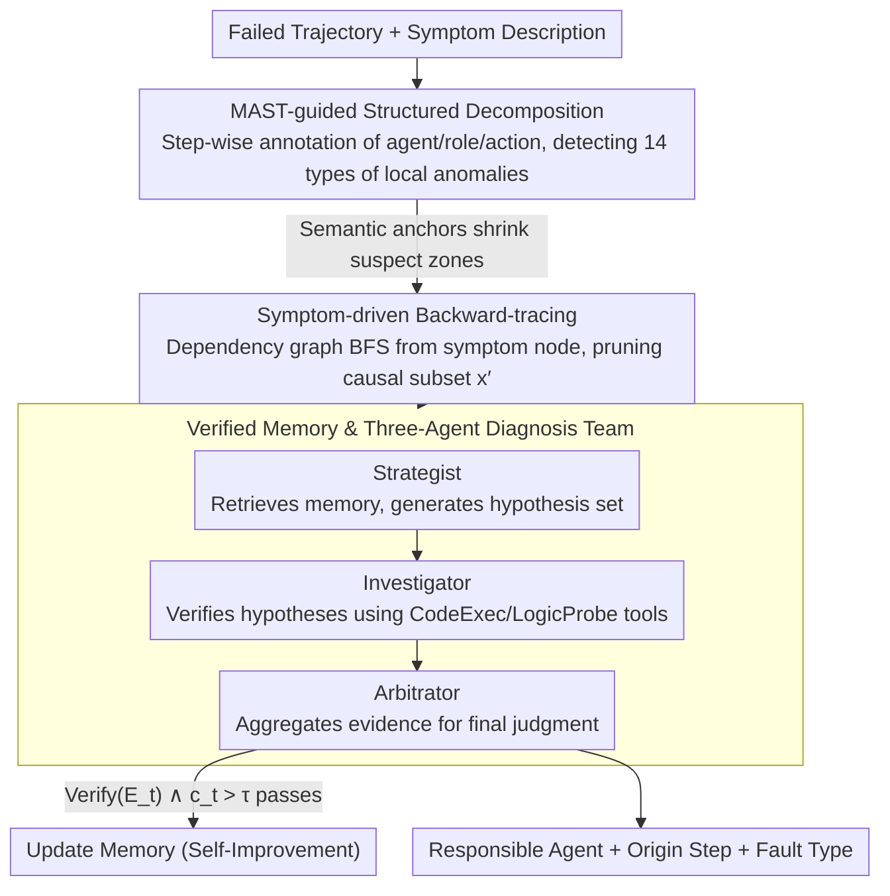

# Towards Self-Improving Error Diagnosis in Multi-Agent Systems

**Conference**: ACL 2026 Findings  
**arXiv**: [2604.17658](https://arxiv.org/abs/2604.17658)  
**Code**: None  
**Area**: LLM Evaluation  
**Keywords**: Multi-agent fault attribution, error localization, self-improving diagnosis, verified memory, backward-tracing

## TL;DR

The ErrorProbe framework is proposed, which achieves self-improving semantic fault attribution in multi-agent systems via MAST taxonomy-driven structured decomposition, symptom-driven backward-tracing, and a verified memory mechanism, significantly outperforming baselines in step-level error localization.

## Background & Motivation

**Background**: LLM-based multi-agent systems (MAS) have demonstrated powerful capabilities in fields such as software engineering, web navigation, and scientific reasoning. However, debugging these systems has become an increasingly prominent issue. When a task is completed collaboratively by multiple roles (e.g., architect, engineer, tester), a failure necessitates answering: "Which agent caused the error? At which step did the error originate?"

**Limitations of Prior Work**: Existing diagnosis methods suffer from three types of flaws: (1) Manual labeling methods based on taxonomy (such as MAST) require intensive expert effort and are difficult to scale. (2) Specialized trackers based on training data rely on expensive data generation pipelines and require continuous retraining. (3) The LLM-as-a-Judge paradigm performs poorly in step-level localization within long contexts, especially in scenarios where error manifestation is delayed.

**Key Challenge**: Error attribution in MAS faces multiple challenges—extremely long interaction trajectories (dozens to hundreds of rounds), delayed symptom manifestation (early errors only surfacing in later stages), complex causal dependency chains between agents, and diverse failure modes. These factors prevent a single LLM judgment from effectively penetrating long contexts to locate the root cause.

**Goal**: To design a self-improving multi-agent fault attribution framework that requires no manual annotation and can precisely identify the responsible agent and the error origin step.

**Key Insight**: Simulate the debugging process of human experts—first decompose the problem into multiple professional roles (hypothesis generation, verification execution, arbitration decision), prune irrelevant context through backward-tracing, and leverage a verified memory pool to achieve cross-domain pattern reuse.

**Core Idea**: Operationalize the MAST taxonomy into a lightweight detector to provide local anomaly clues, combine this with symptom-driven backward-tracing to compress the context, and utilize a "Strategist-Investigator-Arbitrator" team to verify hypotheses through tool execution. Finally, the memory pool is updated via a verification gate to achieve self-improvement.

## Method

### Overall Architecture

ErrorProbe is a three-stage pipeline: the input consists of a failed multi-agent interaction trajectory and a description of fault symptoms; the output includes the responsible agent, the error origin step, and the fault type. First, local anomaly labels are detected via MAST-guided decomposition. Then, backward-tracing starting from the symptoms is performed to prune the context. Finally, three specialized agents collaborate on the diagnosis and update the verified memory.

### Key Designs

**1. MAST-guided Structured Decomposition: Placing semantic anchors on complex trajectories to shrink the search space from the entire trajectory to suspect zones.**

Original interaction trajectories are noisy and unstructured; directly asking an LLM to find a root cause within dozens or hundreds of rounds often leads to confusion. ErrorProbe first parses the trajectory to extract the agent identity, role, and action type for each step. It then uses conditional prompts from the MAST taxonomy to detect step-level deviations—such as "tool output ignored" or "reasoning-action mismatch." MAST categorizes faults into 14 patterns (Specification, Alignment, and Verification). These weak signals serve as heuristic priors to compress the scope requiring detailed inspection from $L$ steps to a few candidate regions. Rather than making a final conclusion, this stage provides semantic anchors for subsequent diagnosis, ensuring expensive reasoning is only spent on suspicious areas.

**2. Symptom-driven Backward-tracing: Reconstructing the causal chain backwards from the crash point to prune the long trajectory into a relevant fragment.**

A typical manifestation of multi-agent faults is "early root cause, late symptoms"—for instance, an incorrect parameter passed at step 5 only causes a crash at step 50. Feeding the entire history into a diagnostician triggers "Lost in the Middle" issues. Backward-tracing constructs a dependency graph $G=(V,E)$ between messages and performs a Breadth-First Search (BFS) starting from the symptom node $v_L$. This determines the effective receptive field of the error while masking irrelevant parallel branches, ultimately compressing the original long trajectory $x$ into a causal subset $x' \subset x$. The diagnostician operates only on $x'$, avoiding interference from irrelevant context while ensuring the chain spanning dozens of steps between the root cause and the symptom remains intact.

**3. Verified Memory and Three-Agent Diagnosis Team: Turning "guessing" into "proving" via tool execution and preventing memory corruption through a verification gate.**

Relying on a single LLM to decide on attribution often leads to hallucinations that sound plausible but are incorrect. ErrorProbe decomposes diagnosis into a "Strategist-Investigator-Arbitrator" team: the Strategist retrieves historical patterns from memory and generates hypotheses; the Investigator must provide executable evidence for each hypothesis using tools like CodeExec for sandbox re-runs or LogicProbe for conditional verification; the Arbitrator aggregates evidence to reach a final judgment and decides whether to save the pattern to memory. Memory updates are restricted by a strict verification gate:

$$\text{Verify}(E_t) \land c_t > \tau,$$

meaning a pattern is only stored if it is confirmed by tools and its confidence $c_t$ exceeds the threshold $\tau$. Tool execution provides objective evidence to counter LLM attribution hallucinations, while the verification gate blocks memory corruption—where incorrect patterns might be stored as experience under distribution shift. Together, these layers allow the framework to self-improve across tasks without degradation.

### Main Results

| Benchmark | Method | Agent Accuracy | Step Accuracy |
|------|------|-------------|------------|
| TracerTraj | LLM-as-a-Judge (Claude) | 67.7% | 8.7% |
| TracerTraj | ErrorProbe+Memory (Claude) | 73.2% | 39.4% |
| Who&When-Algo | LLM-as-a-Judge (Claude) | 55.6% | 41.3% |
| Who&When-Algo | ErrorProbe+Memory (Claude) | 60.3% | 59.5% |
| Average (3 Benchs) | ErrorProbe+Memory (Claude) | 59.6% | 42.7% |
| Average (3 Benchs) | LLM-as-a-Judge (Claude) | 57.0% | 21.3% |

### Ablation Study

| Configuration | Agent Avg | Step Avg | Description |
|------|-----------|----------|------|
| LLM-as-a-Judge | 57.0% | 21.3% | Single judgment baseline |
| Agent-as-a-Judge (Baseline) | 46.4% | 24.7% | Tool-enhanced but unstructured |
| ErrorProbe (No Memory) | 56.3% | 41.9% | With decomposition + tracing |
| ErrorProbe (With Memory) | 59.6% | 42.7% | Complete framework |

### Key Findings

- Step-level localization is the primary highlight: ErrorProbe improves Claude's Step accuracy from 21.3% to 42.7%, more than doubling the performance.
- The memory module benefits weaker models more significantly: GPT-OSS-120B improved from 25.8% to 31.1%, and Qwen3-32B improved from 29.2% to 34.9%.
- Cross-domain transfer is effective: patterns learned from KodCode improved diagnosis on TracerTraj, with the verification gate successfully filtering domain-specific noise.
- GSM8K showed the largest in-domain memory gain (Step +35%) due to high repetition in error patterns within that domain.

## Highlights & Insights

- **Sophisticated Verification Gate**: Only diagnosis patterns confirmed by tool execution are written to memory, avoiding the issue of memory corruption in naive caching under distribution shifts. This approach is transferable to other LLM agent systems requiring experience accumulation.
- **Backward-tracing Solves "Lost in the Middle"**: Compressing long trajectories into causal subsets via dependency graph pruning is applicable to any scenario requiring causal localization in long contexts.
- **Three-Agent Team Mimics Human Debugging**: The division of labor—hypothesis generation, evidence collection, and arbitration decision—allows each stage to be optimized independently.

## Limitations & Future Work

- Reliance on explicit failure signals makes it unable to detect "silent failures" (technically correct but semantically wrong outputs).
- The reasoning overhead of the multi-agent diagnosis team is high, making it unsuitable for ultra-low latency scenarios.
- Validation was limited to three model families and did not cover more architectures.
- Future work could introduce a test-time oracle feedback mechanism to expose latent errors.

## Related Work & Insights

- **vs LLM-as-a-Judge**: LLM-as-a-Judge is significantly deficient in step localization (<10% on TracerTraj). ErrorProbe addresses causal localization in long contexts through structured decomposition and backward-tracing.
- **vs TracerTraj Trained Trackers**: Training-based methods rely on expensive counterfactual replay data and require constant retraining. ErrorProbe requires no training and achieves incremental improvement via verified memory.

## Rating

- Novelty: ⭐⭐⭐⭐ The combination of verified memory and backward-tracing is quite innovative, though the core idea (multi-agent collaborative diagnosis) is not entirely new.
- Experimental Thoroughness: ⭐⭐⭐⭐ Three benchmarks, three models, comprehensive ablations, and memory scaling analysis make the evaluation robust.
- Writing Quality: ⭐⭐⭐⭐ The problem definition is clear and the method description is detailed, though some sections are slightly verbose.

<!-- RELATED:START -->

## Related Papers

- [\[ICLR 2026\] Stochastic Self-Organization in Multi-Agent Systems](../../ICLR2026/multi_agent/stochastic_self-organization_in_multi-agent_systems.md)
- [\[ACL 2026\] AgenticEval: Toward Agentic and Self-Evolving Safety Evaluation of Large Language Models](agenticeval_toward_agentic_and_self-evolving_safety_evaluation_of_large_language.md)
- [\[AAAI 2026\] Conversational Learning Diagnosis via Reasoning Multi-Turn Interactive Learning](../../AAAI2026/multi_agent/conversational_learning_diagnosis_via_reasoning_multi-turn_interactive_learning.md)
- [\[AAAI 2026\] LungNoduleAgent: A Collaborative Multi-Agent System for Precision Diagnosis of Lung Nodules](../../AAAI2026/multi_agent/lungnoduleagent_a_collaborative_multi-agent_system_for_precision_diagnosis_of_lu.md)
- [\[ACL 2026\] LLM-Based Human-Agent Collaboration and Interaction Systems: A Survey](llm-based_human-agent_collaboration_and_interaction_systems_a_survey.md)

<!-- RELATED:END -->
