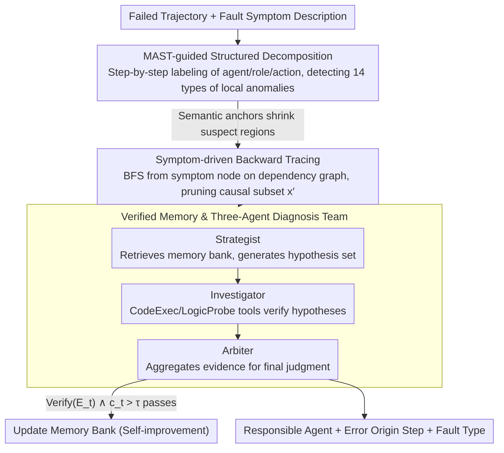

# Towards Self-Improving Error Diagnosis in Multi-Agent Systems

**Conference**: ACL 2026 Findings  
**arXiv**: [2604.17658](https://arxiv.org/abs/2604.17658)  
**Code**: None  
**Area**: LLM Evaluation  
**Keywords**: Multi-agent fault attribution, Error localization, Self-improving diagnosis, Verified memory, Backward tracing

## TL;DR

Ours proposes the ErrorProbe framework, which achieves self-improving semantic fault attribution in multi-agent systems through MAST taxonomy-driven structured decomposition, symptom-driven backward tracing, and a verified memory mechanism, significantly outperforming baselines in step-level error localization.

## Background & Motivation

**Background**: LLM-based multi-agent systems (MAS) have demonstrated powerful capabilities in fields such as software engineering, web navigation, and scientific reasoning. However, their debugging issues have become increasingly prominent. When a system completes a task through the collaboration of multiple roles (architects, engineers, testers, etc.), failure necessitates answering: "Which agent caused the error? At which step did the error originate?"

**Limitations of Prior Work**: Existing diagnosis methods suffer from three types of defects: (1) Taxonomy-based manual labeling methods (e.g., MAST) require extensive expert labor and are difficult to scale; (2) Specialized trackers based on training data rely on expensive data generation pipelines and require continuous retraining; (3) The LLM-as-a-Judge paradigm performs poorly in step-level localization within long contexts, especially in scenarios where error manifestation is delayed.

**Key Challenge**: Error attribution in MAS faces multiple challenges—extremely long interaction trajectories (dozens to hundreds of rounds), delayed error manifestation (early errors only surfacing in later stages), complex causal dependency chains between agents, and diverse failure modes. This makes it difficult for a single LLM judgment to effectively penetrate long contexts to locate the root cause.

**Goal**: To design a self-improving multi-agent fault attribution framework that requires no manual labeling and can accurately identify the responsible agent and the error origin step.

**Key Insight**: Mimic the debugging process of human experts—first decompose the problem into multiple professional roles (hypothesis generation, verification execution, arbitration decision), prune irrelevant context through backward tracing, and achieve cross-domain pattern reuse using a verified memory bank.

**Core Idea**: Operationalize the MAST taxonomy as a lightweight detector to provide local anomaly clues, combine this with symptom-driven backward tracing to compress the context, and have a three-agent team of "Strategist-Investigator-Arbiter" verify hypotheses through tool execution, finally updating the memory bank via a verification gate to achieve self-improvement.

## Method

### Overall Architecture

ErrorProbe is a three-stage pipeline: the input consists of the failed multi-agent interaction trajectory and a description of the fault symptoms; the output is the responsible agent, error origin step, and fault type. First, local anomaly labels are detected via MAST-guided decomposition, then backward tracing is performed from the symptoms to prune the context, and finally, three specialized agents collaborate to diagnose and update the verified memory.

### Key Designs

**1. MAST-guided Structured Decomposition: Setting semantic anchors in disordered trajectories to shrink the search space from the whole trajectory to a few suspect regions.**

Original interaction trajectories are noisy and unstructured; directly asking an LLM to find the root cause across dozens or hundreds of rounds often leads to it getting lost. ErrorProbe first parses the trajectory, step-by-step extracting the agent identity, role, and action type for each step, and then uses conditional prompts from the MAST taxonomy to detect step-level deviations—such as "tool output ignored" or "reasoning-action mismatch." MAST categorizes faults into 14 patterns (Spec Issues, Alignment Failure, Verification Defects). These weak signals act as heuristic priors, compressing the range requiring detailed inspection from $L$ steps to a few candidate regions. It does not provide the final conclusion itself; its role is to provide semantic anchors so that expensive reasoning is only spent on suspicious areas.

**2. Symptom-driven Backward Tracing: Reconstructing the causal chain backwards from the crash point to cut the long trajectory into the truly relevant segment.**

A typical pattern in multi-agent failures is "early root cause, late symptom"—an incorrect parameter passed in step 5 might only cause a crash at step 50. Feeding the entire history into the diagnoser all at once triggers "lost in the middle" in long contexts. Backward tracing builds a dependency graph $G=(V,E)$ between messages and performs a Breadth-First Search starting from the symptom node $v_L$ to determine the effective receptive field of the error, while shielding irrelevant parallel branches. This compresses the original long trajectory $x$ into a causal subset $x' \subset x$. The diagnoser works only on $x'$, which avoids interference from irrelevant context while ensuring that the chain spanning dozens of steps between the root cause and the symptom is preserved intact.

**3. Verified Memory & Three-Agent Diagnosis Team: Turning "guessing" into "verification" via tool execution and preventing memory pollution through a verification gate.**

Simply letting a single LLM finalize the attribution often leads to plausible but incorrect hallucinations. ErrorProbe splits the diagnosis into a "Strategist-Investigator-Arbiter" team: the Strategist retrieves historical patterns from the memory bank and generates a set of hypotheses; for each hypothesis, the Investigator must provide executable evidence using tools—re-running code in a `CodeExec` sandbox or performing condition validation with `LogicProbe`; the Arbiter aggregates the evidence to make the final judgment and decides whether to write the pattern back to memory. Memory updates are filtered by a strict verification gate:

$$\text{Verify}(E_t) \land c_t > \tau,$$

meaning only patterns confirmed by tools with a confidence level exceeding $\tau$ are allowed into the memory bank. Tool execution provides objective evidence to counteract the LLM's attribution hallucinations, while the verification gate blocks memory corruption—preventing the storage of "faulty patterns as experience" under distribution shifts. Together, these two layers allow the framework to achieve cross-task self-improvement without degradation.

### A Complete Example: Walking through the three stages with a failed trajectory

The input is a failed multi-agent trajectory (e.g., architect-engineer-tester collaborating on code, resulting in a unit test crash) plus a fault symptom description. In the first stage, structured decomposition labels this trajectory of dozens of rounds step-by-step, and the MAST detector identifies a "tool output ignored" local anomaly at step 12, shrinking the suspect range from the whole trajectory to a few candidate regions. In the second stage, backward tracing performs a reverse BFS from the symptom node $v_L$ where the crash occurred, pruning parallel discussion branches irrelevant to the crash along the dependency graph, leaving only the causal subset $x'$ leading from the step 12 anomaly to the final crash. In the third stage, the Strategist retrieves from the memory bank on $x'$ and proposes hypotheses such as "incorrect parameter type at step 12"; the Investigator confirms the hypothesis by re-running the step in the `CodeExec` sandbox and uses `LogicProbe` to rule out other branches; based on this, the Arbiter determines responsible agent = Engineer, error origin step = 12, fault type = Verification Defect, and writes this pattern into memory for future reuse because the evidence passed $\text{Verify}(E_t) \land c_t > \tau$.

### Loss & Training

ErrorProbe is an inference-time framework and requires no training. It processes failed tasks in a streaming fashion, selectively updating its memory state based on verification results after each diagnosis:

$$\mathcal{M}_i \leftarrow \text{Update}(\mathcal{M}_{i-1}, x_i, \hat{y}_i, \text{Verify}(\hat{y}_i)),$$

thereby achieving self-improvement. Memory retrieval utilizes a combination of structural matching and quality-weighted RFI-Δ scoring; it degrades to first-principles reasoning during cold starts.

## Key Experimental Results

### Main Results

| Benchmark | Method | Agent Acc | Step Acc |
|-----------|--------|-----------|----------|
| TracerTraj | LLM-as-a-Judge (Claude) | 67.7% | 8.7% |
| TracerTraj | ErrorProbe+Memory (Claude) | 73.2% | 39.4% |
| Who&When-Algo | LLM-as-a-Judge (Claude) | 55.6% | 41.3% |
| Who&When-Algo | ErrorProbe+Memory (Claude) | 60.3% | 59.5% |
| 3-Bench Avg | ErrorProbe+Memory (Claude) | 59.6% | 42.7% |
| 3-Bench Avg | LLM-as-a-Judge (Claude) | 57.0% | 21.3% |

### Ablation Study

| Config | Agent Avg | Step Avg | Description |
|--------|-----------|----------|-------------|
| LLM-as-a-Judge | 57.0% | 21.3% | Single judgment baseline |
| Agent-as-a-Judge (Baseline) | 46.4% | 24.7% | Tool-augmented but no structure |
| ErrorProbe (No Memory) | 56.3% | 41.9% | With decomposition + tracing |
| ErrorProbe (With Memory) | 59.6% | 42.7% | Full framework |

### Key Findings

- Step-level localization is the biggest highlight: ErrorProbe doubles Claude's Step accuracy from 21.3% to 42.7%.
- The memory module helps weaker models more: GPT-OSS-120B improved from 25.8% to 31.1%, and Qwen3-32B from 29.2% to 34.9%.
- Cross-domain transfer is effective: patterns learned from KodCode improved diagnosis on TracerTraj; the verification gate successfully filtered domain-specific noise.
- GSM8K showed the largest in-domain memory gain (Step +35%), as error patterns in this domain have high repeatability.

## Highlights & Insights

- **Sophisticated Verification Gate**: Only diagnosis patterns confirmed by tool execution are written to memory, avoiding the memory corruption issues that naive caching faces under distribution shifts. This approach can be transferred to other LLM agent systems requiring experience accumulation.
- **Backward Tracing Solves "Lost in the Middle"**: Compressing long trajectories into causal subsets via dependency graph pruning is applicable to all scenarios requiring causal localization in long contexts.
- **Three-Agent Team Mimics Human Debugging**: The division of labor into hypothesis generation, evidence collection, and arbitration decision allows each stage to be independently optimized.

## Limitations & Future Work

- Reliance on explicit fault signals; unable to detect "silent failures" (outputs that are technically correct but semantically wrong).
- High reasoning overhead for the multi-agent diagnosis team, making it unsuitable for ultra-low latency scenarios.
- Only verified across three model families, not covering more architectures.
- Future work could introduce test-time oracle feedback mechanisms to expose latent errors.

## Related Work & Insights

- **vs LLM-as-a-Judge**: LLM-as-a-Judge is severely deficient in step localization (<10% on TracerTraj); ErrorProbe solves the causal localization puzzle in long contexts through structured decomposition and backward tracing.
- **vs TracerTraj Trained Trackers**: Trained methods rely on expensive counterfactual replay data and require continuous retraining. Ours requires no training and achieves incremental improvement through verified memory.

## Rating

- Novelty: ⭐⭐⭐⭐ The combination of verified memory and backward tracing is quite innovative, though the core idea (multi-agent collaborative diagnosis) is not entirely new.
- Experimental Thoroughness: ⭐⭐⭐⭐ Three benchmarks + three models + extensive ablations + memory scaling analysis make it quite thorough.
- Writing Quality: ⭐⭐⭐⭐ Problem definition is clear and the method description is detailed, though some content is slightly verbose.

<!-- RELATED:START -->

## Related Papers

- [\[ICLR 2026\] MAS²: Self-Generative, Self-Configuring, Self-Rectifying Multi-Agent Systems](../../ICLR2026/multi_agent/mas2_self-generative_self-configuring_self-rectifying_multi-agent_systems.md)
- [\[ICLR 2026\] Aegis: Automated Error Generation and Attribution for Multi-Agent Systems](../../ICLR2026/multi_agent/aegis_automated_error_generation_and_attribution_for_multi-agent_systems.md)
- [\[ICLR 2026\] Stochastic Self-Organization in Multi-Agent Systems](../../ICLR2026/multi_agent/stochastic_self-organization_in_multi-agent_systems.md)
- [\[ACL 2026\] AgenticEval: Toward Agentic and Self-Evolving Safety Evaluation of Large Language Models](agenticeval_toward_agentic_and_self-evolving_safety_evaluation_of_large_language.md)
- [\[AAAI 2026\] Conversational Learning Diagnosis via Reasoning Multi-Turn Interactive Learning](../../AAAI2026/multi_agent/conversational_learning_diagnosis_via_reasoning_multi-turn_interactive_learning.md)

<!-- RELATED:END -->
