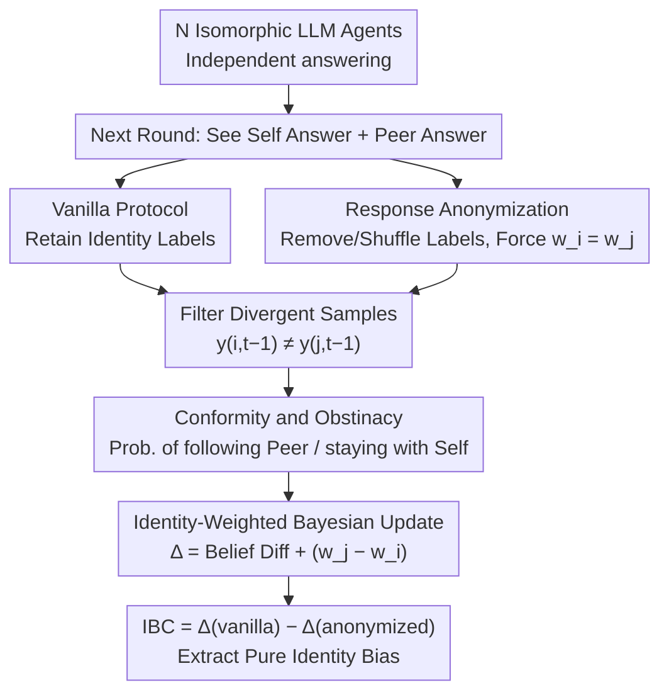

# When Identity Skews Debate: Anonymization for Bias-Reduced Multi-Agent Reasoning

**Conference**: ACL 2024 (Note: Input listed ACL 2026, translated as per input data)
**arXiv**: [2510.07517](https://arxiv.org/abs/2510.07517)
**Code**: https://github.com/deeplearning-wisc/MAD-identity-bias
**Area**: LLM Evaluation
**Keywords**: Multi-Agent Debate, Identity Bias, Anonymization, Conformity, Self-Bias

## TL;DR
This paper points out that LLMs in multi-agent debates change their stances based on "who said it" rather than "what was said," and quantifies and mitigates this identity-driven bias through response anonymization and the Identity Bias Coefficient (IBC).

## Background & Motivation
**Background**: The fundamental assumption of Multi-Agent Debate (MAD) is that allowing multiple LLMs to answer independently, read each other's answers, and revise their stances can amplify correct reasoning signals and reduce single-model hallucinations or accidental errors. Traditional work focuses on communication topology, rounds, aggregation methods, persona settings, and agent diversity, assuming agents update beliefs based on the arguments themselves.

**Limitations of Prior Work**: In actual debates, agents do not see pure content, but content with source labels: "my previous answer" and "another agent's answer." The paper finds that LLMs do not always process these labels neutrally. Some models defer excessively to peers even when their own original answers are more reliable; others persist in their own views, ignoring better external evidence. Consequently, MAD may mislead correct answers rather than correcting errors.

**Key Challenge**: MAD aims to utilize multi-perspective discussion, but the protocols leak identity information. Identity labels distort belief updates—which should be based on content quality—into a weight competition between "self" and "others." The system requires agents to reference each other without irrational conformity or self-persistence triggered by source identity.

**Goal**: The paper addresses three questions: (1) how to unify conformity and self-bias into one interpretable framework; (2) how to measure whether an agent favors peers or self during disagreement; (3) whether identity bias can be reduced via protocol-level changes without training or model modification.

**Key Insight**: Starting from the observation that "the same information triggers different weights when labeled as self or peer," the authors model the debate process as a Bayesian belief update with identity weights. This perspective is promising because it estimates the influence of identity labels on behavior by observing which side an agent follows in disagreement scenarios, without needing to guess internal neural mechanisms.

**Core Idea**: Use response anonymization to remove identity markers from debate transcripts, forcing agents to compare argument content only. This aligns identity weights and uses IBC to measure how much bias is removed compared to vanilla protocols.

## Method

### Overall Architecture
The paper first constructs a MAD setup to observe identity bias: multiple isomorphic LLM agents answer the same question independently, then see their own previous answer and one or more peer answers in the next round before outputting a revised answer. The analysis focuses only on divergent samples where $y_{i,t-1} \neq y_{j,t-1}$, as only these samples reveal whether an agent follows others or persists in its own view.

Based on this, two behavioral statistics are defined. Conformity represents the probability of adopting a peer's previous answer during disagreement; Obstinacy represents the probability of retaining one's own previous answer. If Conformity is significantly higher than Obstinacy, the model yields to others; otherwise, it is self-persistent. These are interpreted as a Bayesian belief update process (Dirichlet-Compound-Multinomial) with identity weights. Response Anonymization is then proposed: removing or shuffling source labels like "Agent i / your previous answer / peer answer" to retain only candidate content.

The experimental workflow runs the same models and datasets under "vanilla MAD" and "anonymized MAD" protocols to calculate Conformity, Obstinacy, their difference $\Delta$, and the Identity Bias Coefficient (IBC) derived from the change in $\Delta$. If $\Delta$ approaches 0 after anonymization, it indicates the previous bias was driven by identity labels rather than content.

### Key Designs

**1. Quantifying directional behavior via Conformity and Obstinacy: Turning "conformity" and "self-persistence" into calculable metrics.**
Standard debate analysis only looks at accuracy changes, failing to distinguish between effective correction and blind following. The paper narrows the observation window to informative divergent samples where the agent's previous answer differs from the peer's ($y_{i,t-1} \neq y_{j,t-1}$). On these samples, Conformity is defined as $\mathbb{E}[\mathbb{1}\{y_{i,t}=y_{j,t-1}\}]$ and Obstinacy as $\mathbb{E}[\mathbb{1}\{y_{i,t}=y_{i,t-1}\}]$. This isolates the debate dynamics from cases where agents already agree.

**2. Identity-weighted Bayesian belief update model: Explaining why $\Delta$ can decompose into a pure identity weight.**
The paper models the agent's internal belief as Dirichlet parameters $\alpha_{i,t}$. Each visible answer is treated as one-hot evidence, but self and peer evidence are assigned different weights $w_i$ and $w_j$. In disagreement scenarios, the difference
$$\Delta = \text{Conformity} - \text{Obstinacy}$$
can be decomposed into the prior belief difference plus an identity term $(w_j - w_i)$, normalized by total belief mass. This provides a testable low-dimensional explanation: if $w_j > w_i$, the model favors the peer even if the peer's content is not stronger.

**3. Response Anonymization and IBC: Using protocol-level anonymization to zero out the identity term.**
Since bias stems from the weight difference between self and peer, the simplest fix is cutting off individual identity channels. Response Anonymization removes source labels like "Agent i" or "your previous answer," leaving only candidate content. This effectively forces $w_i = w_j$, zeroing the identity term. The paper defines:
$$\text{IBC} = \Delta_{\text{vanilla}} - \Delta_{\text{anonymized}}$$
A positive IBC indicates excessive peer weight (conformity), while a negative IBC indicates excessive self-weight (self-bias). Subtracting $\Delta$ values cancels out the content belief difference, leaving the pure identity bias.

### Loss & Training
No new models were trained. All modifications occur at the inference layer during debate prompt construction. Vanilla settings retain identity labels, while anonymized settings remove them. Experiments use open-source and closed-source models across identical datasets and debate rounds.

## Key Experimental Results

### Main Results
Evaluation of Qwen2.5-7B/32B, Llama3.1-8B, Mistral-7B, and GPT-OSS-20B on GPQA, MMLU Pro Med, HellaSwag, and GSM8K with 5-agent MAD. Data shows identity bias is nearly universal, with positive IBC in most cases, indicating agents are prone to over-adopting peer answers.

| Model / Dataset | Vanilla $\Delta$ | Anonymized $\Delta$ | IBC | Observation |
|:---|:---|:---|:---|:---|
| Qwen-32B / MMLU | 0.608 | 0.024 | 0.584 | Strong conformity due to identity labels; nearly zero after anonymization. |
| Qwen-7B / HellaSwag | 0.507 | -0.032 | 0.539 | Extremely high peer weight; becomes slightly self-biased after anonymization. |
| Llama-8B / MMLU | 0.151 | -0.157 | 0.307 | Anonymization reduces conformity and reveals content belief differences. |
| Mistral-7B / GSM8K | -0.302 | -0.157 | -0.145 | Rare self-bias case; reduced but not eliminated by anonymization. |
| GPT-OSS-20B / HellaSwag | 0.180 | -0.069 | 0.249 | Moderate conformity; significantly contracts after anonymization. |

### Ablation Study
Key ablations involve comparing protocols, rounds of divergence, heterogeneous agents, and expert agents.

| Configuration | Key Metric | Description |
|:---|:---|:---|
| Vanilla MAD | 18/20 pairs have positive IBC | Agents favor peers in most cases; identity labels induce conformity. |
| Anonymized MAD | Most $\Delta$ near 0 | Weights become symmetric after removing identity labels. |
| Qwen-32B + MMLU | Subversion ↓ 64.3%, Correction ↓ 14.9% | Anonymization primarily reduces "correct answers corrupted by wrong peers." |
| Multi-round Debate | Bias accumulates | Identity channels reinforce wrong consensus over time. |
| Multi-peer Setup | Bias overlap | Source labels' influence does not automatically average out with more peers. |

### Key Findings
- MAD failures are not just "wrong majorities" or "reasoning failures," but a protocol issue where the same argument yields different influence based on its label.
- Anonymization is particularly effective for the Qwen series, indicating large models are not immune to identity-driven conformity.
- From a trust perspective, anonymization reduces "Subversion" (correct to incorrect) significantly more than it reduces "Correction" (incorrect to correct).

## Highlights & Insights
- The paper unifies sycophancy and self-bias into a single identity bias framework rather than treating them as isolated phenomena.
- Response Anonymization is simple yet effective: it shuts down influence factors that should not affect judgment. This is transferable to peer review, code review, and medical consultation agents.
- The IBC metric is practical, using the difference between protocols to isolate pure identity bias from content-based belief.

## Limitations & Future Work
- The theoretical model treats identity as the primary factor, but factors like answer length, argument quality, position, and formatting might also confound results.
- Anonymization suits isomorphic agents; in expert-layman systems, identity is a useful signal. Future work should distinguish "harmful identity labels" from "verifiable expertise signals."
- Experiments focused on multiple-choice and short reasoning; it is unclear if anonymization affects accountability or efficiency in open-ended generation or code repair.

## Related Work & Insights
- **vs. Traditional Multi-Agent Debate**: While others focus on topology and aggregation, this work shows that source identity itself is a variable that flips the direction of updates.
- **vs. Single-Agent Sycophancy**: Extends sycophancy from user-model interaction to model-model interaction and includes self-bias.
- **vs. Persona Debate**: Persona methods often strengthen identity for diversity; this work warns that such signals may introduce non-content-driven weight biases.

## Rating
- **Novelty**: ⭐⭐⭐⭐☆ Unified analysis of conformity and self-bias in MAD is a fresh perspective.
- **Experimental Thoroughness**: ⭐⭐⭐⭐☆ Covers 5 models and 4 benchmarks with various debate configurations.
- **Writing Quality**: ⭐⭐⭐⭐☆ Clear theoretical decomposition and narrative.
- **Value**: ⭐⭐⭐⭐⭐ High practical value as a zero-cost protocol fix for multi-agent systems.

<!-- RELATED:START -->

## Related Papers

- [\[ICLR 2026\] MAD-Logic: Multi-Agent Debate Enhances Symbolic Translation and Reasoning](../../ICLR2026/multi_agent/mad-logic_multi-agent_debate_enhances_symbolic_translation_and_reasoning.md)
- [\[ACL 2026\] Latent Agents: A Post-Training Procedure for Internalized Multi-Agent Debate](latent_agents_a_post-training_procedure_for_internalized_multi-agent_debate.md)
- [\[ICLR 2026\] Aligned Agents, Biased Swarm: Measuring Bias Amplification in Multi-Agent Systems](../../ICLR2026/multi_agent/aligned_agents_biased_swarm_measuring_bias_amplification_in_multi-agent_systems.md)
- [\[ICLR 2026\] Multi-Agent Debate with Memory Masking (MAD-M²)](../../ICLR2026/multi_agent/multi-agent_debate_with_memory_masking.md)
- [\[ICML 2025\] From Debate to Equilibrium: Belief-Driven Multi-Agent LLM Reasoning via Bayesian Nash Equilibrium](../../ICML2025/multi_agent/from_debate_to_equilibrium_belief-driven_multi-agent_llm_reasoning_via_bayesian_.md)

<!-- RELATED:END -->
