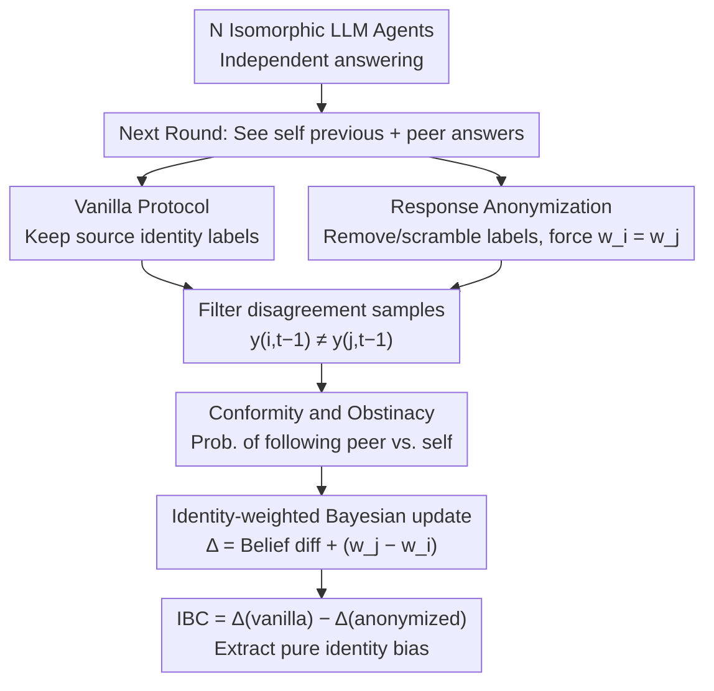

# When Identity Skews Debate: Anonymization for Bias-Reduced Multi-Agent Reasoning

**Conference**: ACL2026  
**arXiv**: [2510.07517](https://arxiv.org/abs/2510.07517)  
**Code**: https://github.com/deeplearning-wisc/MAD-identity-bias  
**Area**: LLM Evaluation  
**Keywords**: Multi-Agent Debate, Identity Bias, Anonymization, Conformity, Self-bias

## TL;DR
This paper identifies that LLMs in multi-agent debate (MAD) change their stances based on "who said it" rather than "what was said," and proposes Response Anonymization along with the Identity Bias Coefficient (IBC) to quantify and mitigate this identity-driven bias.

## Background & Motivation
**Background**: The fundamental assumption of Multi-Agent Debate (MAD) is that allowing multiple LLMs to answer independently followed by iterative cross-review and refinement can amplify correct reasoning signals and reduce single-model hallucinations or accidental errors. Prior work focused on communication topologies, round counts, aggregation methods, agent personas, and diversity, assuming agents update beliefs based on argument quality.

**Limitations of Prior Work**: In practical debates, agents do not see pure content, but content with source labels: "my previous answer" versus "the other agent's answer." The paper finds that LLMs do not process these labels neutrally. Some models over-conform to peers even when their own original answers are more reliable, while others exhibit obstinacy, ignoring superior external evidence. Consequently, MAD may mislead agents away from correct answers rather than correcting errors.

**Key Challenge**: MAD seeks to utilize multi-perspective discussion, but the discussion protocols simultaneously leak identity information. Identity labels distort belief updates—which should be based on content quality—into a weighted competition between "self" and "others." The system requires agents to reference each other without irrational conformity or self-persistence driven by source identities.

**Goal**: This paper addresses three problems: first, how to unify conformity and self-bias into a single interpretable framework; second, how to measure whether an agent biases toward peers or self during disagreements; and third, whether identity bias can be reduced through protocol-layer changes without retraining or modifying models.

**Key Insight**: Starting from the observation that the same information triggers different weights when labeled as "self" or "peer," the authors model the debate process as a Bayesian belief update with identity weights. This perspective is promising as it does not require guessing internal neural mechanisms; it estimates the impact of identity labels by observing which side an agent follows in disagreement scenarios.

**Core Idea**: Utilize Response Anonymization to remove identity markers from the debate transcript, forcing agents to compare only argument content to align identity weights, and use IBC to measure the degree of bias removed.

## Method

### Overall Architecture
The paper constructs a MAD setup to observe identity bias: multiple isomorphic LLM agents initially answer the same question independently. In the subsequent round, they see their own previous answer and one or more peer answers before outputting a revised response. The analysis focuses only on samples with disagreement, i.e., where the agent's previous answer $y_{i,t-1}$ differs from the peer answer $y_{j,t-1}$, as this is the only condition where a shift toward the peer or persistence of the self can be determined.

Based on this, the authors define two behavioral statistics. Conformity represents the probability that an agent adopts the peer answer during disagreement; Obstinacy represents the probability that an agent retains its own previous answer. If Conformity is significantly higher than Obstinacy, the model leans toward peer concession; otherwise, it exhibits self-bias. These metrics are interpreted via a Dirichlet-Compound-Multinomial belief update process with identity weights. Response Anonymization is then proposed: removing or shuffling source labels like "Agent i / your previous answer / peer answer" to retain only the candidate content.

The experimental workflow runs the same models and datasets under both vanilla and anonymized MAD protocols to calculate Conformity, Obstinacy, the difference $\Delta$, and the IBC. If $\Delta$ approaches 0 after anonymization, the previous bias is attributed to identity labels rather than content.

### Key Designs

**1. Quantifying directional behavior during disagreement: Turning "conformity" and "obstinacy" into computable metrics**

Traditional debate analysis evaluates only whether accuracy improves, failing to distinguish between effective correction and blind following. This paper narrows the observation window to informative disagreement samples—those where the agent's answer $y_{i,t-1}$ differs from the peer's $y_{j,t-1}$. In these cases, Conformity is defined as $\mathbb{E}[\mathbb{1}\{y_{i,t}=y_{j,t-1}\}]$ and Obstinacy as $\mathbb{E}[\mathbb{1}\{y_{i,t}=y_{i,t-1}\}]$. 

This conditioning excludes cases where agents already agree, separating debate dynamics into two fundamental tendencies: being pulled by the peer or sticking to the self. Quantification allows trust analysis and anonymization effects to be measured on a unified scale.

**2. Identity-weighted Bayesian belief update model: Explaining why $\Delta$ decomposes into a pure identity weight**

The paper models internal beliefs about candidate answers as Dirichlet parameters $\alpha_{i,t}$. Each observed answer is treated as one-hot evidence, but self and peer evidence are assigned different weights $w_i$ and $w_j$. In disagreement scenarios, the difference 

$$\Delta=\text{Conformity}-\text{Obstinacy}$$

can be decomposed into the prior belief difference plus an identity term $w_j-w_i$, normalized by the total belief mass.

This provides a testable low-dimensional explanation: even if peer content is not stronger, the model will prefer adopting it if $w_j > w_i$. Thus, $\Delta$ contains an irrational weight difference driven by source labels.

**3. Response Anonymization and IBC: Zeroing the identity term via protocol-layer anonymization and quantifying the reduction**

Since the bias stems from weight differences between self/peer, the simplest fix is to cut the identity channel. Response Anonymization removes or shuffles source labels like "Agent i / your previous answer / peer's answer," leaving only anonymous candidate content. Agents cannot distinguish their own answers, effectively forcing $w_i=w_j$ and zeroing the identity term. The paper defines:

$$\text{IBC}=\Delta_{\text{vanilla}}-\Delta_{\text{anonymized}}$$

A positive IBC indicates excessive peer weighting (conformity), while a negative IBC indicates excessive self-weighting (self-bias). Subtracting $\Delta$ terms cancels out the content-based belief difference, exposing pure identity bias. This approach has near-zero deployment cost and does not depend on model architecture.

### Loss & Training
This work involves no new model training or extra loss functions. All modifications occur at the inference-time debate prompt construction layer: the vanilla setting retains source identity, while the anonymized setting removes it. Experiments compare behavioral statistics across multiple open and closed-source models.

## Key Experimental Results

### Main Results
The paper evaluates Qwen2.5-7B/32B, Llama3.1-8B, Mistral-7B, and GPT-OSS-20B on GPQA, MMLU Pro Medicine, HellaSwag, and GSM8K using a 5-agent MAD setup. Results show that identity bias is pervasive, typically manifesting as a positive IBC (over-conformity).

| Model / Dataset | Vanilla $\Delta$ | Anonymized $\Delta$ | IBC | Observation |
|--------|------|------|------|------|
| Qwen-32B / MMLU | 0.608 | 0.024 | 0.584 | Strong identity-driven conformity; nearly zeroed after anonymization |
| Qwen-7B / HellaSwag | 0.507 | -0.032 | 0.539 | High peer weighting; shifts slightly toward self-bias after anonymization |
| Llama-8B / MMLU | 0.151 | -0.157 | 0.307 | Anonymization reduces conformity and exposes underlying belief differences |
| Mistral-7B / GSM8K | -0.302 | -0.157 | -0.145 | Rare case of self-bias; reduced but persistent after anonymization |
| GPT-OSS-20B / HellaSwag | 0.180 | -0.069 | 0.249 | Moderate conformity bias; significantly reduced by anonymization |

### Ablation Study
The study compares vanilla vs anonymized settings, disagreement rounds, heterogeneous agents, multiple peers, and expert agents. 

| Configuration | Key Metric | Description |
|------|---------|------|
| Vanilla MAD | 18/20 pairs show positive IBC | Agents generally favor peers; identity labels induce conformity |
| Anonymized MAD | Majority $\Delta$ near 0 | Removing identity labels makes self/peer weights more symmetric |
| Qwen-32B + MMLU Anonymized | Subversion -64.3%, Correction -14.9% | Anonymization primarily reduces "right-to-wrong" shifts rather than all answer changes |
| Multi-round Debate | Bias accumulates over rounds | Prolonged identity exposure reinforces erroneous consensus |
| Multi-peer Setup | Identity bias can stack | When multiple peers are present, source label influence does not automatically average out |

### Key Findings
- MAD failure is not solely due to "the majority being wrong" or "reasoning failure," but a protocol issue: the same argument carries different weight depending on whether it is labeled as self or peer.
- Anonymization is particularly effective for the Qwen series; for Qwen-32B on MMLU, $\Delta$ dropped from 0.608 to 0.024, showing that large models are not immune to identity-driven conformity.
- From a trust perspective, anonymization reduces Subversion (switching from correct to incorrect) more effectively than it reduces Correction (switching from incorrect to correct).

## Highlights & Insights
- The paper unifies sycophancy and self-bias into a single framework rather than treating them as isolated phenomena. This elevates MAD behavioral analysis to a quantifiable protocol diagnosis.
- Response Anonymization is simple but effective: it removes non-content markers that should not influence judgment. This approach is transferable to peer review agents, code review agents, and medical consultation systems.
- The IBC definition is practical, as it uses the difference between protocols to isolate the identity component from belief differences. Even if the underlying model is simplified, it serves as a clear diagnostic metric: a high IBC indicates dangerous identity signal exposure.

## Limitations & Future Work
- The theoretical model treats identity weight as the primary influence, but real-world MAD involves confounding factors like response length, argument quality, position order, and formatting.
- Anonymization suits isomorphic agents; in expert-non-expert systems, identity is a useful signal. Future work should distinguish "harmful identity labels" from "credible capability signals."
- Experiments focused on multiple-choice and short-answer tasks; the efficacy of anonymization in long-form generation, open-ended planning, or code repair remains to be explored.

## Related Work & Insights
- **vs. Traditional MAD**: While most MAD research focuses on agent counts and topologies, this work identifies source identity itself as a variable that shifts update directions.
- **vs. Single-agent Sycophancy**: Prior sycophancy research typically involves user-model interactions. This work extends the problem to model-model interactions and includes self-bias.
- **vs. Persona Debate**: Persona methods often strengthen identity differences for diversity. This paper warns that such signals can introduce non-content-driven weight biases, requiring blind review or calibration mechanisms.

## Rating
- Novelty: ⭐⭐⭐⭐☆ Unified analysis of conformity and self-bias in MAD is a fresh perspective; the method is elegant.
- Experimental Thoroughness: ⭐⭐⭐⭐☆ Covers 5 models and 4 benchmarks with detailed trust and multi-round analysis, though restricted to choice-based tasks.
- Writing Quality: ⭐⭐⭐⭐☆ The theoretical decomposition, metrics, and experimental narrative are coherent.
- Value: ⭐⭐⭐⭐⭐ Direct implications for any multi-agent voting or debate system; a near-zero cost protocol fix that should be standard practice.

<!-- RELATED:START -->

## Related Papers

- [\[ACL 2026\] Latent Agents: A Post-Training Procedure for Internalized Multi-Agent Debate](latent_agents_a_post-training_procedure_for_internalized_multi-agent_debate.md)
- [\[ICML 2025\] From Debate to Equilibrium: Belief-Driven Multi-Agent LLM Reasoning via Bayesian Nash Equilibrium](../../ICML2025/multi_agent/from_debate_to_equilibrium_belief-driven_multi-agent_llm_reasoning_via_bayesian_.md)
- [\[CVPR 2026\] Tackling Model Bias via Game-theoretic Multi-agent Collaboration Framework for Hateful Meme Classification](../../CVPR2026/multi_agent/tackling_model_bias_via_game-theoretic_multi-agent_collaboration_framework_for_h.md)
- [\[ICML 2026\] When Cloud Agents Meet Device Agents: Lessons from Hybrid Multi-Agent Systems](../../ICML2026/multi_agent/when_cloud_agents_meet_device_agents_lessons_from_hybrid_multi-agent_systems.md)
- [\[ICLR 2026\] When Agents "Misremember" Collectively: Exploring the Mandela Effect in LLM-based Multi-Agent Systems](../../ICLR2026/multi_agent/when_agents_misremember_collectively_exploring_the_mandela_effect_in_llm-based_m.md)

<!-- RELATED:END -->
