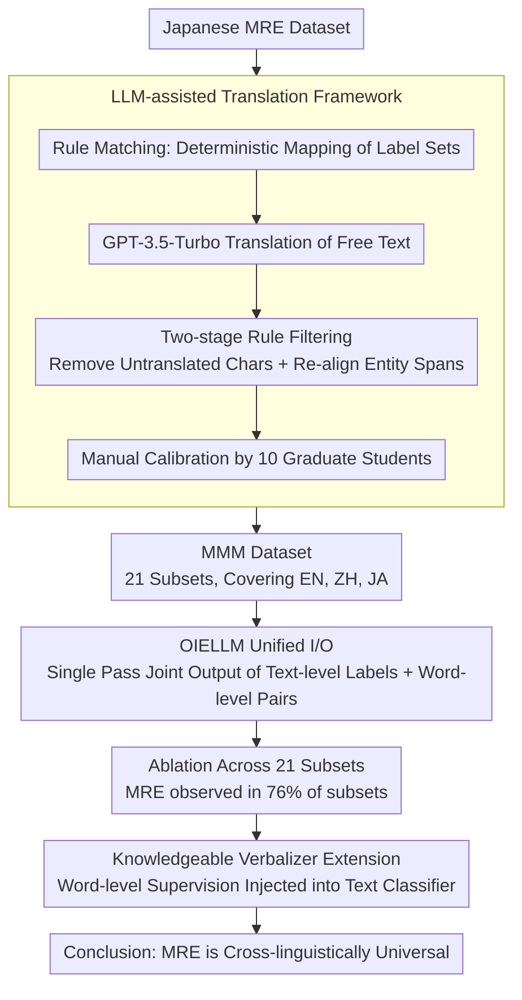

# A Multilingual Dataset and Empirical Validation for the Mutual Reinforcement Effect in Information Extraction

**Conference**: ACL 2026 Findings  
**arXiv**: [2407.10953](https://arxiv.org/abs/2407.10953)  
**Code**: [GitHub/HuggingFace](https://ganchengguang.github.io/MRE/)  
**Area**: Information Extraction / Multilingual NLP  
**Keywords**: Mutual Reinforcement Effect, Multilingual Information Extraction, Word-level/Text-level Joint Modeling, Dataset Construction, LLM-assisted Translation

## TL;DR

Constructs the first multilingual MRE Mix dataset (MMM, 21 subsets covering English, Chinese, and Japanese) and systematically validates that the Mutual Reinforcement Effect (MRE) between word-level and text-level information extraction tasks is cross-linguistically universal through large-scale ablation experiments.

## Background & Motivation

**Background**: Information Extraction (IE) comprises multiple subtasks such as named entity recognition, relation extraction, and sentiment analysis. Traditionally, these are modeled independently. While multi-task learning shares representations, it does not explicitly model the semantic interactions between tasks.

**Limitations of Prior Work**: The Mutual Reinforcement Effect (MRE)—where word-level and text-level IE tasks enhance each other during joint modeling—has previously only been validated in Japanese. The lack of multilingual MRE datasets significantly hinders cross-lingual validation and broader applications.

**Key Challenge**: Is MRE a language-specific phenomenon or a universal mechanism across languages? This fundamental question remains unanswered due to the absence of data.

**Goal**: To construct a multilingual MRE dataset and systematically verify the universality of MRE across different languages and task combinations.

**Key Insight**: A framework for LLM-assisted dataset translation and alignment is proposed to extend Japanese MRE datasets to English and Chinese, while simultaneously constructing new open-domain datasets.

**Core Idea**: MRE is not a language-specific artifact but a universal mechanism of bidirectional dependency between fine-grained word-level semantics and global text-level semantics in IE tasks.

## Method

### Overall Architecture

The entire work constitutes an empirical pipeline: "Data Generation → Joint Modeling Validation → Reverse Validation," corresponding to three core designs: (1) An LLM-assisted translation framework to expand existing Japanese MRE data into the multilingual MMM dataset (21 subsets covering English, Chinese, and Japanese); (2) Training OIELLM with unified input/output on MMM, allowing a single model to perform word-level and text-level extraction in one decoding pass, observing MRE through ablations across 21 subsets; (3) Injecting word-level supervision into a Knowledgeable Verbalizer to confirm from the text classification side that word-level information indeed benefits text-level tasks.

### Key Designs

**1. LLM-assisted Dataset Translation Framework: Expanding Japanese MRE Data Multilingually Without Losing Annotation Consistency**

MRE was previously validated only in Japanese, and cross-lingual validation was hindered by the lack of aligned multilingual data. Direct machine translation of entire segments destroys the alignment of word-level entity spans, while purely manual annotation is too slow. The framework thus employs layered processing: the fixed label set uses rule matching for deterministic translation to eliminate ambiguity; free text is handled by GPT-3.5-Turbo; this is followed by two-stage rule filtering (removing untranslated characters and re-aligning entity spans); and finally, manual calibration provides quality control.

The key lies in the division of labor—the LLM is responsible only for reducing repetitive labor, human experts remain at the quality control stage, and deterministic mapping of the label set ensures that the same label points to consistent meanings across English, Chinese, and Japanese. The resulting MMM dataset enables comparable cross-lingual ablation.

**2. OIELLM Model with Unified Input/Output: Simultaneously Outputting Text-level Labels and Word-level Label-Entity Pairs in a Single Decoding Pass**

To verify the Mutual Reinforcement Effect, a model must perform both tasks simultaneously with stable parseable output. OIELLM takes the original text plus task instructions (prefixed with "/") as input. The output follows a fixed format: text-level labels first, followed by word-level extraction results using ":" and ";" as separators, ensuring consistent structural parsing across tasks and languages.

Conversational prompts are avoided because they introduce extra length overhead and prompt bias, which could interfere with the model's ability to learn the true structural dependencies between text-level and word-level information—the core of MRE.

**3. Knowledgeable Verbalizer Extension: Explicitly Injecting Word-level Supervision Signals into the Text-level Classifier for Reverse Validation**

The first two designs verify that joint modeling yields gains, but reverse evidence is needed: if word-level information truly assists text-level tasks, explicitly embedding it into a classifier should also yield gains. The paper utilizes word-level annotations from the MRE Mix data to construct a knowledge-enhanced verbalizer, strengthening the representation of label tokens in prompt-based text classification.

This approach transforms MRE from a "byproduct of joint training" into a "manually operable source of gain": once word-level supervision is injected, text-level classification improves, confirming from the application side the existence of exploitable bidirectional dependencies.

### Loss & Training

OIELLM is based on an open-source LLM and undergoes full fine-tuning using the standard autoregressive language modeling objective. The training data encompasses all 21 subsets of the MMM dataset.

## Key Experimental Results

### Main Results

| Model | SCNM TL | SCNM WL | SCNM ALL |
|------|---------|---------|----------|
| GPT-4o | 58.30 | 23.42 | 8.57 |
| OIELLM-8B | 84.73 | 88.53 | 61.93 |
| OIELLM-8B* | 87.30 | 89.28 | 64.00 |
| OIELLM-13B | 89.00 | 86.33 | 57.70 |

### Ablation Study

| Configuration | Metric | Description |
|------|---------|------|
| MRE Presence Rate | 76% | 16 out of 21 subsets demonstrated significant MRE |
| Cross-lingual Consistency | Effective in EN/ZH/JA | MRE is not a language-specific phenomenon |
| Verbalizer Gain | Positive | Word-level supervision injection improved text-level classification |

### Key Findings
- 76% of the MMM sub-datasets showed stable Mutual Reinforcement Effects in ablation studies, proving MRE is a universal cross-lingual mechanism.
- OIELLM comprehensively outperforms zero-shot LLMs (GPT-3.5, GPT-4o) under the joint training setting, demonstrating the practical value of MRE.
- Injecting word-level information into the Knowledgeable Verbalizer brought consistent improvements to text-level classification.

## Highlights & Insights
- The "Point-Line" abstraction elegantly unifies the relationship between word-level and text-level IE tasks—word-level tasks are points, text-level tasks are lines, and they constrain each other.
- The design of the LLM-assisted translation framework is practical: deterministic mapping + LLM translation + rule filtering + manual calibration, with clear division of labor at each step.
- The experimental design is thorough—it not only proves the existence of MRE but also demonstrates its actionable application value through the Verbalizer experiment.

## Limitations & Future Work
- Currently only covers English, Chinese, and Japanese; the effectiveness of MRE in low-resource languages has not been verified.
- The translation framework still requires 10 multilingual graduate students for manual calibration, incurring significant costs for scaling.
- The theoretical explanation of MRE (why word-level and text-level reinforce each other) remains insufficient.
- Future work could extend to more languages and a wider array of IE task combinations.

## Related Work & Insights
- **vs. Traditional Multi-task IE**: Not only shares representations but also explicitly models and validates bidirectional reinforcement between tasks.
- **vs. Unified IE Models (UIE/USM)**: Focuses on the empirical validation of the MRE phenomenon rather than architectural innovation.
- **vs. LLM Zero-shot IE**: Fine-tuned OIELLM significantly outperforms GPT-4o zero-shot, suggesting that task-specific training remains vital.

## Rating
- Novelty: ⭐⭐⭐⭐ First multilingual MRE dataset and systematic cross-lingual validation.
- Experimental Thoroughness: ⭐⭐⭐⭐ Comprehensive ablation across 21 subsets and multi-model comparison.
- Writing Quality: ⭐⭐⭐⭐ Clear structure with vivid "Point-Line" abstractions.
- Value: ⭐⭐⭐⭐ Provides important data resources and an empirical foundation for multilingual IE.

<!-- RELATED:START -->

## Related Papers

- [\[ACL 2025\] KnowCoder-X: Boosting Multilingual Information Extraction via Code](../../ACL2025/multilingual_mt/knowcoder-x_boosting_multilingual_information_extraction_via_code.md)
- [\[ACL 2025\] Translation and Fusion Improves Zero-shot Cross-lingual Information Extraction](../../ACL2025/multilingual_mt/translation_and_fusion_improves_cross-lingual_information_extraction.md)
- [\[ACL 2026\] NeoAMT: Neologism-Aware Agentic Machine Translation with Reinforcement Learning](neoamt_neologism-aware_agentic_machine_translation_with_reinforcement_learning.md)
- [\[ACL 2026\] XQ-MEval: A Dataset with Cross-lingual Parallel Quality for Benchmarking Translation Metrics](xq-meval_a_dataset_with_cross-lingual_parallel_quality_for_benchmarking_translat.md)
- [\[ACL 2026\] Reinforcement Learning with Semantic Rewards Enables Low-Resource Language Expansion without Alignment Tax](reinforcement_learning_with_semantic_rewards_enables_low-resource_language_expan.md)

<!-- RELATED:END -->
