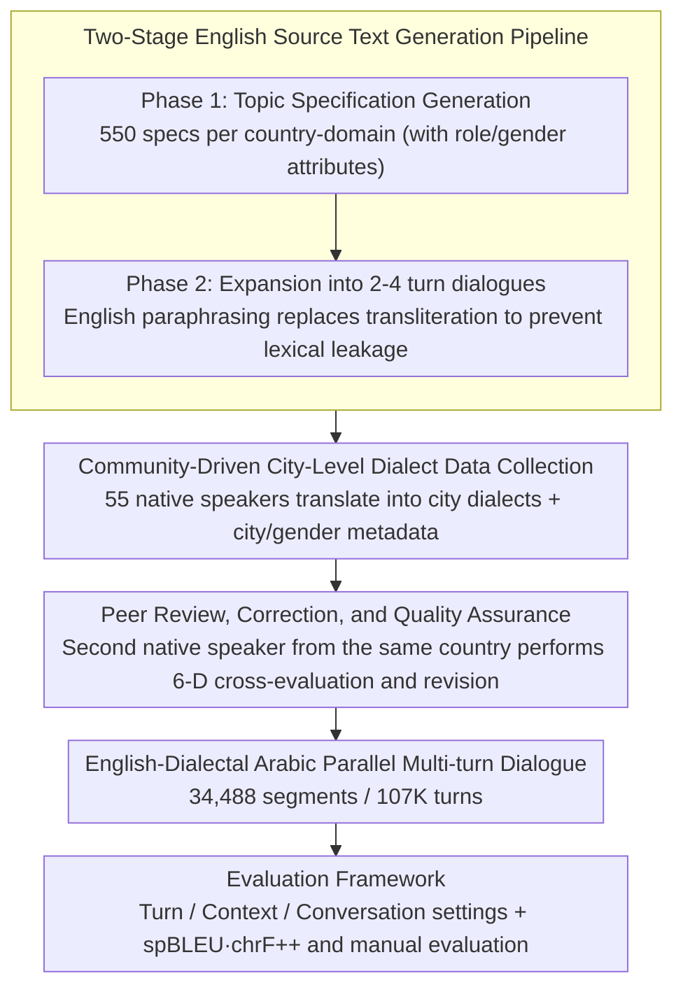

# Alexandria: A Multi-Domain Dialectal Arabic Machine Translation Dataset for Culturally Inclusive and Linguistically Diverse LLMs

**Conference**: ACL 2026  
**arXiv**: [2601.13099](https://arxiv.org/abs/2601.13099)  
**Code**: [https://github.com/UBC-NLP/Alexandria](https://github.com/UBC-NLP/Alexandria)  
**Area**: Audio & Speech  
**Keywords**: Dialectal Arabic, Machine Translation, Multi-domain Dataset, Cultural Inclusivity, LLM Evaluation

## TL;DR

Alexandria constructs a multi-turn Dialectal Arabic-English parallel dataset covering 13 Arabic countries, 11 social impact domains, and 107K turns. Through a community-driven human translation and revision process, it provides unprecedented fine-grained training and evaluation resources for Dialectal Arabic machine translation and systematically benchmarks 24 LLMs.

## Background & Motivation

**Background**: Neural Machine Translation (NMT) has made significant progress in high-resource language pairs, but Arabic faces a severe challenge of "diglossia"—daily communication primarily uses regional dialects, while MT systems are mainly trained on Modern Standard Arabic (MSA). This results in poor generalization to dialectal inputs.

**Limitations of Prior Work**: Existing Dialectal Arabic resources have three major limitations: (1) Scale is severely insufficient (PADIC covers only ~6,400 sentences/dialect, MADAR only 2,000); (2) Domain coverage is narrow (MADAR focuses on tourism, lacking social impact domains like health, education, and agriculture); (3) Granularity is coarse, using only regional labels like "Levantine" or "North African" instead of city-level variations, and missing metadata such as gender configurations and code-switching.

**Key Challenge**: The daily communication needs of millions of Arabic speakers vs. the systematic neglect of dialects by MT systems and the lack of evaluation resources.

**Goal**: To build a large-scale, multi-domain, city-level Dialectal Arabic parallel dataset that serves as both a training resource and an evaluation benchmark to reveal the capabilities and deficiencies of current LLMs in dialectal translation.

**Key Insight**: Adoption of a community-driven model, recruiting 55 participants from 13 Arabic countries (including 29 women), each associated with a specific city to ensure the authenticity and localized features of the dialects.

**Core Idea**: Through city-level labeling, gender configuration metadata, coverage of 11 domains, and a human translation-revision pipeline, Ours significantly surpasses existing resources in scale and granularity, providing the first comprehensive evaluation framework for Dialectal Arabic MT.

## Method

### Overall Architecture

Alexandria is essentially a pipeline for dataset construction: "English seed generation → Native speaker dialect translation → Peer revision," plus an evaluation framework covering 24 LLMs. The construction consists of three phases: First, Gemini-1.5 Pro generates multi-turn English dialogue scenarios for specific countries and domains; then, native speakers translate each turn into city-specific Dialectal Arabic; finally, peers from the same country review and revise the translations. The final output is turn-aligned English-Dialectal Arabic parallel dialogues totaling 34,488 segments and 107K turns.

As an evaluation benchmark, it designs three input settings—Turn-level (single-turn translation), Context-level (translating the current turn with dialogue history), and Conversation-level (translating the entire segment at once)—to distinguish models' ability to use context. Automatic evaluation uses spBLEU and chrF++, intentionally avoiding COMET due to its limited reliability for dialects. Human evaluation covers semantic adequacy (XSTS on a 5-point scale), gender accuracy (Pass/Fail), and dialectness and fluency (1-5 scale), separating "correctness" from "dialectal authenticity."

### Key Designs

**1. Two-Stage English Source Text Generation Pipeline: Creating diverse, culturally appropriate, and leakage-free English seeds for each country-domain pair.**

If source texts are limited to a single domain and short sentences (like MADAR), the coverage of dialectal data is locked from the start. This pipeline increases diversity in two steps: Phase 1 generates 550 topic specifications (55 sub-domains × 10 topics) for each country-domain pair, including role and gender attributes; Phase 2 expands these into 2-4 turn dialogues. 

A critical detail is using English paraphrases instead of Arabic transliterations (e.g., "God willing" instead of "inshallah") to prevent lexical leakage—otherwise, residual transliterations in the source text would cause "translation" to degrade into surface-level transcription rather than true semantic transfer. Generation quality is verified via t-SNE visualization, showing a mean cosine similarity of only 0.20 between topics, proving broad semantic coverage.

**2. Community-Driven City-Level Dialect Data Collection: Replacing coarse regional labels with authentic speakers and city metadata.**

Older resources use regional labels like "Levantine" or "North African," which fail to capture systematic dialectal differences between cities within the same country (e.g., Ramallah vs. Shuqba in Palestine). Alexandria recruited 55 participants from different cities across 13 countries (including 29 women), where each person translated dialogues into their specific city dialect, with country leads coordinating annotation consistency.

Each data segment is tagged with city-of-origin metadata to support sub-dialectal analysis, alongside speaker→listener gender configurations (F→M 33.19%, M→F 32.78%, M→M 21.43%, F→F 12.60%). This binding of "person to city, city to dialect" embeds dialectal authenticity and geographic diversity into the data itself rather than approximating it later.

**3. Peer Review, Correction, and Quality Assurance: Every translation undergoes six-dimensional cross-evaluation by a second native speaker.**

LLM-generated English source texts may be unnatural or culturally mismatched, and human translations require a systematic safety net. Every translation is cross-evaluated by a second participant from the same country across six dimensions: dialectal authenticity, gender alignment, register appropriateness, semantic faithfulness, punctuation, and code-switching consistency, with revisions made as needed.

Ultimately, 68.4% of turns required no changes, 30.6% required minor editing, and only 1% had major issues—this distribution demonstrates that the native speakers' initial quality was high while the cross-revision caught the small number of serious errors, allowing the data to serve as both a training resource and an evaluation benchmark.

## Key Experimental Results

### Main Results

**English→Dialect Context-Level spBLEU (Representative models and dialects)**

| Model | SA | EG | SY | LB | MA | MR |
|------|-----|-----|-----|-----|-----|-----|
| Gemini-1.5-Pro | 31.4 | 27.1 | 34.4 | 27.8 | 20.3 | 8.2 |
| Gemini-1.5-Flash | 29.6 | 27.8 | 31.1 | 27.9 | 19.5 | 10.1 |
| Command-R | 29.2 | 25.8 | 29.0 | 19.5 | 18.0 | 8.9 |
| Llama-3-70b | 30.0 | 25.7 | 26.8 | 21.3 | 17.3 | 7.4 |
| Qwen2-72B | 17.6 | 14.8 | 15.2 | 10.4 | 13.2 | 4.4 |
| ALLaM-7B | 12.5 | 10.4 | 10.3 | 7.1 | 8.9 | 2.5 |

### Ablation Study

**Metadata Ablation (Single-turn English→Dialect spBLEU)**

| Model | Metadata | EG | SA | SY | MA |
|------|--------|-----|-----|-----|-----|
| Llama-3-8b | None | 25.54 | 25.65 | 25.79 | 11.33 |
| Llama-3-8b | Full | 25.11 | 24.39 | 24.90 | 11.34 |
| Command-R | None | 28.78 | 28.88 | 27.74 | 18.60 |
| Command-R | Full | 29.45 | 29.40 | 26.96 | 20.01 |
| NLLB-200-3.3B | N/A | 17.16 | 17.96 | 22.24 | 9.82 |

**Thinking Mode Ablation**: Only Gemini-1.5-Flash improved performance by ~2.0 spBLEU via reasoning; for other models, reasoning actually decreased performance.

### Key Findings

- Significant directional asymmetry exists: Dialect→English translation quality is consistently better than English→Dialect, indicating that generating dialects is harder than understanding them.
- Models perform best on Levantine and Egyptian dialects, while Maghrebi dialects (especially Mauritanian) are the most challenging.
- The Gemini series is strongest in both directions; small open-source models (ALLaM-7B, Fanar-9B) show a massive gap.
- Human evaluation reveals that dialectal authenticity/fluency (~2-3/5) is significantly lower than semantic adequacy (>3/5) for all models, indicating a tendency to generate outputs close to MSA.
- Code-switching (using Latin characters) significantly degrades translation quality, with Moroccan and Tunisian dialects most affected.
- Lexical overlap with MSA is positively correlated with translation quality (Saudi $r=0.48$, Yemen $r=0.44$).

## Highlights & Insights

- The community-driven methodology is exemplary: City-level tagging + country lead coordination + peer revision balances scale and quality.
- Gender configuration labeling (F→M, M→F, etc.) is a unique requirement for Arabic MT evaluation, filling a critical gap.
- The scale of 107K turns far exceeds PADIC (38K) and MADAR (100K), covering 11 high social impact domains.
- Sub-dialectal analysis reveals systematic differences in translation difficulty within countries, with model rankings remaining highly consistent across sub-dialects.
- The effect of metadata varies by model—"more information" isn't always better; some models saw performance drops with Full metadata.

## Limitations & Future Work

- Gender distribution imbalance: F→F accounts for only 12.60%, rooted in LLM generation bias toward mixed-gender scenarios.
- Technical term translation difficulties lead to MSA seepage in some domains.
- Evaluation of closed-source models was budget-limited, testing only the Gemini series.
- Not all Arabic dialects are covered (e.g., Iraqi and Bahraini were not included).

## Related Work & Insights

- **vs MADAR**: Alexandria surpasses it in scale (107K vs 100K), domains (11 vs 1), and annotation granularity (city-level + gender + code-switching).
- **vs FLORES+**: FLORES+ has been reported to have dialect portions too close to MSA; Alexandria avoids this via native speaker translation.
- **vs NLLB-200**: All evaluated LLMs consistently outperform NLLB-200-3.3B, even without metadata.

## Rating

- Novelty: ⭐⭐⭐⭐ City-level dialect granularity, gender configuration labeling, and 11-domain coverage are unprecedented in Dialectal Arabic resources.
- Experimental Thoroughness: ⭐⭐⭐⭐⭐ Extremely comprehensive with 24 models, 13 dialects, auto + human evaluation, and multi-dimensional ablations.
- Writing Quality: ⭐⭐⭐⭐ Clear structure, detailed data, and rich visualizations.
- Value: ⭐⭐⭐⭐⭐ Fills a major resource gap in Dialectal Arabic MT, offering high practical value to the community.

<!-- RELATED:START -->

## Related Papers

- [\[ACL 2026\] NiuTrans.LMT: Toward Inclusive and Scalable Multilingual Machine Translation with LLMs](niutranslmt_toward_inclusive_and_scalable_multilingual_machine_translation_with_.md)
- [\[ACL 2026\] LQM: Linguistically Motivated Multidimensional Quality Metrics for Machine Translation](lqm_linguistically_motivated_multidimensional_quality_metrics_for_machine_transl.md)
- [\[ACL 2026\] CLewR: Curriculum Learning with Restarts for Machine Translation Preference Learning](clewr_curriculum_learning_with_restarts_for_machine_translation_preference_learn.md)
- [\[ACL 2026\] TransLaw: A Large-Scale Dataset and Multi-Agent Benchmark Simulating Professional Translation of Hong Kong Case Law](translaw_a_large-scale_dataset_and_multi-agent_benchmark_simulating_professional.md)
- [\[ACL 2026\] FairQE: Multi-Agent Framework for Mitigating Gender Bias in Translation Quality Estimation](fairqe_multi-agent_framework_for_mitigating_gender_bias_in_translation_quality_e.md)

<!-- RELATED:END -->
