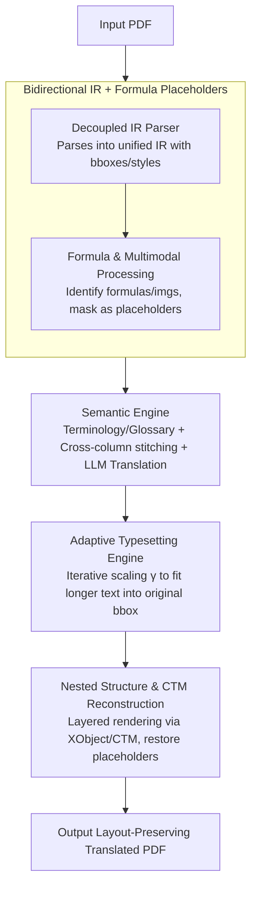

# BabelDOC: Better Layout-Preserving PDF Translation via Intermediate Representation

**Conference**: ACL 2026  
**arXiv**: [2605.10845](https://arxiv.org/abs/2605.10845)  
**Code**: https://github.com/funstory-ai/BabelDOC  
**Area**: Multilingual Machine Translation / Document Translation / Layout-aware NLP  
**Keywords**: PDF Translation, Intermediate Representation, Adaptive Typesetting, Formula Placeholders, Terminology Consistency

## TL;DR
BabelDOC is proposed as a layout-preserving PDF translation system based on an Intermediate Representation (IR) that decouples visual layout from semantic content. This allows NLP operations—such as LLM translation, terminology extraction, cross-page context awareness, and formula masking—to be performed at the semantic layer before being re-anchored to the original layout via an adaptive typesetting engine. On a 200-page benchmark, it outperforms PDFMathTranslate and DeepL Document Translation in BIoU, layout fidelity, and terminology consistency.

## Background & Motivation
**Background**: Cross-lingual scientific collaboration is surging. PDF is the dominant format for scientific, legal, and technical documents, yet its "designed for display" imperative syntax makes translation difficult. Existing approaches fall into two categories: (i) CAT/MT systems (e.g., Google, DeepL) focus on text streams and lose significant layout metadata during extraction; (ii) document parsers (e.g., Doc2X, MinerU, Mathpix) excel at one-way PDF-to-Markdown/LaTeX extraction but do not support reverse typesetting to restore the translated PDF.

**Limitations of Prior Work**: The authors' previous work, PDFMathTranslate, provided the first end-to-end layout-preserving translation but used a monolithic pipeline without an explicit IR layer. This made document-level NLP interventions nearly impossible—leading to terminology inconsistency in long documents, broken cross-page/column contexts, and difficulties in handling nested XObjects/Forms/clipping paths. End-to-end models also treat translation as a black box with poor extensibility.

**Key Challenge**: There is a structural trade-off between "translation quality" and "layout fidelity." Text-layer operations (CAT, LLM) break layout, while layout parsers cannot reconstruct the document backward. An intermediate layer is missing that allows both domains to work at their optimal levels of abstraction.

**Goal**: (1) Design a bidirectional IR that enables both PDF deconstruction and reconstruction; (2) Implement document-level NLP interventions (terminology extraction, glossary injection, cross-page stitching, formula placeholders) on the IR; (3) Use adaptive typesetting to fit potentially longer translated text into original bounding boxes; (4) Provide a fully open-source, modular framework.

**Key Insight**: The translation pipeline is divided into four stages: parser → IR → semantic engine → typesetting. The IR carries spatial coordinates, stylistic attributes, and semantic content simultaneously, decoupling upstream parsing from downstream reconstruction. NLP interventions (like glossary injection) are performed strictly on the IR without polluting the layout data.

**Core Idea**: An "explicit IR" is used to bridge the Document Understanding (DU) and NLP communities, making document translation a plugin-friendly transparent pipeline rather than a black-box conversion.

## Method

### Overall Architecture
Five modules operate sequentially: (1) **Decoupled IR Parser**: Standardizes and parses the input PDF into a unified IR where every element (characters, lines, graphic blocks, images) contains bbox, coordinates, and font/style attributes; (2) **Formula & Multimodal Processing**: Identifies formulas and multimodal segments to mask them as placeholders, preventing LLMs from corrupting mathematical symbols; (3) **Semantic Engine**: Performs LLM translation on the IR, automatically extracting terminology for dynamic glossaries and handling cross-page/column stitching; (4) **Adaptive Typesetting**: Iteratively searches for a local scaling factor $\gamma$ to fit expanded translated text into the original bbox; (5) **Nested Structure & CTM Reconstruction**: Manages XObject/Form/clipping path stacks and the Current Transformation Matrix (CTM) to re-render the graphics state layer by layer.

### Key Designs

**1. Bidirectional IR + Formula Placeholders: Bridging Readable Translation and Closed-loop Reconstruction**

Formula corruption is a primary failure mode in PDF translation. Conventional LLMs often misinterpret or delete symbols like $\int$ or subscripts. While one-way parsers can extract formulas, they cannot return them to the original layout. BabelDOC constructs an IR carrying spatial, stylistic, and semantic data. Each page element is tagged with its bbox and font style, enabling both translation and closed-loop reconstruction.

Formula processing in the IR layer involves three steps: a script detection unit evaluates font-size variance for sub/superscripts, an offset calculation unit determines fragment shifts based on baseline coordinates, and a vector reconstruction unit restores vector formulas using these offsets. Formulas, images, and special characters are masked as placeholders before the NLP stage. LLMs process only the "text stream + placeholder IDs," and the placeholders are precisely restored via the IR after translation. This explicit IR resolves the conflict between "preserving formulas during translation" and "restoring them to original positions."

**2. Semantic Engine: Unifying Terminology and Sentences via Document-level Views**

Standard CAT/MT systems translate on a per-paragraph basis, leading to terminology drift in long documents (e.g., "Current Transformation Matrix" translated inconsistently). BabelDOC treats the IR as a global document view. Before translation, it scans the IR to extract domain terms and build a dynamic glossary, which is then injected into the LLM prompt to ensure terminology constraints across all paragraphs. It also utilizes the reading order in the IR to merge sentences split across columns or pages into complete logical paragraphs before translation.

This intervention is possible because the IR provides a document-level view that paragraph-level pipelines (like the original PDFMathTranslate) lack. Terminology consistency and context coherence thus become matters of prompt engineering rather than architectural redesign.

**3. Adaptive Typesetting Engine: Managing Text Expansion via Iterative Search**

Translations (e.g., English to Spanish) typically expand text length by 10–30%, causing overflows in fixed bounding boxes. BabelDOC performs per-paragraph local scaling within the IR bbox constraints. Starting from $\gamma = 1.0$, it checks if the translated text fits. If it overflows, it iteratively adjusts $\gamma \leftarrow \gamma - 0.05$ (or $0.10$) until the text fits or a minimum threshold (typically $\gamma = 0.85$) is reached.

Local scaling is preferred over global scaling to ensure that only long paragraphs are compressed while others remain unchanged, preventing the page from appearing visually distorted. Compared to commercial tools that allow text overlap, adaptive typesetting significantly improves layout fidelity.

### A Complete Example: Translating a Two-column Paper Page

Consider a two-column English paper page with inline formulas. The Decoupled IR Parser first generates the IR, recording bboxes and font attributes for all elements. Formula & Multimodal Processing identifies a summation $\sum_{i=1}^{n} x_i$ and a figure, masking them as `[FORMULA_1]` and `[IMG_1]`.

The Semantic Engine extracts terms for the glossary and uses the reading order to stitch a sentence split between the bottom of the left column and the top of the right column. The LLM translates the text into Spanish, keeping the placeholders intact. The Adaptive Typesetting engine detects that the expanded Spanish text overflows the original bbox and reduces $\gamma$ to 0.85. Finally, the Nested Structure & CTM Reconstruction module re-renders the page, restoring the original formulas and images into the Spanish PDF.

### Loss & Training
As a systems engineering paper, there is no manual training objective. LLMs are used with role-play prompts. OCR and layout detection modules are hot-swappable (e.g., DocLayout-YOLO, YOLOv10).

## Key Experimental Results

### Main Results (200-page Benchmark: Scientific, Technical, and Patent Documents)

| System | BIoU ↑ | LF (human) ↑ | TP ↑ | VA ↑ | TC ↑ | UTB (avg untranslated blocks) ↓ |
|---|---|---|---|---|---|---|
| DeepL Document | 19.8% | 3.44 | 3.62 | 3.63 | 4.21 | 2.33 |
| PDFMathTranslate | 48.7% | 3.29 | 3.40 | 3.28 | 3.34 | 6.25 |
| **BabelDOC** | **50.0%** | **4.59** | **4.28** | **4.46** | **4.47** | 2.85 |

LLM-as-a-judge (Gemini-2.5-Flash) metrics follow the same trend: BabelDOC achieves the highest scores in Layout Fidelity (LF: 4.46), Visual Appeal (VA: 4.49), and Terminology Consistency (TC: 4.43). A BIoU of 50.0% (geometric IoU of layout blocks) validates the effectiveness of the IR and adaptive typesetting.

### Ablation Study (80-page Representative Subset)

| Variant | LF ↑ | VA ↑ | TC ↑ | Meaning |
|---|---|---|---|---|
| Full BabelDOC | 4.50 | 4.50 | 5.00 | Complete system |
| w/o adaptive typesetting | 3.00 | 2.50 | 4.00 | Layout overflows; LF/VA drop significantly |
| w/o glossary/context control | 4.50 | 4.50 | 3.00 | Terminology consistency collapses |

### Key Findings
- **Layout is the core strength**: BabelDOC's BIoU is 30 points higher than DeepL, and human-rated LF is over 1 point higher than all baselines, directly benefiting from IR and adaptive typesetting.
- **TP Parity**: BabelDOC matches DeepL in translation proficiency, suggesting its value lies in providing a layout-aware controllable framework rather than just a better MT engine.
- **UTB Bottleneck**: BabelDOC has slightly more untranslated blocks than DeepL due to upstream OCR/layout detection failures (e.g., in-figure text), showing that layout-preserving pipelines are sensitive to parsing robustness.
- **Functional Orthogonality**: The ablation shows adaptive typesetting primarily affects LF/VA, while glossary/context control affects TC. These modules solve orthogonal problems and can be upgraded independently.
- **Ecosystem Impact**: High community engagement (8.4K stars) proves that the IR-based design's extensibility is attractive to developers.

## Highlights & Insights
- **"IR-as-interface" bridges DU and NLP**: Previously, document translation was siloed between researchers in Document Understanding (parsers) and NLP (MT). BabelDOC treats IR as a first-class citizen, allowing both to join at an appropriate abstraction level. This paradigm is applicable to PowerPoint, Word, and Web layouts.
- **Engineering Simplicity in Adaptive Typesetting**: Eschewing complex layout learning in favor of an iterative search with a 0.05 step size proves that a well-executed trivial baseline can outperform complex commercial solutions.
- **Prompt Engineering via Placeholders**: The formula placeholder and glossary injection techniques are highly reusable for any LLM task involving structured academic content.
- **Open-source Strategy**: The architecture is designed for the community, with hot-swappable backends and clear plugin structures, turning a system paper into a long-term ecosystem asset.

## Limitations & Future Work
- IR construction introduces computational overhead; inference latency is significantly higher than pure text API calls (1.63 s/page vs 0.38 s/page).
- Dependency on upstream OCR/layout detection robustness; failure in parsing low-quality scans or exotic layouts results in untranslated segments.
- Translation quality is capped by the underlying LLM; it is a framework, not an MT engine.
- Typesetting for language pairs with extreme morphological differences (e.g., vertical CJK to Latin) remains a challenge.
- Evaluation focuses on technical documents; magazine layouts or complex artistic pages are not yet covered.

## Related Work & Insights
- **vs. PDFMathTranslate**: Moves from a monolithic black box to a modular IR-based system with added terminology and adaptive typesetting.
- **vs. DeepL/Google Translate**: Provides an open-source alternative with superior layout fidelity compared to the text-stream-heavy commercial tools.
- **vs. Doc2X/MinerU**: Transitions from one-way extraction to bidirectional reconstruction.
- **vs. LayoutReader/DocLayout-YOLO**: Treats these layout models as interchangeable upstream plugins.

## Rating
- **Novelty**: ⭐⭐⭐⭐ IR paradigms are known, but applying a bidirectional, plugin-based IR to the PDF translation problem is a significant system contribution.
- **Experimental Thoroughness**: ⭐⭐⭐⭐ Combination of 200-page benchmark, human evaluation, LLM-as-a-judge, and module ablations.
- **Writing Quality**: ⭐⭐⭐⭐ Clear explanation of the five-module architecture with strong alignment between tables and case studies.
- **Value**: ⭐⭐⭐⭐⭐ High community impact (8.4K stars) and practical utility make it an excellent example of an ACL system demo.

<!-- RELATED:START -->

## Related Papers

- [\[ACL 2025\] Cross-Lingual Representation Alignment Through Contrastive Image-Caption Tuning](../../ACL2025/multilingual_mt/cross-lingual_representation_alignment_through_contrastive_image-caption_tuning.md)
- [\[ACL 2025\] Building Better: Avoiding Pitfalls in Developing Language Resources when Data is Scarce](../../ACL2025/multilingual_mt/building_better_avoiding_pitfalls_in_developing_language_resources_when_data_is_.md)
- [\[ACL 2025\] Middle-Layer Representation Alignment for Cross-Lingual Transfer in Fine-Tuned LLMs](../../ACL2025/multilingual_mt/mid_layer_crosslingual_alignment.md)
- [\[ACL 2025\] Less, but Better: Efficient Multilingual Expansion for LLMs via Layer-wise Mixture-of-Experts](../../ACL2025/multilingual_mt/less_but_better_efficient_multilingual_expansion.md)
- [\[ACL 2026\] Evaluating the Impact of Verbal Multiword Expressions on Machine Translation](evaluating_the_impact_of_verbal_multiword_expressions_on_machine_translation.md)

<!-- RELATED:END -->
