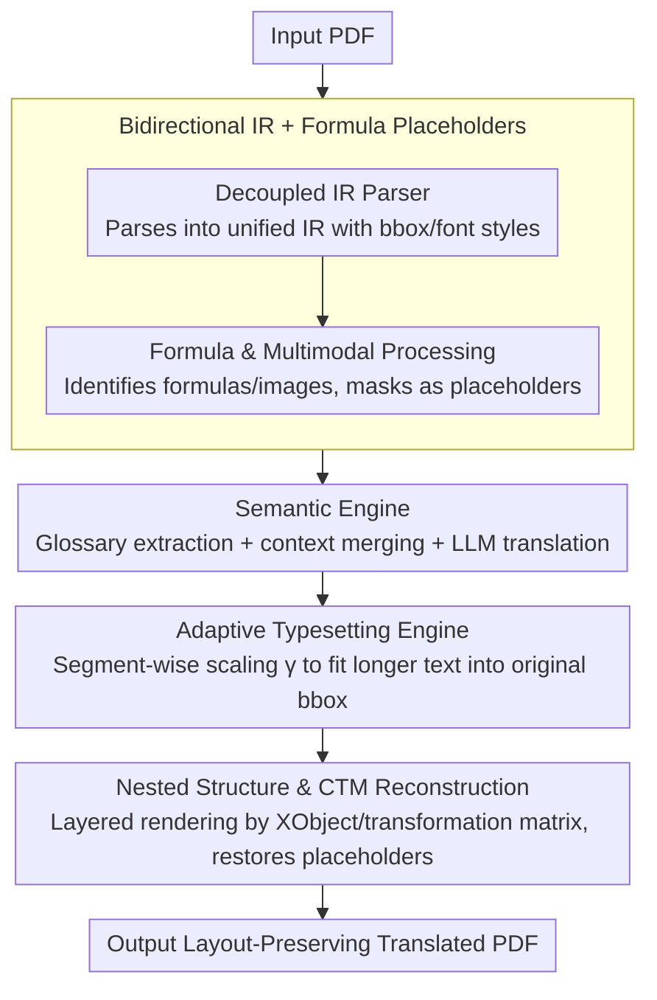

# BabelDOC: Better Layout-Preserving PDF Translation via Intermediate Representation

**Conference**: ACL 2026  
**arXiv**: [2605.10845](https://arxiv.org/abs/2605.10845)  
**Code**: https://github.com/funstory-ai/BabelDOC  
**Area**: Multilingual Machine Translation / Document Translation / Layout-aware NLP  
**Keywords**: PDF Translation, Intermediate Representation, Adaptive Typesetting, Formula Placeholders, Terminology Consistency

## TL;DR
This paper proposes BabelDOC, a layout-preserving PDF translation system based on "Intermediate Representation" (IR). By decoupling visual layout from semantic content, it enables NLP operations such as LLM translation, terminology extraction, cross-page context processing, and formula placeholder management to occur at the semantic layer. An adaptive typesetting engine then anchors the result back to the original layout. On a 200-page benchmark, it outperforms PDFMathTranslate and DeepL Document Translation in BIoU, layout fidelity, and terminology consistency.

## Background & Motivation
**Background**: With the surge in cross-lingual scientific collaboration, PDF remains the dominant format for scientific, legal, and technical documents. however, its imperative syntax, "designed for display," makes translation challenging. Existing approaches fall into two categories: (i) CAT/MT systems (Google, DeepL) focus on text streams, discarding significant layout metadata during extraction; (ii) document parsers (Doc2X, MinerU, Mathpix) excel at PDF → Markdown/LaTeX unidirectional extraction but do not support reverse typesetting for "reconstructing PDF after translation."

**Limitations of Prior Work**: The authors' previous work, PDFMathTranslate, established the first end-to-end layout-preserving translation pipeline. However, its monolithic architecture lacked an explicit IR layer, making document-level NLP interventions nearly impossible. This led to terminology inconsistency in long documents, broken cross-page/cross-column contexts, and difficulties in unified handling of nested XObject/Form/clipping paths. End-to-end models also treat translation as a black box, limiting extensibility.

**Key Challenge**: There is a structural trade-off between "translation quality" and "layout fidelity." Operations at the text layer (CAT, LLM) destroy layout, while layout parsers cannot perform inverse reconstruction. A missing intermediate layer is needed to allow both domains to work at their most effective abstraction levels.

**Goal**: (1) Design a bidirectional IR capable of both PDF deconstruction and reconstruction; (2) Implement various document-level NLP interventions on the IR (terminology extraction, glossary injection, cross-page merging, formula placeholders); (3) Use adaptive typesetting to fit translated (typically longer) text back into original bounding boxes; (4) Provide a fully open-source, hot-swappable modular system.

**Key Insight**: The translation pipeline is decomposed into four stages: parser → IR → semantic engine → typesetting. The IR simultaneously carries spatial coordinates, stylistic attributes, and semantic content, decoupling upstream parsing from downstream reconstruction. NLP interventions (e.g., glossary injection) are performed solely on the IR without polluting the layout.

**Core Idea**: Utilize an "explicit IR" to bridge the Document Understanding (DU) and NLP communities, transforming translation into a plugin-friendly transparent pipeline rather than a black-box conversion.

## Method

### Overall Architecture
Five modules operate sequentially: (1) **Decoupled IR Parser**: Standardizes and parses input PDF into a unified IR where each element (characters, lines, graphic blocks, inline images) contains bbox, coordinates, and font/style attributes; (2) **Formula & Multimodal Processing**: Identifies formulas and multimodal fragments, masking them as placeholders to prevent LLMs from corrupting mathematical symbols; (3) **Semantic Engine**: Performs LLM translation on the IR, automatically extracting terminology for dynamic glossaries, merging cross-column/cross-page segments, and executing glossary-constrained generation; (4) **Adaptive Typesetting**: Iteratively searches for a local scaling factor $\gamma$ to fit longer translated text into the original bbox; (5) **Nested Structure & CTM Reconstruction**: Manages nested stacks for XObject/Form/clipping paths and the Current Transformation Matrix (CTM) to re-render the document by applying graphics states layer by layer.

### Key Designs

**1. Bidirectional IR + Formula Placeholders: A Structured Intermediate Layer for Readability and Reconstruction**

Formula corruption is the primary failure mode in PDF translation. Traditional LLMs often mistranslate or delete mathematical symbols like $\int$ or sub/superscripts. While unidirectional parsers (Doc2X / MinerU) can extract formulas, they cannot return them to the original layout. BabelDOC constructs an IR carrying spatial, stylistic, and semantic data. Each element is linked to its bbox and font style, enabling both translation and closed-loop reconstruction.

Formula processing in the IR layer involves three units: the script detection unit determines sub/superscripts via font-size variance; the offset calculation unit computes fragment offsets based on baseline coordinates; and the vector reconstruction unit restores vector formulas using these offsets. Formulas, inline images, and special characters are masked as placeholders before the NLP stage. LLMs process only the "text stream + placeholder IDs," and placeholders are accurately restored post-translation according to the IR. This explicit IR resolves the conflict between formula protection and spatial restoration.

**2. Semantic Engine: Document-Level Views for Terminology Consistency and Sentence Merging**

Standard CAT/MT translation is per-paragraph, causing terminology drift in long documents (e.g., translating "Current Transformation Matrix" differently across pages). Furthermore, layout columns often break sentences. BabelDOC treats the IR as a global document view. Before translation, it scans the IR to extract domain terminology and build a dynamic glossary (user uploads are also supported). This is injected into the LLM prompt to ensure consistent constraints across paragraphs. Utilizing the IR's reading order, logically continuous paragraphs split by columns or pages are merged before translation.

The IR provides a document-level view unavailable in paragraph-level pipelines like PDFMathTranslate, making terminology consistency and context coherence a matter of prompt engineering rather than architectural modification.

**3. Adaptive Typesetting: Iterative Searching to Absorb Cross-Lingual Text Expansion**

Translations (e.g., English to Spanish) often expand text by 10–30%, causing overflows in original bounding boxes. BabelDOC implements per-paragraph local scaling within IR-defined bbox constraints. Starting from $\gamma = 1.0$, it checks if the translated text fits. If an overflow occurs, it scales by $\gamma \leftarrow \gamma - 0.05$ (or $0.10$) and re-typesets until it fits or reaches a lower bound (typically $\gamma = 0.85$).

Local scaling ensures that only long paragraphs are reduced while short ones remain unchanged, preventing the page from appearing visually cluttered. Compared to DeepL’s method of allowing overlapping text, adaptive scaling significantly improves layout fidelity; removing it drops the LF score from 4.5 to 3.0 in ablation studies.

### Main Results (200-Page Benchmark: 80 Scientific, 60 Technical, 60 Patents)

| System | BIoU ↑ | LF (human) ↑ | TP ↑ | VA ↑ | TC ↑ | UTB (avg untranslated blocks) ↓ |
|---|---|---|---|---|---|---|
| DeepL Document | 19.8% | 3.44 | 3.62 | 3.63 | 4.21 | 2.33 |
| PDFMathTranslate | 48.7% | 3.29 | 3.40 | 3.28 | 3.34 | 6.25 |
| **BabelDOC** | **50.0%** | **4.59** | **4.28** | **4.46** | **4.47** | 2.85 |

LLM-as-a-judge (Gemini-2.5-Flash) ratings show consistent trends: BabelDOC scores highest in LF (4.46), VA (4.49), and TC (4.43), while matching DeepL in TP (4.19). A BIoU of 50% reflects the geometric IoU of layout element bounding boxes, validating the effectiveness of the IR and adaptive typesetting.

### Ablation Study (80-Page Representative Subset)

| Variant | LF ↑ | VA ↑ | TC ↑ | Description |
|---|---|---|---|---|
| Full BabelDOC | 4.50 | 4.50 | 5.00 | Complete system |
| w/o adaptive typesetting | 3.00 | 2.50 | 4.00 | Default typesetting; LF/VA drop |
| w/o glossary/context control | 4.50 | 4.50 | 3.00 | Terminology consistency collapse |

### Key Findings
- **Layout is BabelDOC's strongest selling point**: BIoU is 30 percentage points higher than DeepL, and human-rated LF is over 1 point higher than all baselines, directly resulting from IR and adaptive typesetting.
- **TP parity with DeepL**: This suggests BabelDOC's value lies not in replacing MT engines but in providing a layout-aware, controllable framework for them.
- **UTB is slightly higher than DeepL**: Some untranslated blocks stem from upstream OCR/layout detection failures (in-figure text, scanned pages), indicating that layout-preserving pipelines are constrained by parsing robustness.
- **Clear division of labor in ablations**: Adaptive typesetting primarily impacts LF/VA, while glossary/context control affects TC. These modules address orthogonal issues and can be upgraded independently.
- **Ecosystem impact**: With 8.4K stars and 17 contributors, the IR-based design demonstrates high extensibility and community appeal.

## Highlights & Insights
- **"IR-as-interface" bridges DU and NLP**: Previously, document translation was siloed; DU produced parsers and NLP produced MT, joined only by ad-hoc engineering. By elevating the IR to a first-class citizen, both domains can work at their respective layers. This paradigm is applicable to PowerPoint, Word, and web layouts.
- **Engineering simplicity of adaptive typesetting**: Eschewing complex layout optimization for an iterative search with 0.05 increments is highly effective. It serves as a reminder that perfecting a "trivial baseline" often outweighs jumping to complex neural networks.
- **Formula placeholders + glossary injection as reusable prompt techniques**: This approach is applicable to any task involving long documents with mathematical symbols, such as paper translation, textbook rewriting, or academic summarizing.
- **Open-source ecosystem strategy**: The project’s success is attributed to its backend-frontend separation, varied UIs, and plugin architecture, making the system paper a long-term community asset.

## Limitations & Future Work
- IR construction incurs computational overhead; inference latency (1.63 s/page) is significantly higher than text-only API calls (e.g., Google at 0.38 s/page), making it less suitable for high-concurrency real-time scenarios.
- The system depends on upstream OCR/layout detection robustness. Failures occur with poor scan quality or non-standard layouts, as seen in the UTB metrics.
- Translation quality is limited by the underlying LLM; BabelDOC is a framework, not a translation engine. Morphologically disparate language pairs (e.g., vertical Traditional Chinese ↔ Latin) still require layout optimization.
- Evaluation was centered on scientific papers, technical docs, and patents; complex magazine layouts or highly graphical pages remain less explored.
- The 0.05 step size for adaptive scaling is empirical. Extreme expansion (e.g., English → German) might result in unreadably small font sizes without hard constraint discussion.

## Related Work & Insights
- **vs. PDFMathTranslate (Previous Work)**: Moved from a monolithic black-box to a modular IR-based system. Added terminology extraction, cross-page handling, and adaptive typesetting.
- **vs. DeepL / Google Translate**: Commercial closed-source tools focus on text flow with poor layout restoration. BabelDOC offers open-source, explicit layout control via IR.
- **vs. Doc2X / MinerU / Mathpix**: These are unidirectional (PDF → Markdown) and cannot reconstruct layouts. BabelDOC's bidirectional IR is the key differentiator.
- **vs. LayoutReader / DocLayout-YOLO**: BabelDOC treats these upstream layout models as hot-swappable plugins.

## Rating
- Novelty: ⭐⭐⭐⭐ While IR is not new in document processing, its use as a bidirectional, plugin-based interface for PDF translation is a first for system implementation.
- Experimental Thoroughness: ⭐⭐⭐⭐ Comprehensive 200-page benchmark including human evaluation, LLM-as-judge, and component ablations.
- Writing Quality: ⭐⭐⭐⭐ Clearly explains the five modules with strong correspondence between tables and case studies.
- Value: ⭐⭐⭐⭐⭐ High industrial utility and community impact (8.4K stars); a model example for ACL system demos.

<!-- RELATED:START -->

## Related Papers

- [\[ACL 2025\] Cross-Lingual Representation Alignment Through Contrastive Image-Caption Tuning](../../ACL2025/multilingual_mt/cross-lingual_representation_alignment_through_contrastive_image-caption_tuning.md)
- [\[ACL 2025\] Building Better: Avoiding Pitfalls in Developing Language Resources when Data is Scarce](../../ACL2025/multilingual_mt/building_better_avoiding_pitfalls_in_developing_language_resources_when_data_is_.md)
- [\[ACL 2025\] Middle-Layer Representation Alignment for Cross-Lingual Transfer in Fine-Tuned LLMs](../../ACL2025/multilingual_mt/mid_layer_crosslingual_alignment.md)
- [\[ACL 2025\] Less, but Better: Efficient Multilingual Expansion for LLMs via Layer-wise Mixture-of-Experts](../../ACL2025/multilingual_mt/less_but_better_efficient_multilingual_expansion.md)
- [\[ACL 2026\] CLewR: Curriculum Learning with Restarts for Machine Translation Preference Learning](clewr_curriculum_learning_with_restarts_for_machine_translation_preference_learn.md)

<!-- RELATED:END -->
