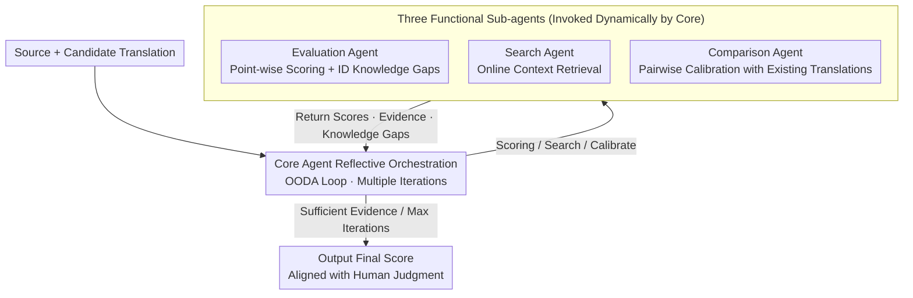

# Beyond Literal Mapping: Benchmarking and Improving Non-Literal Evaluation Evaluation

**Conference**: ACL 2026  
**arXiv**: [2601.07338](https://arxiv.org/abs/2601.07338)  
**Code**: [GitHub](https://github.com/BITHLP/RATE)  
**Area**: Multilingual / MT Evaluation  
**Keywords**: Machine Translation Evaluation, Non-Literal Translation, Meta-Evaluation Benchmark, Agentic Evaluation Framework, LLM-as-Judge

## TL;DR

The authors construct MENT, a meta-evaluation dataset for non-literal translation (7,530 human annotations), revealing the unreliability of traditional metrics and LLM-as-Judge in non-literal scenarios. They propose the RATE agentic evaluation framework, which improves correlation with human judgment by over 3.2 points through a reflective core agent that dynamically invokes functional sub-agents.

## Background & Motivation

**Background**: LLMs have significantly expanded the scope of machine translation (MT) applications, making non-literal translation scenarios such as social media and literature increasingly important. Translation quality evaluation is critical for MT system iteration and providing reward signals for reinforcement learning.

**Limitations of Prior Work**: (1) Traditional metrics (BLEU, COMET) lack deep semantic understanding and are severely disconnected from human judgment in non-literal translation—overestimating literal but semantically incorrect translations while underestimating idiomatic non-literal ones. (2) LLM-as-Judge is limited by knowledge cutoff (unable to evaluate emerging internet slang) and scoring inconsistency. (3) Existing meta-evaluation datasets primarily cover formal domains like News or Wikipedia, lacking coverage of non-literal translation.

**Key Challenge**: The core challenge of non-literal translation is that errors often stem from a misunderstanding of global semantics (e.g., slang, cultural allusions) rather than isolated lexical errors. Traditional metrics based on word-level matching or surface semantics are inherently unable to capture such issues.

**Goal**: To systematically evaluate the reliability of MT metrics on non-literal translation and propose a more accurate evaluation methodology.

**Key Insight**: First, construct a large-scale non-literal meta-evaluation benchmark (covering SNS, cross-cultural, poetry, and literature domains), then design an agentic framework to overcome the limitations of standard LLM evaluation.

**Core Idea**: Reflective agentic evaluation—the Core Agent dynamically decides whether to invoke a Search Agent for background knowledge, an Evaluation Agent for scoring, or a Comparison Agent for score calibration.

## Method

### Overall Architecture

RATE centers around a reflective Core Agent that delegates the "choice of evaluation strategy" to model reasoning. The Core Agent operates within an OODA (Observe-Orient-Decide-Act) loop for multiple iterations. In each round, it dynamically invokes three functional sub-agents based on the current state: the Evaluation Agent (point-wise scoring), the Search Agent (online retrieval of external knowledge to mitigate knowledge cutoff), and the Comparison Agent (pairwise calibration with existing translations to ensure consistency). The final score is output only when sufficient evidence is gathered or the maximum iteration count is reached. The MENT dataset serves as the benchmark to measure the reliability of this framework and is not part of the RATE inference loop.

### Key Designs

**1. MENT Meta-Evaluation Dataset: A Robust Benchmark for Non-Literal Evaluation**

Existing meta-evaluation datasets often contain fewer than 1,000 annotations and focus almost exclusively on formal domains like News or Wikipedia, which are insufficient for verifying non-literal translation metrics. MENT bridges this gap by covering four domains: SNS, Cross-cultural, Poetry, and Literature. It includes translations from 10 MT systems (ranging from NLLB-3.3B to GPT-4o), totaling 7,530 human annotations. Each translation is scored using a 5-point SQM scale by at least two professional translators, enabling the first quantitative analysis of metric unreliability in non-literal contexts.

**2. Core Agent Reflective Orchestration: Reasoning over Evaluation Strategies**

Static LLM evaluation suffers from using a fixed pipeline regardless of the translation type. SNS translations may require understanding new slang, while poetry requires analyzing rhythm and imagery. RATE delegates decision-making to a reflective Core Agent. Operating in an OODA loop, it analyzes the current evaluation state, determines what information is missing, and selects the appropriate sub-agent. This approach mimics the cognitive process of human experts who research and verify information while evaluating.

**3. Three Functional Sub-agents: Specialized for Scoring, Retrieval, and Calibration**

The Core Agent orchestrates three specialized sub-agents. The **Evaluation Agent** acts as the base scorer, providing SQM scores along with confidence levels, rationales, and identified "knowledge gaps" that may trigger further action. The **Search Agent** addresses the "knowledge cutoff" bottleneck of LLMs; it is invoked when source texts contain emerging slang or cultural allusions unknown to the model's parameters, providing real-time semantic context from the web. The **Comparison Agent** mitigates subjective drift in point-wise scoring by performing pairwise preference ranking against previously scored translations to ensure scale consistency.

### Method Detail: Example of SNS Slang Evaluation

Consider a source tweet containing a new internet slang term, where an MT system provides a literal but semantically incorrect translation. The Core Agent first identifies its uncertainty regarding the slang and invokes the Search Agent. The Search Agent retrieves the actual meaning and returns it as context. The Core Agent then instructs the Evaluation Agent to score the text based on this retrieved meaning. Finding that the translation misunderstood the global semantic despite word-for-word accuracy, the agent assigns a low score. The final result aligns more closely with human judgment than static LLM-as-Judge methods.

### Loss & Training

RATE is a zero-shot agentic framework based on LLMs and requires no training. The evaluation protocol follows a 5-point SQM scale. The Comparison Agent mitigates score drift by comparing multiple translations for the same source text.

## Key Experimental Results

### Main Results

| Method Category | Representative Method | System + Segment Combined Correlation |
| :--- | :--- | :--- |
| Traditional Metrics | BLEU, COMET | Baseline |
| LLM-as-Judge | GEMBA, AutoMQM | +X |
| **RATE (Ours)** | Core + Sub-agents | **+3.2+ points** |

### Ablation Study

| Configuration | Findings |
| :--- | :--- |
| w/o Search Agent | Performance drops significantly in SNS and Cross-cultural domains. |
| w/o Comparison Agent | Score consistency decreases. |
| Different Backbone LLMs | RATE remains consistently effective across various LLMs. |
| General Domain Testing | RATE remains robust for general-purpose MT evaluation. |

### Key Findings

- Traditional metrics are severely inaccurate for non-literal translation: they overestimate literal mapping and underestimate idiomatic translations.
- LLM-as-Judge has two primary limitations: knowledge cutoff (cannot evaluate new slang) and scoring inconsistency (different scores for the same quality).
- RATE is not only effective for non-literal scenarios but also maintains robustness in general MT evaluation.
- Among 10 MT systems, large-scale foundational models (GPT-4o, Gemini-1.5 Pro) perform best.

## Highlights & Insights

- First systematic evaluation of the reliability of MT metrics in non-literal translation, filling a significant research gap.
- The MENT dataset scale (7,530 annotations) far exceeds similar works (<1,000) and covers 4 challenging domains.
- The agentic design of RATE—core reasoning combined with on-demand sub-capabilities—aligns with the cognitive flow of human evaluation.
- Identifies knowledge cutoff as a critical bottleneck for LLM evaluation, providing the Search Agent as a simple yet effective solution.

## Limitations & Future Work

- MENT currently only covers Chinese-English and has not been extended to more language pairs.
- RATE depends on the quality of search engine results.
- The number and types of sub-agents could be expanded (e.g., style analysis agents).
- The SQM evaluation protocol might miss some fine-grained error details.

## Related Work & Insights

- WMT Meta-evaluation (Freitag et al., 2023; Moghe et al., 2025): Benchmarks for formal domains.
- COMET / BLEURT: Model-based metrics that remain limited in non-literal scenarios.
- Agent-as-a-Judge (You et al., 2026): The paradigm of agentic evaluation.
- The dynamic sub-agent invocation of RATE can be generalized to other evaluation scenarios requiring external knowledge.

## Rating

- Novelty: ⭐⭐⭐⭐ First focus on non-literal translation evaluation with a clever agentic design.
- Experimental Thoroughness: ⭐⭐⭐⭐⭐ 7,530 human annotations across 10 MT systems with comprehensive ablation.
- Writing Quality: ⭐⭐⭐⭐ Clear data construction process and intuitive case analyses.
- Value: ⭐⭐⭐⭐ Directly relevant to both the research and practice of MT evaluation.

<!-- RELATED:START -->

## Related Papers

- [\[ACL 2025\] Beyond N-Grams: Rethinking Evaluation Metrics and Strategies for Multilingual Abstractive Summarization](../../ACL2025/multilingual_mt/beyond_n-grams_rethinking_evaluation_metrics_and_strategies_for_multilingual_abs.md)
- [\[ACL 2026\] PEAR: Pairwise Evaluation for Automatic Relative Scoring in Machine Translation](pear_pairwise_evaluation_for_automatic_relative_scoring_in_machine_translation.md)
- [\[ACL 2026\] Prosody as Supervision: Bridging the Non-Verbal–Verbal for Multilingual Speech Emotion Recognition](prosody_as_supervision_bridging_the_non-verbal--verbal_for_multilingual_speech_e.md)
- [\[ICLR 2026\] ASSESS: A Semantic and Structural Evaluation Framework for Statement Similarity](../../ICLR2026/multilingual_mt/assess_a_semantic_and_structural_evaluation_framework_for_statement_similarity.md)
- [\[ACL 2025\] Accessible Machine Translation Evaluation For Low-Resource Languages](../../ACL2025/multilingual_mt/accessible_machine_translation_evaluation_for_low-resource_languages.md)

<!-- RELATED:END -->
