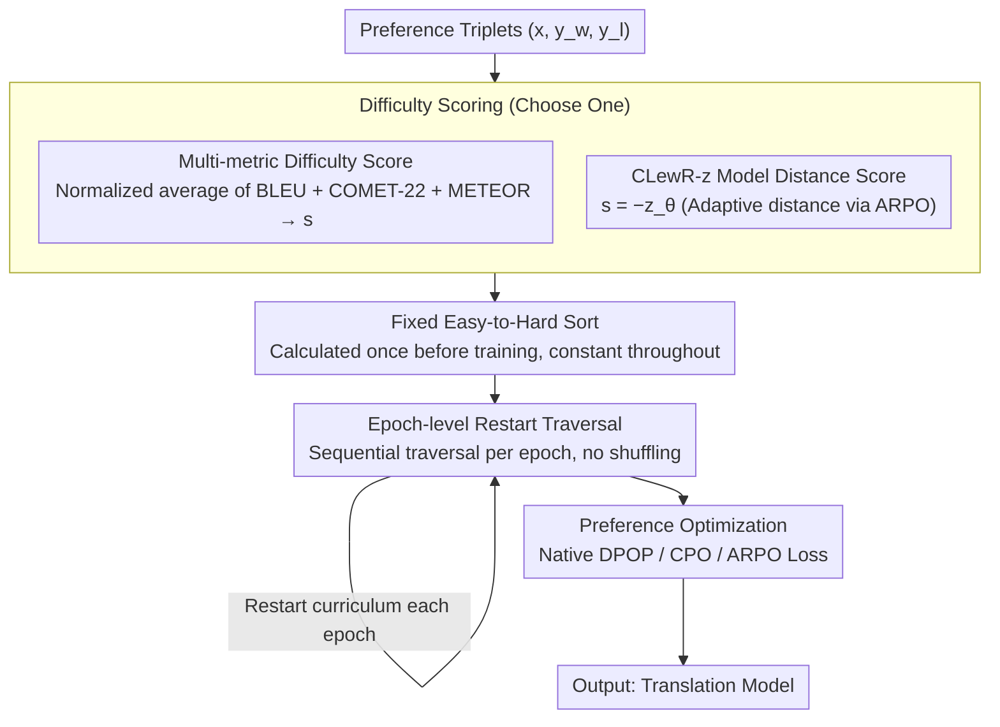

# CLewR: Curriculum Learning with Restarts for Machine Translation Preference Learning

**Conference**: ACL 2026  
**arXiv**: [2601.05858](https://arxiv.org/abs/2601.05858)  
**Code**: [https://github.com/alexandra-dragomir/CLewR](https://github.com/alexandra-dragomir/CLewR)  
**Area**: Optimization  
**Keywords**: Curriculum Learning, Preference Optimization, Machine Translation, Catastrophic Forgetting, DPO

## TL;DR

This paper proposes CLewR (Curriculum Learning with Restarts), a strategy that sorts data from easy to hard during preference optimization and restarts the curriculum every epoch. This effectively mitigates catastrophic forgetting and consistently improves machine translation performance across multiple model families (Gemma2, Qwen2.5, Llama3.1) and preference optimization algorithms (DPO, CPO, ARPO).

## Background & Motivation

**Background**: Large language models perform exceptionally well in zero-shot multilingual machine translation. Subsequent research employs preference optimization (such as DPO, CPO, ARPO) to further enhance translation quality by performing contrastive learning between high-quality and low-quality translations.

**Limitations of Prior Work**: Preference optimization methods neglect the presentation order of data samples, which significantly impacts training outcomes. Existing curriculum learning works (e.g., CurriDPO) simply sort data by difficulty but fail to address catastrophic forgetting during training—simple samples learned in early stages are forgotten later.

**Key Challenge**: Traditional curriculum learning traverses data from easy to hard only once. Models tend to forget knowledge from simple samples when focusing on difficult samples at the end of training. Conversely, without an ordered sequence, models cannot benefit from curriculum learning.

**Goal**: Propose a data-level curriculum strategy that captures the benefits of curriculum learning while mitigating catastrophic forgetting for preference optimization in machine translation.

**Key Insight**: Sort data from easy to hard within each epoch, but restart the sorting sequence at the end of every epoch. This ensures that every epoch completes a full traversal of all samples from simple to complex.

**Core Idea**: By restarting the easy-to-hard curriculum sort every epoch, CLewR inherently addresses catastrophic forgetting because all samples are revisited from the beginning in every cycle.

## Method

### Overall Architecture

CLewR consists of two stages: (1) Sorting stage—all training triplets are ranked based on the similarity difference between chosen and rejected translations; (2) Training stage—data is traversed in a fixed easy-to-hard order in every epoch without random shuffling. Sorting is performed once before training, and the same order is repeated across epochs.

### Key Designs

**1. Multi-metric Difficulty Scoring: Quantifying "Difficulty"**

Curriculum learning requires defining "hard" samples. CLewR defines the difficulty of a preference triplet $(x, y_w, y_l)$ based on the similarity between the chosen translation $y_w$ and the rejected translation $y_l$. Smaller differences make it harder for the model to distinguish between good and bad. Specifically, BLEU, COMET-22, and METEOR are calculated, normalized, and averaged to obtain a similarity score $s$. Samples with high $s$ (very similar translations) are classified as difficult, while low $s$ samples are simple. 

Multi-metric scoring is used because individual metrics have biases: BLEU emphasizes n-gram overlap, COMET emphasizes semantics, and METEOR balances morphology and synonyms. Averaging complementary metrics provides a more stable difficulty estimation.

**2. Epoch-level Restart Mechanism: Revisiting Simple Samples Every Round**

This is the core of how CLewR resolves the conflict between curriculum learning and catastrophic forgetting. Traditional curriculum learning sorts data and traverses it once; by the end of training, the model spends excessive time on hard samples, and earlier knowledge of simple samples is overwritten. CLewR calculates the sorting once before training, but every epoch traverses the full data in the same easy-to-hard order **without random shuffling**. At the start of each new epoch, the model is forced to "warm up" with simple samples before progressing to difficult ones.

This restart mechanism ensures simple samples are consolidated every round, offsetting forgetting through regular review while retaining the benefits of an easy-to-hard curriculum. It requires no changes to model architecture or losses, only to the traversal order.

**3. CLewR-z Variant: Using Model Distance Signals for Sorting**

External metrics require additional computation and may not align with the optimization objective. When using ARPO as the base algorithm, CLewR provides a self-consistent variant, CLewR-z. It utilizes the adaptive distance function $z_\theta(y_w, y_l)$ from ARPO, which encodes the log-likelihood difference between chosen and rejected responses. By setting $s = -z_\theta$, the model's own perception of difficulty determines the sort order. 

The paper also presents an enhanced ARPO version that weights $z_\theta$ with BLEU and COMET, combining internal model signals with external quality signals. This aligns the sorting criteria with the optimization objective and eliminates external metric overhead.

### Loss & Training

CLewR is compatible with three preference optimization algorithms: DPOP (enhanced DPO), CPO (Contrastive Preference Optimization with behavior cloning), and ARPO (Adaptive Rejection Preference Optimization). Training utilizes the native loss functions of these algorithms; CLewR only modifies the data presentation order.

## Key Experimental Results

### Main Results

**BLEU Scores for Gemma2-9B on 6 Romance Languages (en→xx)**

| Method | DPOP | +CurriDPO | +CLewR | CPO | +CLewR | ARPO | +CLewR |
|------|------|-----------|--------|-----|--------|------|--------|
| BLEU | 23.26 | 21.81 | 22.35 | 33.53 | **36.24** | 35.37 | **36.63** |

**BLEU Scores for Qwen2.5-7B on 6 Romance Languages (en→xx)**

| Method | DPOP | +CLewR | CPO | +CLewR | ARPO | +CLewR |
|------|------|--------|-----|--------|------|--------|
| BLEU | 24.43 | 23.59 | 27.68 | **30.05** | 30.41 | **31.56** |

### Ablation Study

| Configuration | Description | Effect |
|------|------|------|
| CLewR (Multi-metric) | Integrated BLEU+COMET+METEOR sorting | Optimal |
| CLewR-z (Model distance) | Sorting via ARPO internal distance | Near-optimal |
| ARPO-z'-V1/V2 (Enhanced dist) | Enhanced distance functions | Further improves ARPO baseline |
| CurriDPO | Competing method | Underperforms CLewR |

### Key Findings

- CLewR consistently improves performance for CPO and ARPO; results on DPOP vary by model.
- On Gemma2, the best configuration (CLewR + ARPO-z'-V2) achieved 37.45 BLEU (en→xx), a 2.08 Gain over baseline ARPO.
- CLewR outperforms CurriDPO across all model families and most algorithms.
- Enhanced ARPO (combining internal distance with external metrics) further boosts baseline ARPO performance.

## Highlights & Insights

- Extremely simple implementation—only changes data presentation order without modifying model architecture or loss functions, yet yields consistent gains.
- The "restart" mechanism is an elegant solution to the contradiction between curriculum learning and catastrophic forgetting.
- CLewR is highly universal and can be seamlessly integrated into various preference optimization algorithms like DPO, CPO, and ARPO.

## Limitations & Future Work

- Performance on DPOP is less stable than on CPO/ARPO, possibly due to DPOP's reliance on a reference model.
- Difficulty sorting is static based on pre-training evaluation and does not dynamically adjust during training.
- Validated only on machine translation; efficacy in other preference optimization scenarios (e.g., dialogue, summarization) remains to be verified.

## Related Work & Insights

- **vs CurriDPO**: CurriDPO uses iterative curricula but fails to address catastrophic forgetting; CLewR is more effective through epoch-level restarts.
- **vs X-ALMA**: X-ALMA is a strong baseline based on ARPO; CLewR further enhances performance on top of ARPO.

## Rating

- Novelty: ⭐⭐⭐⭐ The restart mechanism is simple but effectively addresses the curriculum learning/forgetting trade-off.
- Experimental Thoroughness: ⭐⭐⭐⭐⭐ Comprehensive coverage across three model families, three preference algorithms, and multilingual evaluation.
- Writing Quality: ⭐⭐⭐⭐ Clear motivation, concise methods, and detailed experiments.
- Value: ⭐⭐⭐⭐ Provides a simple and effective curriculum strategy for preference optimization training.

<!-- RELATED:START -->

## Related Papers

- [\[ACL 2026\] NeoAMT: Neologism-Aware Agentic Machine Translation with Reinforcement Learning](neoamt_neologism-aware_agentic_machine_translation_with_reinforcement_learning.md)
- [\[ACL 2025\] Code-Switching Curriculum Learning for Multilingual Transfer in LLMs](../../ACL2025/multilingual_mt/code-switching_curriculum_learning_for_multilingual_transfer_in_llms.md)
- [\[ACL 2026\] Selective Contrastive Learning For Gloss Free Sign Language Translation](selective_contrastive_learning_for_gloss_free_sign_language_translation.md)
- [\[ACL 2025\] GrammaMT: Improving Machine Translation with Grammar-Informed In-Context Learning](../../ACL2025/multilingual_mt/grammamt_improving_machine_translation_with_grammar-informed_in-context_learning.md)
- [\[ACL 2026\] Alexandria: A Multi-Domain Dialectal Arabic Machine Translation Dataset for Culturally Inclusive and Linguistically Diverse LLMs](alexandria_a_multi-domain_dialectal_arabic_machine_translation_dataset_for_cultu.md)

<!-- RELATED:END -->
