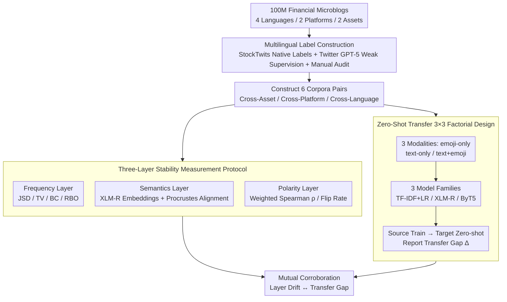

# Cross-Cultural Transfer of Emoji Semantics and Sentiment in Financial Social Media

**Conference**: ACL 2026 Findings  
**arXiv**: [2605.09414](https://arxiv.org/abs/2605.09414)  
**Code**: None  
**Area**: NLP / Multilingual / Financial Sentiment Analysis  
**Keywords**: emoji semantics, cross-lingual transfer, financial social media, zero-shot sentiment analysis, cross-platform generalization

## TL;DR
By systematically comparing emoji frequency, semantics, and sentiment polarity across 100 million financial microblogs in 4 languages, 2 platforms, and 2 asset classes, this study finds that while emoji frequency varies significantly across languages/platforms, their semantics and polarity remain highly stable. Consequently, in zero-shot sentiment transfer, incorporating emojis into text consistently reduces the cross-platform transfer gap from as high as 21% to nearly 0%.

## Background & Motivation

**Background**: Sentiment analysis in financial social media (Twitter, StockTwits) often relies on LLMs or encoders trained on English stock domains, which are then transferred to cryptocurrencies, other languages, or other platforms. Emojis (🚀, 💎🙌, 🐻, etc.) appear with extremely high frequency in financial contexts and are generally considered a "universal language." However, mainstream practices either strip them as noise or include them as features using general emoji embeddings (trained on non-financial corpora).

**Limitations of Prior Work**:

1. Most studies focus on single-platform, single-asset, or single-language scenarios. Existing work has only verified emoji effectiveness on English stocks on Twitter; no systematic testing has been conducted across languages, platforms, or assets.
2. In general contexts, there is ample evidence that emoji semantics drift significantly across cultures (usage varies between Chinese, Japanese, and English). Whether financial sub-cultures exhibit similar drift—and whether it affects downstream models—remains unquantified.
3. No prior work has linked "similarity in emoji distribution" with "improvement in zero-shot transfer provided by emojis."

**Key Challenge**: The frequency distribution of emojis as tokens likely depends heavily on language or platform (writing habits), but the financial semantics they encode (bullish/bearish/HODL) might be shared across cultures. These represent two different concepts of stability that must be measured separately. If the latter is stable, emojis can serve as a "lightweight bridge" for cross-domain transfer.

**Goal**: This study addresses two sub-problems: (i) whether emojis are consistent across financial communities at the levels of frequency, semantics, and polarity; (ii) how this consistency (or inconsistency) affects the cross-community transfer of zero-shot sentiment models.

**Key Insight**: Emojis are viewed as "shared codes of financial sub-cultures." The study employs four complementary distribution measures (JSD/TV/BC/RBO) for frequency, XLM-R embeddings with Procrustes alignment for semantics, and polarity ratios for sentiment stability. Finally, zero-shot transfer experiments using three input modalities (emoji-only / text-only / text+emoji) anchor the analysis to downstream metrics.

**Core Idea**: Utilizing a dual perspective of "hierarchical stability measurement + multimodal zero-shot transfer," the paper proves that emojis are stable signal sources for domain transfer in financial NLP—specifically, they can almost entirely close the transfer gap during cross-platform migration.

## Method

### Overall Architecture
The paper employs two parallel pipelines: **Analysis** and **Transfer Experiments**. The analysis side uses 100M+ financial microblogs to construct 6 corpora pairs (5 core comparisons across asset/platform/language) and calculates a set of complementary metrics across three layers (frequency/semantics/polarity). The transfer experiment side constructs 27 zero-shot setups across 3 model families × 3 input modalities × 3 transfer directions, reporting "in-domain accuracy" and "transfer gap." The pipelines share a common multilingual labeled dataset, allowing the "layer with the most drift" to correlate with the "transfer direction with the largest gap."

### Key Designs

**1. Multilingual Financial Sentiment Ground Truth: GPT-5 Weak Supervision + Manual Audit**

To extend analysis to EN/ES/JA/TR, the lack of native sentiment labels on Twitter and scarcity of multilingual financial corpora had to be addressed. The authors used StockTwits' native bullish/bearish labels and applied GPT-5 weak supervision for Twitter sentiment. They manually verified 2,700 samples per language to ensure label quality was sufficient for transfer conclusions.

**2. Three-Layer Stability Measurement Protocol: Decoupling Frequency, Semantics, and Polarity**

Directly asking if emojis are "the same" across cultures leads to pessimistic conclusions based on distribution distances like JSD. This study decouples the problem into three measured layers. The frequency layer uses top-100 emojis and computes JSD, TV, BC, and RBO. The semantics layer uses XLM-R centroids and Procrustes orthogonal alignment to measure mean cosine and NN@k. The polarity layer treats the "positive post ratio" of each emoji as its polarity, calculating weighted Spearman $\rho_w$, weighted MAUD$_w$, and flip rates.

**3. Zero-Shot Transfer Factorial Design: Controlled Comparison of Emoji Impact**

To quantify the benefit of emojis, three input modalities are tested: E (emoji sequence only), T (plain text without emojis), and TE (original text with emojis). Experiments involve three model families (TF-IDF+LR, XLM-R, ByT5) across cross-asset (stocks↔crypto), cross-platform (StockTwits↔Twitter), and cross-language (EN/ES/JA/TR) directions. The transfer gap $\Delta = \text{Acc}_{\text{in-domain}} - \text{Acc}_{\text{target}}$ is the primary metric.

### Loss & Training
TF-IDF+LR uses standard L2 regularization. XLM-R and ByT5 undergo standard cross-entropy fine-tuning (sharing hyperparameters across modalities). All corpora are balanced for positive/negative samples and processed with unified tokenizers to ensure differences arise from data distribution rather than training settings.

## Key Experimental Results

### Main Results

Cross-platform transfer (StockTwits-BTC → Twitter-BTC) serves as the "hardest" transfer gap. The table below compares modalities across models:

| Modality / Model | In-domain Acc | $\Delta$ → Twitter-BTC | Notes |
|---|---|---|---|
| Text / ByT5 | 0.783 | **0.209** | Largest gap for pure text |
| Text / XLM-R | 0.739 | 0.035 | Multilingual encoder provides buffer |
| Emoji / XLM-R | 0.718 | **0.004** | Emoji-only has nearly zero gap |
| Emoji / TF-IDF | 0.738 | 0.035 | Simple bag-of-words remains stable |
| Text+Emoji / ByT5 | **0.833** | 0.147 | High in-domain + improved transfer |
| Text+Emoji / XLM-R | 0.791 | 0.022 | Best overall performance |

Cross-asset transfer gaps (Crypto → Stocks) are generally smaller by 2–11%; emoji-only gaps are all < 5%.

Three-layer stability metrics: Cross-asset shows JSD=0.28, semantics cosine=0.96, polarity $\rho_w$=0.89. For EN-JA, frequency JSD rises to 0.51 and NN@1 drops to 0.09, but polarity $\rho_w$ remains high at 0.85—confirming that frequency drifts while polarity stays stable.

### Ablation Study

Treating modality as the ablation dimension while fixing XLM-R to observe contribution to cross-platform transfer gap:

| Config | In-domain Acc | Cross-platform $\Delta$ | Implication |
|---|---|---|---|
| Full (Text+Emoji) | 0.791 | 0.022 | Full model, gap nearly disappears |
| w/o Emoji (Text only) | 0.739 | 0.035 | Removing emojis increases gap slightly |
| w/o Text (Emoji only) | 0.718 | **0.004** | Emoji signal is most stable, but lower in-domain cap |
| TF-IDF / Text | 0.831 | 0.191 | Removing context encoder leads to gap surge |
| ByT5 / Text | 0.783 | 0.209 | Byte-level does not fix pure text drift |

### Key Findings

- Emojis are "insulators" for zero-shot sentiment transfer: While text-only drops up to 20.9 pp cross-platform, emoji-only drops just 0.4 pp (XLM-R).
- TE > T is a consistent trend: Text+Emoji yields a smaller transfer gap than text-only across all 9 model×modality combinations.
- Decoupling frequency from polarity is essential: Cross-language JSD is high (0.51), but polarity $\rho_w$ remains 0.79–0.89, explaining why sentiment transfer works despite distribution differences.
- Cross-language remains the most difficult: Emojis close nearly the entire gap cross-platform, but only partially mitigate the linguistic divide in cross-language scenarios.

## Highlights & Insights

- **Three-layer decoupling** is ingenious: By separating "distribution," "semantics," and "polarity," the authors reveal that "usage frequency" and "meaning" are distinct; merging them leads to false pessimism.
- Treating the "emoji-only" modality as a baseline is a key innovation, allowing for clean isolation of the invariant cross-domain signals carried by emojis.
- Selecting ByT5 as a control model eliminates the confounder of "tokenizer drift," proving that emoji benefits are not merely artifacts of how sub-word tokenizers handle special characters.

## Limitations & Future Work

- The authors acknowledge that cross-language transfer remains a hurdle; emojis reduce the gap but do not eliminate it, requiring stronger multilingual alignment.
- Observation: StockTwits is English-only, meaning cross-platform and cross-language variables are somewhat coupled in the data (cross-platform is fixed on English BTC). Future work should source multilingual StockTwits-like data.
- Polarity measurement based on "positive post ratio" is a coarse proxy; causal analysis (e.g., do-calculus) could better quantify the causal contribution of emojis.
- Experiments were limited to ByT5/XLM-R; testing whether emojis remain vital in the era of massive LLMs (like GPT-5) would be a valuable baseline.

## Related Work & Insights

- **vs. Mahrous et al. (2023)**: While they first proposed that financial emojis carry independent sentiment, this work scales the analysis to 4 languages and 2 platforms while quantifying transfer performance.
- **vs. Lu et al. (2016) / Barbieri et al. (2016)**: Whereas general research emphasizes cross-cultural semantic drift, this study shows that the financial sub-culture exhibits stable polarity despite frequency drift.
- **vs. Colavito et al. (2025) / Di Palo et al. (2024)**: These studies argue that emoji-only models are competitive; this paper adds that emoji-only models are particularly superior in cross-domain transfer scenarios.

## Rating

- Novelty: ⭐⭐⭐⭐ First systematic quantification of financial emoji stability across platform/language/asset linked to zero-shot metrics.
- Experimental Thoroughness: ⭐⭐⭐⭐⭐ 100M data points, multiple languages/platforms/assets, and 27 transfer experiments.
- Writing Quality: ⭐⭐⭐⭐ Clear logical chain; high information density in tables.
- Value: ⭐⭐⭐⭐ Direct guidance for deploying financial NLP systems; the nearly zero cross-platform gap for emoji-only models is a highly actionable engineering insight.

<!-- RELATED:START -->

## Related Papers

- [\[ACL 2026\] PluRule: A Benchmark for Moderating Pluralistic Communities on Social Media](plurule_a_benchmark_for_moderating_pluralistic_communities_on_social_media.md)
- [\[ACL 2025\] Cross-Lingual Transfer of Cultural Knowledge: An Asymmetric Phenomenon](../../ACL2025/multilingual_mt/cross-lingual_transfer_of_cultural_knowledge_an_asymmetric_phenomenon.md)
- [\[CVPR 2025\] SMTPD: A New Benchmark for Temporal Prediction of Social Media Popularity](../../CVPR2025/multilingual_mt/smtpd_a_new_benchmark_for_temporal_prediction_of_social_media_popularity.md)
- [\[ACL 2026\] What Factors Affect LLMs and RLLMs in Financial Question Answering?](what_factors_affect_llms_and_rllms_in_financial_question_answering.md)
- [\[ACL 2026\] Why Low-Resource NLP Needs More Than Cross-Lingual Transfer: Lessons Learned from Luxembourgish](why_low-resource_nlp_needs_more_than_cross-lingual_transfer_lessons_learned_from.md)

<!-- RELATED:END -->
