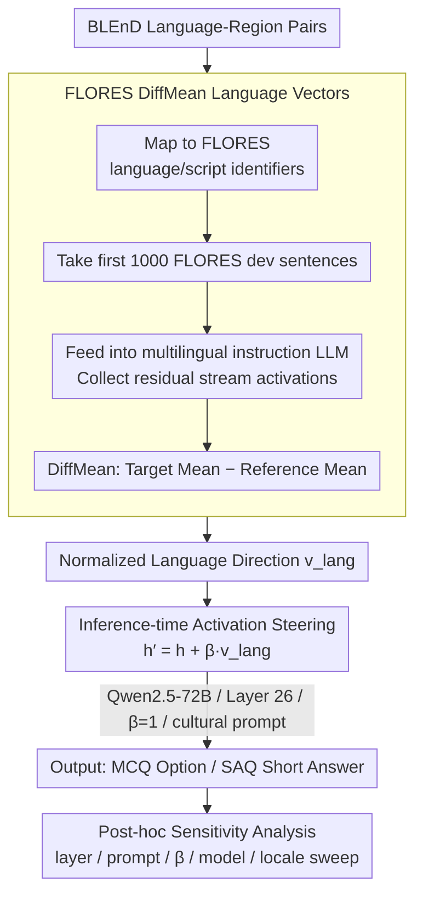

# DFKI-MLT at SemEval-2026 TASK 7: Steering Multilingual Models Towards Cultural Knowledge

**Conference**: ACL2026  
**arXiv**: [2605.23069](https://arxiv.org/abs/2605.23069)  
**Code**: https://github.com/Yusser96/SemEval-2026-Track7  
**Area**: Multilingual Models / Cultural Knowledge Evaluation  
**Keywords**: activation steering, cultural awareness, FLORES, BLEnD, SemEval

## TL;DR
This SemEval system paper utilizes the FLORES parallel corpus to extract language directions and injects language steering vectors into the residual stream of multilingual LLMs during inference. The system achieved an official MCQ accuracy of 86.96% (7th out of 17 teams), though post-hoc analysis indicates that gains are highly sensitive to layers, prompts, models, and locales.

## Background & Motivation
**Background**: Multilingual LLMs can process multiple languages fluently, but linguistic fluency does not equate to cultural knowledge reliability. Benchmarks such as BLEnD and SemEval-2026 Task 7 focus on whether models can answer questions within specific linguistic, regional, and cultural contexts, rather than merely outputting grammatically correct text.

**Limitations of Prior Work**: Many cultural knowledge gaps cannot be resolved through simple translation or general multilingual instruction tuning. Models may understand a language but lack knowledge of regional daily culture, food, festivals, social customs, or local common sense. While fine-tuning can improve specific tasks, the SemEval shared task did not provide BLEnD training data, and fine-tuning is costly and prone to overfitting.

**Key Challenge**: Cultural knowledge and linguistic representations may overlap within the model, but how to exploit this overlap without updating parameters remains unclear. Activation steering provides a lightweight solution, yet its ability to consistently improve cultural reasoning across multiple languages, locales, prompts, and models requires verification.

**Goal**: The DFKI-MLT system aims to use language vectors for inference-time adaptation to participate in the SAQ and MCQ tracks of SemEval-2026 Task 7, while analyzing the actual benefits and failure modes of steering on cultural tasks.

**Key Insight**: The authors hypothesize that language identity forms stable directions in the residual stream, and cultural knowledge access partially depends on language/region-related directions. They extract language vectors from FLORES parallel sentences and add target language vectors to the residual stream of specified transformer layers during generation.

**Core Idea**: Instead of fine-tuning model parameters, the internal representations are nudged along the target language direction during inference to make the model more likely to access the corresponding linguistic and cultural context.

## Method
The system consists of three parts: task setup, language vector extraction, and inference-time steering. The tasks include Track 1 SAQ and Track 2 MCQ. SAQ requires generating short answers in the input language, matched against a set of acceptable answers; MCQ involves English questions with four regional cultural options, where the system must select the correct option for the target region. The official metric for both is accuracy.

### Overall Architecture
The authors first map BLEnD language-region pairs to FLORES language/script identifiers. For each mappable language, the first 1,000 sentences from FLORES dev are taken and fed into a multilingual instruction-tuned LLM. Post-normalization residual-stream activations at specified layers are collected. Language vectors are constructed using DiffMean, defined as the difference between the mean activation of the target language and the mean activation of a reference set.

During inference, $\beta v_{lang}$ is added to the hidden state of a specific transformer layer, where $v_{lang}$ is the normalized language direction and $\beta$ is the steering strength. The final submission uses Qwen2.5-72B-Instruct, Layer 26, $\beta=1$, and a cultural prompt. All tracks employ greedy decoding with temperature=0 to minimize the interference of sampling noise on steering evaluation.

### Key Designs

**1. FLORES DiffMean language vectors: Extracting "Language Identity" via parallel corpora as an injectable direction**

To "add a bit of target language" during inference, a clean language direction must first be established. The authors map BLEnD pairs to FLORES identifiers, feed sentences through the model's tokenizer, and collect post-normalization activations. The vector is the DiffMean of the target vs. reference set. Using FLORES ensures content alignment—since sentences across languages share the same meaning, the mean difference cancels out semantic variance, leaving a pure language identity direction rather than one confounded by topical bias.

**2. Inference-time activation steering: Nudging the residual stream without changing parameters**

With the direction $v_{lang}$, the intervention is an additive injection into the hidden state of a chosen transformer layer:

$$h' = h + \beta v_{lang}$$

Where $v_{lang}$ is the normalized direction and $\beta$ is steering strength. During development, a search was conducted across $\beta \in \{1, 3, 5\}$ and candidate layers. The final submission used Qwen2.5-72B-Instruct, Layer 26, and $\beta=1$ with a cultural prompt. Greedy decoding was used to isolate the steering effect from sampling noise. This approach is low-cost and ideal for shared tasks without training data.

**3. Post-hoc sensitivity analysis: Explaining why a single configuration lacks global stability**

Since a fixed official submission $(\text{model}, \text{layer}, \beta, \text{prompt})$ cannot reveal the robustness of steering, the authors conducted a post-hoc analysis. They performed layer sweeps, prompt comparisons (generic vs. cultural), and steering strength tests across multiple models (Qwen2.5, Aya Expanse, Qwen3) and compared language vectors against random Gaussian directions. This analysis quantified that cultural reasoning steering is highly localized—optimal layers shift between early (Layer 2/3) and middle (Layer 26) layers depending on the prompt, and gains do not generalize consistently across locales.

### Loss & Training
The system has no training loss as it does not update model parameters. The development strategy selected models, layers, and $\beta$ based on the SemEval development phase. Final configuration: Qwen2.5-72B-Instruct + Layer 26 + $\beta=1$.

## Key Experimental Results

### Main Results

| Track | Metric | DFKI-MLT | Rank | Description |
|--------|------|------|----------|------|
| Track 1 (SAQ) | Acc. | N/A | - / 10 | Official submission file corrupted; not evaluated. |
| Track 2 (MCQ) | Acc. | 86.96 | 7 / 17 | Official score using cultural prompt + steering. |
| Track 2 best system | Acc. | 96.78 | 1 / 17 | Leading system, +9.82% ahead of DFKI-MLT. |

### Ablation Study

| Locale | DFKI-MLT (%) | System Locale Rank | Official Best (%) | Gap |
|------|---------|------|---------|------|
| es-EC | 97.54 | 7 | 98.67 | -1.13 |
| en-GB | 96.12 | 6 | 99.17 | -3.05 |
| es-MX | 94.94 | 4 | 99.32 | -4.38 |
| ar-EG | 94.84 | 2 | 91.03 | +3.81 |
| bg-BG | 94.60 | 8 | 99.54 | -4.94 |

### Key Findings
- **Locale performance is not uniform**: On ar-EG, the system reached 94.84%, outperforming the overall leaderboard champion's 91.03% for that locale by 3.81%. However, it trailed significantly on bg-BG.
- **Inconsistent average gains**: Individual locales saw up to +1.5% absolute accuracy gains, but other configurations degraded performance; gains do not generalize across language-region pairs.
- **Layer sensitivity**: In post-hoc sweeps for Qwen2.5-72B, the optimal layer for MCQ shifted to Layer 2/3 with cultural prompts, while Layer 26 was a compromise found on dev splits.
- **Steering Strength**: $\beta=1$ is a robust default. Higher strengths cause instability in early layers, though some models (Aya/Qwen3) tolerate stronger steering.
- **FLORES Sample Size**: The DiffMean vector is stable; at $N=500$, the cosine similarity with $N=1000$ is at least 0.999 across models.

## Highlights & Insights
- **Honesty regarding limits**: The paper demonstrates the boundaries of activation steering, noting that gains are highly dependent on locale, layer, and prompt rather than being a "magic bullet" for cultural alignment.
- **Lightweight adaptation**: Extracting directions from FLORES parallel corpora requires no cultural training sets or parameter updates, making it suitable for rapid prototyping.
- **Control comparison**: Random vector controls showed that language vectors produce distinct (though sometimes negative) outliers, proving they represent more than just random noise.
- **Task-specific prompt needs**: Cultural prompts help MCQ probabilities but can hinder SAQ by inducing long-winded answers that fail exact-match evaluation.

## Limitations & Future Work
- **Lack of official SAQ results**: Due to submission errors, Track 1 only has post-hoc offline evaluations, preventing direct leaderboard comparison.
- **Limited baseline comparison**: The study lacks systematic comparisons against alternatives like full fine-tuning, CAA, ReFT, or SAE-based steering.
- **Static global configuration**: The submission uses a single $(\beta, layer)$ pair; post-hoc analysis suggests per-locale or per-prompt adaptive steering is necessary.
- **Proxy limitations**: Language directions are only a proxy for cultural knowledge. Many cultural differences are regional or social and cannot be fully captured by a FLORES language vector.

## Related Work & Insights
- **vs BLEnD / SemEval**: This is a participant system focusing on lightweight adaptation without training data.
- **vs Activation Steering / CAA**: While general steering controls model behavior via internal directions, this work defines the direction as language identity and tests its transfer to cultural tasks.
- **vs Fine-tuning**: Fine-tuning learns culture directly but is costly. This method is faster but less stable than task-specific optimization.

## Rating
- **Novelty**: ⭐⭐⭐⭐☆ Applying language-vector steering to cultural shared tasks is innovative, though based on established steering concepts.
- **Experimental Thoroughness**: ⭐⭐⭐⭐☆ Extensive post-hoc sweeps are valuable, though official SAQ results are missing.
- **Writing Quality**: ⭐⭐⭐⭐☆ Transparent about negative results; the system description is clear.
- **Value**: ⭐⭐⭐⭐☆ Insights into the relationship between linguistic identity and cultural knowledge are valuable for the community.

<!-- RELATED:START -->

## Related Papers

- [\[ACL 2026\] Lingo_Research_Group at SemEval-2026 Task 9: Evaluating Prompt Variants for Polarization Detection](lingo_research_group_at_semeval-2026_task_9_evaluating_prompt_variants_for_polar.md)
- [\[ACL 2026\] Multilingual Steering by Design: Multilingual Sparse Autoencoders and Principled Layer Selection](multilingual_steering_by_design_multilingual_sparse_autoencoders_and_principled_.md)
- [\[ACL 2026\] EMCEE: Improving Multilingual Capability of LLMs via Bridging Knowledge and Reasoning with Extracted Synthetic Multilingual Context](emcee_improving_multilingual_capability_of_llms_via_bridging_knowledge_and_reaso.md)
- [\[ACL 2025\] Cross-Lingual Transfer of Cultural Knowledge: An Asymmetric Phenomenon](../../ACL2025/multilingual_mt/cross-lingual_transfer_of_cultural_knowledge_an_asymmetric_phenomenon.md)
- [\[ACL 2026\] Language on Demand, Knowledge at Core: Composing LLMs with Encoder-Decoder Translation Models for Extensible Multilinguality](language_on_demand_knowledge_at_core_composing_llms_with_encoder-decoder_transla.md)

<!-- RELATED:END -->
