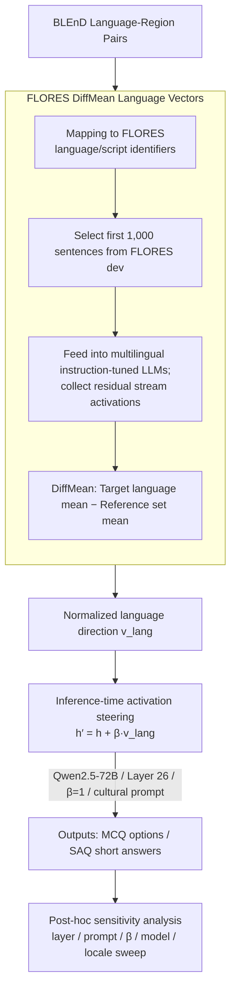

# DFKI-MLT at SemEval-2026 TASK 7: Steering Multilingual Models Towards Cultural Knowledge

**Conference**: ACL2026  
**arXiv**: [2605.23069](https://arxiv.org/abs/2605.23069)  
**Code**: https://github.com/Yusser96/SemEval-2026-Track7  
**Area**: Multilingual Models / Cultural Knowledge Evaluation  
**Keywords**: activation steering, cultural awareness, FLORES, BLEnD, SemEval

## TL;DR
This SemEval system paper extracts language directions using FLORES parallel corpora and injects language steering vectors into the residual stream of multilingual LLMs during inference. The system achieved a 86.96% accuracy in the official MCQ track (ranking 7th out of 17 teams), though post-hoc analysis reveals that gains are highly dependent on layers, prompts, models, and locales.

## Background & Motivation
**Background**: Multilingual LLMs can process multiple languages fluently, but linguistic fluency does not equate to cultural knowledge reliability. Benchmarks like BLEnD and SemEval-2026 Task 7 focus on whether models can answer questions specific to languages, regions, and cultural backgrounds rather than merely producing grammatically correct text.

**Limitations of Prior Work**: Many cultural knowledge gaps cannot be resolved through simple translation or general multilingual instruction tuning. A model may understand a language but lack knowledge of local daily culture, food, festivals, social habits, or local trivia. While fine-tuning can improve specific tasks, the SemEval shared task did not provide BLEnD training data, and fine-tuning is costly and prone to overfitting.

**Key Challenge**: Cultural knowledge and linguistic representations may overlap within the model, but how to leverage this overlap without updating parameters remains unclear. Activation steering offers a lightweight solution, yet its stability in enhancing cultural reasoning across multiple languages, locales, prompts, and models requires verification.

**Goal**: The DFKI-MLT system aims to use language vectors for inference-time adaptation for the SAQ and MCQ tracks of SemEval-2026 Task 7, while analyzing the real gains and failure modes of steering on cultural questions.

**Key Insight**: The authors hypothesize that linguistic identity forms stable directions in the residual stream, and cultural knowledge access partially depends on language- or region-related directions. They extract language vectors from FLORES parallel sentences and add a target language vector to the residual stream of specified transformer layers during generation.

**Core Idea**: Instead of fine-tuning model parameters, the internal representation is "nudged" along the target language direction during inference to make the model more likely to access the corresponding linguistic and cultural context.

## Method
The system consists of three parts: task setup, language vector extraction, and inference-time steering. The tasks include Track 1 (SAQ) and Track 2 (MCQ). SAQ requires generating short answers in the input language, matched against a set of acceptable answers; MCQ involves English questions with four regional cultural options, where the system selects the correct option for the target region. The official metric for both is accuracy.

### Overall Architecture
The authors first map the BLEnD language-region pairs to FLORES language/script identifiers. For each mappable language, the first 1,000 sentences from FLORES dev are taken and fed into a multilingual instruction-tuned LLM to collect post-normalization residual-stream activations at specified layers. Language vectors are constructed using DiffMean, calculated as the difference between the mean activation of the target language and the mean activation of a reference set.

During inference, $\beta v_{lang}$ is added to the hidden state of a specific transformer layer, where $v_{lang}$ is the normalized language direction and $\beta$ is the steering strength. The final submission uses Qwen2.5-72B-Instruct, Layer 26, $\beta=1$, and a cultural prompt. All tracks employ greedy decoding (temperature=0) to minimize the interference of sampling noise on the assessment of steering effectiveness.

### Key Designs

**1. FLORES DiffMean language vectors: Extracting "linguistic identity" as an injectable direction using parallel corpora**

The prerequisite for "adding a target language" during inference is having a clean language direction. The authors map BLEnD pairs to FLORES identifiers and collect activations from 1,000 parallel sentences. Using FLORES ensures that the sentences describe the same content across languages; thus, the "mean difference" cancels out semantic/topic variations, leaving a pure linguistic identity direction rather than one biased by topic.

**2. Inference-time activation steering: Nudging the residual stream without parameter changes**

The intervention involves an additive injection into the hidden states of a selected transformer layer:

$$h' = h + \beta v_{lang}$$

Where $v_{lang}$ is the normalized direction and $\beta$ is the strength. During development, searches were conducted over $\beta \in \{1, 3, 5\}$ and various candidate layers. The method is low-cost, allows instantaneous switching between languages, and fits the shared task setting where no BLEnD training data is available.

**3. Post-hoc sensitivity analysis of prompts, layers, and models: Explaining why singular configurations lack global stability**

Since a single official submission $(\text{model}, \text{layer}, \beta, \text{prompt})$ cannot demonstrate robustness, the authors performed comprehensive sensitivity analyses post-competition. They compared Qwen, Aya, and other models across layer sweeps, prompt types (generic vs. cultural), and steering strengths, including a control group using random Gaussian vectors. This step highlights that cultural steering gains are highly localized, with optimal layers shifting significantly based on the prompt or locale.

### Loss & Training
The system has no training loss as model parameters are not updated. The development strategy involved selecting models, layers, and $\beta$ based on the SemEval development phase. Final track configurations utilized Qwen2.5-72B-Instruct + Layer 26 + $\beta=1$.

## Key Experimental Results

### Main Results
| Track | Metric | DFKI-MLT | Rank | Description |
|--------|------|------|----------|------|
| Track 1 (SAQ) | Acc. | N/A | - / 10 | Official submission file corrupted; not evaluated. |
| Track 2 (MCQ) | Acc. | 86.96 | 7 / 17 | Official score using cultural prompt and steering. |
| Track 2 best system | Acc. | 96.78 | 1 / 17 | Leaderboard winner, leading DFKI-MLT by 9.82 points. |

### Ablation Study
| Locale | DFKI-MLT (%) | System Rank for Locale | Best Official (%) | Gain/Gap |
|------|---------|------|---------|------|
| es-EC | 97.54 | 7 | 98.67 | -1.13 |
| en-GB | 96.12 | 6 | 99.17 | -3.05 |
| es-MX | 94.94 | 4 | 99.32 | -4.38 |
| ar-EG | 94.84 | 2 | 91.03 | +3.81 |
| bg-BG | 94.60 | 8 | 99.54 | -4.94 |

### Key Findings
- The best locale does not represent global optimality. For ar-EG, DFKI-MLT reached 94.84% (outperforming the overall winner for this specific locale), but it trailed by nearly 5 points in bg-BG.
- Average gains from steering are small and unstable. Individual locales saw up to +1.5% absolute accuracy gains, but other configurations caused performance degradation.
- Layer selection is highly sensitive. Post-hoc sweeps showed the optimal layer for MCQ shifted to Layer 2/3 and for SAQ to Layer 8/7 depending on the prompt; Layer 26 was merely a compromise.
- $\beta=1$ is a safe default. Larger strengths often cause instability in early layers.
- FLORES sample size is not the primary source of instability. DiffMean vectors reached a median cosine similarity of $>0.99$ with $N=100$.

## Highlights & Insights
- The paper honestly presents the boundaries of activation steering, noting that gains depend on the interaction between locale, layer, and prompt.
- Extracting directions via FLORES is lightweight and requires no task-specific training data.
- The use of random vector controls was crucial; it demonstrated that language vectors are not purely random perturbations, though they do not guarantee positive results.
- SAQ and MCQ have different prompting needs; cultural prompts help MCQ probability but can lead to overly long or explanatory answers in SAQ, hindering matching.

## Limitations & Future Work
- The missing official SAQ result is a major experimental regret. Only post-hoc offline re-evaluation is available.
- The scope of comparison is limited; there was no systematic comparison against prompt-only, fine-tuning, CAA, or SAE-based steering.
- A single global configuration is sub-optimal. Future work should explore per-locale or per-prompt adaptive steering.
- Language vectors are only an approximate proxy for cultural knowledge. Language and culture are related but not identical; many cultural differences are regional or social and may not be fully captured by a FLORES language direction.

## Related Work & Insights
- **vs BLEnD / SemEval**: This is a participant system focusing on lightweight adaptation without training data.
- **vs activation steering / CAA**: While general steering controls behavior, this work defines the direction specifically as linguistic identity and tests its transfer to cultural domain reasoning.
- **vs Fine-tuning**: Fine-tuning is robust but costly; this method serves as a parameter-efficient alternative for shared tasks.
- **vs Prompt-only methods**: Prompts provide explicit instructions, while steering acts on internal representations. The results suggest these components need joint optimization.

## Rating
- Novelty: ⭐⭐⭐⭐☆ Using language-vector steering for a cultural knowledge shared task is interesting, though it builds on existing steering concepts.
- Experimental Thoroughness: ⭐⭐⭐⭐☆ Strong MCQ analysis and post-hoc sweeps, but official SAQ data is missing and comparisons to strong baselines are a bit narrow.
- Writing Quality: ⭐⭐⭐⭐☆ Transparent about negative results and sensitivities; system description is clear.
- Value: ⭐⭐⭐⭐☆ Insightful for multilingual cultural evaluation and inference-time intervention, highlighting that linguistic fluency is not cultural competence.

<!-- RELATED:START -->

## Related Papers

- [\[ACL 2026\] Lingo_Research_Group at SemEval-2026 Task 9: Evaluating Prompt Variants for Polarization Detection](lingo_research_group_at_semeval-2026_task_9_evaluating_prompt_variants_for_polar.md)
- [\[ACL 2026\] Multilingual Steering by Design: Multilingual Sparse Autoencoders and Principled Layer Selection](multilingual_steering_by_design_multilingual_sparse_autoencoders_and_principled_.md)
- [\[ACL 2026\] EMCEE: Improving Multilingual Capability of LLMs via Bridging Knowledge and Reasoning with Extracted Synthetic Multilingual Context](emcee_improving_multilingual_capability_of_llms_via_bridging_knowledge_and_reaso.md)
- [\[ACL 2025\] Cross-Lingual Transfer of Cultural Knowledge: An Asymmetric Phenomenon](../../ACL2025/multilingual_mt/cross-lingual_transfer_of_cultural_knowledge_an_asymmetric_phenomenon.md)
- [\[ACL 2026\] Language on Demand, Knowledge at Core: Composing LLMs with Encoder-Decoder Translation Models for Extensible Multilinguality](language_on_demand_knowledge_at_core_composing_llms_with_encoder-decoder_transla.md)

<!-- RELATED:END -->
