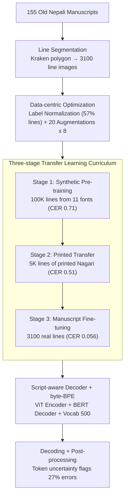

# Digitizing Nepal's Written Heritage: A Comprehensive HTR Pipeline for Old Nepali Manuscripts

**Conference**: ACL 2026  
**arXiv**: [2512.17111](https://arxiv.org/abs/2512.17111)  
**Code**: https://github.com/anjalisarawgi/nepOCR/ (Available)  
**Area**: Multilingual / OCR / Low-Resource Document Recognition  
**Keywords**: HTR, Devanagari, Low-resource, TrOCR, Three-stage Transfer Learning, Data Augmentation

## TL;DR
This is the first end-to-end **Handwritten Text Recognition (HTR)** pipeline for Old Nepali. By employing a "Synthetic Devanagari → Printed Nagari → Old Nepali Manuscripts" three-stage transfer learning curriculum, $8\times$ data augmentation with 20 techniques, byte-level BPE, and a script-aware decoder, the CER is reduced from a fine-tuned TrOCR baseline of $9.6\%$ to **$4.9\%$**. The code, models, and a Streamlit web application are open-sourced.

## Background & Motivation
**Background**: Modern HTR has transitioned from CNN+CTC models to the Transformer paradigm (TrOCR), which performs well on English/Latin manuscripts. However, **low-resource historical scripts** (e.g., Old Nepali Devanagari) remain challenging due to diverse handwriting styles, severe document degradation, complex conjuncts, and almost no annotated data.

**Limitations of Prior Work**: (1) Tesseract and Google Cloud Vision fail on historical Devanagari manuscripts (missing conjuncts, diacritics, and punctuation). (2) TrOCR is not pre-trained on Devanagari and outputs non-Devanagari characters out of the box. (3) The availability of only 155 manuscript pages (3100 lines) is insufficient for training Transformers from scratch. (4) Issues include scriptio continua (no word spaces), irregular punctuation, character evolution (U+0310 vs. U+0901 synonyms), and inconsistent spelling, creating noisy labels.

**Key Challenge**: Transformer-based HTR requires large-scale data, yet Old Nepali manuscripts are inherently low-resource. Directly fine-tuning TrOCR is ineffective as the tokenizer does not understand Devanagari.

**Goal**: To construct a pipeline that (1) achieves a stable CER under $5\%$ with only $\sim 3000$ lines of training data; (2) automates line segmentation → recognition → post-processing; and (3) provides an ablation study for researchers of other low-resource scripts.

**Key Insight**: (a) Three-stage curriculum learning—synthetic data for basic fonts $\to$ printed scanned data for real noise $\to$ manuscript data for handwriting styles. (b) Script-aware decoder—training custom byte-BPE/char-BPE tokenizers and BERT/GPT-2 decoders to replace English wordpieces. (c) Data-centric optimization (label normalization and $8\times$ augmentation) yields more gains than architectural tuning.

**Core Idea**: The performance ceiling for low-resource historical HTR is determined by data quality and curriculum rather than model capacity. Once the "Synthetic → Printed → Manuscript" stages are implemented, architectural choices like BERT vs. GPT-2 or char-BPE vs. byte-BPE have minimal impact.

## Method

### Overall Architecture
The pipeline consists of five steps: ① **Line segmentation** using Kraken (polygon-based) to cut 155 manuscripts into 3100 line images. ② **Stage 1: Synthetic Pre-training** using 11 Devanagari fonts and 10 noise types to render 100K training lines. ③ **Stage 2: Printed Transfer** using 5139 lines from printed Nagari scans. ④ **Stage 3: Manuscript Fine-tuning** on 3100 real manuscript lines. ⑤ **Decoding & Post-processing** comparing various strategies and flagging errors via token uncertainty. All stages use AdamW, $lr=3e-5$, $bs=8$, and 500 warmup steps over 6/10/20 epochs.

### Key Designs

**1. Three-stage Transfer Learning Curriculum**: Using synthetic and printed data to learn Old Nepali handwriting with only 3100 real annotations.  
Directly fine-tuning Transformers on 3100 lines leads to overfitting, whereas synthetic data alone does not bridge the noise gap. Stage 1 (Synthetic) allows the decoder to learn Devanagari visual priors. Stage 2 (Printed) bridges the gap between synthetic fonts and real scan noise. Stage 3 (Manuscript) adapts to specific handwriting styles and paper degradation. Ablations confirm that CER drops from $0.71$ (Stage 1) to $0.51$ (Stage 2) and finally to $0.056$ (Stage 3).

**2. Script-aware decoder + byte-BPE tokenizer**: Replacing TrOCR's English wordpiece vocabulary with BPE trained specifically for Devanagari.  
TrOCR's default vocabulary lacks Devanagari conjuncts. Ours redevelops the decoding path: training ByteLevelBPETokenizers with a vocabulary size of 500 (balancing coverage and frequency) and training decoders (BERT/GPT-2) from scratch with matching vocab sizes. Byte-level BPE perfectly covers Devanagari characters and conjuncts.

**3. Data-centric Optimization**: Label normalization and $8\times$ augmentation to increase data diversity.  
Normalization handles systematic noise (e.g., unifying U+0310 vs. U+0901) for $57\%$ of lines. Augmentations include shape deformations (rotation, shear), quality degradation (Gaussian noise, JPEG compression), and character-level perturbations (blurred patches, elastic warp). The $8\times$ augmentation (22,320 samples) was identified as the inflection point for cost-effectiveness, contributing more to CER reduction than upgrading the model encoder.

## Loss & Training
Standard cross-entropy NLL is used. CER (normalized Levenshtein distance) is the primary metric, with weighted CER and exact match accuracy as secondary metrics. Five decoding methods (beam search, contrastive search, temperature sampling, etc.) were compared, showing that **decoding strategies have almost no impact on results** ($\text{CER} \approx 0.0483-0.0490$).

## Key Experimental Results

### Main Results

Ours vs. Existing Baselines:

| System | CER | CER(w) | ACC | Note |
| :--- | :--- | :--- | :--- | :--- |
| Google Cloud Vision OCR | Failure | - | - | Fails on conjuncts/diacritics |
| Fine-tuned TrOCR (Default decoder) | 0.096 | - | - | Direct baseline fine-tuning |
| Ours base-handwritten + BERT+byteBPE + 8× aug | **0.056** | 0.057 | 29.4% | base encoder |
| **Ours large-handwritten + BERT+byteBPE + 8× aug** | **0.049** | **0.048** | **33.5%** | Final Model |

$\to$ CER reduced from 0.096 to 0.049, a **relative reduction of 49%**.

### Ablation Study

Impact of data-centric interventions (base encoder):

| Step | Samples | CER | CER(w) | ACC |
| :--- | :--- | :--- | :--- | :--- |
| Original | 2,480 | 0.089 | 0.090 | 22.9% |
| + Normalization | 2,480 | 0.084 (-0.005) | 0.084 | 21.6% |
| + Aug 2× | 7,440 | 0.067 (-0.017) | 0.068 | 26.7% |
| **+ Aug 8×** | **22,320** | **0.056 (-0.004)** | **0.057** | **29.4%** |

Cumulative gain from the three-stage curriculum:

| Training Stage | Pre-training | CER | ACC |
| :--- | :--- | :--- | :--- |
| Only Stage 1 | - | 0.71 | 0.0% |
| Only Stage 2 | + Stage 1 | 0.51 | 2.58% |
| **Stage 3** | + Stage 1 + Stage 2 | **0.056** | **29.58%** |

### Key Findings
- **Data-centric > Architecture**: Normalization and $8\times$ augmentation contributed $-0.033$ CER, nearly 5 times the impact of upgrading the encoder ($-0.007$).
- **Decoding strategies are negligible**: The difference between beam search and sampling is $\leq 0.001$ CER.
- **Errors are structured**: Top 10 characters contribute $55.9\%$ of errors, primarily "virama" and "space."
- **Failure on long lines**: Performance drops on lines $>120$ characters, suggesting Transformer length generalization issues.
- **Uncertainty as a proxy**: $27\%$ of errors can be flagged via token uncertainty, providing a path for human-in-the-loop post-correction.

## Highlights & Insights
- **Data > Model** is empirically verified: Architectures (BERT/GPT-2) matter less than data quality in low-resource HTR.
- The combination of **Three-stage curriculum + custom BPE** provides a portable recipe for other low-resource scripts (e.g., Tibetan, Uyghur).
- Structural error analysis demonstrates that the model learns meaningful patterns rather than hallucinations.
- Splitting long lines significantly improves accuracy, highlighting encoder OOD limitations.

## Limitations & Future Work
- **Dataset Closure**: Ground truth data is not public due to copyright, hindering exact reproduction.
- **Segmentation Dependency**: Still relies on external Kraken polygons; error propagation occurs if segmentation fails.
- **Long-line Generalization**: Poor performance on sequences $>120$ characters due to data scarcity.
- **Post-correction**: No LM-based rescoring was implemented.
- **Usability**: A $4.9\%$ CER is still too high for automated scholarly transcription without expert review.

## Related Work & Insights
- Compared to older CRNN+CTC models (Nakarmi et al. 2024), this Transformer-based approach with a curriculum effectively scales in low-resource settings.
- Proves that custom-script tokenizers are essential: commercial OCR and default TrOCR fail because they do not model the specific linguistic structure (conjuncts/diacritics) of historical Devanagari.

## Rating
- Novelty: ⭐⭐⭐
- Experimental Thoroughness: ⭐⭐⭐⭐⭐
- Writing Quality: ⭐⭐⭐⭐
- Value: ⭐⭐⭐⭐

## Related Papers

- [\[ACL 2026\] The GaoYao Benchmark: A Comprehensive Framework for Evaluating Multilingual and Multicultural Abilities of Large Language Models](the_gaoyao_benchmark_a_comprehensive_framework_for_evaluating_multilingual_and_m.md)
- [\[ACL 2025\] Are Rules Meant to be Broken? Understanding Multilingual Moral Reasoning as a Computational Pipeline with UniMoral](../../ACL2025/multilingual_mt/are_rules_meant_to_be_broken_understanding_multilingual_moral_reasoning_as_a_com.md)
- [\[ACL 2026\] Efficient Low-Resource Language Adaptation via Multi-Source Dynamic Logit Fusion](efficient_low-resource_language_adaptation_via_multi-source_dynamic_logit_fusion.md)
- [\[ACL 2026\] BhashaSutra: A Task-Centric Unified Survey of Indian NLP Datasets, Corpora, and Resources](bhashasutra_a_task-centric_unified_survey_of_indian_nlp_datasets_corpora_and_res.md)
- [\[ACL 2026\] Prosody as Supervision: Bridging the Non-Verbal–Verbal for Multilingual Speech Emotion Recognition](prosody_as_supervision_bridging_the_non-verbal--verbal_for_multilingual_speech_e.md)

<!-- RELATED:END -->

<!-- RELATED:START -->

## Related Papers

- [\[ACL 2026\] The GaoYao Benchmark: A Comprehensive Framework for Evaluating Multilingual and Multicultural Abilities of Large Language Models](the_gaoyao_benchmark_a_comprehensive_framework_for_evaluating_multilingual_and_m.md)
- [\[ACL 2025\] Are Rules Meant to be Broken? Understanding Multilingual Moral Reasoning as a Computational Pipeline with UniMoral](../../ACL2025/multilingual_mt/are_rules_meant_to_be_broken_understanding_multilingual_moral_reasoning_as_a_com.md)
- [\[ACL 2026\] EMCEE: Improving Multilingual Capability of LLMs via Bridging Knowledge and Reasoning with Extracted Synthetic Multilingual Context](emcee_improving_multilingual_capability_of_llms_via_bridging_knowledge_and_reaso.md)
- [\[ACL 2026\] Efficient Low-Resource Language Adaptation via Multi-Source Dynamic Logit Fusion](efficient_low-resource_language_adaptation_via_multi-source_dynamic_logit_fusion.md)
- [\[ACL 2026\] BhashaSutra: A Task-Centric Unified Survey of Indian NLP Datasets, Corpora, and Resources](bhashasutra_a_task-centric_unified_survey_of_indian_nlp_datasets_corpora_and_res.md)

<!-- RELATED:END -->
