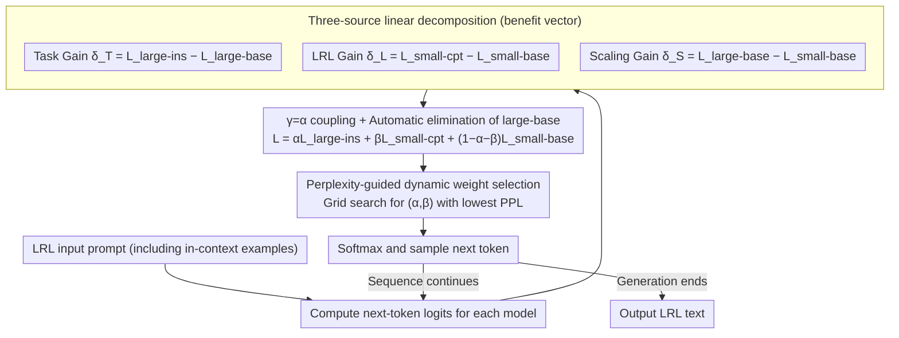

# Efficient Low-Resource Language Adaptation via Multi-Source Dynamic Logit Fusion

**Conference**: ACL 2026  
**arXiv**: [2604.18106](https://arxiv.org/abs/2604.18106)  
**Code**: https://github.com/luciusssss/TriMix  
**Area**: Multilingual / Low-Resource  
**Keywords**: Low-resource languages, Proxy Tuning, Logit Fusion, Dynamic weights, Continual Pre-training

## TL;DR
TriMix decomposes Low-Resource Language (LRL) adaptation into three logit benefit vectors: "language capability + task capability + scaling dividends." It only requires continual pre-training (CPT) on a small model. At inference time, weights are dynamically determined via perplexity. It consistently outperforms single-model baselines and Proxy Tuning across 4 model families and 8 LRLs. A core empirical discovery is that "the weight of the small CPT model should be higher than that of the large instruction model," directly challenging the "large-model-dominant" assumption in Proxy Tuning.

## Background & Motivation

**Background**: Transferring Large Language Models (LLMs) dominated by High-Resource Languages (HRL, e.g., English) to LRLs (e.g., Tibetan, Uyghur, Kazakh, Bengali) remains a difficult challenge in multilingual NLP. Two mainstream approaches exist: (1) Model Merging (e.g., TIES): Parameter-level fusion of an "instruction model with task capabilities in HRL" and a "base model CPTed in LRL." However, this requires the models to have the **same architecture and size**, and stronger models still necessitate CPT on the large model. (2) Proxy Tuning (Liu et al. 2024): Injecting logits from specialized small models into large model logits to avoid large model CPT, which has succeeded in the code domain.

**Limitations of Prior Work**: Proxy Tuning implicitly assumes that "the large model serves as the primary signal and the small model is merely a delta." In LRL scenarios, the large model itself is **also weak** in the target LRL. Treating it as the primary signal "suppresses" the strong capabilities of the small CPT model in the LRL, and may even disrupt basic LRL generation (examples provided in Appendix B.4). In other words, "capabilities from different sources are not equivalent" in logit fusion.

**Key Challenge**: LRL tasks simultaneously lack three things: LRL language data, task annotations, and large model compute. Existing methods typically solve only one or two at a time and default to "large model logits as the skeleton," which contradicts the fact that the large model itself is weak in LRL.

**Goal**: Design a framework that (i) does not require LRL task annotations, (ii) does not require CPT on the large model, (iii) correctly balances the three sources of capability, and (iv) is universal across multiple model families.

**Key Insight**: Categorize models into base, instruction (ins), and CPT variants. Represent "task," "LRL," and "scaling" as delta vectors between the base and its variants in the logit space. Then, automatically select weights using perplexity as an unsupervised measure of input distribution fit.

**Core Idea**: Perform "three-source linear decomposition + dynamic weighting" on logits. By deliberately coupling the scaling coefficient with the task coefficient ($\gamma = \alpha$), the large base model is algebraically eliminated, requiring only the "large ins + small base + small cpt" for inference.

## Method

### Overall Architecture
TriMix is a **purely test-time** framework (requiring no training except for small model CPT). Given an LRL input prompt: (1) It is simultaneously fed into three models: the large instruction model (large-ins), the small base model (small-base), and the small model CPTed on LRL (small-cpt). (2) Their next-token logits are linearly fused via $L = \alpha L_{large\text{-}ins} + \beta L_{small\text{-}cpt} + (1 - \alpha - \beta)L_{small\text{-}base}$. (3) $\alpha, \beta$ are selected **online** from a small grid using a perplexity-guided (default) or entropy-guided approach. (4) The next token is sampled after softmax, and the cycle continues. The entire process only requires a single CPT on the small model with raw LRL text, **completely eliminating the need for LRL task annotations** or updating the large model.

### Key Designs

**1. Three-source linear decomposition (Task / Language / Scaling benefit vectors): Explicitly decomposing "ideal logits" into a small-base plus three independent gains.**

LRL tasks lack language data, task annotations, and scaling. Previous methods mixed these, making it impossible to tune them individually. TriMix disentangles these into three channels in the logit space: Task gain $\delta_T = L_{large\text{-}ins} - L_{large\text{-}base}$ (large models have strong learning capacity, so task capabilities are extracted from this pair), LRL gain $\delta_L = L_{small\text{-}cpt} - L_{small\text{-}base}$ (only small models can afford CPT, so language capabilities come from the small pair), and Scaling gain $\delta_S = L_{large\text{-}base} - L_{small\text{-}base}$ (using base-to-base to avoid mistaking "instruction style" for "scaling dividends"). Final logits are represented as $L = L_{small\text{-}base} + \alpha\delta_T + \beta\delta_L + \gamma\delta_S$.

This explicit decomposition allows each term to be tuned independently, unlike Proxy Tuning which has only one "large-dominant" knob. The base-to-base design for $\delta_S$ ensures that the scaling factor remains pure and is not contaminated by instruction-tuning styles.

**2. $\gamma = \alpha$ coupling + Automatic elimination of large-base: An algebraic transformation reducing inference from 4 models to 3.**

The ideal formula requires four models: large-ins, large-base, small-cpt, and small-base. In reality, deployment environments often lack VRAM for the large base. TriMix sets $\gamma = \alpha$, merging $\alpha(L_{large\text{-}ins} - L_{large\text{-}base}) + \alpha(L_{large\text{-}base} - L_{small\text{-}base})$ such that $L_{large\text{-}base}$ cancels out. The formula collapses to $L = \alpha L_{large\text{-}ins} + \beta L_{small\text{-}cpt} + (1 - \alpha - \beta)L_{small\text{-}base}$. This requires only three forward passes during inference. 

This is a trade-off between engineering cost and flexibility: the authors acknowledge that allowing $\gamma \neq \alpha$ might yield a higher theoretical upper bound, but as a practical approximation, saving the VRAM and bandwidth costs of the large base is more viable for LRL deployment.

**3. Perplexity-guided dynamic weight selection: Online selection of $(\alpha, \beta)$ per sample via PPL without an LRL validation set.**

Since LRL task annotations are unavailable, traditional grid searches fail due to the lack of a dev set. TriMix uses an unsupervised proxy: for each input prompt (including in-context examples), calculate the perplexity of the fused language model. Select the $(\alpha, \beta)$ pair from a small grid that minimizes PPL. The intuition is that the weight configuration that best explains the current input distribution should be used. An alternative ENT strategy selects the configuration with the lowest entropy for the first generated token to capture the "most certain" output. Neither method requires annotations.

This is effective because PPL is highly correlated with generation quality while remaining unsupervised. In experiments, the weights selected by PPL almost perfectly matched the empirical Upper Bound and significantly outperformed ENT on 1.5B+3B configurations, suggesting that "input distribution fit" is a more robust indicator than "output certainty."

### Loss & Training
The **only training** involved in this framework is the CPT of the small model on raw LRL corpora to obtain the small-cpt. All other stages (task capability transfer, scaling gain, and $\alpha, \beta$ selection) are completed at test time with **zero task annotations and zero gradient updates to the large model**. CPT details vary by model family: Qwen2.5, Llama3.2, and Gemma3 were CPTed by the authors, while Llama2 checkpoints were reused from Tao et al. 2024.

## Key Experimental Results

### Main Results
Comparison across different large scales in the Qwen2.5 family (4 minority languages in China: Tibetan bod, Uyghur uig, Kazakh kaz, Mongolian mvf; average scores). $\Delta$ represents the relative improvement over the best single-model baseline:

| Setup | Method | #Param Train | #Param Test | MC | ENG-G | LRL-G | Avg | $\Delta$ |
|------|------|--------------|-------------|-----|-------|-------|------|----------|
| 1.5B+3B | Qwen2.5-3B-ins | 0 | 3B | 42.4 | 12.2 | 10.8 | 24.8 | – |
| 1.5B+3B | Proxy Tuning | 1.5B | 6B | 45.4 | 14.1 | 14.1 | 28.5 | -7.2% |
| 1.5B+3B | **TriMix (PPL)** | 1.5B | 6B | 48.7 | 19.5 | 16.3 | **31.1** | **+1.3%** |
| 1.5B+3B | TriMix (Upper Bound) | 1.5B | 6B | 52.4 | 21.3 | 17.6 | 33.6 | +9.4% |
| 1.5B+7B | Qwen2.5-7B-ins | 0 | 7B | 49.7 | 20.0 | 12.5 | 30.6 | – |
| 1.5B+7B | Proxy Tuning | 1.5B | 10B | 50.5 | 16.3 | 13.3 | 30.0 | -2.3% |
| 1.5B+7B | **TriMix (PPL)** | 1.5B | 10B | **53.4** | 19.8 | 15.7 | **33.0** | **+7.5%** |
| 1.5B+14B | Qwen2.5-14B-ins | 0 | 14B | 57.1 | 21.0 | 13.8 | 34.4 | – |
| 1.5B+14B | Proxy Tuning | 1.5B | 17B | 57.7 | 15.4 | 16.8 | 33.9 | -1.5% |
| 1.5B+14B | **TriMix (PPL)** | 1.5B | 17B | **59.5** | 20.5 | 16.8 | **36.1** | **+4.9%** |

Key findings: (1) Proxy Tuning **decreased scores** in most Qwen2.5 configurations (up to -7.2%), confirming that "large-model dominance" fails in LRL. (2) TriMix-PPL consistently provided positive gains at every large size, with a 4.9% increase even at 14B+. (3) The gap between TriMix-PPL and the Upper Bound narrowed as the large model grew (e.g., only a 0.6 difference at 1.5B+7B), proving PPL is an excellent proxy. (4) ENT underperformed compared to PPL, indicating that "input fit" is more critical than "output certainty."

### Cross-Model & Cross-Language Validation
The framework was extended to Llama2 (7B+13B), Llama3.2 (1B+3B), and Gemma3 (4B+12B), covering 8 LRLs: Tibetan, Uyghur, Kazakh, Mongolian, Tamil, Telugu, Odia, and Bengali. TriMix-PPL consistently outperformed or equaled the strongest single-model baseline, demonstrating that the framework is model-agnostic.

### Ablation Study: Weight Distribution Analysis
Core empirical discovery (distribution statistics based on Upper Bound weight selection):

| Setup | Empirical Optimal $\alpha$ (large-ins) | Empirical Optimal $\beta$ (small-cpt) | $\beta/\alpha$ |
|------|-------------------------------|------------------------------|----------------|
| Proxy Tuning Assumption | ≈1.0 | ≈0.x | <1 (Large Dominant) |
| TriMix Upper Bound | Small | **Significantly Larger** | **>1 (Small-CPT Dominant)** |
| TriMix PPL Selection | Close to Upper Bound | Close to Upper Bound | >1 |

Thus, the **optimal strategy is the exact opposite of the Proxy Tuning assumption**: in LRL scenarios, the small CPT model should dominate the logits, while the large instruction model acts as a secondary task/scaling signal.

### Key Findings
- **"Large-model dominance" is the root cause of Proxy Tuning's failure in LRL**: The authors used Upper Bound weight distributions to disprove the default assumption, providing a new principle for future logit-fusion work: "dominance by the domain expert."
- **Perplexity is a strong proxy for unsupervised weight selection in LRL**: PPL-selected weights closely track the Upper Bound and outperform ENT, offering a practical engineering solution when labels are missing.
- **High leverage of small model CPT**: A 1.5B CPT model combined with a 14B off-the-shelf ins model yields a 4.9% gain over the 14B model alone, effectively saving the compute required to CPT the 14B model.
- **Task type sensitivity**: TriMix shows the largest gains in generative tasks (LRL-G, ENG-G). Gains in MC (Multiple Choice) are smaller, as MC relies more on retrieval than linguistic fluency.
- **Divergence-from-base explains LRL weight demand**: The optimal $\beta$ increases as the divergence between the CPT model and the base distribution grows (deeper LRL adaptation), providing a quantifiable metric for when to weight the small CPT model more heavily.

## Highlights & Insights
- **Three-source decomposition + coefficient coupling**: Upgrades logit fusion from simple model addition/subtraction to a controllable linear combination of three sources of capability. The algebraic elimination of the large base via $\gamma = \alpha$ is an elegant engineering step. 
- **Challenging Proxy Tuning's default assumption**: Provides one of the strongest counter-arguments in recent logit arithmetic literature by showing that the "large model must be the primary signal" intuition is false in specific domains.
- **No annotations, plug-and-play**: Requires no task-level LRL labels, reducing the cost of data preparation to nearly zero, which is highly beneficial for real-world LRL communities.
- **PPL weight selection paradigm**: Using "PPL on prompt" as a free proxy for weight selection is a technique that can be readily adopted by other inference-time fusion studies.

## Limitations & Future Work
- The $\gamma = \alpha$ coupling is a compromise for "engineering practicality"; theoretically, relaxation could lead to higher performance. Incorporating the large base without excessive VRAM is a future direction.
- CPT remains a necessary step, making it inapplicable for ultra-low resource languages with zero raw corpora.
- Experiments focused on Llama/Qwen/Gemma families; MoE (Mixture-of-Experts) models were not covered, and their fusion behavior might differ.
- Evaluation relied on MiLiC-Eval, Belebele, and SIB-200; open-ended human evaluation was not conducted. Fine-grained evaluation of LRL generation quality remains a challenge.
- The discrete granularity of the weight search grid might limit the potential of the Upper Bound; future work could use continuous optimization (e.g., token-level dynamic gating).

## Related Work & Insights
- **vs. Proxy Tuning (Liu 2024)**: Both perform fusion in the logit domain, but Proxy Tuning treats the large model as primary and the small as a delta. TriMix reverses this and adds "task + scaling" channels, performing better in LRL.
- **vs. Model Merging (Tao 2024, TIES)**: Requires identical architectures and sizes, and scaling necessitates CPT on the large model. TriMix allows for architectural mismatch and leverages scaling via small model CPT.
- **vs. Contrastive Decoding (Li 2023)**: CD uses small-cpt − small-base to enhance language capabilities but lacks a large model. TriMix explicitly integrates a large-ins model for task and scaling benefits with dynamic weights.
- **Inspiration**: TriMix can be applied to any "small expert + generalist" scenario (medical, legal, vertical agents). Vertical capabilities can be $\delta_L$, task skills $\delta_T$, and scaling $\delta_S$, with PPL/ENT selecting weights online.

## Rating
- Novelty: ⭐⭐⭐⭐ Three-source decomposition + $\gamma = \alpha$ elimination + PPL selection + Disproving "large-dominant" assumption. Individually incremental, but collectively highly creative.
- Experimental Thoroughness: ⭐⭐⭐⭐⭐ 4 model families × 8 LRLs × multiple large scales × 3 weight strategies. Very solid coverage.
- Writing Quality: ⭐⭐⭐⭐ Clear mathematical derivations, intuitive architecture diagrams; some ablations rely heavily on the Appendix.
- Value: ⭐⭐⭐⭐⭐ Highly practical for compute-limited LRL communities and offers a methodological shift for future logit-fusion research.

<!-- RELATED:START -->

## Related Papers

- [\[ICML 2026\] Toward Robust Multilingual Adaptation of LLMs for Low-Resource Languages](../../ICML2026/multilingual_mt/toward_robust_multilingual_adaptation_of_llms_for_low-resource_languages.md)
- [\[ACL 2026\] Mitigating Catastrophic Forgetting in Target Language Adaptation of LLMs via Source-Shielded Updates](mitigating_catastrophic_forgetting_in_target_language_adaptation_of_llms_via_sou.md)
- [\[ACL 2026\] Reinforcement Learning with Semantic Rewards Enables Low-Resource Language Expansion without Alignment Tax](reinforcement_learning_with_semantic_rewards_enables_low-resource_language_expan.md)
- [\[ACL 2025\] Language Fusion for Parameter-Efficient Cross-lingual Transfer (FLARE)](../../ACL2025/multilingual_mt/flare_crosslingual_lora.md)
- [\[ACL 2026\] Why Low-Resource NLP Needs More Than Cross-Lingual Transfer: Lessons Learned from Luxembourgish](why_low-resource_nlp_needs_more_than_cross-lingual_transfer_lessons_learned_from.md)

<!-- RELATED:END -->
