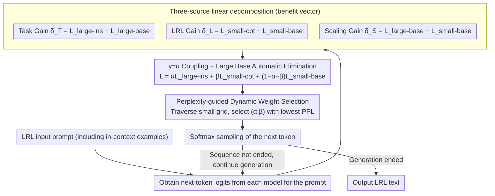

# Efficient Low-Resource Language Adaptation via Multi-Source Dynamic Logit Fusion

**Conference**: ACL 2026  
**arXiv**: [2604.18106](https://arxiv.org/abs/2604.18106)  
**Code**: https://github.com/luciusssss/TriMix  
**Area**: Multilingual / Low-Resource  
**Keywords**: Low-resource languages, Proxy Tuning, Logit Fusion, Dynamic Weights, Continual Pre-training

## TL;DR
TriMix decomposes LRL (Low-Resource Language) adaptation into three logit benefit vectors: "language proficiency + task capability + scaling dividends." By performing continual pre-training (CPT) only on small models and dynamically determining weights via perplexity during inference, it consistently outperforms single-model baselines and Proxy Tuning across 4 model families and 8 LRLs. The core empirical finding suggests that "the weight of the small CPT model should be higher than that of the large instruction model," directly challenging the "large-model dominant" assumption default in Proxy Tuning.

## Background & Motivation

**Background**: Transferring Large Language Models (LLMs) dominated by HRLs (High-Resource Languages like English) to LRLs (Tibetan, Uyghur, Kazakh, Bengali, etc.) remains a bottleneck in multilingual NLP. Two mainstream approaches exist: (1) Model merging (e.g., TIES): performing parameter-level fusion between an "ins model that learned task capabilities on HRL" and a "base model CPT-ed on LRL," which requires the two to be of **identical architecture and size**; more powerful models still require CPT on the large model itself. (2) Proxy Tuning (Liu et al. 2024): injecting logits from a small expert model into large model logits to avoid large model CPT, which has seen success in the coding domain.

**Limitations of Prior Work**: Proxy Tuning implicitly assumes that "the large model serves as the primary signal, while the small model is merely a delta." However, in LRL scenarios, the large model itself is **also weak** in the target LRL. Treating it as the primary signal "suppresses" the strong LRL capabilities of the small CPT model and can even disrupt basic LRL generation (examples provided in Appendix B.4). In other words, capabilities from different sources in logit fusion are not equivalent.

**Key Challenge**: LRL tasks simultaneously lack three components: LRL language data, task annotations, and large model compute. Existing methods typically address only one or two at a time and default to the "large model logits as the skeleton" assumption, which conflicts with the fact that large models are inherently weak in LRLs.

**Goal**: Design a framework that (i) requires no LRL task annotations, (ii) avoids CPT for the large model, (iii) correctly balances the three capability sources, and (iv) is universal across multiple model families.

**Key Insight**: Categorize models into base, ins, and cpt variants, and represent "Task," "LRL," and "Scaling" as delta vectors between these variants in the logit space. Then, use perplexity—an unsupervised measure of input distribution fit—to automatically select weights.

**Core Idea**: Implement "three-source linear decomposition + dynamic weighting" on logits, intentionally coupling the scaling coefficient with the task coefficient ($\gamma=\alpha$). This cancels out the large base model, requiring only the "large ins + small base + small cpt" models for inference.

## Method

### Overall Architecture
TriMix is a **purely test-time** framework (requiring no training except for small model CPT). Given an LRL input prompt: (1) It is fed simultaneously to three models: a large instruction model (large-ins), a small base model (small-base), and a small model CPT-ed on LRL (small-cpt); (2) Their next-token logits are extracted for linear fusion: $L=\alpha L_{large\text{-}ins}+\beta L_{small\text{-}cpt}+(1-\alpha-\beta)L_{small\text{-}base}$; (3) $\alpha$ and $\beta$ are selected **online** from a small grid using perplexity-guided (default) or entropy-guided methods; (4) The next token is sampled after softmax, and the process repeats until completion. This entire workflow only requires one CPT pass on the small model using raw LRL text, **completely avoiding LRL task annotations** and **never updating** the large model.

### Key Designs

**1. Three-source linear decomposition (Task / Language / Scaling benefit vectors): Explicitly decomposing "ideal logits" into small-base plus three independent gains**

LRL tasks simultaneously lack language data, task annotations, and large model compute. Previous methods mixed these up, preventing targeted adjustments. TriMix disentangles these into three independent channels in the logit space: Task Gain $\delta_T=L_{large\text{-}ins}-L_{large\text{-}base}$ (large models learn better, so task capabilities are extracted from the large model pair), LRL Gain $\delta_L=L_{small\text{-}cpt}-L_{small\text{-}base}$ (only small models can afford CPT, so language capabilities are derived from the small model difference), and Scaling Gain $\delta_S=L_{large\text{-}base}-L_{small\text{-}base}$ (specifically using base-to-base to avoid mistaking "instruction style" for "scaling dividends"). Final ideal logits are expressed as $L=L_{small\text{-}base}+\alpha\delta_T+\beta\delta_L+\gamma\delta_S$.

The significance of explicit decomposition is that each term's weight can be adjusted independently, unlike Proxy Tuning which has only one knob for "large-dominant, small-auxiliary." The insistence on base-to-base for $\delta_S$ also keeps the "scale" component pure and untainted by instruction-tuned styles.

**2. $\gamma=\alpha$ Coupling + Large Base Automatic Elimination: An algebraic transformation reducing the models loaded for inference from 4 to 3**

The ideal formula above requires running four models: large-ins, large-base, small-cpt, and small-base. In practice, deployment environments often lack the VRAM to load a large base model. TriMix sets $\gamma=\alpha$, merging $\alpha(L_{large\text{-}ins}-L_{large\text{-}base})+\alpha(L_{large\text{-}base}-L_{small\text{-}base})$ such that $L_{large\text{-}base}$ cancels out. The formula collapses to $L=\alpha L_{large\text{-}ins}+\beta L_{small\text{-}cpt}+(1-\alpha-\beta)L_{small\text{-}base}$. Only three forward passes (large ins + small base + small cpt) are needed during inference.

This is a trade-off between "engineering cost and flexibility": the authors admit that allowing $\gamma\ne\alpha$ theoretically offers a higher upper bound, but as a practical approximation, saving the VRAM and bandwidth costs of the large base model is more feasible for real LRL deployments.

**3. Perplexity-guided Dynamic Weight Selection: Using PPL to select $(\alpha,\beta)$ online per sample in the absence of LRL dev sets**

LRL scenarios often lack task annotations, making traditional grid searches for hyperparameters via a dev set impossible. TriMix uses an unsupervised proxy: for each input prompt (including in-context examples + test input), it calculates the perplexity using the fused language model. It traverses a small grid to select the $(\alpha,\beta)$ pair with the lowest PPL. The intuition is: "use the set of weights that best explains the current input distribution." An alternative ENT strategy selects the configuration with the lowest entropy for the first generated token to capture the "most certain" output; neither requires annotations.

This approach is viable because PPL is highly correlated with generation quality while being entirely unsupervised; experiment results show that the weights selected by PPL closely match the empirical Upper Bound and significantly outperform ENT on 1.5B+3B configurations, suggesting that "input distribution fit" is a more reliable indicator than "output certainty."

### Loss & Training
The **only training** in this framework is the CPT of the small model on raw LRL corpora to obtain the small-cpt model. All other stages (task capability transfer, scaling gain, $\alpha,\beta$ selection) are completed at test time with **zero task annotations and zero gradient updates to the large model**. CPT details vary by model family: Qwen2.5 / Llama3.2 / Gemma3 undergo custom CPT, while Llama2 reuses checkpoints from Tao et al. 2024.

## Key Experimental Results

### Main Results
Comparison of different large scales within the Qwen2.5 family (average scores across 4 Chinese minority languages: Tibetan bod, Uyghur uig, Kazakh kaz, Mongolian mvf), where $\Delta$ represents the relative improvement over the best single-model baseline:

| Setting | Method | #Param Train | #Param Test | MC | ENG-G | LRL-G | Avg | $\Delta$ |
|------|------|--------------|-------------|-----|-------|-------|------|----------|
| 1.5B+3B | Qwen2.5-3B-ins | 0 | 3B | 42.4 | 12.2 | 10.8 | 24.8 | – |
| 1.5B+3B | Proxy Tuning | 1.5B | 6B | 45.4 | 14.1 | 14.1 | 28.5 | -7.2% |
| 1.5B+3B | **TriMix (PPL)** | 1.5B | 6B | 48.7 | 19.5 | 16.3 | **31.1** | **+1.3%** |
| 1.5B+3B | TriMix (Upper Bound) | 1.5B | 6B | 52.4 | 21.3 | 17.6 | 33.6 | +9.4% |
| 1.5B+7B | Qwen2.5-7B-ins | 0 | 7B | 49.7 | 20.0 | 12.5 | 30.6 | – |
| 1.5B+7B | Proxy Tuning | 1.5B | 10B | 50.5 | 16.3 | 13.3 | 30.0 | -2.3% |
| 1.5B+7B | **TriMix (PPL)** | 1.5B | 10B | **53.4** | 19.8 | 15.7 | **33.0** | **+7.5%** |
| 1.5B+14B | Qwen2.5-14B-ins | 0 | 14B | 57.1 | 21.0 | 13.8 | 34.4 | – |
| 1.5B+14B | Proxy Tuning | 1.5B | 17B | 57.7 | 15.4 | 16.8 | 33.9 | -1.5% |
| 1.5B+14B | **TriMix (PPL)** | 1.5B | 17B | **59.5** | 20.5 | 16.8 | **36.1** | **+4.9%** |

Key takeaways: (1) Proxy Tuning actually **decreases performance** on most Qwen2.5 configurations (up to -7.2%), confirming "large-model dominance" fails in LRL; (2) TriMix-PPL delivers stable positive improvements across all large model sizes, with a 4.9% gain even on 14B+; (3) The gap between PPL and Upper Bound shrinks as the large model size increases (e.g., only 0.6 points for 1.5B+7B), proving PPL is an excellent proxy; (4) ENT is inferior to PPL, indicating that "input distribution fit" > "output certainty."

### Cross-model & Cross-language Validation
The authors extended the framework to Llama2 (7B+13B), Llama3.2 (1B+3B), and Gemma3 (4B+12B), covering 8 LRLs including Tibetan, Uyghur, Kazakh, Mongolian, Tamil, Telugu, Odia, and Bengali. TriMix-PPL consistently outperformed or equaled the strongest single-model baseline, proving it is model-agnostic.

### Ablation Study
Core empirical analysis of optimal weight patterns (based on Upper Bound distribution statistics):

| Setting | Optimal $\alpha$ (large-ins) | Optimal $\beta$ (small-cpt) | $\beta/\alpha$ |
|------|-------------------------------|------------------------------|----------------|
| Proxy Tuning Assumption | ≈1.0 | ≈0.x | <1 (Large Dominant) |
| TriMix Upper Bound | Small | **Significantly Larger** | **>1 (Small-CPT Dominant)** |
| TriMix PPL Selection | Close to UB | Close to UB | >1 |

Thus, the **optimal strategy is the opposite of the Proxy Tuning assumption**: in LRL scenarios, the small CPT model should dictate the logits, with the large ins model acting as an auxiliary task/scaling signal.

### Key Findings
- **"Large-model dominance" is the root cause of Proxy Tuning's failure in LRL**: The authors disprove the default assumption via Upper Bound distributions, providing a new principle for logit-fusion: "dominance by the target-domain expert."
- **Perplexity is a strong surrogate for unsupervised weight selection in LRL**: PPL-selected $(\alpha,\beta)$ closely align with the Upper Bound and beat ENT, offering a practical engineering solution when annotations are scarce.
- **High leverage of small model CPT**: Combining 1.5B CPT with a 14B off-the-shelf ins model achieves a 4.9% gain over the standalone 14B model, effectively "saving the compute required for 14B CPT."
- **Task type sensitivity**: TriMix shows the largest gains in generative tasks (LRL-G, ENG-G), while gains in MC (Multiple Choice) are smaller as MC focuses more on retrieval than linguistic fluency.
- **Divergence-from-base explains LRL weight demand**: Greater distribution divergence between the CPT model and its base (indicating deeper LRL adaptation) correlates with a larger optimal $\beta$, providing a quantifiable metric for when to weight the small CPT model more heavily.

## Highlights & Insights
- **Three-source Decomposition + Coefficient Coupling**: Elevates logit fusion from "simple addition/subtraction" to a "controlled linear combination of three capability sources" and elegantly eliminates the large base model via $\gamma=\alpha$. This logic extends to any multi-source capability scenarios (Code + Math + Multilingual).
- **Challenging Proxy Tuning Assumptions**: Uses empirical bounds and dynamic weights to invert the intuition that "large models must be the primary signal," offering one of the most powerful counterexamples in recent logit arithmetic literature.
- **Zero-annotation, Plug-and-Play**: The method requires no task-level LRL annotations, reducing data preparation costs to nearly zero—highly beneficial for real-world LRL communities (Tibetan, Uyghur, etc.).
- **PPL Weight Selection Paradigm**: Using "PPL on prompt" as a free proxy for weight selection is a technique that can be readily adopted by other inference-time fusion studies.

## Limitations & Future Work
- $\gamma=\alpha$ is an "engineering utility" compromise; theoretically, relaxation could yield a higher performance ceiling. Efficiently integrating the large base model without exceeding VRAM limits is a future direction.
- CPT remains a necessary step, making it unfeasible for ultra-low resource languages with no raw corpora.
- Experiments focused on Llama / Qwen / Gemma families and did not cover MoE (Mixture of Experts) models; fusion behavior in MoE logits may differ.
- Evaluations relied on MiLiC-Eval, Belebele, and SIB-200; open-ended human evaluation was not performed, and fine-grained LRL generation quality remains an open problem.
- The discrete granularity of the weight search grid may limit the potential of the Upper Bound; future improvements could involve continuous optimization (e.g., token-level dynamic gating).

## Related Work & Insights
- **vs Proxy Tuning (Liu 2024)**: Both fuse in the logit domain, but Proxy treats the large model as the primary signal; TriMix reverses this for LRL and introduces independent "task + scaling" channels, performing consistently better.
- **vs Model Merging (Tao 2024, TIES)**: Requires matching architecture/size and scaling requires CPT on the large model; TriMix allows heterogeneous architectures and leverages scaling dividends via small model CPT.
- **vs Contrastive Decoding (Li 2023)**: CD uses small-cpt − small-base to enhance language proficiency without a large model; TriMix explicitly integrates a large ins model for task/scaling signals with dynamic weighting.
- **Insights**: TriMix can be applied to any scenario where "a small model knows a local domain X and a large model is general" (medicine, law, vertical agents)—encode domain expertise as $\delta_L$, task ability as $\delta_T$, and scale as $\delta_S$, then select weights online via PPL/ENT.

## Rating
- Novelty: ⭐⭐⭐⭐ Three-source decomposition + $\gamma=\alpha$ elimination + PPL selection + Disproving the "large-dominant" assumption; each point is incremental but combined they are quite creative.
- Experimental Thoroughness: ⭐⭐⭐⭐⭐ Well-grounded coverage across 4 model families, 8 LRLs, multiple large scales, and three strategies (UB / PPL / ENT).
- Writing Quality: ⭐⭐⭐⭐ Clear mathematical derivations and intuitive framework in Figure 2; some ablation details reside heavily in the Appendix.
- Value: ⭐⭐⭐⭐⭐ Highly practical for compute-constrained LRL communities and offers a methodological shift for future logit-fusion research.

<!-- RELATED:START -->

## Related Papers

- [\[ICML 2026\] Toward Robust Multilingual Adaptation of LLMs for Low-Resource Languages](../../ICML2026/multilingual_mt/toward_robust_multilingual_adaptation_of_llms_for_low-resource_languages.md)
- [\[ACL 2026\] Mitigating Catastrophic Forgetting in Target Language Adaptation of LLMs via Source-Shielded Updates](mitigating_catastrophic_forgetting_in_target_language_adaptation_of_llms_via_sou.md)
- [\[ACL 2026\] Reinforcement Learning with Semantic Rewards Enables Low-Resource Language Expansion without Alignment Tax](reinforcement_learning_with_semantic_rewards_enables_low-resource_language_expan.md)
- [\[ACL 2026\] Why Low-Resource NLP Needs More Than Cross-Lingual Transfer: Lessons Learned from Luxembourgish](why_low-resource_nlp_needs_more_than_cross-lingual_transfer_lessons_learned_from.md)
- [\[ACL 2025\] Language Fusion for Parameter-Efficient Cross-lingual Transfer (FLARE)](../../ACL2025/multilingual_mt/flare_crosslingual_lora.md)

<!-- RELATED:END -->
