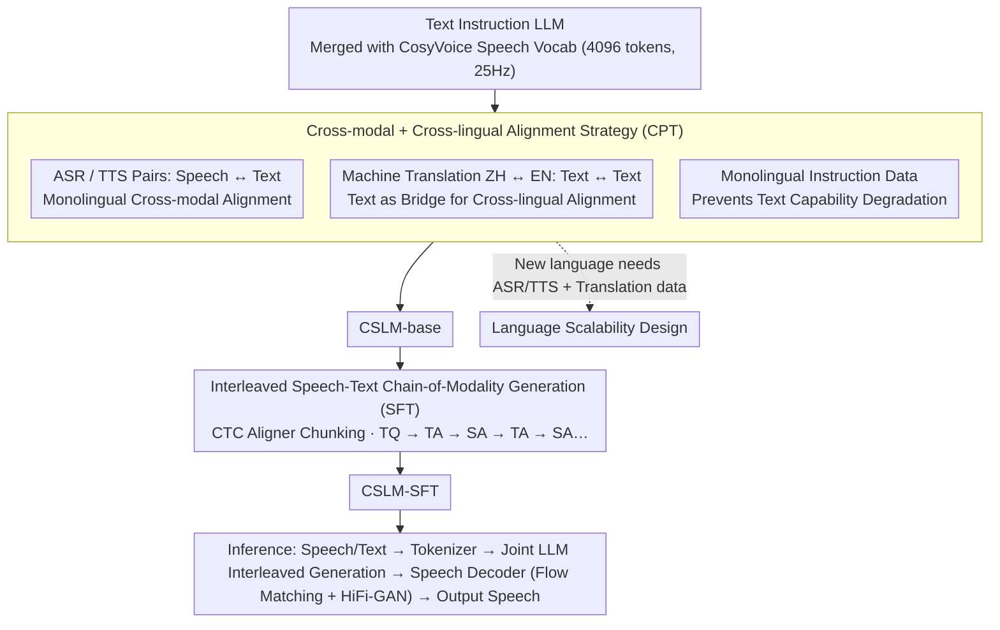

# Efficient Training for Cross-lingual Speech Language Models

**Conference**: ACL 2026 Findings  
**arXiv**: [2604.11096](https://arxiv.org/abs/2604.11096)  
**Code**: [https://github.com/ictnlp/CSLM](https://github.com/ictnlp/CSLM)  
**Area**: Multilingual/Translation / Audio & Speech  
**Keywords**: Cross-lingual Speech LLM, Discrete Speech Tokens, Modality Alignment, Interleaved Chain-of-Modality Generation, Data-efficient Training

## TL;DR
This paper proposes CSLM, an efficient training method for cross-lingual speech LLMs. By utilizing a novel alignment strategy to achieve cross-modal and cross-lingual alignment and introducing speech-text interleaved chain-of-modality generation, the model improves quality and reduces latency while scaling to new languages without requiring large-scale speech data.

## Background & Motivation

**Background**: Speech LLMs are emerging to enable more natural human-computer interaction, but building effective end-to-end speech LLMs remains challenging. Existing approaches include cascaded ASR+LLM+TTS (suffering from error accumulation and high latency), modular encoder+LLM methods (weak speech generation), and unified modeling based on discrete speech tokens (e.g., SpeechGPT, GLM-4-Voice).

**Limitations of Prior Work**: (1) Speech data is extremely scarce compared to text, especially for certain languages; (2) existing unified modeling methods (e.g., GLM-4-Voice, Moshi) require massive amounts of training data; (3) extending speech LLMs to more languages faces the dual challenge of data scarcity and training difficulty; (4) existing chain-of-modality generation (TQ → full TA → full SA) results in high latency.

**Key Challenge**: The core difficulty lies in building a unified multilingual multimodal representation with limited data, as speech data is severely insufficient for many languages.

**Goal**: Design a data-efficient training method that achieves simultaneous cross-modal and cross-lingual alignment using limited speech data while ensuring good language scalability.

**Key Insight**: Use the text modality as a "bridge" to achieve cross-lingual alignment—performing speech-text cross-modal alignment within a single language via ASR/TTS data, and cross-lingual alignment via machine translation (text-to-text) data. This eliminates the need for cross-lingual speech-to-speech alignment data.

**Core Idea**: Design an "interleaved speech-text chain-of-modality" generation method where the model alternately generates short text chunks and corresponding speech chunks (TQ → TA → SA → TA → SA...). This provides finer-grained modality alignment and lower latency than the standard chain-of-modality (TQ → full TA → full SA).

## Method

### Overall Architecture
CSLM consists of three components: (1) CosyVoice speech tokenizer (4096 vocabulary, 25Hz) converting speech into discrete tokens; (2) a joint speech-text LLM (merging speech and text vocabularies); (3) a speech decoder (flow matching model + HiFi-GAN vocoder). The core contribution lies in the two-stage training: the Continued Pre-training stage uses a "cross-modal + cross-lingual alignment strategy" to align speech/text and Chinese/English simultaneously; the Supervised Fine-Tuning stage uses "interleaved speech-text chain-of-modality generation" to refine alignment and reduce latency. This alignment recipe naturally provides "language scalability"—supporting new languages requires only two types of data.

### Key Designs

**1. Cross-modal + Cross-lingual Alignment: Using Text as a Bridge**
Directly collecting cross-lingual speech pairs like "Chinese Speech ↔ English Speech" is extremely difficult. CSLM splits alignment into two accessible parts: monolingual ASR data (Speech → Text) and TTS data (Text → Speech) for cross-modal alignment, and MT data (ZH ↔ EN Text) for cross-lingual alignment. By anchoring both languages' speech to their respective text and connecting text via translation, cross-lingual speech alignment is established "indirectly" without any cross-lingual speech pairs.

**2. Interleaved Speech-Text Chain-of-Modality Generation**
Original chain-of-modality (TQ → full TA → full SA) requires the full text to be generated before speech starts, causing high latency. The interleaved approach generates a small text chunk followed immediately by its corresponding speech chunk (TQ → TA → SA → TA → SA...). Training data is constructed using a CTC aligner to find the optimal alignment path:

$$\pi^* = \arg\max_\pi \prod_t P(\pi_t|\mathbf{h}_t)$$

After obtaining token-level boundaries, data is segmented at punctuation marks into chunks (e.g., 7 words). This allows generation and playback to overlap in time, significantly reducing latency while maintaining more stable alignment than word-level interleaving.

**3. Language Scalability Design**
Extending speech LLMs typically fails due to lack of target language speech data. CSLM lowers this threshold: since discrete tokens are language-independent and the CosyVoice tokenizer supports multiple languages, one only needs (1) speech-text pairs (for modal alignment) and (2) translation data (for lingual alignment) to integrate a new language.

### Loss & Training
Two-stage training: (1) Continued Pre-training: Mixing ASR/TTS/MT/Monolingual instruction data on a pre-trained LLM with a merged vocabulary to obtain CSLM-base. (2) Supervised Fine-Tuning: Training on text instructions and speech dialogue data using the interleaved format to obtain CSLM-SFT. Consecutive repeated speech tokens are merged before LLM input to improve efficiency.

## Key Experimental Results

### Main Results

| Task | Model | English | Chinese |
|------|------|------|------|
| ASR (WER↓) | Whisper-large-v3 | 2.5 | 9.3 |
| ASR | GLM-4-Voice | 2.8 | 2.5 |
| ASR | CSLM-SFT | 9.8 | 9.0 |
| TTS (WER↓) | CosyVoice-SFT | 3.4 | — |
| TTS | GLM-4-Voice | 4.7 | — |
| TTS | CSLM-SFT | **3.8** | — |
| TTS (LibriTTS) | CSLM-SFT | **2.9** | — |

### Ablation Study

| Configuration | Effect | Description |
|------|------|------|
| Full Chain-of-Modality | High Latency | TQ → full TA → full SA |
| Interleaved Chain-of-Modality | Low Latency, Better Quality | TQ → TA → SA → TA → SA... |
| w/o Cross-lingual Alignment | Poor Cross-lingual Performance | Lacks translation data bridge |
| w/o Modal Alignment | Poor Speech Quality | Lacks ASR/TTS training |

### Key Findings
- CSLM achieves TTS quality close to or exceeding specialized TTS systems (CosyVoice) while possessing dialogue and cross-lingual capabilities.
- Interleaved generation significantly reduces latency by overlapping model generation with audio playback.
- CSLM achieves comparable performance to GLM-4-Voice using significantly less speech data.
- Chunk-level interleaved data from CTC aligners is more stable than word-level interleaving.
- ASR performance is lower than specialized models (Whisper) but sufficient for dialogue scenarios.

## Highlights & Insights
- **Text as a Cross-lingual Bridge**: Cleverly leverages rich text resources to bridge speech in different languages, avoiding dependence on rare cross-lingual speech pairs.
- **Latency Optimization via Interleaving**: Achieving overlap between generation and playback through interleaved chunks is a practical and elegant latency solution.
- **CTC Aligner for Data Construction**: Using existing ASR CTC modules to obtain precise speech-text alignment for automatic training data construction avoids manual labeling.

## Limitations & Future Work
- ASR performance lags behind Whisper, indicating a gap in unified modeling for speech understanding.
- Only ZH-EN was validated; scalability to more languages remains to be tested.
- Performance is heavily dependent on the speech tokenizer (CosyVoice).
- The chunk size (7 words) is manually selected; adaptive chunking could be explored.

## Related Work & Insights
- **vs GLM-4-Voice**: GLM-4-Voice is the first ZH-EN speech LLM but requires massive data; CSLM achieves comparable effects with far less.
- **vs SPIRIT LM / Moshi**: These unified models require large speech datasets; CSLM's efficient strategy reduces this requirement.
- **vs LLaMA-Omni**: Modular approaches (Encoder+LLM+TTS) have limited speech quality; CSLM's discrete token modeling provides more natural speech.

## Rating
- Novelty: ⭐⭐⭐⭐ Interleaved CoM and text-bridge alignment are novel and practical.
- Experimental Thoroughness: ⭐⭐⭐ Covers multiple tasks but focuses only on two languages; data scale comparisons could be more detailed.
- Writing Quality: ⭐⭐⭐⭐ Clear framework and helpful visualizations.
- Value: ⭐⭐⭐⭐ Provides a feasible training path for speech LLMs in lower-resource languages.

<!-- RELATED:START -->

## Related Papers

- [\[ACL 2026\] LLM-XTM: Enhancing Cross-Lingual Topic Models with Large Language Models](llm-xtm_enhancing_cross-lingual_topic_models_with_large_language_models.md)
- [\[ACL 2026\] Vocabulary Shapes Cross-Lingual Variation of Word-Order Learnability in Language Models](vocabulary_shapes_cross-lingual_variation_of_word-order_learnability_in_language.md)
- [\[ACL 2025\] Language Fusion for Parameter-Efficient Cross-lingual Transfer (FLARE)](../../ACL2025/multilingual_mt/flare_crosslingual_lora.md)
- [\[ACL 2025\] Statement-Tuning Enables Efficient Cross-lingual Generalization in Encoder-only Models](../../ACL2025/multilingual_mt/statement-tuning_enables_efficient_cross-lingual_generalization_in_encoder-only_.md)
- [\[ACL 2025\] Cross-Lingual Optimization for Language Transfer in Large Language Models](../../ACL2025/multilingual_mt/cross-lingual_optimization_for_language_transfer_in_large_language_models.md)

<!-- RELATED:END -->
