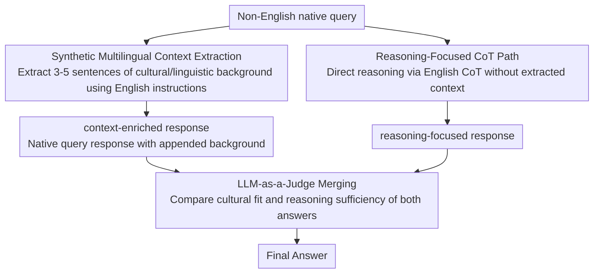

# EMCEE: Improving Multilingual Capability of LLMs via Bridging Knowledge and Reasoning with Extracted Synthetic Multilingual Context

**Conference**: ACL 2026  
**arXiv**: [2503.05846](https://arxiv.org/abs/2503.05846)  
**Code**: https://github.com/hamin2065/EMCEE  
**Area**: Multilingual LLM / Prompting  
**Keywords**: multilingual prompting, synthetic context, LLM-as-a-Judge, low-resource languages, cultural knowledge

## TL;DR
EMCEE enables LLMs to first extract synthetic multilingual context related to non-English queries from their internal parameters, then merges context-augmented responses with CoT reasoning responses via an LLM-as-a-Judge, significantly improving performance on low-resource languages across four multilingual tasks.

## Background & Motivation
**Background**: While LLMs exhibit strong performance on English tasks, pre-training corpora are heavily English-centric, often leading to degradation when facing non-English queries. Common remedies include translating queries into English, using English instructions for CoT, or incorporating external retrieval to supplement background knowledge.

**Limitations of Prior Work**: Translation and English CoT are effective for reasoning-heavy problems like mathematics and natural sciences but tend to lose local context for knowledge-intensive issues in linguistics, social sciences, and cultural common sense. External RAG depends on specific retrievers and external corpora, where retrieved content might not align with the cultural nuances of the query.

**Key Challenge**: Multilingual queries often encompass two types of requirements: abstract reasoning and language/cultural background. A single pathway struggles to cover both simultaneously; furthermore, pre-determining which path to take may result in routing errors due to insufficient information in the query itself.

**Goal**: To construct a prompting framework that generates both "context-enriched responses" and "reasoning-enhanced responses" without relying on external retrieval or additional training, then dynamically selects the most appropriate output.

**Key Insight**: The authors observe that LLM parameters may already store language and cultural knowledge that is not explicitly evoked during direct answering. Rather than translating all non-English questions into English, it is more effective to require the model to "extract" relevant background knowledge in text form first.

**Core Idea**: First Extract synthetic multilingual context, then Merge with reasoning; the name EMCEE is derived from Extracting synthetic Multilingual Context and mErging.

## Method
EMCEE is a pure prompting pipeline. It does not update model parameters or call external knowledge bases; instead, it executes the LLM multiple times during inference: once for extracting query-relevant context, once for standard CoT reasoning, and once for the judge/merge step. The significance lies not in "spending more tokens" but in ensuring that two candidate answers stem from different information sources: one emphasizing cultural and linguistic background, the other emphasizing general reasoning.

### Overall Architecture
The input is a non-English native query. The first path directs the LLM to extract 3 to 5 sentences of synthetic context related to the query using English instructions; this context can include cultural, historical, domain-specific, or local linguistic knowledge. The context is then appended back to the native query to generate a context-enriched response. The second path utilizes English CoT instructions to generate a reasoning-focused response without additional extracted context. The third step passes both responses to an LLM-as-a-Judge, which compares their fit regarding linguistic background, cultural context, and reasoning sufficiency to select or synthesize the final answer.

### Key Designs

**1. Synthetic Multilingual Context Extraction: Explicitly eliciting hidden cultural knowledge from model parameters**

Models are often hindered in low-resource language tasks not by short reasoning chains, but by the failure to evoke local vocabulary, cultural entities, or social norms that they actually possess—this information remains latent in the parameters during direct answering. EMCEE's first path addresses this by using English instructions to prompt the model to extract the background knowledge required to answer the native query, typically limited to 3-5 sentences with few-shot examples illustrating "useful background." Crucially, this context is derived from the model's own latent knowledge rather than external retrieval—effectively forcing the model to "write out" relevant common sense before answering, thereby significantly reducing the probability of missing key background details.

**2. Reasoning-Focused CoT Path: Maintaining a parallel pure reasoning path to avoid knowledge-extraction bias**

Multilingual tasks are inherently heterogeneous: some rely on cultural common sense, while others depend on pure logical inference. For reasoning-heavy problems such as mathematics or natural sciences, context extraction may be unhelpful or even distracting. Therefore, EMCEE runs a parallel English CoT path without synthetic context, leveraging the model's existing strengths in English-based reasoning. This ensures the system is not forcibly pulled toward knowledge extraction for problems that do not require cultural background; both paths play to their respective strengths to cover both "knowledge-based" and "reasoning-based" queries.

**3. LLM-as-a-Judge Merging: Comparing generated answers instead of early hard routing**

While it seems intuitive to pre-classify a query as knowledge-based or reasoning-based to decide the path, the model often misjudges the type before seeing the extracted knowledge—an observation confirmed by the EMCEE (Route) ablation study. EMCEE instead executes both paths fully and presents the context-enriched response and the reasoning-focused response to an LLM-as-a-Judge. The judge evaluates the specific content of both answers to determine which is more culturally appropriate and which has more robust reasoning. With two pieces of evidence in hand, the judge's selection is significantly more stable than guessing based on the query alone.

### A Complete Example: Javanese "pagupon"

Consider a Javanese multiple-choice question where the keyword is `pagupon`, and the correct option D relates to pigeon/dove. The Eng-CoT reasoning-focused path, lacking this local vocabulary knowledge, incorrectly associates `pagupon` with a chicken coop, leading to an wrong answer. Conversely, the Extraction path first identifies that "pagupon refers to a pigeon house in Javanese," and the context-enriched response provides the correct answer based on this. Finally, the LLM-as-a-Judge reviews both answers, identifies the superior linguistic and cultural grounding of the extraction version, and selects the correct option D. This workflow clearly demonstrates how the three steps cooperate: extraction supplements missing knowledge, CoT provides a reasoning baseline, and the judge makes an evidenced decision between them.

> ⚠️ A counterexample illustrates the boundaries: when a question concerns globally famous entities, extraction may hallucinate a need for local background—e.g., the English song "Wake Me Up Before You Go-Go" in a Japanese query was erroneously linked to the Japanese singer Koda Kumi, whereas the correct answer was Wham!.

### Loss & Training
EMCEE involves no training loss or parameter fine-tuning. In experiments, the API model temperature was set to 0.0, and the open-source Llama model used greedy decoding to minimize stochastic effects. The default model for main experiments was GPT-4o-mini, with evaluations on M3-Exam, MKQA, XNLI, and XCOPA; accuracy was used for M3-Exam, XNLI, and XCOPA, while span-level F1 was used for MKQA. The authors also categorized languages into high-resource and low-resource based on Native-Basic performance.

## Key Experimental Results

### Main Results
The main experiment compared various multilingual prompting baselines using GPT-4o-mini. The table below highlights the All/Low trends; in the full paper, EMCEE achieved the highest or tied-for-highest scores on All metrics across four datasets.

| Method | M3-Exam All | M3-Exam Low | MKQA All | MKQA Low | XNLI All | XNLI Low | XCOPA All | XCOPA Low |
|------|-----------:|-----------:|---------:|---------:|---------:|---------:|----------:|----------:|
| Native-Basic | 65.2 | 57.7 | 44.1 | 38.5 | 66.2 | 58.4 | 79.3 | 61.4 |
| Eng-CoT | 74.6 | 67.3 | 49.4 | 49.3 | 73.2 | 72.7 | 90.5 | 83.8 |
| XLT | 70.4 | 63.8 | 51.1 | 51.5 | 72.6 | 71.0 | 91.1 | 85.4 |
| RAG (Eng) | 72.1 | 63.9 | 44.7 | 44.5 | 70.4 | 69.7 | 87.9 | 80.6 |
| EMCEE (Route) | 76.2 | 69.2 | 50.8 | 49.8 | 73.1 | 72.3 | 90.5 | 83.8 |
| **Ours** (EMCEE) | **77.4** | **71.5** | **52.3** | **52.4** | **74.3** | **73.9** | **92.0** | **86.2** |

The paper notes an average relative gain of 16.4% for EMCEE over Native-Basic, reaching 31.7% in low-resource languages. Specific relative gains for low-resource languages were 23.7% for M3-Exam, 36.1% for MKQA, 27.7% for XNLI, and 40.4% for XCOPA.

### Ablation Study
Ablations on M3-Exam decoupled CoT, ExT (Extraction), and MeR (Merging). while ExT alone approached Eng-CoT levels, the full EMCEE provided the largest gains in low-resource settings.

| Configuration | CoT | ExT | MeR | All / High / Low |
|------|-----|-----|-----|------------------|
| Native-Basic | ✗ | ✗ | ✗ | 65.2 / 72.7 / 57.7 |
| Eng-CoT | ✓ | ✗ | ✗ | 74.6 / 81.8 / 67.3 |
| Extraction only | ✗ | ✓ | ✗ | 74.7 / 82.0 / 67.5 |
| CoT + MeR variant | ✓ | ✗ | ✓ | 75.2 / 83.4 / 67.1 |
| **Ours** (EMCEE) | ✓ | ✓ | ✓ | **77.4 / 83.3 / 71.5** |

### Generalization and Cost Analysis

| Experiment | Control | EMCEE Result | Key Information |
|------|------|------------|----------|
| GPT-4o M3-Exam | Native-Basic 78.1 | 85.7 | Relative gain: 8.9% |
| Claude-Haiku M3-Exam | Native-Basic 67.4 | 75.6 | Relative gain: 10.8% |
| Llama-3.1-8B M3-Exam | Native-Basic 49.8 | 56.9 | XLT/CoT were weaker on this model |
| GlobalOpinionQA | Native-Basic 65.3 | 69.0 | Low-resource countries rose from 53.7 to 60.4 |
| Aya-8B | Native-Basic 46.0 | 49.8 | Average gains on multilingual-specific model |
| GPT-4o subset | Native-Basic 74.3 | 76.0 | High-resource rose from 83.8 to 87.5 |
| Qwen3-8B w/o Think | Native-Basic 37.8 | 67.3 | Extraction is more critical than think-mode |
| Cost | 3x Eng-CoT + Merge: 76.9, $0.149 | EMCEE: 78.8, $0.140 | Higher input tokens but lower output and total cost |

### Key Findings
- EMCEE's benefits are concentrated in low-resource languages and cultural knowledge tasks, rather than being a simple result of stacked reasoning rounds.
- RAG (Native/Eng) underperformed compared to EMCEE across multiple tasks, suggesting that external retrieval content is not necessarily more effective than query-aligned context extracted internally.
- EMCEE (Route) was weaker than the full EMCEE, supporting the idea that merging after seeing candidate answers is superior to choosing a path based on the query alone.
- Failure cases are illustrative: for global entities, extraction may misidentify a need for local cultural knowledge (e.g., misattributing a Wham! song to a Japanese artist in a Japanese query).

## Highlights & Insights
- The paper decouples multilingual prompting into "knowledge elicitation" and "reasoning selection" processes, rather than just refining prompts for translation or CoT language selection.
- The positioning of synthetic context is clever: it acts not as an external fact base, but as a mechanism to make the model explicitly state background knowledge it knows but might overlook during direct answering.
- The insight that merging is more stable than routing has high practical value. It is difficult to determine whether a complex query relies on knowledge or reasoning beforehand, but much easier to judge which explanation fits the context once candidate answers are provided.
- The cost analysis dispels the misconception that EMCEE is stronger simply due to more calls, as 3x Eng-CoT + Merge resulted in higher costs but lower accuracy.

## Limitations & Future Work
- Multiple LLM inferences incur computational cost and latency; while more cost-effective than 3x Eng-CoT, it remains more expensive than single-turn prompting.
- There is a risk of irrelevant contextualization in the extraction step. For queries involving global entities or general knowledge, forced local context extraction can mislead the model.
- The current method relies entirely on internal knowledge; if the model lacks knowledge of a specific language or culture, synthetic context may result in confident but incorrect hallucinations.
- While the authors suggest RAG could mitigate knowledge deficits, this would shift the "self-contained prompting" setting and require finer retrieval quality control.
- For open-ended subjective questions, the judge's cultural positioning and value preferences may impact results; while GlobalOpinionQA provides some validation, more granular evaluations for varied regions/groups are needed.

## Related Work & Insights
- **vs XLT**: XLT improves multilingual tasks via translation to English and English reasoning; EMCEE preserves the native query and extracts linguistic/cultural background instead of full English-centrism.
- **vs Trans-Google**: Machine translation improves comprehension but may lose local semantics; EMCEE generates background directly around the original query to minimize translation loss.
- **vs RAG**: RAG retrieves passages externally with quality dependent on the retriever; EMCEE extracts query-aligned context internally, making it more lightweight but constrained by the model's internal knowledge ceiling.
- **vs multi-agent debate / response merging**: EMCEE's merge step compares candidate answers from different information sources rather than simulating a debate; this design is transferable to specialized QA, medical QA, and cross-cultural recommendations.

## Rating
- Novelty: ⭐⭐⭐⭐☆ The combination of synthetic context extraction and LLM-as-a-Judge merging is clear, effective, and insightful without requiring complex model architecture changes.
- Experimental Thoroughness: ⭐⭐⭐⭐⭐ Covers four major benchmarks, low/high-resource splits, cross-model analysis, strong models, cost, failure cases, and extensive appendix analysis.
- Writing Quality: ⭐⭐⭐⭐☆ Visual examples are intuitive, tables are comprehensive, and the authors are transparent about method boundaries and failure modes.
- Value: ⭐⭐⭐⭐⭐ Highly practical for multilingual LLM applications, particularly in scenarios needing cultural context without external retrieval resources.

<!-- RELATED:START -->

## Related Papers

- [\[ACL 2026\] Why Do Multilingual Reasoning Gaps Emerge in Reasoning Language Models?](why_do_multilingual_reasoning_gaps_emerge_in_reasoning_language_models.md)
- [\[ACL 2026\] Language on Demand, Knowledge at Core: Composing LLMs with Encoder-Decoder Translation Models for Extensible Multilinguality](language_on_demand_knowledge_at_core_composing_llms_with_encoder-decoder_transla.md)
- [\[ACL 2026\] Prosody as Supervision: Bridging the Non-Verbal–Verbal for Multilingual Speech Emotion Recognition](prosody_as_supervision_bridging_the_non-verbal--verbal_for_multilingual_speech_e.md)
- [\[ACL 2025\] GrammaMT: Improving Machine Translation with Grammar-Informed In-Context Learning](../../ACL2025/multilingual_mt/grammamt_improving_machine_translation_with_grammar-informed_in-context_learning.md)
- [\[AAAI 2026\] Bridging the Multilingual Safety Divide: Efficient, Culturally-Aware Alignment for Global South Languages](../../AAAI2026/multilingual_mt/bridging_the_multilingual_safety_divide_efficient_culturally-aware_alignment_for.md)

<!-- RELATED:END -->
