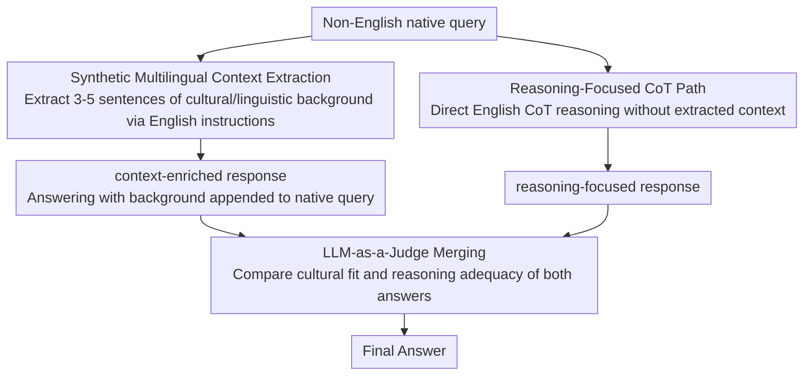

# EMCEE: Improving Multilingual Capability of LLMs via Bridging Knowledge and Reasoning with Extracted Synthetic Multilingual Context

**Conference**: ACL2026  
**arXiv**: [2503.05846](https://arxiv.org/abs/2503.05846)  
**Code**: https://github.com/hamin2065/EMCEE  
**Area**: Multilingual LLM / Prompting  
**Keywords**: multilingual prompting, synthetic context, LLM-as-a-Judge, low-resource languages, cultural knowledge

## TL;DR
EMCEE enables LLMs to first extract synthetic multilingual context related to non-English queries from their own parameters, then merges the context-enriched responses with CoT reasoning responses using an LLM-as-a-Judge, significantly improving performance on low-resource languages across four multilingual tasks.

## Background & Motivation
**Background**: LLMs perform strongly on English tasks, but pre-training corpora are highly English-centric, often leading to degradation when facing non-English queries. Common remedies include translating queries into English, using English instructions for Chain-of-Thought (CoT), or integrating external retrieval to supplement background knowledge.

**Limitations of Prior Work**: Translation and English CoT are effective for reasoning-heavy problems like mathematics and natural sciences but tend to lose local context in knowledge-intensive areas such as linguistics, social sciences, and cultural common sense. External RAG depends on retrievers and external corpora, where retrieved content may not align with the cultural nuances of the query.

**Key Challenge**: Multilingual queries simultaneously contain two types of needs: some require abstract reasoning, while others require linguistic, cultural, or national background. A single path struggle to cover both simultaneously; pre-determined routing may fail due to insufficient information in the query itself.

**Goal**: To construct a prompting framework that does not rely on external retrieval or additional training, allowing the LLM to generate both "context-enriched answers" and "reasoning-enhanced answers" before dynamically selecting the most appropriate output.

**Key Insight**: The authors observe that LLM parameters may already store linguistic and cultural knowledge that is not explicitly evoked during direct answering. Instead of translating all non-English questions into English, it is better to require the model to "extract" relevant background knowledge in text form first.

**Core Idea**: Extract synthetic multilingual context first, then Merge with reasoning; the name EMCEE is derived from **E**xtracting synthetic **M**ultilingual **C**ontext and **E**rging.

## Method
EMCEE is a pure prompting pipeline. It does not update model parameters or call external knowledge bases. Instead, it runs the LLM multiple times during inference: once to extract query-relevant context, once for standard CoT reasoning, and once for judging/merging. The key is not the "extra token cost" itself, but ensuring the two candidate answers originate from different information sources: one emphasizing cultural and linguistic background, and the other emphasizing general reasoning.

### Overall Architecture
The input is a non-English native query. The first path directs the LLM to extract 3 to 5 sentences of synthetic context relevant to the query using English instructions; this context can include cultural, historical, domain-specific, or local linguistic knowledge. The context is then appended to the native query to generate a context-enriched response. The second path uses English CoT instructions to generate a reasoning-focused response without additional context. The third step passes both responses to an LLM-as-a-Judge to compare their suitability regarding linguistic background, cultural context, and reasoning adequacy, selecting or synthesizing them into the final answer.

### Key Designs

**1. Synthetic Multilingual Context Extraction: Explicitly articulating cultural knowledge hidden in model parameters**

Low-resource language problems often fail not because the reasoning chain is too short, but because the model fails to evoke local vocabulary, cultural entities, or social norms it actually knows—this information remains in the parameters rather than the context window during direct answering. EMCEE’s first path specifically addresses this: it uses English instructions on a native query to require the model to extract background knowledge needed to answer the question, typically limited to 3-5 sentences, using few-shot examples to demonstrate "useful background." Crucially, this context does not come from external retrieval but from the model's own latent knowledge. This forces the model to recall relevant common sense before answering, significantly reducing the probability of missing key background.

**2. Reasoning-Focused CoT Path: Parallel preservation of a pure reasoning path to avoid knowledge-extraction bias**

Multilingual tasks are inherently heterogeneous: some depend on cultural common sense, others on pure logical inference. If only context extraction is performed, it may not help with reasoning problems like math or science, and irrelevant extracted background might interfere with judgment. Thus, EMCEE runs a parallel English CoT path without synthetic context, allowing the model to solve problems using its inherently strong English reasoning capabilities. For questions requiring no cultural background, the system is not forced toward knowledge extraction; both paths play to their strengths.

**3. LLM-as-a-Judge Merging: Comparing two generated answers instead of hard routing in advance**

An intuitive approach would be to judge the query type (knowledge vs. reasoning) first and then decide the path, but the model may misjudge since it has not seen the extracted knowledge yet—an observation confirmed by the EMCEE (Route) ablation. EMCEE instead finishes both paths first and presents the context-enriched response and reasoning-focused response to the LLM-as-a-Judge. The judge evaluates which answer fits the linguistic-cultural context better and which is more reasoned. With two pieces of evidence rather than just the query, the selection is more stable.

### A Complete Example: Javanese "pagupon"

Consider a Javanese multiple-choice question where the keyword is `pagupon`, and the correct option D relates to pigeons/doves. The English-CoT path lacks knowledge of this local vocabulary and incorrectly associates `pagupon` with a chicken coop, leading to a wrong option. Meanwhile, the Extraction path extracts the background that "pagupon in Javanese refers to a dovehouse/pigeon loft," and the context-enriched response provides the correct answer based on this. Finally, the LLM-as-a-Judge sees both, recognizes the solid cultural-linguistic grounding of the extraction version, and selects option D.

> ⚠️ Counter-examples also define boundaries: When a question concerns globally famous entities, extraction may mistakenly assume a need for local background—e.g., the Japanese query for "Wake Me Up Before You Go-Go" was incorrectly directed to Japanese singer Koda Kumi, while the correct answer was Wham!.

### Loss & Training
EMCEE involves no training loss or parameter fine-tuning. In experiments, the API model temperature was set to 0.0, and the open-source Llama used greedy decoding to reduce randomness. The default primary model was GPT-4o-mini, evaluated on M3-Exam, MKQA, XNLI, and XCOPA; accuracy was used for M3-Exam/XNLI/XCOPA, and span-level F1 for MKQA. Languages were categorized into high-resource and low-resource based on Native-Basic performance.

## Key Experimental Results

### Main Results
The main experiment compared various multilingual prompting baselines on GPT-4o-mini. The table below highlights the All/Low results; in the full paper, EMCEE achieved the highest or tied-highest scores across all four datasets.

| Method | M3-Exam All | M3-Exam Low | MKQA All | MKQA Low | XNLI All | XNLI Low | XCOPA All | XCOPA Low |
|------|------------:|------------:|---------:|---------:|---------:|---------:|----------:|----------:|
| Native-Basic | 65.2 | 57.7 | 44.1 | 38.5 | 66.2 | 58.4 | 79.3 | 61.4 |
| Eng-CoT | 74.6 | 67.3 | 49.4 | 49.3 | 73.2 | 72.7 | 90.5 | 83.8 |
| XLT | 70.4 | 63.8 | 51.1 | 51.5 | 72.6 | 71.0 | 91.1 | 85.4 |
| RAG (Eng) | 72.1 | 63.9 | 44.7 | 44.5 | 70.4 | 69.7 | 87.9 | 80.6 |
| EMCEE (Route) | 76.2 | 69.2 | 50.8 | 49.8 | 73.1 | 72.3 | 90.5 | 83.8 |
| EMCEE | 77.4 | 71.5 | 52.3 | 52.4 | 74.3 | 73.9 | 92.0 | 86.2 |

The paper reports an average relative improvement of 16.4% over Native-Basic, reaching 31.7% for low-resource languages. Specific relative improvements for low-resource languages were M3-Exam 23.7%, MKQA 36.1%, XNLI 27.7%, and XCOPA 40.4%.

### Ablation Study
Ablations on M3-Exam decoupled the CoT, ExT (Extraction), and MeR (Merging) components. ExT alone performed close to Eng-CoT, but the full EMCEE showed the greatest gain on low-resource languages.

| Configuration | CoT | ExT | MeR | All / High / Low |
|------|-----|-----|-----|------------------|
| Native-Basic | ✗ | ✗ | ✗ | 65.2 / 72.7 / 57.7 |
| Eng-CoT | ✓ | ✗ | ✗ | 74.6 / 81.8 / 67.3 |
| Extraction only | ✗ | ✓ | ✗ | 74.7 / 82.0 / 67.5 |
| CoT + MeR variant | ✓ | ✗ | ✓ | 75.2 / 83.4 / 67.1 |
| EMCEE | ✓ | ✓ | ✓ | 77.4 / 83.3 / 71.5 |

### Generalization & Cost Analysis
| Experiment | Comparison | EMCEE Result | Key Information |
|------|------|------------|----------|
| GPT-4o M3-Exam | Native-Basic 78.1 | 85.7 | 8.9% relative gain |
| Claude-Haiku M3-Exam | Native-Basic 67.4 | 75.6 | 10.8% relative gain |
| Llama-3.1-8B M3-Exam | Native-Basic 49.8 | 56.9 | XLT/CoT were weaker on this model |
| GlobalOpinionQA | Native-Basic 65.3 | 69.0 | Low-resource countries 53.7 to 60.4 |
| Aya-8B | Native-Basic 46.0 | 49.8 | Average gain even on specialized multilingual models |
| Qwen3-8B w/o Think | Native-Basic 37.8 | 67.3 | Extraction proved more critical than think-mode |
| Cost | 3x Eng-CoT + Merge: 76.9, $0.149 | EMCEE: 78.8, $0.140 | Higher input tokens but lower output tokens and total cost |

### Key Findings
- EMCEE gains are concentrated in low-resource languages and cultural-knowledge tasks, rather than simply stacking more reasoning rounds.
- RAG (Native/Eng) underperformed EMCEE on multiple tasks, suggesting external retrieval may be less effective than query-aligned context extracted from model parameters.
- EMCEE (Route) performed worse than the full version, supporting the view that comparing two candidate answers is superior to routing based on the query alone.
- Failure cases indicate that for global entities, extraction may misidentify the need for local background (e.g., the Wham! vs. Koda Kumi example).

## Highlights & Insights
- The paper decomposes multilingual prompting into "knowledge arousal" and "reasoning selection" instead of iterating on translation or CoT language choices.
- The role of synthetic context is clever: it acts as a mechanism for the model to explicitly state internal background that might otherwise be overlooked.
- The superiority of merging over routing is of practical value. It is difficult to determine if a complex query relies on knowledge or reasoning beforehand, but much easier to spot contextual inconsistencies when comparing two answers.
- The cost analysis addresses the misconception that EMCEE is stronger simply via "more calls," as 3x Eng-CoT + Merge incurred higher costs with lower accuracy.

## Limitations & Future Work
- Multiple LLM inferences increase computational cost and latency. While more efficient than 3x Eng-CoT, it remains more expensive than single-round prompting.
- There is a risk of irrelevant contextualization. For queries involving global entities or general knowledge, forced local background extraction can mislead the model.
- The method relies entirely on internal model knowledge; if the model lacks knowledge of a specific language or culture, the synthetic context may result in confident hallucinations.
- The authors suggest combining with RAG to mitigate knowledge gaps, but this would alter the "self-contained prompting" setting and require more granular retrieval control.
- For open-ended subjective questions, the judge's cultural positioning and value preferences may influence results; while GlobalOpinionQA offered some validation, further granular evaluation is needed.

## Related Work & Insights
- **vs XLT**: XLT improves tasks by translating to English and reasoning in English; EMCEE retains the native query and extracts linguistic/cultural background.
- **vs Trans-Google**: Machine translation improves understanding but may lose local semantics; EMCEE generates background around the original query to minimize translation loss.
- **vs RAG**: RAG retrieves external passages with quality dependent on the retriever; EMCEE extracts internal context, which is more lightweight and query-aligned but capped by internal knowledge.
- **vs Multi-agent Debate / Response Merging**: EMCEE's merge involves comparing candidate answers from different information sources rather than debate; this design is transferable to specialized Q&A and cross-cultural recommendations.

## Rating
- Novelty: ⭐⭐⭐⭐☆ The combination of synthetic context extraction and LLM-as-a-Judge merging is clear and insightful without requiring complex model modification.
- Experimental Thoroughness: ⭐⭐⭐⭐⭐ Covers four major benchmarks, low/high-resource splits, cross-model analysis, cost-benefit analysis, and failure mode sections.
- Writing Quality: ⭐⭐⭐⭐☆ Intuitive examples, comprehensive tables, and honest discussion of boundaries and failure modes.
- Value: ⭐⭐⭐⭐⭐ Highly practical for multilingual LLM applications, especially in scenarios lacking external retrieval resources but requiring cultural sensitivity.

<!-- RELATED:START -->

## Related Papers

- [\[ACL 2026\] Why Do Multilingual Reasoning Gaps Emerge in Reasoning Language Models?](why_do_multilingual_reasoning_gaps_emerge_in_reasoning_language_models.md)
- [\[ACL 2026\] DFKI-MLT at SemEval-2026 TASK 7: Steering Multilingual Models Towards Cultural Knowledge](dfki-mlt_at_semeval-2026_task_7_steering_multilingual_models_towards_cultural_kn.md)
- [\[ACL 2025\] Blessing of Multilinguality: A Systematic Analysis of Multilingual In-Context Learning](../../ACL2025/multilingual_mt/blessing_of_multilinguality_a_systematic_analysis_of_multilingual_in-context_lea.md)
- [\[ACL 2026\] Prosody as Supervision: Bridging the Non-Verbal–Verbal for Multilingual Speech Emotion Recognition](prosody_as_supervision_bridging_the_non-verbal--verbal_for_multilingual_speech_e.md)
- [\[ACL 2026\] NiuTrans.LMT: Toward Inclusive and Scalable Multilingual Machine Translation with LLMs](niutranslmt_toward_inclusive_and_scalable_multilingual_machine_translation_with_.md)

<!-- RELATED:END -->
