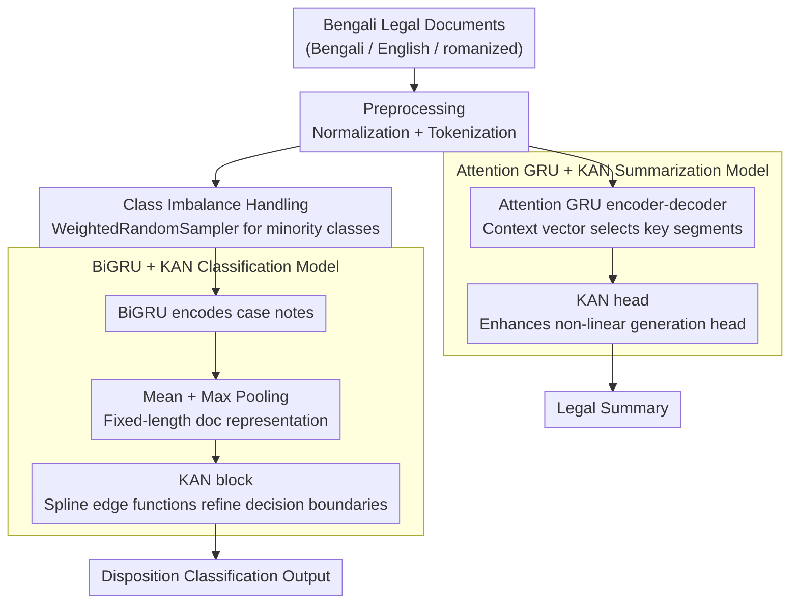

# Enhancing BiGRU with a KAN Block for Legal Document Classification and Summarization

**Conference**: ACL2026  
**arXiv**: [2606.00116](https://arxiv.org/abs/2606.00116)  
**Code**: None  
**Area**: Legal NLP / Multilingual Text Classification and Summarization  
**Keywords**: BiGRU, Kolmogorov-Arnold Network, legal NLP, document classification, legal summarization

## TL;DR
This paper integrates a KAN block into a BiGRU classifier and an attention-based GRU summarization model for low-resource multilingual Bengali legal documents. The approach achieves a classification accuracy of 67.96% and ROUGE-1/2/L scores of 0.38/0.23/0.31, improving the BiGRU accuracy from 57.34% to 67.96% in ablation studies.

## Background & Motivation
**Background**: Common legal NLP tasks include judgment/disposition classification, case summarization, and legal document retrieval. Traditional methods rely on handcrafted feature models like SVM and Logistic Regression, while deep learning approaches often utilize BiGRU, BiLSTM, encoder-decoder attention, or pointer-generators.

**Limitations of Prior Work**: Legal documents are typically long, complex in structure, and rich in specialized terminology, often containing procedural facts and subtle legal nuances. Bengali legal data additionally involves a mix of Bengali, English, and transliterated Bengali, creating a combined challenge of low resources, multilingualism, and class imbalance.

**Key Challenge**: While Pre-trained Language Models (PLMs) are theoretically powerful, they may be insufficiently tuned in settings with low-resource legal corpora and limited computational power. Traditional recurrent models are cost-effective but may lack representational capacity. The core problem is whether recurrent models can be enhanced with non-linear representations without introducing heavy backbones.

**Goal**: The authors aim to verify whether the KAN block can serve as a lightweight enhancement module to improve the performance of BiGRU/GRU in legal document classification and summarization, rather than proposing an entirely new large-scale legal model.

**Key Insight**: Kolmogorov-Arnold Networks (KAN) replace fixed activation functions in traditional MLPs with learnable spline-like edge functions, which can theoretically model more complex non-linear relationships. The authors append it after the representations of a recurrent backbone, allowing the KAN to refine document representations or the generation head.

**Core Idea**: In low-resource legal scenarios, using "BiGRU/AttnGRU for sequence modeling + KAN for non-linear representation enhancement" serves as a more controllable compromise compared to heavy PLMs.

## Method
The paper covers two tasks: legal document disposition classification and legal document summarization. Both share a basic strategy: using a recurrent architecture to encode long texts and then employing KAN as an enhancement head or transformation block. The classification task focuses on fixed-length document representations, while the summarization task focuses on encoder-decoder attention outputs.

### Overall Architecture
Data is sourced from Manupatra, containing 2,937 samples of Bengali legal documents with mixed Bengali, English, and romanized Bengali. The authors split the data into 2,349 training samples and 588 held-out evaluation samples. Preprocessing includes handling missing values and placeholder standardization, text normalization, removal of duplicates/corrupt items, length analysis, and tokenization. The classification task uses BiGRU to encode case notes, obtains document representations via mean and max pooling, and feeds them to a KAN block for disposition prediction. The summarization task uses an attention-based GRU encoder-decoder and adds a KAN to the output head to enhance token prediction. Both task branches share the same preprocessed text and attach a KAN enhancement module atop their respective recurrent backbones.

### Key Designs

**1. BiGRU + KAN Classification Model: Sequence encoding via BiGRU, non-linear decision boundaries via KAN**

Legal documents are long and terminology-heavy, featuring a mix of three scripts. The representational power of a single recurrent backbone may be insufficient. This model passes the token sequence $X=(x_1,x_2,\ldots,x_T)$ through an embedding layer and BiGRU. At each time step, forward and backward hidden states are concatenated as $h_t=[\overrightarrow{h_t};\overleftarrow{h_t}]$. Document representations $h_{doc}=[h_{mean};h_{max}]$ are formed by simultaneous mean and max pooling, which are then fed into the KAN block. Mean pooling preserves overall semantics while max pooling captures strong trigger words or key legal phrases. The KAN head replaces fixed activations with learnable spline-like edge functions, providing more complex non-linear separation capabilities to the fixed representation, effectively refining the decision boundary without changing the heavy backbone.

**2. Attention GRU + KAN Summarization Model: Attention for segment selection, KAN for generation head reinforcement**

Legal summarization must focus on core legal issues and key clauses within long texts, which can be difficult for a standard recurrent decoder. The summarization model uses an attention-based GRU encoder-decoder: the encoder represents the input as $H=(h_1,h_2,\dots,h_T)$, and the decoder calculates a context vector $c_t$ via attention at each time step, combining it with its own hidden state to predict the next token. Similar to the classification model, a KAN head is attached to this generation output. While attention selects relevant segments from the input, KAN enhances the non-linear expression of the output representation, ensuring the generated summary better retains critical facts and clauses.

**3. Class Imbalance Handling: Using WeightedRandomSampler to boost minority classes**

Legal disposition labels are highly imbalanced; standard random sampling would bias the model toward majority classes. Consequently, classification training utilizes a `WeightedRandomSampler`, weighting samples inversely to their class frequency to ensure minority classes appear more frequently in mini-batches. This is a low-cost mitigation strategy naturally compatible with recurrent/KAN architectures. The summarization task maintains standard batch formation since goals depend on complete source-target pairs, making per-sample sampling more appropriate than class-based resampling.

### Loss & Training
The classification task uses standard cross entropy, while the summarization task uses sequence-to-sequence target token loss. Training hyperparameters include 200 epochs, a learning rate of $2\times10^{-5}$, a batch size of 8, the Adam optimizer, and a dropout rate of 0.2. Classification metrics include accuracy, macro-F1, and weighted-F1; summarization metrics use ROUGE-1, ROUGE-2, and ROUGE-L F1. The paper also reports stability across three classification runs: 0.6765, 0.6699, and 0.6771, all close to the primary result.

## Key Experimental Results

### Main Results
In the classification results, BiGRU + KAN achieved the highest accuracy among all compared methods. The paper explicitly provides a macro-F1 of 0.53 and a weighted-F1 of 0.65 for this model.

| Category | Model | Accuracy |
|------|------|---------:|
| Classical ML | Logistic Regression | 0.59 |
| Classical ML | Random Forest | 0.62 |
| Classical ML | SVM | 0.62 |
| Classical ML | Naive Bayes | 0.48 |
| Classical ML | KNN | 0.58 |
| PLMs | BERT | 0.3813 |
| PLMs | Legal-BERT | 0.3885 |
| PLMs | RoBERTa | 0.3741 |
| PLMs | T5 | 0.4101 |
| PLMs | Longformer | 0.4173 |
| Recurrent | BiLSTM w/o KAN | 0.5188 |
| Recurrent | BiGRU w/o KAN | 0.5734 |
| Recurrent | BiGRU + KAN | 0.6796 |

In the summarization results, AttnGRU + KAN outperformed both BiLSTM and Pointer-Generator.

| Model | ROUGE-1 F1 | ROUGE-2 F1 | ROUGE-L F1 |
|------|-----------:|-----------:|-----------:|
| AttnGRU + KAN | 0.38 | 0.23 | 0.31 |
| BiLSTM | 0.30 | 0.18 | 0.25 |
| Pointer-Generator | 0.35 | 0.20 | 0.28 |

### Ablation Study

| Configuration | Accuracy | Description |
|------|---------:|------|
| BiLSTM without KAN | 0.5188 | Recurrent baseline |
| BiGRU without KAN | 0.5734 | Stronger recurrent baseline |
| BiGRU + KAN | 0.6796 | Gain of 10.62 percentage points with KAN |

The accuracies for the three main classification experiments were 0.6765, 0.6699, and 0.6771, with the paper reporting a mean of 0.6796. While there is a slight numerical discrepancy between these values and the reported mean, the note follows the original text.

### Key Findings
- The improvement provided by KAN to BiGRU is significant: classification accuracy increased from 0.5734 to 0.6796, a gain of 10.62 percentage points.
- In traditional ML, Random Forest and SVM reached 0.62, outperforming the PLM baselines in this experiment; this suggests that PLMs may not necessarily be superior on low-resource legal data if tuning is insufficient.
- For summarization, AttnGRU + KAN achieved ROUGE-1/2/L scores of 0.38/0.23/0.31, indicating that KAN enhancement heads also benefit generative tasks.
- Error analysis shows that the model still confuses similar disposition classes (e.g., Appeal Dismissed vs. Petition Dismissed) and sometimes misses procedural legal facts in summaries.

## Highlights & Insights
- The goal of the paper is engineering-oriented: rather than pursuing larger models, it validates a lightweight structural enhancement on actual legal data characterized by low resources, mixed languages, and class imbalance.
- Using KAN as a head rather than a backbone replacement is a rational design choice. it allows the recurrent model to retain its sequence modeling advantages while delegating non-linear decision boundaries to KAN.
- Counter-intuitive yet insightful: under constrained resources, BERT, Legal-BERT, and Longformer performed worse than classical ML and BiGRU + KAN, reminding researchers that tuning budgets must be carefully considered in low-resource legal NLP experiments.
- Summarization examples show the model captures core legal actions and clauses but also reveal a tendency to produce short summaries that may omit procedural information.

## Limitations & Future Work
- Class imbalance remains a severe issue; `WeightedRandomSampler` only partially mitigates it, and minority classes remain difficult to predict.
- The multilingual nature of the data (Bengali, English, and romanized Bengali) increases the difficulty of tokenization, representation learning, and terminology alignment.
- The summarization model sometimes skips important procedural information, which carries high risk in legal scenarios as procedural facts can influence conclusions.
- The comparison with PLMs was conducted under limited computational power and varying tuning budgets; thus, it cannot be definitively concluded that recurrent+KAN is always superior to fully tuned Legal-BERT or Longformer.
- The dataset size is limited to 2,937 entries from specific Bengali legal sources; generalization across countries, legal systems, and larger corpora remains unverified.
- Future directions include stronger backbones, better class imbalance methods, higher-fidelity summary generation, and transparency/explainability analysis of the KAN block.

## Related Work & Insights
- **vs Classical ML**: SVM and Random Forest perform well on this data but rely on shallow text features; BiGRU + KAN better models context and non-linear boundaries.
- **vs Pre-trained Language Models**: BERT, Legal-BERT, RoBERTa, T5, and Longformer performed poorly in the current constrained setting, indicating that model scale does not equal actual gain in low-resource legal tasks.
- **vs BiGRU/BiLSTM**: Pure recurrent backbones suffer from insufficient representational capacity; the KAN head provides stronger non-linear transformation, directly supported by ablation gains.
- **vs Pointer-Generator Summarization**: While pointer-generators are suitable for copying needs in legal summaries, AttnGRU + KAN achieved higher ROUGE scores; future work could combine KAN with the copy mechanism.
- **Insight**: For low-resource specialized NLP, lightweight structural modifications combined with explicit data imbalance handling may be more stable and reproducible than simply applying large-scale models.

## Rating
- Novelty: ⭐⭐⭐⭐☆☆ The idea of KAN as a recurrent head has some novelty, though the overall method is an engineering combination.
- Experimental Thoroughness: ⭐⭐⭐⭐☆☆ Includes classification, summarization, ablation, and stability results, but the data scale is small, PLM comparisons are somewhat limited, and statistical significance is lacking.
- Writing Quality: ⭐⭐⭐⭐☆☆ The main argument is clear and data is complete; however, some citations and mean calculations are slightly imprecise.
- Value: ⭐⭐⭐⭐⭐☆ Offers practical reference value for low-resource multilingual legal NLP, showing that lightweight models are worth optimizing under resource-constrained conditions.

<!-- RELATED:START -->

## Related Papers

- [\[ACL 2026\] Mitigating Extrinsic Gender Bias for Bangla Classification Tasks](mitigating_extrinsic_gender_bias_for_bangla_classification_tasks.md)
- [\[ACL 2026\] SteerEval: Inference-time Interventions Strengthen Multilingual Generalization in Neural Summarization Metrics](steereval_inference-time_interventions_strengthen_multilingual_generalization_in.md)
- [\[ACL 2026\] LLM-XTM: Enhancing Cross-Lingual Topic Models with Large Language Models](llm-xtm_enhancing_cross-lingual_topic_models_with_large_language_models.md)
- [\[ICCV 2025\] SignRep: Enhancing Self-Supervised Sign Representations](../../ICCV2025/multilingual_mt/signrep_enhancing_self-supervised_sign_representations.md)
- [\[ACL 2025\] Beyond N-Grams: Rethinking Evaluation Metrics and Strategies for Multilingual Abstractive Summarization](../../ACL2025/multilingual_mt/beyond_n-grams_rethinking_evaluation_metrics_and_strategies_for_multilingual_abs.md)

<!-- RELATED:END -->
