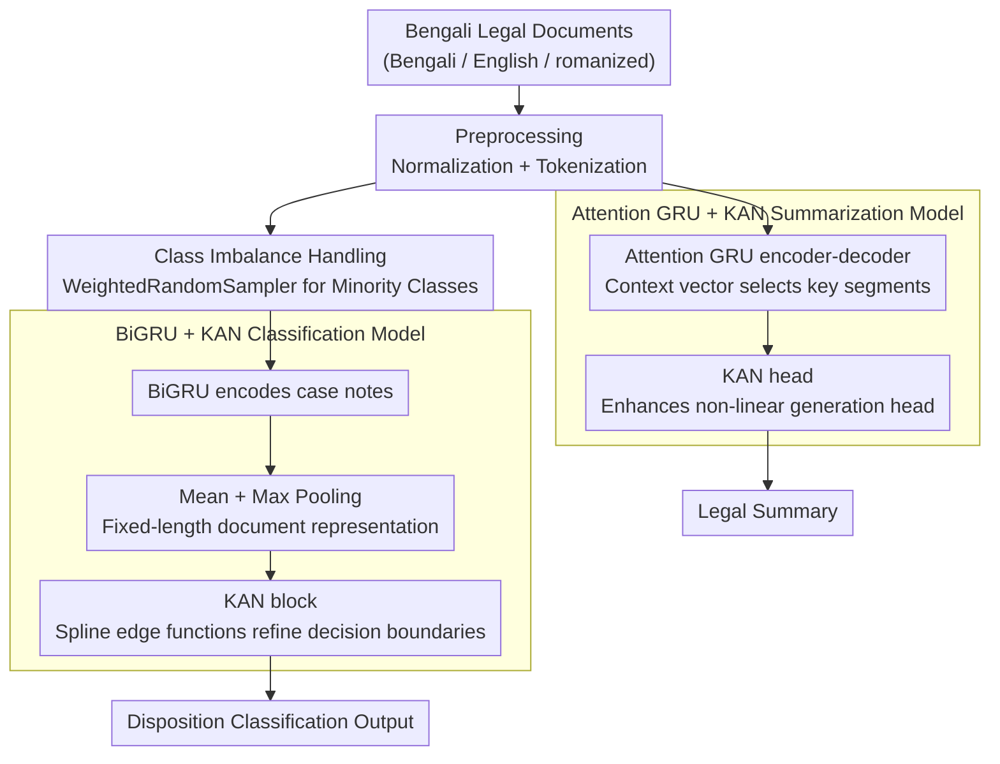

# Enhancing BiGRU with a KAN Block for Legal Document Classification and Summarization

**Conference**: ACL2026  
**arXiv**: [2606.00116](https://arxiv.org/abs/2606.00116)  
**Code**: None  
**Area**: Legal NLP / Multilingual Text Classification and Summarization  
**Keywords**: BiGRU, Kolmogorov-Arnold Network, legal NLP, document classification, legal summarization

## TL;DR
This paper integrates a KAN block into a BiGRU classifier and an attention-based GRU summarization model for low-resource multilingual Bengali legal documents. It achieves a classification accuracy of 67.96% and ROUGE-1/2/L scores of 0.38/0.23/0.31, improving BiGRU accuracy from 57.34% to 67.96% in ablation studies.

## Background & Motivation
**Background**: Common tasks in legal NLP include judgment/disposition classification, case summarization, and legal document retrieval. Traditional methods rely on manual feature models like SVM and Logistic Regression, while deep learning approaches often utilize BiGRU, BiLSTM, encoder-decoder attention, or pointer-generators.

**Limitations of Prior Work**: Legal documents are long, structurally complex, contain specialized terminology, and often involve procedural facts and subtle legal nuances. Bengali legal data presents an additional challenge as a low-resource, multilingual mix of Bengali, English, and transliterated Bengali with significant class imbalance.

**Key Challenge**: While Pre-trained Language Models (PLMs) are theoretically powerful, they may underperform when fine-tuned on low-resource legal corpora under limited computing constraints. Traditional recurrent models are cost-effective but may lack sufficient representational capacity. The core problem is whether recurrent models can be enhanced with non-linear representations without introducing heavy backbones.

**Goal**: The authors aim to verify whether a KAN block can serve as a lightweight enhancement module to improve BiGRU/GRU performance in legal document classification and summarization, rather than proposing a new large-scale legal model.

**Key Insight**: KAN replaces fixed activation functions in traditional MLPs with learnable spline-like edge functions, theoretically allowing for the modeling of more complex non-linear relationships. By appending it to the representations of a recurrent backbone, KAN can refine document representations or the generation head.

**Core Idea**: In low-resource legal scenarios, using a "BiGRU/AttnGRU for sequence modeling + KAN for non-linear representation enhancement" serves as a more controllable compromise than heavy PLMs.

## Method
The paper covers two tasks: legal document disposition classification and legal document summarization. Both share a fundamental approach: encoding long text with a recurrent architecture first, then using KAN as an enhancement head or transformation block. The classification task focuses on fixed-length document representations, while the summarization task focuses on encoder-decoder attention outputs.

### Overall Architecture
The data sourced from Manupatra contains 2,937 Bengali legal document samples with mixed Bengali, English, and romanized Bengali. The dataset is split into 2,349 training and 588 evaluation samples. Preprocessing includes handling missing values, placeholder standardization, text normalization, duplicate removal, length analysis, and tokenization. For classification, a BiGRU encodes case notes, followed by mean and max pooling to obtain document representations, which are passed to a KAN block for disposition prediction. For summarization, an attention-based GRU encoder-decoder is used, with a KAN block added to the output head to enhance token prediction.

### Key Designs

**1. BiGRU + KAN Classification Model: Sequence encoding by BiGRU, non-linear decision boundaries by KAN**
Legal documents are long and technical, often mixing languages. The representation power of a single recurrent backbone may be insufficient. In this model, the token sequence $X=(x_1,x_2,\ldots,x_T)$ passes through embedding and BiGRU layers. At each timestep, forward and backward hidden states are concatenated $h_t=[\overrightarrow{h_t};\overleftarrow{h_t}]$. Document representations $h_{doc}=[h_{mean};h_{max}]$ are formed via simultaneous mean and max pooling before being sent to the KAN block. Mean pooling preserves global semantics while max pooling captures strong trigger words. The KAN head, utilizing learnable spline-like edge functions, refines the decision boundary without requiring a heavy backbone.

**2. Attention GRU + KAN Summarization Model: Attention for selection, KAN for head enhancement**
Legal summarization must focus on core legal issues from long texts. The model uses an attention-based GRU encoder-decoder. The encoder maps input to $H=(h_1,h_2,\dots,h_T)$, and the decoder calculates a context vector $c_t$ via attention at each step. Similar to the classification task, a KAN head is attached to the generation head to enhance the non-linear expression of output representations, ensuring summaries better retain important facts and clauses.

**3. Class Imbalance Handling: Boosting minority classes via WeightedRandomSampler**
Legal disposition labels are highly imbalanced. The classification training uses a WeightedRandomSampler, weighting by the inverse of class frequency to ensure minority classes appear more frequently in mini-batches. This is a low-cost mitigation strategy compatible with recurrent/KAN architectures. Summarization tasks use standard batch formation as they rely on complete source-target pairs.

### Loss & Training
The classification task uses standard cross entropy, while the summarization task uses sequence-to-sequence target token loss. Hyperparameters include 200 epochs, a learning rate of $2\times10^{-5}$, batch size 8, Adam optimizer, and dropout of 0.2. Metrics include accuracy, macro-F1, and weighted-F1 for classification, and ROUGE-1/2/L F1 for summarization. The paper reports classification stability across three runs: 0.6765, 0.6699, and 0.6771.

## Key Experimental Results

### Main Results
In classification, BiGRU + KAN achieved the highest accuracy among all compared models, with a macro-F1 of 0.53 and a weighted-F1 of 0.65.

| Category | Model | Accuracy |
|------|------|---------:|
| Classical ML | Logistic Regression | 0.59 |
| Classical ML | Random Forest | 0.62 |
| Classical ML | SVM | 0.62 |
| Classical ML | Naive Bayes | 0.48 |
| Classical ML | KNN | 0.58 |
| PLMs | BERT | 0.3813 |
| PLMs | Legal-BERT | 0.3885 |
| PLMs | RoBERTa | 0.3741 |
| PLMs | T5 | 0.4101 |
| PLMs | Longformer | 0.4173 |
| Recurrent | BiLSTM w/o KAN | 0.5188 |
| Recurrent | BiGRU w/o KAN | 0.5734 |
| Recurrent | BiGRU + KAN | 0.6796 |

In summarization, AttnGRU + KAN outperformed both BiLSTM and Pointer-Generator.

| Model | ROUGE-1 F1 | ROUGE-2 F1 | ROUGE-L F1 |
|------|-----------:|-----------:|-----------:|
| AttnGRU + KAN | 0.38 | 0.23 | 0.31 |
| BiLSTM | 0.30 | 0.18 | 0.25 |
| Pointer-Generator | 0.35 | 0.20 | 0.28 |

### Ablation Study

| Configuration | Accuracy | Description |
|------|---------:|------|
| BiLSTM without KAN | 0.5188 | Recurrent baseline |
| BiGRU without KAN | 0.5734 | Stronger recurrent baseline |
| BiGRU + KAN | 0.6796 | Gain of 10.62 percentage points with KAN |

The three main classification experiments yielded accuracies of 0.6765, 0.6699, and 0.6771, with the paper reporting a mean of 0.6796. While the arithmetic mean of these three values slightly differs, the note follows the values provided in the original text.

### Key Findings
- KAN significantly improves BiGRU performance: classification accuracy rose from 0.5734 to 0.6796, a gain of 10.62 points.
- Traditional ML models like Random Forest and SVM reached 0.62, outperforming the PLM baselines in this specific setting, suggesting PLMs may not excel on low-resource legal data without sufficient tuning.
- On the summarization side, AttnGRU + KAN reached ROUGE-1/2/L of 0.38/0.23/0.31, proving the effectiveness of KAN enhancement heads for generation.
- Error analysis shows continued confusion between similar disposition classes (e.g., Appeal Dismissed vs. Petition Dismissed) and occasional omissions of procedural legal facts in summaries.

## Highlights & Insights
- The goal is engineering-oriented: validating a lightweight structural enhancement on actual low-resource, mixed-language legal data rather than chasing model size.
- Positioning KAN as a head rather than a backbone replacement is strategic, allowing the recurrent model to handle sequences while KAN handles non-linear decision boundaries.
- The observation that PLMs underperformed traditional ML and BiGRU+KAN under restricted conditions serves as a reminder to carefully compare tuning budgets in small-data legal NLP.
- Summarization examples show the model identifies core legal actions but tends to generate short summaries that may omit procedural context.

## Limitations & Future Work
- Class imbalance remains severe; WeightedRandomSampler provides only partial relief for minority class prediction.
- Multilingual text (Bengali, English, and romanized) complicates tokenization, representation learning, and terminology alignment.
- Summarization models occasionally skip procedural information, posing risks in legal contexts where facts influence conclusions.
- PLM comparisons were conducted under specific resource and tuning constraints, so recurrent+KAN is not necessarily superior to a fully optimized Longformer or larger models.
- The dataset scale is limited (2,937 samples) and sourced from a specific Bengali corpus; generalization across other jurisdictions remains unverified.
- Future directions include stronger backbones, better imbalance handling, more faithful summarization, and transparency analysis of KAN blocks.

## Related Work & Insights
- **vs Classical ML**: SVM and Random Forest perform well but rely on shallow text features; BiGRU + KAN better models context and non-linear boundaries.
- **vs PLMs**: BERT, Legal-BERT, and others underperformed in this constrained setting, showing that model scale does not equal gains in low-resource legal tasks.
- **vs BiGRU/BiLSTM**: Pure recurrent backbones lack representational depth; the KAN head provides stronger non-linear transformations as supported by ablation results.
- **vs Pointer-Generator**: While Pointer-Generator is suited for legal copy tasks, AttnGRU + KAN achieved higher ROUGE scores; combining KAN with copy mechanisms is a future possibility.
- **Insight**: For low-resource specialized NLP, lightweight structural modifications combined with explicit data handling (like imbalance mitigation) can be more robust than simply applying large models.

## Rating
- Novelty: ⭐⭐⭐⭐☆☆ Using KAN as a recurrent head is somewhat novel, though the overall approach is an engineering combination.
- Experimental Thoroughness: ⭐⭐⭐⭐☆☆ Includes classification, summarization, ablation, and stability tests, but small data size and PLM comparison constraints limit statistical significance.
- Writing Quality: ⭐⭐⭐⭐☆☆ Clear narrative and complete figures, though some reporting of averages could be more precise.
- Value: ⭐⭐⭐⭐⭐☆ Highly practical for low-resource multilingual legal NLP, demonstrating that lightweight models are worth optimizing under resource constraints.

<!-- RELATED:START -->

## Related Papers

- [\[ACL 2026\] Mitigating Extrinsic Gender Bias for Bangla Classification Tasks](mitigating_extrinsic_gender_bias_for_bangla_classification_tasks.md)
- [\[ACL 2026\] SteerEval: Inference-time Interventions Strengthen Multilingual Generalization in Neural Summarization Metrics](steereval_inference-time_interventions_strengthen_multilingual_generalization_in.md)
- [\[ACL 2026\] LLM-XTM: Enhancing Cross-Lingual Topic Models with Large Language Models](llm-xtm_enhancing_cross-lingual_topic_models_with_large_language_models.md)
- [\[CVPR 2026\] SEA-Vision: A Multilingual Benchmark for Document and Scene Text Understanding in Southeast Asia](../../CVPR2026/multilingual_mt/sea-vision_a_multilingual_benchmark_for_comprehensive_document_and_scene_text_un.md)
- [\[ACL 2025\] mOSCAR: A Large-scale Multilingual and Multimodal Document-level Corpus](../../ACL2025/multilingual_mt/moscar_a_large-scale_multilingual_and_multimodal_document-level_corpus.md)

<!-- RELATED:END -->
