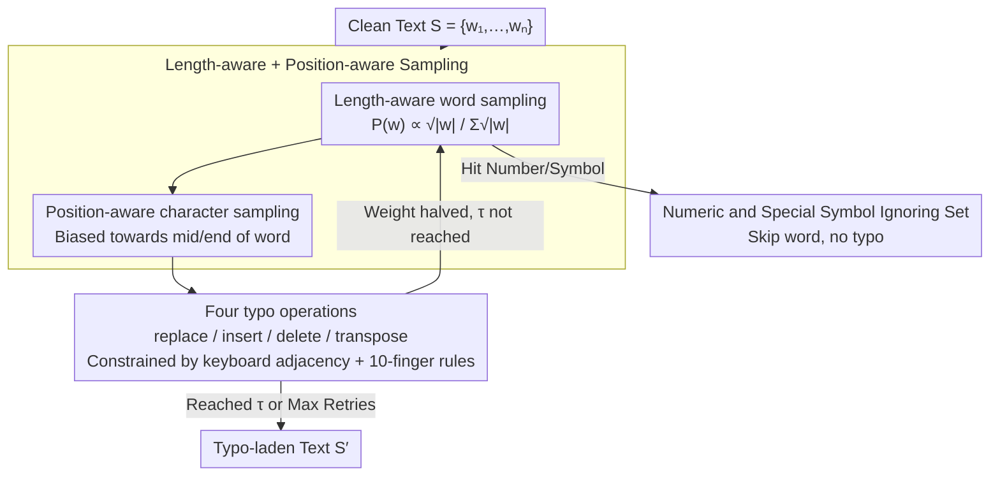

# Evaluating Robustness of Large Language Models Against Multilingual Typographical Errors

**Conference**: ACL 2026  
**arXiv**: [2510.09536](https://arxiv.org/abs/2510.09536)  
**Code**: <https://github.com/cisnlp/multypo>  
**Area**: Multilingual / Robustness / LLM Evaluation  
**Keywords**: Multilingual typo, keyboard layout, robustness evaluation, MulTypo, instruction tuning  

## TL;DR
This paper proposes MulTypo—a multilingual typo generation algorithm based on language-specific keyboard layouts and 10-finger typing habits. It systematically evaluates the robustness of 18 open-source LLMs across 12 languages and 5 downstream tasks, demonstrating that typos significantly impact generation and reasoning tasks, instruction-tuned models are more fragile, and typo effects exhibit cross-lingual and directional asymmetry.

## Background & Motivation

**Background**: LLMs are extensively deployed in scenarios like chat, translation, and search, where real-world user inputs naturally contain typos. However, most benchmarks assume clean inputs, and model robustness evaluations are often limited to English or use keyboard-agnostic perturbations such as edit distance.

**Limitations of Prior Work**: Early character-level perturbations (Pruthi 2019, Gao 2018, etc.) only consider four operations—"replace, insert, delete, and transpose"—while completely ignoring keyboard layouts. For instance, "q" is adjacent to "w" in English QWERTY, but Cyrillic keyboards have different adjacency relationships. Simple random character replacement fails to approximate real human typing noise. Multilingual robustness evaluations have mostly focused on encoder-only models like mBERT/XLM-R (Cooper Stickland 2023) and have not systematically covered modern LLMs.

**Key Challenge**: To quantify the impact of "realistic typos" on LLMs, a perturbation algorithm that mimics human typing across 12 languages is required. Simultaneously, the relationships between model scaling, instruction tuning, number of shots, and robustness must be disentangled, dimensions that have not been previously evaluated under unified controlled variables.

**Goal**: (i) Construct a cross-lingual typo generator consistent with keyboard layouts; (ii) Conduct controlled perturbation evaluations across 3 model families (Gemma, Qwen, OLMo) involving 18 models and 5 task categories (NLI, MCQA, mathematical reasoning, machine translation); (iii) Determine how model size, instruction tuning, shot count, and source/target language direction influence typo robustness.

**Key Insight**: The authors observe that human typos primarily stem from "10-finger QWERTY typing habits" and "adjacent key misclicks," where the probability of error is influenced by word length (longer words are more error-prone) and position (errors are more likely in the middle and end of words). These two priors can be directly encoded into the sampling distribution.

**Core Idea**: Generate typos using a "keyboard layout adjacency graph + length-aware word sampling + position-aware character sampling + 10-finger constraints." This ensures perturbations are both "human-like" and "controllable in difficulty," providing a lens to systematically re-evaluate the robustness of 18 LLMs.

## Method

### Overall Architecture
MulTypo transforms clean text $S=\{w_1, \dots, w_n\}$ into typo-laden text via a three-step pipeline: (i) Sample words to perturb proportional to the square root of their length; (ii) Sample a character position within the selected word according to a "position-aware" distribution; (iii) Draw from four operations (replace, insert, delete, or transpose) and execute based on the language's keyboard layout. The process is controlled by a corruption rate $\tau \in [0, 1]$. For each successfully perturbed word, its sampling weight is halved to encourage distributional diversity until the target typo count or maximum retries are reached. All numeric strings (whether Arabic numerals or word forms like "three / hundred") are added to an "ignoring set" to ensure perturbations affect only linguistic components without contaminating evaluation targets.

### Key Designs

**1. Length-aware Word Sampling + Position-aware Character Sampling: Encoding Human Typo Priors**

Psycholinguistic research shows that typos are denser in long words and more frequent in the middle or end of words (Peterson 1986, Kukich 1992, Lisbach & Meyer 2013). MulTypo incorporates this into a two-level sampling strategy: the probability of selecting a word is proportional to $\frac{\sqrt{|w|}}{\sum_w \sqrt{|w|}}$, ensuring long words are more likely to be selected without clustering all errors in a single ultra-long word. Within the word, character positions are sampled based on an empirical distribution favoring the middle and end sections. This approximates real human typing behavior more closely than random noise.

**2. Keyboard Adjacency + 10-finger Constraints: Grounding Perturbations in Physical Actions**

Early character-level perturbations (Pruthi 2019, Gao 2018) utilized the four core operations but ignored physical keyboard layouts, resulting in errors that humans would never commit. MulTypo applies physical constraints: Replacement only allows swapping with adjacent keys on the specific language's keyboard; Insertion adds an adjacent key after the correct character to simulate "simultaneous pressing"; Deletion removes a character; Transposition only swaps adjacent characters assigned to different hands (e.g., "5TGB" for the left hand and "6YHN" for the right hand) based on 10-finger typing observations (Logan et al., 2016). Grounding noise in finger movements makes MulTypo's naturalness significantly superior to naive baselines across 6 out of 7 tested languages (Table 2, multilingual $p<0.001$).

**3. Ignoring String Sets: Shading Semantic-altering Tokens**

In mathematical reasoning, changing `500` to `5O0` alters the answer rather than just adding noise, turning a robustness test into a digit-recovery task. To prevent this, MulTypo maintains an ignoring set for each language, including Arabic numerals (`1`, `2`, `3`), numeric words (`three`, `hundred`, `million`), punctuation, and modifier keys. Any word matching these strings is skipped. This ensures that the evaluation measures linguistic robustness, not the model's capacity for numeric recognition in noise.

### Loss & Training
This paper performs evaluation only. All 18 LLMs use 3-shot prompting as the default (shot impact is studied separately in §6.3). Typos are injected into the dataset content rather than the prompt instructions to ensure the evaluation focuses on "input noise" rather than the destruction of "task specifications." Corruption rates $\tau$ are set at $\{0, 0.1, 0.4, 0.7\}$. Both base and instruction-tuned versions are evaluated across 12 languages and 5 tasks (XNLI / Belebele / MMMLU / MGSM / FLORES200), plus a multilingual AIME for complex reasoning.

## Key Experimental Results

### Main Results

| Model Family | Small | Medium | Large | Description |
|--------|-------|--------|-------|------|
| Gemma | 21.46 (-9.9%) | 48.50 (-5.7%) | 59.11 (-3.7%) | Avg score at 10% typo + relative drop |
| OLMo | 16.30 (-9.5%) | 29.16 (-7.9%) | 36.82 (-4.3%) | Same as above |
| Qwen | 27.86 (-5.7%) | 44.50 (-8.2%) | 47.19 (-5.7%) | Same as above |

Qwen on Belebele dropped from 50+ (clean) to ~45 (10% typo); on MGSM it dropped from ~40 to ~27 (70% typo), a decrease of nearly 13 points. XNLI remained largely unchanged, suggesting classification tasks are far more robust than generation or reasoning tasks.

### Ablation Study

| Config (gemma-3-4b-it) | XNLI | Belebele | MMMLU | MGSM | Flores200 |
|------|------|----------|-------|------|-----------|
| Baseline naive (10%) | 56.25 | 74.83 | 35.73 | 46.90 | 35.47 |
| WikiTypo (10%) | 57.65 | 73.07 | 37.80 | 53.30 | 35.20 |
| MulTypo (10%) | 55.83 | 76.58 | 43.43 | 53.80 | 35.35 |
| Baseline naive (70%) | 40.67 | 56.20 | 30.62 | 12.00 | 24.21 |
| WikiTypo (70%) | 38.80 | 52.65 | 30.45 | 16.40 | 22.47 |
| MulTypo (70%) | 43.20 | 61.85 | 31.27 | 38.80 | 29.68 |

MulTypo's performance drop generally falls between the naive baseline and WikiTypo (actual Wikipedia edit history) and aligns with WikiTypo trends. This indicates it captures "realistic but controllable" typo behavior, whereas naive baselines overestimate model fragility.

### Key Findings
- **High Task Sensitivity**: XNLI (Qwen) shows almost no performance drop at 10% typo, but MGSM mathematical reasoning drops 33% relatively at 70% typo. Token-level perturbations severely disrupt multi-step reasoning chains.
- **Scale Yields Weak Robustness Gains**: Gemma's relative drop decreases from 9.9% (Small) to 3.7% (Large). However, even the largest 13B models still show a 4-6% drop, indicating no "scaling immunity."
- **Instruction Tuning Increases Fragility**: IT models outperform base models on clean inputs, but their absolute drops at 10-40% noise are often $\ge$ the base versions, suggesting current instruction tuning does not explicitly incorporate noise-aware training.
- **Shot Count Does Not Improve Robustness**: While 3-shot is better than 0-shot overall, the clean-to-noisy robustness gap remains nearly constant across 0/1/3/5 shots; extra shots even proved harmful for OLMo.
- **Directional Asymmetry**: On FLORES200, "X $\rightarrow$ English" is less robust than "English $\rightarrow$ X" when typos are present. High-resource languages (en/de/fr) and Latin-script languages are more robust than low-resource (hi/ben) or non-Latin counterparts.

## Highlights & Insights
- **Keyboard Layout Priors + 10-Finger Constraints**: This is a "virtually free" realism enhancer. Without training data or human annotation, it transforms perturbations from "looking like typos" into "actual human typos" based on physical layouts, as confirmed by human evaluations in 6/7 languages.
- **Numerical Integrity**: The numeric ignoring set detail reveals a systemic flaw in robustness benchmarks—many previous algorithms altered answer digits in GSM8K, measuring model "digit identification" rather than "robustness to linguistic noise."
- **Ordering of Performance Drop**: The observation that `MulTypo < WikiTypo < Baseline` in terms of performance impact suggests models encounter significant amounts of "real human typos" during pre-training. Consequently, perturbations closer to the real distribution result in smaller drops, while naive perturbations represent an "unseen distribution," overestimating fragility.

## Limitations & Future Work
- The current method only covers 12 alphabetic/phonetic scripts and is not directly applicable to IME-dominated languages like Chinese, Korean, or Japanese (where typo patterns involve Pinyin or radical errors).
- In Arabic, MulTypo did not significantly outperform the naive baseline, which the authors attribute to Arabic keyboard specificities or RTL layout issues requiring more detailed physical modeling.
- The evaluation focuses on base/IT stages without verifying if noise-aware fine-tuning could close the loop; the logical next step is using MulTypo for data augmentation.
- The conclusion regarding the fragility of instruction-tuned models may depend on specific IT data mixtures; a lack of comparative experiments on noise ratios in IT mixes is noted.

## Related Work & Insights
- **vs Pruthi et al. (2019) / Gao et al. (2018)**: These focused on English character-level adversarial perturbations; this work expands to keyboard layouts and multiple languages across modern LLMs.
- **vs WikiTypos (Aliakbarzadeh et al., 2025)**: WikiTypos uses Wikipedia edit history, which is realistic but lacks control over proportions; MulTypo allows for specified $\tau$ and languages, providing a "realistic-controllable" dual-anchor system.
- **vs Cooper Stickland et al. (2023)**: They focused on encoder-only models (XLM-R/mBERT) and real noise; this work advances the scope to decoder-only LLMs and reasoning tasks, pushing multilingual robustness research into the GenAI era.

## Rating
- Novelty: ⭐⭐⭐⭐ Simple algorithm, but addresses a long-neglected need for physical keyboard constraints in multilingual contexts.
- Experimental Thoroughness: ⭐⭐⭐⭐⭐ Massive engineering effort: 18 models × 12 languages × 5 tasks × 4 typo rates, plus human and WikiTypo comparisons.
- Writing Quality: ⭐⭐⭐⭐ Clear structure with section takeaways, though some key information is buried in the appendix.
- Value: ⭐⭐⭐⭐⭐ Provides a reusable Python package; MulTypo should become a standard baseline for future multilingual LLM robustness evaluations.

<!-- RELATED:START -->

## Related Papers

- [\[ACL 2026\] The GaoYao Benchmark: A Comprehensive Framework for Evaluating Multilingual and Multicultural Abilities of Large Language Models](the_gaoyao_benchmark_a_comprehensive_framework_for_evaluating_multilingual_and_m.md)
- [\[ACL 2026\] LaoBench: A Large-Scale Multidimensional Lao Benchmark for Large Language Models](laobench_a_large-scale_multidimensional_lao_benchmark_for_large_language_models.md)
- [\[ACL 2025\] Disentangling Language and Culture for Evaluating Multilingual Large Language Models](../../ACL2025/multilingual_mt/disentangle_language_culture.md)
- [\[ACL 2026\] LLM-XTM: Enhancing Cross-Lingual Topic Models with Large Language Models](llm-xtm_enhancing_cross-lingual_topic_models_with_large_language_models.md)
- [\[NeurIPS 2025\] XIFBench: Evaluating Large Language Models on Multilingual Instruction Following](../../NeurIPS2025/multilingual_mt/xifbench_evaluating_large_language_models_on_multilingual_instruction_following.md)

<!-- RELATED:END -->
