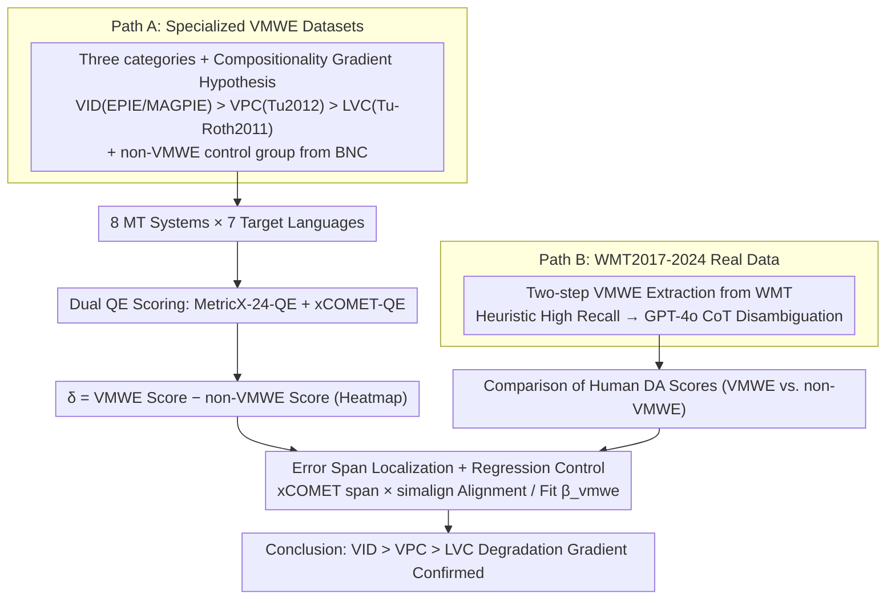

# Evaluating the Impact of Verbal Multiword Expressions on Machine Translation

**Conference**: ACL 2026  
**arXiv**: [2508.17458](https://arxiv.org/abs/2508.17458)  
**Code**: <https://github.com/cincynlp/vmwe-mt-eval>  
**Area**: Machine Translation / Multilingual / Evaluation  
**Keywords**: VMWE, Verbal Idioms, verb-particle, light verb, xCOMET, MetricX

## TL;DR
This paper presents the first systematic evaluation of the impact of Verbal Multiword Expressions (VMWEs: Verbal Idioms (VID), Verb-Particle Constructions (VPC), and Light Verb Constructions (LVC)) on machine translation quality. Analyzing 8 MT systems across 7 language pairs using two QE models and human DA scores, the study proves that VMWEs consistently lead to performance degradation. This degradation is strictly positively correlated with "non-compositionality" (VID > VPC > LVC), and even GPT-4.1/GPT-5.1 cannot eliminate this regression.

## Background & Motivation

**Background**: MT quality has surged over the past five years driven by LLMs, yet the translation community has long recognized that certain linguistic phenomena—structural differences, morphologically complex words, and MWEs—remain challenging. Prior work either focused on idiom translation in the statistical MT era or conducted case studies solely on Chinese-English directions, lacking a systematic evaluation for modern neural MT and LLM eras.

**Limitations of Prior Work**: (i) VMWEs are inherently highly non-compositional—"spill the beans" is not about "spilling legumes" but "disclosing a secret"; models often translate word-for-word, losing the semantics. (ii) Existing MWE evaluations either cover only a single type (idioms or light verbs) or rely on metrics like BLEU, which are insensitive to phrase-level semantics. (iii) Confounding variables are not controlled—sentences containing VMWEs might be longer or more complex, and it remains unclear whether VMWEs or general sentence difficulty cause the degradation.

**Key Challenge**: To prove that "VMWEs themselves are dragging down MT," an evaluation must simultaneously: cover three typical VMWE types, span multiple MT systems, utilize both reference-free QE and human DA validation, and control for confounders such as sentence length, polysemy, and structural complexity via regression. No prior work has addressed all four requirements.

**Goal**: (i) Quantify degradation across three VMWE types (VID/VPC/LVC) $\times$ 7 language pairs $\times$ 8 MT systems; (ii) Validate using both specialized VMWE datasets and real WMT evaluation data; (iii) Use xCOMET error spans to locate whether errors actually fall on VMWE tokens; (iv) Use regression to prove VMWEs are significant negative predictors even after controlling for sentence difficulty.

**Key Insight**: The authors observe a natural gradient in "non-compositionality" across the three VMWE categories (VID: fully non-compositional > VPC: semi-compositional > LVC: semantics mainly carried by the noun). This serves as a natural control variable for the "translation degradation vs. compositionality" hypothesis.

**Core Idea**: A "five-layer chain" evaluation framework—comprising dual data sources (VMWE-specific + WMT), dual metrics (QE + DA), and dual analyses (error span + regression control)—transforms the impact of VMWEs on MT from an "industry intuition" into a statistically rigorous attribution.

## Method

### Overall Architecture
The evaluation follows two parallel paths: Path A utilizes "specialized VMWE datasets"—extracting idioms from EPIE/MAGPIE, VPCs from Tu (2012), and LVCs from Tu-Roth (2011), with a control group of non-VMWEs from the BNC. Eight MT systems translate these into seven target languages, scored by MetricX-24-QE and xCOMET-QE, calculating $\delta = \text{score}_{\text{VMWE}} - \text{score}_{\text{non-VMWE}}$. Path B utilizes "real WMT evaluation data"—extracting VMWE sentences from WMT2017-2024 via a two-step heuristic + GPT-4o method, comparing historical human DA scores for VMWE vs. non-VMWE sentences. Both paths report $\delta$ heatmaps.

### Key Designs

**1. Linguistic Classification + Compositionality Gradient: Verifying Translation Degradation as a Falsifiable Proposition**

While idioms are known to be "hard to translate," VMWE is a broad concept that is difficult to compare quantitatively. This paper divides them into three tiers of decreasing non-compositionality: VID (Verbal Idioms) like "spill the beans," where semantics are entirely decoupled from literal meaning; VPC (Verb-Particle Constructions) like "give up," where the particle modifies the verb's meaning (semi-compositional); and LVC (Light Verb Constructions) like "take a walk," where semantics are primarily carried by the noun. Each category is paired with recognized high-quality datasets, and a control group of structurally similar non-VMWE sentences is constructed using spaCy dependency parsing.

This design transforms "non-compositionality causes degradation" into a falsifiable hypothesis: if true, degradation should follow a VID > VPC > LVC gradient. Experiments confirm this—for Opus, error overlap is 78.64% for VID, dropping to 65.51% for VPC and 62.21% for LVC. Even strong systems like GemmaX2 and the Google API consistently perform worst on VID.

**2. Two-step VMWE Extraction on WMT Data: High-Precision Identification in Real Evaluation Data**

Specialized datasets lack authentic human scores. WMT2017-2024 provides golden human DA scores but lacks VMWE annotations. This paper designs a recall-disambiguation pipeline: first, high recall is achieved using heuristic matching (lexicons for idioms, dependency parsing for VPC/LVC); second, GPT-4o with chain-of-thought prompting disambiguates candidates based on PARSEME guidelines to exclude literal usages.

This pipeline achieves F1 scores of 81.8/80.0/81.6 for VID/VPC/LVC (Table 1), significantly outperforming other LLMs like Phi-4 or LLaMA-3.3-70B. This enables the first large-scale VMWE evaluation on real data.

**3. Error Span Localization + Regression Control: Attributing Degradation to VMWE Tokens Directly**

To counter the argument that VMWE sentences are simply longer or more complex, this study employs two methods. First, error localization: using token-level error spans from xCOMET aligned via simalign to count how many target errors actually correspond to source VMWE phrases (Table 2). Second, regression analysis: fitting a model across 300k segments:

$$\text{score}_i = \beta_0 + \beta_1 I_{vmwe} + \beta_2 S_{len} + \beta_3 P_{deg} + \beta_4 T_{cmp} + \varepsilon_i$$

where $I_{vmwe}$ is the VMWE indicator, $S_{len}$ is sentence length, $P_{deg}$ is polysemy (WordNet senses), and $T_{cmp}$ is structural complexity (sum of dependency arc lengths). Even after controlling for difficulty factors, $\beta_1$ remains highly significant ($p<0.001$), contributing a degradation of ~0.08 on the xCOMET scale (0-1).

### Loss & Training
This is an evaluation-only paper; no models were trained. QE evaluation used MetricX-24-QE (mT5-based, lower is better, 0-25) and xCOMET-QE (XLM-RoBERTa-XL-based, higher is better, 0-1). MT systems include SeamlessM4T, Madlad400, M2M100, Opus-MT, LLaMAX3 Alpaca, Phi-4-multimodal, GemmaX2, and Google Translate API. WMT path also evaluates GPT-4.1, GPT-5.1, and Google API on a controlled subset.

## Key Experimental Results

### Main Results

| MT System | VID error overlap (%) | VPC | LVC | Avg xCOMET |
|-----------|----------------------|-----|-----|------------|
| Opus | 78.64 | 65.51 | 62.21 | 66.89 |
| M2M | 82.15 | 67.67 | 62.19 | 73.02 |
| Phi-4-multi | 66.50 | 54.43 | 56.36 | 74.68 |
| Madlad | 69.88 | 52.79 | 50.14 | 78.22 |
| Seamless | 67.91 | 56.30 | 55.75 | 76.43 |
| LLaMAX | 66.82 | 53.11 | 55.89 | 78.08 |
| GemmaX2 | 55.41 | 46.77 | 43.90 | 85.69 |
| Google API | 52.98 | 40.77 | 39.25 | 87.19 |

General pattern: Stronger MT systems (higher xCOMET) have lower proportions of errors falling on VMWEs, but the VID > VPC > LVC degradation gradient persists across all systems.

### Ablation Study (Regression Control)

| Predictor | xCOMET β (SE) | MetricX β (SE) | Interpretation |
|-----------|---------------|----------------|----------------|
| $\beta_0$ (intercept) | 0.7908 (0.0010)*** | 5.6889 (0.0183)*** | Expected score for non-VMWE at mean difficulty |
| $I_{vmwe}$ | **-0.0813** (0.0012)*** | **+0.9954** (0.0240)*** | Extra degradation caused by VMWE itself |
| $S_{len}$ | -0.0359 (0.0012)*** | +0.6348 (0.0240)*** | Impact of +1 SD in sentence length |
| $P_{deg}$ | -0.0126 (0.0006)*** | +0.0244 (0.0110)* | Impact of lexical polysemy |
| $T_{cmp}$ | -0.0120 (0.0009)*** | +0.0059 (0.0210) ns | Impact of structural complexity |

Results from $N=305{,}428$ segment-level regressions show the VMWE coefficient is significantly larger than other difficulty factors.

### Key Findings
- **Compositionality Gradient Holds**: Across all 8 MT systems and top LLMs (GPT-4.1/5.1), VID shows the greatest degradation and LVC the least. Table 4 shows GPT-4.1 has an average $\delta=+0.10$ for VID but only $+0.01$ for VPC and LVC.
- **Strong LLMs Do Not Solve Idioms**: GPT-5.1 fails to eliminate VID degradation (en-cs $\delta=+0.22$), suggesting the "literal-by-default" bias in LLMs is deep-seated and unaffected by scale alone.
- **Human Translators Unaffected**: Human WMT translations show minimal DA score differences between VMWE and non-VMWE sentences, implying the degradation is a fundamental weakness of MT systems, not the task itself.
- **Error Span Correlation**: Systems with error spans concentrated on VMWEs have lower total QE scores, making VMWE handling a leading indicator of overall MT quality.
- **LLM-based MT Side Effects**: GemmaX2 shows >75% language identification errors or empty outputs in ja/cs/tr, highlighting the hidden fragility of LLM-based translation.

## Highlights & Insights
- **"Five-layer Chain" Framework**: The design of dual data/evaluation/analysis ensures every conclusion is supported by independent evidence, serving as a methodological benchmark for MWE, metaphor, or metonymy research.
- **Error Span as a Leading Indicator**: Table 2 reveals that total xCOMET scores are monotonically inversely correlated with VMWE error overlap. This suggesting that reward shaping or DPO targeting MWE error reduction could improve overall MT quality.
- **Regression + Salign Paradigm**: Rigorously proving linguistic hypotheses via statistical causal analysis and token-level alignment is far more persuasive than reporting BLEU differences alone.

## Limitations & Future Work
- Language coverage is limited to 7 types (de/cs/ru/zh/es/ja/tr), all translated from English; results may not generalize to low-resource or non-Indo-European pairs.
- Specialized VMWE dataset evaluations rely on QE models rather than human reference scores.
- No remediation proposed—the paper exposes problems without providing solutions. Future work could explore upsampling VMWE sentences or MWE-aware reranking during decoding.
- Does not cover other non-literal phenomena like metaphor or metonymy.

## Related Work & Insights
- **vs. Song & Xu (2024)**: While they analyzed errors in idioms + named entities for CN-EN MT, this paper scales the study to 8 systems, 3 VMWE types, and 7 languages with regression attribution.
- **vs. Baziotis et al. (2023)**: These works focus on improvement methods for MWEs; this paper provides the systematic evaluation framework to benchmark such improvements.
- **vs. PARSEME shared task**: PARSEME standardized cross-lingual VMWE identification; this paper extends that task as a natural input for downstream MT evaluation.

## Rating
- Novelty: ⭐⭐⭐⭐ The evaluation dimension is established, but the "five-layer" design and regression control are significant methodological contributions.
- Experimental Thoroughness: ⭐⭐⭐⭐⭐ Massive engineering effort: 8 MT systems, 7 languages, 2 data sources, 2 QE models, 300k regressions, and GPT-5.1 verification.
- Writing Quality: ⭐⭐⭐⭐ Clear takeaways and organization, though the heavy use of appendices requires jumping between sections.
- Value: ⭐⭐⭐⭐ The open-source pipeline allows any future MT system to be benchmarked for VMWEs, creating a standard baseline.

<!-- RELATED:START -->

## Related Papers

- [\[ACL 2026\] Prosody as Supervision: Bridging the Non-Verbal–Verbal for Multilingual Speech Emotion Recognition](prosody_as_supervision_bridging_the_non-verbal--verbal_for_multilingual_speech_e.md)
- [\[ACL 2026\] CLewR: Curriculum Learning with Restarts for Machine Translation Preference Learning](clewr_curriculum_learning_with_restarts_for_machine_translation_preference_learn.md)
- [\[ACL 2026\] NiuTrans.LMT: Toward Inclusive and Scalable Multilingual Machine Translation with LLMs](niutranslmt_toward_inclusive_and_scalable_multilingual_machine_translation_with_.md)
- [\[ACL 2026\] LQM: Linguistically Motivated Multidimensional Quality Metrics for Machine Translation](lqm_linguistically_motivated_multidimensional_quality_metrics_for_machine_transl.md)
- [\[ACL 2026\] MORPHOGEN: A Multilingual Benchmark for Evaluating Gender-Aware Morphological Generation](morphogen_a_multilingual_benchmark_for_evaluating_gender-aware_morphological_gen.md)

<!-- RELATED:END -->
