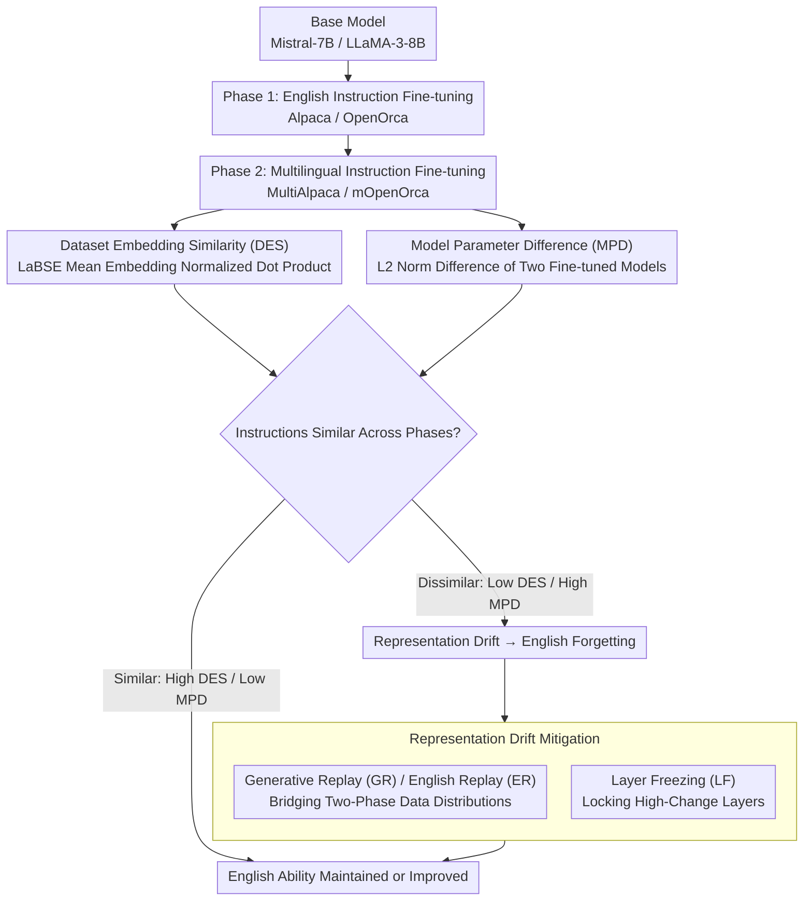

# Exploring Two-Phase Continual Instruction Fine-tuning for Multilingual Adaptation in Large Language Models

**Conference**: ACL 2026 Findings  
**arXiv**: [2410.16006](https://arxiv.org/abs/2410.16006)  
**Code**: None  
**Area**: Multilingual / Continual Learning  
**Keywords**: Continual fine-tuning, multilingual adaptation, catastrophic forgetting, dataset similarity, representation drift

## TL;DR

This paper proposes a two-phase continual fine-tuning (CFT) framework—fine-tuning on English instruction data first, followed by multilingual data—finding that the instruction similarity between datasets across phases is the key factor determining whether English proficiency degrades. It further effectively mitigates representation drift and English forgetting caused by dissimilar datasets through generative replay and heuristic layer freezing.

## Background & Motivation

**Background**: LLM multilingual user bases are growing, but models perform significantly poorer on low-resource languages. Training from scratch is extremely costly; fine-tuning is the preferred solution. Fine-tuning on mixed multilingual datasets leads to English bias, while fine-tuning solely on non-English data results in English performance degradation due to catastrophic forgetting.

**Limitations of Prior Work**: (1) Existing methods like InstructAlign require parallel data and old task data, involving high computational overhead; (2) Direct fine-tuning on mixed datasets leads to imbalanced English-multilingual performance; (3) Lack of systematical understanding regarding "under what conditions multilingual fine-tuning harms English ability"; (4) Regularization methods like EWC require saving both old and new parameters, resulting in low computational efficiency.

**Key Challenge**: There is a tension between improving multilingual adaptation (MA) and maintaining English ability (EA)—ideally, the same model should excel in both to avoid the cost of maintaining multiple models.

**Goal**: Under the two-phase CFT framework, understand the mechanisms of English degradation in multilingual adaptation and propose efficient mitigation strategies.

**Key Insight**: Focus on the "instruction similarity" of datasets between phases—if both phases encode the same instructions (differing only in language), English ability can be maintained or even improved.

**Core Idea**: The fundamental cause of English degradation is representation drift—dissimilar phase datasets cause a significant shift in the model's hidden representation space, which can be controlled by replaying data distributions and freezing layers.

## Method

### Overall Architecture

Two-phase CFT: Phase 1 fine-tunes on English instruction datasets (Alpaca/OpenOrca), and Phase 2 fine-tunes on multilingual datasets (MultiAlpaca/mOpenOrca). Compared to single-stage mixed fine-tuning, two-phase CFT achieves better average performance under the same training steps. Following this line, the paper quantifies instruction similarity from data and parameter perspectives using two metrics (DES, MPD). The similarity levels accurately predict whether English ability is maintained or degrades due to representation drift after Phase 2; for degradation cases, drift is suppressed via replay and layer freezing.

### Key Designs

**1. Dataset Embedding Similarity (DES): Predicting whether Phase 2 will destroy English ability from a data perspective**

To explain why some multilingual fine-tuning harms English while others do not, a cross-lingual comparison metric is needed. The authors use the language-agnostic sentence encoder LaBSE to encode all instructions from both phase datasets into vectors, compute their average embeddings, and then calculate the normalized dot product as DES—higher values indicate instructions encoded in both phases are closer, differing only by language. 

This metric directly predicts downstream results: the homologous pair Alpaca-MultiAlpaca has a DES of $0.924$, while the heterologous pair Instruct-MultiAlpaca is only $0.746$, corresponding respectively to English preservation and collapse. LaBSE is chosen over standard English encoders because Phase 2 data is multilingual, requiring language-agnostic encoding to separate "instruction semantics" from "instruction language."

**2. Model Parameter Difference (MPD): Independent evidence for the similarity hypothesis from a parameter perspective**

DES only evaluates the data itself. What if the model reacts differently to similar data? The authors add a parameter-side metric: starting from the same base model, they fine-tune on two datasets separately and calculate the $L_2$ norm difference between the parameters of the two fine-tuned models, denoted as MPD—smaller differences indicate the two datasets pull the model in a more consistent direction. 

Results corroborate DES: Alpaca-MultiAlpaca's MPD is only $0.29$, while Instruct-MultiAlpaca's is $1.00$. Both data and model perspectives point toward "instruction similarity determining forgetting," making the core hypothesis independent of a single metric.

**3. Representation Drift Mitigation: Suppressing the root cause of English degradation (hidden representation shift) through two paths**

The study proves the mechanism of English degradation is representation drift—dissimilar Phase 2 data pushes the model's hidden representation space away. Mitigation is offered via distribution and parameters. On the distribution side is replay: Generative Replay (GR) uses the Phase 1 model to generate responses for English instruction versions of the Phase 2 dataset, mixing them into Phase 2 training at a $5\%$ or $10\%$ ratio, effectively bridging the two-phase distributions with synthetic data; English Replay (ER) directly uses real English parallel data. On the parameter side is Layer Freezing (LF): selectively freezing parts of the model based on the most changed layers (LF_H2), random layers (LF_H1), or Signal-to-Noise Ratio (Spectrum) to physically limit the space for drift.

These paths target two ends of the same mechanism—replay reduces the "driving force" of drift by maintaining distribution continuity, while layer freezing compresses the "degrees of freedom" for drift by locking parameters. GR has a practical advantage as it does not require original Phase 1 data; only the Phase 1 model is needed to generate replay samples, bypassing dependencies on old data required by methods like InstructAlign.

### Loss & Training

Full-parameter fine-tuning with bf16 precision. Phases 1 and 2 use full training on their respective datasets. English ability is evaluated using IFEval, Alpaca Eval, MMLU, HellaSwag, and XLSUM_en; multilingual ability using MLQA, XQuAD, XLSUM, and GMMLU. Multilingual coverage includes 11 languages (FR, AR, DE, ES, ID, JA, KO, PT, RU, TH, VI).

## Key Experimental Results

### Main Results

| Model | Phase 1 | Phase 2 | EA Avg | MA Avg | Overall |
|------|---------|---------|---------|---------|------|
| Mistral-7B | Alpaca | MultiAlpaca | 0.371 ↑ | 0.338 ↑ | 0.355 |
| Mistral-7B | Instruct | MultiAlpaca | 0.332 ↓ | 0.302 ↑ | 0.317 |
| LLaMA-3-8B | Alpaca | MultiAlpaca | 0.265 ↑ | 0.427 ↑ | 0.346 |
| LLaMA-3-8B | Instruct | MultiAlpaca | 0.178 ↓ | 0.301 ↓ | 0.240 |
| Mistral-7B | Mixed | - | 0.371 | 0.278 | 0.325 |
| LLaMA-3-8B | Mixed | - | 0.335 | 0.289 | 0.312 |

### Ablation Study

| Strategy | Mistral EA | Mistral MA | LLaMA EA | LLaMA MA |
|------|-----------|-----------|----------|----------|
| No Mitigation (Instruct→MA) | 0.332 | 0.302 | 0.178 | 0.302 |
| GR_5 | 0.394 | 0.298 | 0.236 | 0.348 |
| GR_10 | 0.394 | 0.274 | 0.173 | 0.204 |
| ER_10 | 0.404 | 0.276 | 0.345 | 0.359 |
| LF_H2 | 0.294 | 0.263 | 0.306 | 0.320 |
| Spectrum | 0.363 | 0.237 | 0.329 | 0.261 |
| LoRA | 0.341 | 0.321 | 0.142 | 0.075 |

### Key Findings

- Two-phase CFT consistently outperforms mixed fine-tuning—Mistral-7B overall $0.355$ vs $0.325$, LLaMA-3-8B $0.346$ vs $0.312$.
- Similar datasets (Alpaca→MultiAlpaca) not only preserve but improve English—as both phases encode the same instructions.
- Dissimilar datasets (Instruct→MultiAlpaca) cause severe English degradation—IFEval for LLaMA-3-8B plummeted from $0.735$ to $0.182$.
- Representation drift visualization confirms: dissimilar datasets produce 3-4x more covariance shift in higher layers compared to similar datasets.
- ER_10 achieves the best overall performance on Mistral, while GR_5 is strongest for LLaMA multilingual tasks.
- LoRA shows extremely poor multilingual performance on LLaMA ($0.075$), suggesting parameter-efficient methods might not effectively maintain multilingual capability.

## Highlights & Insights

- The finding that "instruction similarity determines the extent of forgetting" is highly practical—when selecting Phase 2 datasets, preference should be given to versions encoding the same instructions as Phase 1, rather than using arbitrary multilingual data.
- DES and MPD metrics complementarily validate the similarity hypothesis from data and model perspectives, enhancing reliability.
- Generative replay does not require original Phase 1 data (meeting real-world constraints); only $5\%$ replay data significantly mitigates drift.
- Covariance matrix drift analysis reveals the hierarchical distribution of English degradation—concentrated in high layers for Mistral, while occurring across all layers in LLaMA.

## Limitations & Future Work

- Verified only on Mistral-7B and LLaMA-3-8B; generalizability to larger models or different architectures is unknown.
- DES and MPD as similarity proxies might not capture all instruction-level differences.
- Optimal performance of ER_10 depends on the availability of parallel data, which is not always accessible.
- Multi-stage ($>2$) continual fine-tuning scaling was not explored.

## Related Work & Insights

- **vs InstructAlign**: The latter requires cross-lingual alignment, in-context replay, and parallel data, which is costly; the proposed GR only needs the Phase 1 model to generate English responses.
- **vs Shaham et al. (2024)**: The latter introduces multilinguality in the first stage; this paper introduces it in the second stage and systematically analyzes forgetting conditions.
- **vs EWC-like regularization**: These require saving old and new parameters, which is computationally inefficient; layer freezing achieves similar effects in a more lightweight manner.

## Rating

- Novelty: ⭐⭐⭐⭐ The two-phase CFT framework and similarity metrics are innovative, though individual components have precedents.
- Experimental Thoroughness: ⭐⭐⭐⭐ Multiple dataset pairs, multiple models, detailed ablations, and mitigation strategies, though model scaling is limited.
- Writing Quality: ⭐⭐⭐⭐ Clear structure and effective visualizations, though notation is slightly dense.
- Value: ⭐⭐⭐⭐ Provides practical guidance for multilingual continual fine-tuning—selecting similar datasets and lightweight replay can significantly mitigate forgetting.

<!-- RELATED:START -->

## Related Papers

- [\[ACL 2025\] SIFT-50M: A Large-Scale Multilingual Dataset for Speech Instruction Fine-Tuning](../../ACL2025/multilingual_mt/sift-50m_a_large-scale_multilingual_dataset_for_speech_instruction_fine-tuning.md)
- [\[NeurIPS 2025\] Exploring the Translation Mechanism of Large Language Models](../../NeurIPS2025/multilingual_mt/exploring_the_translation_mechanism_of_large_language_models.md)
- [\[ACL 2026\] Mitigating Catastrophic Forgetting in Target Language Adaptation of LLMs via Source-Shielded Updates](mitigating_catastrophic_forgetting_in_target_language_adaptation_of_llms_via_sou.md)
- [\[NeurIPS 2025\] XIFBench: Evaluating Large Language Models on Multilingual Instruction Following](../../NeurIPS2025/multilingual_mt/xifbench_evaluating_large_language_models_on_multilingual_instruction_following.md)
- [\[ACL 2026\] Modular Monolingual Adaptation using Pretrained Language Models](modular_monolingual_adaptation_using_pretrained_language_models.md)

<!-- RELATED:END -->
