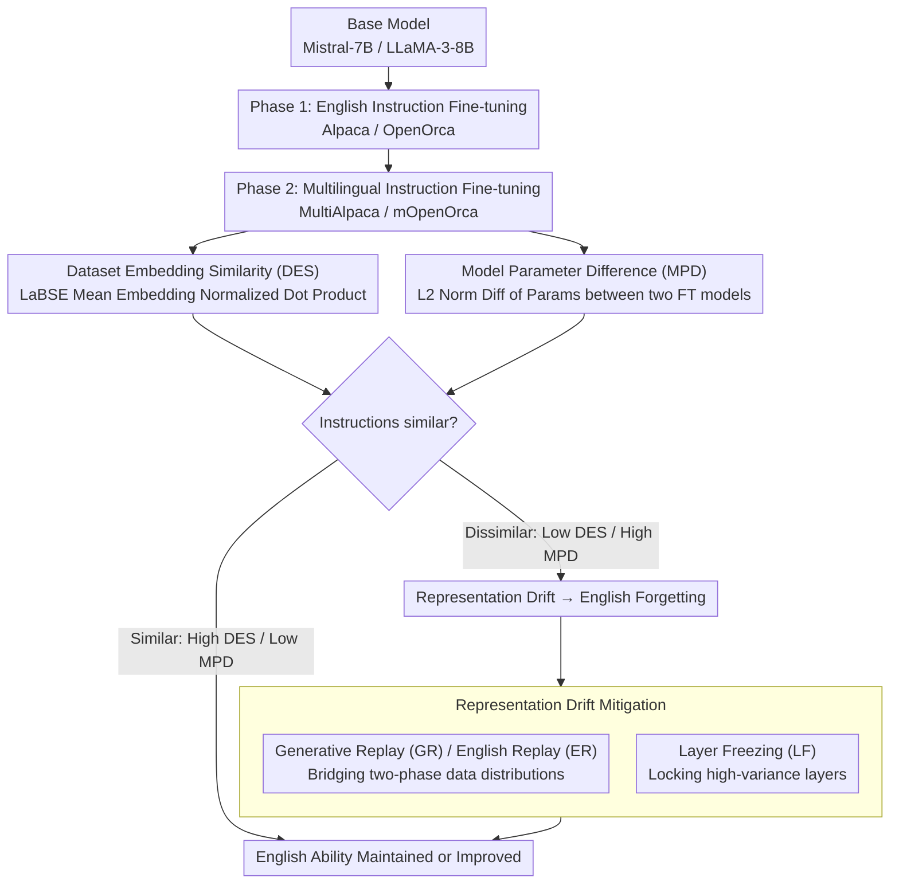

# Exploring Two-Phase Continual Instruction Fine-tuning for Multilingual Adaptation in Large Language Models

**Conference**: ACL 2026 Findings  
**arXiv**: [2410.16006](https://arxiv.org/abs/2410.16006)  
**Code**: None  
**Area**: Multilingual / Continual Learning  
**Keywords**: Continual Fine-tuning, Multilingual Adaptation, Catastrophic Forgetting, Dataset Similarity, Representation Drift

## TL;DR

This paper proposes a two-phase Continual Fine-Tuning (CFT) framework—fine-tuning first on English instruction data and then on multilingual data. It identifies that the instruction similarity between datasets across phases is the key factor determining whether English proficiency degrades. It further effectively mitigates representation drift and English forgetting caused by dissimilar datasets through generative replay and heuristic layer freezing.

## Background & Motivation

**Background**: The multilingual user base for LLMs is growing, but models perform significantly worse on low-resource languages. Training from scratch is extremely costly, making fine-tuning the preferred solution. Fine-tuning on mixed multilingual datasets leads to English bias, while fine-tuning solely on non-English data results in English performance degradation due to catastrophic forgetting.

**Limitations of Prior Work**: (1) Existing methods like InstructAlign require parallel data and old task data, resulting in high computational overhead; (2) Direct fine-tuning on mixed datasets leads to an imbalance between English and multilingual performance; (3) There is a lack of systematic understanding regarding "under what conditions multilingual fine-tuning harms English proficiency"; (4) Regularization methods like EWC require saving both old and new parameters, which is computationally inefficient.

**Key Challenge**: There is a tension between improving Multilingual Adaptation (MA) and maintaining English Ability (EA)—ideally, a single model should excel in both aspects to avoid the cost of maintaining multiple models.

**Goal**: To understand the mechanism of English degradation during multilingual adaptation within a two-phase CFT framework and propose efficient mitigation strategies.

**Key Insight**: Focus on the "instruction similarity" between datasets across phases—if both phases encode the same instructions (merely in different languages), English proficiency can be maintained or even improved.

**Core Idea**: The root cause of English degradation is representation drift—dissimilar datasets across phases cause a significant shift in the model's hidden representation space. This drift can be controlled by replaying data distributions and freezing specific layers.

## Method

### Overall Architecture

Two-phase CFT: Phase 1 involves fine-tuning on an English instruction dataset (Alpaca/OpenOrca), and Phase 2 involves fine-tuning on a multilingual dataset (MultiAlpaca/mOpenOrca). Compared to single-stage mixed fine-tuning, two-phase CFT achieves better average performance given the same number of training steps. Following this line, the paper uses two metrics (DES and MPD) to quantify instruction similarity from both data and parameter perspectives. Similarity levels accurately predict whether English ability is maintained or degraded due to representation drift after Phase 2. For cases of degradation, replay and layer freezing are employed to suppress the drift.

### Key Designs

**1. Dataset Embedding Similarity (DES): Predicting English performance from a data perspective**  
To explain why some multilingual fine-tuning harms English while others do not, a cross-lingual metric is required. The paper uses the language-agnostic sentence encoder LaBSE to encode all instructions in both phases into vectors, takes their respective mean embeddings, and calculates the normalized dot product as the DES. A higher value indicates that the instructions in both phases are closer in meaning, differing primarily in language.  
This metric directly predicts downstream results: the similar pair Alpaca-MultiAlpaca has a high DES (0.924), while the dissimilar pair Instruct-MultiAlpaca has only 0.746, corresponding to English maintenance and collapse, respectively. LaBSE is chosen because it allows for separating "instruction semantics" from "instruction language."

**2. Model Parameter Difference (MPD): Independent evidence from a parameter perspective**  
DES only considers the data itself. What if the data is similar but the model reacts differently? The paper adds a parameter-side metric: starting from the same base model, it fine-tunes separately on two datasets and then calculates the L2 norm difference between the parameters of the two fine-tuned models, denoted as MPD. A smaller difference indicates that the "pulling direction" of the two datasets on the model is more consistent.  
The results corroborate DES: the MPD for Alpaca-MultiAlpaca is only 0.29, while for Instruct-MultiAlpaca it is as high as 1.00. These two independent lines of evidence point to "instruction similarity as the determinant of forgetting."

**3. Representation Drift Mitigation: Suppressing the root cause of English degradation**  
It is demonstrated that the mechanism for English degradation is representation drift—dissimilar Phase 2 data pushes the model's hidden representation space away from its original state. The paper provides mitigation methods from both distribution and parameter sides. On the distribution side, Generative Replay (GR) utilizes the Phase 1 model to generate responses for the English version of the Phase 2 instructions, mixing them into Phase 2 training at a ratio of 5% or 10%. English Replay (ER) uses real English parallel data instead. On the parameter side, Layer Freezing (LF) selectively freezes specific layers based on the highest variation in Phase 1 (LF_H2), random selection (LF_H1), or signal-to-noise ratio (Spectrum).  
Both paths target the same mechanism: Replay reduces the "driving force" of drift by maintaining data distribution continuity, while Layer Freezing compresses the "degrees of freedom" for drift by locking parameters. GR offers a practical advantage as it does not require original Phase 1 data, bypassing the dependencies of methods like InstructAlign.

### Loss & Training

Full-parameter fine-tuning with bf16 precision is employed. Phase 1 and Phase 2 use full-scale training on their respective datasets. English ability is evaluated using IFEval, Alpaca Eval, MMLU, HellaSwag, and XLSUM_en. Multilingual ability is evaluated using MLQA, XQuAD, XLSUM, and GMMLU. The multilingual scope covers 11 languages.

## Key Experimental Results

### Main Results

| Model | Phase 1 | Phase 2 | EA Avg | MA Avg | Combined |
|------|---------|---------|---------|---------|------|
| Mistral-7B | Alpaca | MultiAlpaca | 0.371 ↑ | 0.338 ↑ | 0.355 |
| Mistral-7B | Instruct | MultiAlpaca | 0.332 ↓ | 0.302 ↑ | 0.317 |
| LLaMA-3-8B | Alpaca | MultiAlpaca | 0.265 ↑ | 0.427 ↑ | 0.346 |
| LLaMA-3-8B | Instruct | MultiAlpaca | 0.178 ↓ | 0.301 ↓ | 0.240 |
| Mistral-7B | Mixed | - | 0.371 | 0.278 | 0.325 |
| LLaMA-3-8B | Mixed | - | 0.335 | 0.289 | 0.312 |

### Ablation Study

| Strategy | Mistral EA | Mistral MA | LLaMA EA | LLaMA MA |
|------|-----------|-----------|----------|----------|
| No Mitigation (Instruct→MA) | 0.332 | 0.302 | 0.178 | 0.302 |
| GR_5 | 0.394 | 0.298 | 0.236 | 0.348 |
| GR_10 | 0.394 | 0.274 | 0.173 | 0.204 |
| ER_10 | 0.404 | 0.276 | 0.345 | 0.359 |
| LF_H2 | 0.294 | 0.263 | 0.306 | 0.320 |
| Spectrum | 0.363 | 0.237 | 0.329 | 0.261 |
| LoRA | 0.341 | 0.321 | 0.142 | 0.075 |

### Key Findings

- Two-phase CFT consistently outperforms mixed fine-tuning: Mistral-7B comprehensive 0.355 vs 0.325, LLaMA-3-8B 0.346 vs 0.312.
- Similar datasets (Alpaca→MultiAlpaca) do not harm English skills but rather enhance them, as both phases encode the same instructions.
- Dissimilar datasets (Instruct→MultiAlpaca) lead to severe English degradation—IFEval for LLaMA-3-8B plummeted from 0.735 to 0.182.
- Representation drift visualization confirms that dissimilar datasets produce 3-4 times the covariance shift in higher layers compared to similar datasets.
- ER_10 achieves the best overall performance on Mistral, while GR_5 is strongest for LLaMA multilingual tasks.
- LoRA shows extremely poor multilingual performance on LLaMA (0.075), suggesting that parameter-efficient methods may not effectively maintain multilingual performance.

## Highlights & Insights

- The discovery that "instruction similarity determines the degree of forgetting" is highly practical—when selecting Phase 2 datasets, priority should be given to versions encoding the same instructions as Phase 1.
- The dual metrics of DES and MPD validate the similarity hypothesis from both data and model perspectives, increasing the credibility of the conclusions.
- Generative Replay does not require the original Phase 1 data (satisfying real-world constraints); only 5% replay data is needed to effectively mitigate drift.
- Covariance matrix drift analysis intuitively reveals the layer-wise distribution of English degradation—Mistral focuses on top layers, while LLaMA drifts across all layers.

## Limitations & Future Work

- Validated only on Mistral-7B and LLaMA-3-8B; generalization to larger models or different architectures is unknown.
- DES and MPD, as similarity proxies, may not capture all instruction-level differences.
- The optimal performance of ER_10 depends on the availability of parallel data, which may not always be accessible in practice.
- Extension to multi-phase (>2) continual fine-tuning remains unexplored.

## Related Work & Insights

- **vs InstructAlign**: The latter requires cross-lingual alignment, in-context replay, and parallel data, which is costly. The GR proposed in this paper only needs the Phase 1 model to generate English responses.
- **vs Shaham et al. (2024)**: The latter introduces multilinguality in the first stage, whereas this paper introduces it in the second stage and systematically analyzes forgetting conditions.
- **vs EWC / Regularization**: These require saving multiple sets of parameters, which is inefficient. Layer freezing achieves similar effects in a much more lightweight manner.

## Rating

- Novelty: ⭐⭐⭐⭐ The two-phase CFT framework and similarity metrics are innovative, though individual components have precedents.
- Experimental Thoroughness: ⭐⭐⭐⭐ Detailed datasets, multiple models, and comprehensive ablation/mitigation strategies, though model size is limited.
- Writing Quality: ⭐⭐⭐⭐ Clear structure and effective visualizations, though notation is somewhat complex.
- Value: ⭐⭐⭐⭐ Provides practical guidance for multilingual continual fine-tuning—selecting similar datasets and using lightweight replay can significantly mitigate forgetting.

<!-- RELATED:START -->

## Related Papers

- [\[ACL 2025\] SIFT-50M: A Large-Scale Multilingual Dataset for Speech Instruction Fine-Tuning](../../ACL2025/multilingual_mt/sift-50m_a_large-scale_multilingual_dataset_for_speech_instruction_fine-tuning.md)
- [\[NeurIPS 2025\] Exploring the Translation Mechanism of Large Language Models](../../NeurIPS2025/multilingual_mt/exploring_the_translation_mechanism_of_large_language_models.md)
- [\[ACL 2026\] Mitigating Catastrophic Forgetting in Target Language Adaptation of LLMs via Source-Shielded Updates](mitigating_catastrophic_forgetting_in_target_language_adaptation_of_llms_via_sou.md)
- [\[NeurIPS 2025\] XIFBench: Evaluating Large Language Models on Multilingual Instruction Following](../../NeurIPS2025/multilingual_mt/xifbench_evaluating_large_language_models_on_multilingual_instruction_following.md)
- [\[ACL 2026\] Evaluating Robustness of Large Language Models Against Multilingual Typographical Errors](evaluating_robustness_of_large_language_models_against_multilingual_typographica.md)

<!-- RELATED:END -->
