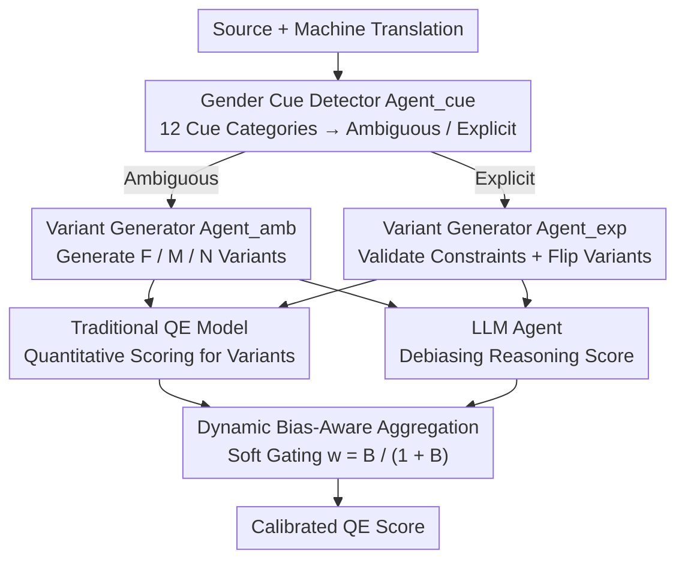

# FairQE: Multi-Agent Framework for Mitigating Gender Bias in Translation Quality Estimation

**Conference**: ACL 2026  
**arXiv**: [2604.21420](https://arxiv.org/abs/2604.21420)  
**Code**: None  
**Area**: LLM Agent / Machine Translation Evaluation  
**Keywords**: Translation Quality Estimation, Gender Bias, Multi-Agent, Fairness, Bias Mitigation

## TL;DR

Proposes FairQE, a multi-agent framework that effectively mitigates systematic gender bias in QE models through gender cue detection, gender-flipped variant generation, and a dynamic bias-aware score aggregation mechanism, without sacrificing the accuracy of translation quality assessment.

## Background & Motivation

**Background**: Translation Quality Estimation (QE) aims to automatically evaluate machine translation quality without reference translations. Models such as COMETKiwi and MetricX have achieved excellent performance in WMT evaluations and become essential tools for translation assessment.

**Limitations of Prior Work**: Existing QE models exhibit systematic gender bias—tending to give higher scores to masculine translations in gender-ambiguous contexts; they may even prefer masculine forms when feminine translations are explicitly required (preference reversal phenomenon). This bias cascades into downstream decisions (model selection, data filtering, etc.).

**Key Challenge**: How to mitigate gender bias while maintaining the evaluation accuracy of QE models? Simple debiasing may damage the model's ability to judge translation quality.

**Goal**: Design a model-agnostic framework that can calibrate the gender bias of existing QE models in a plug-and-play manner while maintaining or even improving overall evaluation performance.

**Key Insight**: Adopt a multi-agent collaborative architecture to decompose bias detection, variant generation, and debiased reasoning into independent modules, combining LLM reasoning capabilities with quantitative scores from traditional QE models.

**Core Idea**: Quantify the degree of bias by generating gender-flipped variants and use dynamic weights to perform soft switching between traditional QE scores and LLM debiased reasoning scores—the greater the bias, the more the reliance on LLM reasoning.

## Method

### Overall Architecture

FairQE consists of four sequential stages: (1) Gender cue detection—identifying gender-related linguistic cues in the source sentence; (2) Gender-flipped variant generation—generating female/male/neutral translation variants based on cue types; (3) Dual-stream quality assessment—traditional QE models provide quantitative scores while LLM agents perform debiased reasoning; (4) Dynamic bias-aware aggregation—dynamically adjusting the weights of the two scores based on the severity of the bias.

### Key Designs

**1. Gender Cue Detector ($Agent_{cue}$): Identifying the gender problem type before applying debiasing strategies.**

Gender bias is not a single phenomenon; blind debiasing can be counterproductive. $Agent_{cue}$ receives the source sentence and target translation, classifying identified gender cues into two main categories—Gender Ambiguous (source does not specify gender) and Gender Explicit (source specifies gender)—based on a 12-category fine-grained system, and links each cue to corresponding segments in the source and target.

This subdivision is necessary because the requirements for a "good translation" are opposite for the two types: ambiguous cues require consistency (various gender realizations should be scored equally), while explicit cues require faithfulness (must strictly match the source gender).

**2. Gender-flipped Variant Generators ($Agent_{amb}$ + $Agent_{exp}$): Quantifying bias by observing score changes after flipping.**

Bias is often latent; this method creates control samples to expose it. For gender-ambiguous cues, $Agent_{amb}$ generates all valid gender realizations (Feminine F / Masculine M / Neutral N). For gender-explicit cues, $Agent_{exp}$ first validates whether the target translation satisfies the source gender constraint and then generates flipped variants for comparison.

With variants that only differ in gender but are identical otherwise, the QE model's scores for them can be compared: if the model systematically scores masculine variants higher, the gap itself is a quantitative measure of bias. This step converts the subjective judgment of "is the model biased" into a computable score difference.

**3. Dynamic Bias-Aware Score Aggregation: Trusting LLM reasoning when bias is high, reverting to original QE when bias is zero.**

Traditional QE models excel at fine-grained precision, while LLMs are more stable for reasoning-intensive judgments. This framework allows for a soft switch between the two scores based on bias severity: first, compute ambiguous bias $b_{amb}$ (range of variant scores) and explicit bias $b_{exp}$ (degree of preference violation) to synthesize total bias $B$. Then, use a soft gating mechanism:

$$w = \frac{B}{1 + B}$$

to determine fusion weights—as $B$ increases, $w$ nears 1, favoring the LLM's debiased reasoning. When $B$ approaches 0, $w \to 0$, and the framework reverts to the original QE model, leaving unbiased samples undisturbed. Hyperparameters $\alpha$ and $\beta$ adjust the weights of $b_{amb}$ and $b_{exp}$ within $B$. This design ensures that fairness and accuracy are not mutually exclusive: LLM intervention is only used where bias exists, avoiding accuracy loss from indiscriminate debiasing.

### Loss & Training

FairQE does not involve training; it is a plug-and-play framework for inference. Hyperparameters $\alpha$ and $\beta$ control the weights of ambiguous and explicit bias, respectively.

## Key Experimental Results

### Main Results (Gender Ambiguous Scenario - F/M QE Score Ratio)

| Method | ES | FR | IT | AR | DE | HI |
|------|-----|-----|-----|-----|-----|-----|
| COMETKiwi 22 | 0.983 | 0.978 | 0.979 | 0.985 | 0.994 | 0.991 |
| FairQE (w/ COMETKiwi 22) | **0.995** | **0.986** | **0.992** | **0.994** | **0.999** | **0.997** |

### Gender Explicit Scenario Accuracy

| Method | AR | DE | HI |
|------|------|------|------|
| COMETKiwi 22 | 95.0 | 99.2 | 55.3 |
| FairQE (w/ COMETKiwi 22) | **97.3** | **99.7** | 74.0 |

### Key Findings
- FairQE consistently outperforms baseline QE models on gender fairness metrics, with F/M score ratios closer to the ideal 1.0.
- In MQM evaluations, FairQE achieves competitive or superior overall QE performance, proving that debiasing does not sacrifice accuracy.
- The model-agnostic design allows it to be combined with various QE models (COMETKiwi, MetricX).
- Achieved an avg-corr of 0.812 in MQM evaluation (w/ COMETKiwi 22), surpassing most baselines.

## Highlights & Insights
- The first unified framework to simultaneously address QE bias in both gender-ambiguous and gender-explicit scenarios.
- The dynamic aggregation mechanism elegantly balances fairness and accuracy—reverting to the original QE model when bias is zero.
- The multi-agent design provides clear responsibilities for each module, allowing independent optimization.
- The approach of generating gender-flipped variants can be generalized to other types of bias detection.

## Limitations & Future Work
- High inference cost due to multiple LLM and QE model calls per sample.
- Cue detection depends on LLM linguistic capabilities, which may be limited for low-resource languages.
- Focus is limited to gender bias; future work could extend the framework to other social biases (age, race, etc.).
- Dependence on the quality of LLM-generated gender flips; improper flips may introduce noise.
- Optimal values for $\alpha$ and $\beta$ may vary by language pair and QE model.
- Non-binary gender expressions were not explored.

## Related Work & Insights
- **vs COMETKiwi/MetricX**: These traditional QE models have strong precision but exhibit gender bias; FairQE calibrates bias on top of them.
- **vs GEMBA-MQM**: Pure LLM methods have advantages in reasoning but lack the precision of specialized QE models; FairQE combines the strengths of both.
- **vs Debiasing Training Methods**: FairQE is a plug-and-play solution during inference, requiring no retraining of QE models.

## Rating
- Novelty: ⭐⭐⭐⭐ The multi-agent + dynamic aggregation design is novel, and the use of flipped variants for bias quantification is clever.
- Experimental Thoroughness: ⭐⭐⭐⭐ Four evaluation settings covering both scenarios across multiple language pairs.
- Writing Quality: ⭐⭐⭐⭐ Clear framework description with high mathematical formalization.
- Value: ⭐⭐⭐⭐ Addresses fairness issues of QE models in practical deployment with engineering utility.

<!-- RELATED:START -->

## Related Papers

- [\[ACL 2025\] Watching the Watchers: Exposing Gender Disparities in Machine Translation Quality Estimation](../../ACL2025/multilingual_mt/watching_the_watchers_exposing_gender_disparities_in_machine_translation_quality.md)
- [\[ACL 2026\] Mitigating Extrinsic Gender Bias for Bangla Classification Tasks](mitigating_extrinsic_gender_bias_for_bangla_classification_tasks.md)
- [\[ACL 2026\] TransLaw: A Large-Scale Dataset and Multi-Agent Benchmark Simulating Professional Translation of Hong Kong Case Law](translaw_a_large-scale_dataset_and_multi-agent_benchmark_simulating_professional.md)
- [\[ACL 2025\] Alleviating Distribution Shift in Synthetic Data for Machine Translation Quality Estimation](../../ACL2025/multilingual_mt/alleviating_distribution_shift_in_synthetic_data_for_machine_translation_quality.md)
- [\[ACL 2026\] LQM: Linguistically Motivated Multidimensional Quality Metrics for Machine Translation](lqm_linguistically_motivated_multidimensional_quality_metrics_for_machine_transl.md)

<!-- RELATED:END -->
