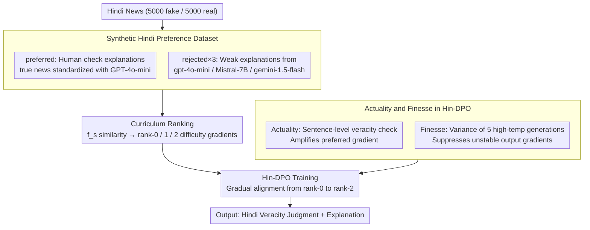

# From Fragments to Facts: A Curriculum-Driven DPO Approach for Generating Hindi News Veracity Explanations

**Conference**: ACL2026 Findings  
**arXiv**: [2507.05179](https://arxiv.org/abs/2507.05179)  
**Code**: Project Page: From Fragments to Facts (URL not provided in cache)  
**Area**: Multilingual NLP / Fact-checking / Explanation Generation  
**Keywords**: Hindi fact-checking, DPO, curriculum learning, explanation generation, hallucination mitigation  

## TL;DR
This paper proposes DeFactoX, which organizes Hindi news preference data using curriculum learning and incorporates two signals—Actuality (factuality) and Finesse (stability)—into Direct Preference Optimization (DPO). This enables the model to simultaneously predict news veracity and generate Hindi rationales that closely resemble human fact-checking explanations.

## Background & Motivation
**Background**: Automated misinformation detection and explanation generation have been extensively studied in high-resource languages like English and Chinese. However, Hindi—a language with a massive user base but low automated resources—still lacks reliable fact-checking explanation generation tools. Real-world Hindi fact-checking relies primarily on manual platforms, which are difficult to scale to massive news dissemination scenarios.

**Limitations of Prior Work**: Although general LLMs can generate fluent explanations, they are prone to shallow textual biases in Hindi news veracity judgment. They often focus on a single factual dimension, lack context and evidence chains, and may even generate plausible-sounding but factually unstable explanations. Supervised fine-tuning alone struggles to teach models "what kind of explanation looks like a professional fact-checker's."

**Key Challenge**: Explanation generation must stay close to human rationales while avoiding factual errors and hallucinations. Standard DPO uses preferred/rejected responses for preference alignment, but it does not explicitly distinguish whether the "facts are correct" or if "repeated generations are stable."

**Goal**: The authors aim to construct a preference learning framework for Hindi news veracity, allowing the model to transition from distinguishing easy, low-quality explanations to difficult, high-similarity ones, while explicitly incorporating factual correctness and hallucination stability into the optimization objective.

**Key Insight**: The paper uses human explanations from fact-checking websites as preferred responses and weak explanations from multiple LLMs as rejected responses. These rejected responses are سپس ranked into a curriculum by difficulty using automated scoring.

**Core Idea**: By integrating curriculum learning, DPO, the Actuality factuality signal, and the Finesse uncertainty signal into Hin-DPO, the preference optimization is directed not just toward "resembling the reference answer," but toward explanations that are factually correct and stable in generation.

## Method
DeFactoX consists of two main stages: constructing the Hindi news preference dataset and fine-tuning the model with curriculum-driven Hin-DPO. Data is sourced from Hindi fact-checking websites. The input is the news lead (excluding direct veracity and reasoning); the output requires the model to provide a veracity judgment and an explanation. Preferred explanations come from human fact-checking or standardized real news explanations, while rejected explanations come from weaker responses generated by various LLMs.

### Overall Architecture
The first stage involves preference data construction. The authors extracted 10,000 news articles (5,000 fake, 5,000 real) from the Sharma and Arya dataset. Human explanations for fake news naturally contain clear refutations and evidence. Explanations for true news are often just informative summaries; thus, the authors used GPT-4o-mini to standardize true news explanations to explicitly state veracity while maintaining factual content. Then, gpt-4o-mini, Mistral-7B-v0.1, and gemini-1.5-flash were used to generate rejected responses, creating one preferred and three rejected responses per sample.

The second stage is curriculum-driven preference optimization. For rejected responses, a weighted similarity function $f_s$ measures their closeness to the ground-truth rationale, categorizing them into rank-0, rank-1, and rank-2 difficulty levels. The model first learns from easily distinguishable low-quality rejected samples and progresses to those more similar to the preferred ones. Finally, the Hin-DPO loss combines the log probability ratios of preferred/rejected responses with Actuality and Finesse signals.

### Key Designs

**1. Synthetic Hindi Preference Dataset: Using existing human-checked explanations as preferred and LLM weak explanations as rejected to bypass full manual labeling**

Hindi lacks large-scale, high-quality explanation preference data, and manual labeling from scratch is too costly. The authors paired existing resources: the preferred responses are taken directly from human explanations on fact-checking sites. Since true news explanations are often just summaries without explicit stances, GPT-4o-mini was used to standardize them to clearly state veracity while preserving facts. Rejected responses were intentionally generated by gpt-4o-mini, Mistral-7B-v0.1, and gemini-1.5-flash under simple prompts, retaining common LLM flaws like shallowness and factual instability. Each news item ends up with one preferred and three rejected pairs, repurposing professional judgments while naturally covering common LLM errors.

**2. Curriculum Ranking: Using a weighted similarity function to rank three negative examples into difficulty gradients, allowing DPO to learn easy before hard**

If a model is immediately matched against rejected responses that are very close to the preferred ones, it struggles to distinguish subtle differences, leading to unstable optimization. The authors calculated a similarity score $f_s=(\mathrm{BERTScore}+3\times(\mathrm{ROUGE\text{-}L}+\mathrm{METEOR}))/4$ between each rejected response and the ground-truth rationale. Based on this, negatives are ranked (rank-0, rank-1, rank-2), and training progresses through these levels. The 1:3 weight was chosen because it achieved a Spearman $\rho=0.81$ with human rankings on 300 samples, significantly higher than 1:1 (0.63) or 1:2 (0.74), suggesting it closely mirrors human judgment of "explanation quality."

**3. Hin-DPO's Actuality and Finesse: Explicitly integrating "factual correctness" and "generation stability" into the DPO objective**

Standard DPO identifies preferred answers but does not understand *why* they are preferred, thus it neither rewards factual correctness nor penalizes hallucinations. The authors added two task-specific signals: Actuality uses GPT-4o-mini with web search to verify each factual statement in an explanation (the average score represents "factuality"); Finesse measures output jitter across 5 high-temperature generations for the same input (representing "stability"). In Hin-DPO, the preferred log ratio is amplified by $(1+s_w)$ (strengthening factually correct responses), while the rejected log ratio is modulated by $\max(0.01,s_l)$. The entire objective is scaled by $1/(v+\epsilon)$ according to Finesse (reducing gradients for unstable outputs). This ensures the model favors explanations that are both factually accurate and consistently generated.

### Loss & Training
Let $r_w=\pi_\theta(y_w|x)/\pi_{ref}(y_w|x)$ and $r_l=\pi_\theta(y_l|x)/\pi_{ref}(y_l|x)$. Hin-DPO defines an intermediate score $S(x,y_w,y_l)=\frac{1}{v+\epsilon}[(1+s_w)\log r_w-\max(0.01,s_l)\log r_l]$, with the final loss as $\mathcal{L}_{Hin\text{-}DPO}=-\mathbb{E}[\log\sigma(\beta\cdot S)]$. Here, $s_w,s_l$ represent Actuality for preferred/rejected samples, $v$ is Finesse, and $\epsilon$ is a learnable parameter.

Experiments fine-tuned five models: Gemma-2-9B-It, Llama-3.1-8B-Instruct, Mistral-7B-Instruct-v0.3, mBART-large-50, and mT5-large. Automated evaluation used ROUGE-1/2/L, METEOR, and BERTScore; the Polyglot tokenizer was used for Hindi ROUGE and METEOR.

## Key Experimental Results

### Main Results
| Model | Method | ROUGE-1 | ROUGE-2 | ROUGE-L | METEOR | BERTScore |
|------|------|---------|---------|---------|--------|-----------|
| mT5 | DPO | 17.93 | 9.14 | 13.59 | 22.87 | 73.61 |
| mT5 | Hin-DPO | 20.29 | 9.45 | 16.89 | 24.39 | 77.32 |
| Llama3.1-8B | DPO | 34.56 | 22.00 | 28.73 | 34.53 | 80.98 |
| Llama3.1-8B | Hin-DPO | 37.13 | 24.07 | 31.22 | 37.25 | 84.73 |
| Gemma2-9B | DPO | 30.92 | 19.86 | 25.19 | 31.21 | 79.59 |
| Gemma2-9B | Hin-DPO | 33.55 | 21.64 | 27.91 | 33.84 | 83.67 |

### Ablation Study
| Experiment | Configuration | mT5 Results | Llama3.1-8B Results | Description |
|------|------|----------|-------------------|------|
| Curriculum | DPO w/o CL | R-L 13.59 / BS 73.61 | R-L 28.73 / BS 80.98 | Standard DPO |
| Curriculum | DPO with CL | R-L 15.37 / BS 75.02 | R-L 30.00 / BS 82.04 | CL is effective alone |
| Curriculum | Hin-DPO w/o CL | R-L 15.22 / BS 76.19 | R-L 29.74 / BS 82.01 | Actuality + Finesse effective alone |
| Curriculum | Hin-DPO with CL | R-L 16.89 / BS 77.32 | R-L 31.22 / BS 84.73 | Full method is best |
| Human Eval | Base+SFT | Gemma 3.29 | Llama 3.07 | 0-5 avg human score |
| Human Eval | DPO | Gemma 3.92 | Llama 3.87 | Preference learning helps significantly |
| Human Eval | Hin-DPO | Gemma 4.12 | Llama 4.23 | Consistent with automated metrics |

### Key Findings
- Compared to standard DPO, Hin-DPO improved ROUGE-L by +3.30 and BERTScore by +3.71 on mT5; on Llama3.1-8B, it improved ROUGE-L by +2.49 and BERTScore by +3.75.
- Validation of the Actuality score on 400 factual claims showed GPT-4o-mini achieved 80.0% accuracy, 78.8% precision, 89.1% recall, and 83.7% F1 relative to human judgments.
- Veracity prediction also improved with Hin-DPO: Gemma2-9B reached 80.6% accuracy / 78.4% F1, and Llama3.1-8B reached 81.2% accuracy / 78.9% F1.
- Curriculum learning and Hin-DPO are complementary. Adding either CL or Actuality/Finesse yields gains, while the full combination performs best.
- Human evaluation of 800 explanations by three students showed a Spearman agreement of 0.71, indicating consistent evaluation.

## Highlights & Insights
- The most practical aspect is using fact-checker explanations as preference signals rather than simple classification. For misinformation applications, transparent explanations are often more vital than labels.
- Actuality and Finesse address "factuality" and "stability," respectively. These signals target the core risks of explanation generation: fluent but incorrect text, and inconsistent reasoning.
- Curriculum learning is essential here as it matches the data structure. Ranking rejected responses by similarity helps the model learn easy differences before fine-grained ones, stabilizing alignment.
- While GPT-4o-mini is used for both generation and Actuality scoring, the authors distinguished them via settings: the former is zero-shot document-level generation, while the latter is sentence-level verification with web search, mitigating concerns about circular dependency.

## Limitations & Future Work
- High-quality Hindi fact-checked data remains limited; domain diversity is constrained by source data, potentially reducing effectiveness for highly specialized news.
- The system was only evaluated on Hindi. Migration to other low-resource languages requires new data, native speaker validation, and language-specific resources.
- Model scale was limited to under 10B parameters, with no comparison to larger reasoning-oriented models.
- Actuality relies on external LLMs and search, which may introduce biases or retrieval errors; Finesse requires multiple generations per input, significantly increasing computational costs.
- High-risk scenarios (e.g., politics, medicine) should still involve human-in-the-loop verification, as automated explanations are not final truth.

## Related Work & Insights
- **vs Standard Fake News Detection**: Traditional methods output veracity labels or interpretable features. DeFactoX generates veracity explanations, aligning better with reader and fact-checker workflows.
- **vs Standard DPO**: While standard DPO uses fixed preference pairs, Hin-DPO treats factuality and uncertainty as task-specific weights to align preference optimization with fact-checking goals.
- **vs Curry-DPO**: Building on the concept that curriculum learning enhances preference optimization, this work applies it specifically to Hindi explanation ranking with Actuality/Finesse adaptations.

## Rating
- Novelty: ⭐⭐⭐⭐☆ Combines existing DPO and curriculum learning concepts specifically for Hindi veracity explanation with targeted heuristics.
- Experimental Thoroughness: ⭐⭐⭐⭐☆ Covers five models, automated metrics, human evaluation, and ablation studies; lacks larger models and cross-lingual validation.
- Writing Quality: ⭐⭐⭐⭐☆ Data construction and loss functions are clearly explained; technical validation is thorough (though some URLs were missing).
- Value: ⭐⭐⭐⭐☆ Highly practical for low-resource fact-checking and provides a reusable design for factuality-oriented preference optimization.

<!-- RELATED:START -->

## Related Papers

- [\[ACL 2026\] CLewR: Curriculum Learning with Restarts for Machine Translation Preference Learning](clewr_curriculum_learning_with_restarts_for_machine_translation_preference_learn.md)
- [\[ACL 2025\] CLIX: Cross-Lingual Explanations of Idiomatic Expressions](../../ACL2025/multilingual_mt/clix_cross-lingual_explanations_of_idiomatic_expressions.md)
- [\[ACL 2026\] SERM: Self-Evolving Relevance Model with Agent-Driven Learning from Massive Query Streams](serm_self-evolving_relevance_model_with_agent-driven_learning_from_massive_query.md)
- [\[ACL 2025\] Code-Switching Curriculum Learning for Multilingual Transfer in LLMs](../../ACL2025/multilingual_mt/code-switching_curriculum_learning_for_multilingual_transfer_in_llms.md)
- [\[ACL 2025\] Hierarchical Level-Wise News Article Clustering via Multilingual Matryoshka Embeddings](../../ACL2025/multilingual_mt/hierarchical_news_clustering.md)

<!-- RELATED:END -->
