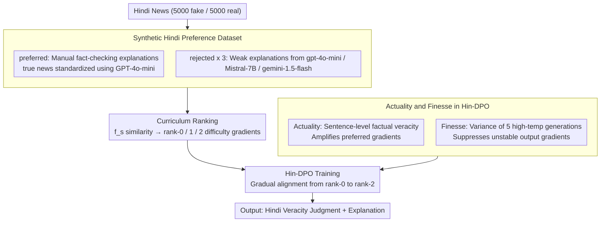

# From Fragments to Facts: A Curriculum-Driven DPO Approach for Generating Hindi News Veracity Explanations

**Conference**: ACL2026 Findings  
**arXiv**: [2507.05179](https://arxiv.org/abs/2507.05179)  
**Code**: Project Page: From Fragments to Facts (URL not provided in cache)  
**Area**: Multilingual NLP / Fact-checking / Explanation Generation  
**Keywords**: Hindi fact-checking, DPO, curriculum learning, explanation generation, hallucination mitigation  

## TL;DR
This paper proposes DeFactoX, which organizes Hindi news preference data using curriculum learning and incorporates two signals—Actuality (factuality) and Finesse (stability)—into DPO. This enables the model to simultaneously predict news veracity and generate Hindi rationales that closely align with manual fact-checking explanations.

## Background & Motivation
**Background**: Automated misinformation detection and explanation generation have been extensively studied in high-resource languages like English and Chinese. however, languages like Hindi, which have large speaker populations but low automated resources, still lack reliable fact-checking explanation generation tools. In practice, Hindi fact-checking primarily relies on manual platforms, making it difficult to scale to massive news dissemination scenarios.

**Limitations of Prior Work**: Although general LLMs can generate fluent explanations, they are prone to shallow textual cue biases in Hindi news veracity judgment. They often focus on a single factual dimension, lack context and evidence chains, and may even generate plausible-sounding but factually unstable explanations. Supervised fine-tuning alone struggle to teach models "what an explanation looks like to a professional fact-checker."

**Key Challenge**: Explanation generation must stay close to human rationales while avoiding factual errors and hallucinations. Standard DPO leverages preferred/rejected responses for preference alignment, but it does not explicitly distinguish whether the facts are correct or if repeated generations are stable.

**Goal**: The authors aim to construct a preference learning framework for Hindi news veracity, allowing the model to transition from easily distinguishable poor explanations to difficult-to-distinguish high-similarity explanations, while explicitly incorporating factual correctness and hallucination stability into the optimization objective.

**Key Insight**: The paper utilizes manual explanations from fact-checking websites as preferred responses and weak explanations from multiple LLMs as rejected responses. Automated scoring is then used to rank the rejected responses into a curriculum by difficulty.

**Core Idea**: By integrating curriculum learning, DPO, the Actuality factuality signal, and the Finesse uncertainty signal into Hin-DPO, the preference optimization is biased not only toward "resembling the reference answer" but also toward explanations that are factually correct and stable.

## Method
DeFactoX consists of two main threads: first, constructing Hindi news preference data, and second, fine-tuning the model using curriculum-driven Hin-DPO. Data is sourced from Hindi fact-checking websites; inputs consist of news leads without direct veracity or reasoning, and outputs require the model to provide a veracity judgment and explanation. Preferred explanations come from manual fact-checking or standardized real news explanations, while rejected explanations are derived from weaker answers generated by LLMs.

### Overall Architecture
The first stage involves preference data construction. The authors extracted 10,000 news articles (5,000 fake and 5,000 real) from the Sharma and Arya dataset. Since manual explanations for fake news naturally contain clear refutations and evidence while true news explanations are often just informative summaries, the authors standardized the true news explanations using GPT-4o-mini to explicitly state veracity while maintaining factual content. Rejected responses were then generated by GPT-4o-mini, Mistral-7B-v0.1, and Gemini-1.5-Flash, forming one preferred and three rejected responses per sample.

The second stage is curriculum-driven preference optimization. For rejected responses, a scoring function $f_s$ measures their similarity to the ground-truth rationale, categorizing them into rank-0, rank-1, and rank-2 difficulty levels. The model first learns from the most easily distinguishable low-quality rejected responses and gradually progresses to those closer to the preferred response. Finally, the Hin-DPO loss combines the log probability ratio of preferred/rejected pairs with Actuality and Finesse.

### Key Designs

**1. Synthetic Hindi Preference Dataset: Using existing manual fact-checking explanations as preferred and weak LLM explanations as rejected to bypass full manual annotation.**

Hindi lacks large-scale, high-quality preference data for explanations, and manual annotation from scratch is too costly. The authors bridged this by pairing existing resources: preferred samples are taken directly from manual explanations on fact-checking sites. However, since true news explanations are often just summaries, GPT-4o-mini is used to standardize them to explicitly state veracity while preserving factual content. Rejected samples are intentionally generated using GPT-4o-mini, Mistral-7B-v0.1, and Gemini-1.5-Flash under simple prompts to retain shallow, one-sided, and factually unstable flaws. This approach reuses professional judgments as positive samples while ensuring negative samples cover typical LLM errors.

**2. Curriculum Ranking: Using a weighted similarity function to rank three negative examples into difficulty gradients, allowing DPO to learn easy distinctions before hard ones.**

Comparing highly similar rejected responses to preferred ones immediately can lead to unstable optimization. The authors calculate a similarity score $f_s=(\text{BERTScore}+3\times(\text{ROUGE-L}+\text{METEOR}))/4$ against the ground-truth rationale for each rejected response. These are then ranked (rank-0, rank-1, rank-2). Training progresses from the easiest (rank-0) to the hardest (rank-2). This 1:3 weighting was chosen because it achieved a Spearman $\rho=0.81$ with human rankings on 300 samples, significantly higher than 1:1 (0.63) or 1:2 (0.74), indicating it best aligns with human judgment of explanation quality.

**3. Actuality and Finesse in Hin-DPO: Explicitly incorporating "truthfulness" and "generation stability" into the DPO objective.**

Standard DPO identifies which response is preferred but not "why," thus it neither rewards factual correctness nor penalizes hallucinations. The authors added two task-specific signals: Actuality uses GPT-4o-mini with web search to verify the veracity of each factual claim in the explanation sentence-by-sentence, representing "factual correctness." Finesse measures output jitter via the variance of token distributions across five high-temperature generations, representing "consistency." In Hin-DPO, the preferred log ratio is amplified by $(1+s_w)$ (strengthening factually correct samples), while the rejected log ratio is adjusted by $\max(0.01,s_l)$. The entire objective is scaled by $1/(v+\epsilon)$ according to Finesse (suppressing gradients for unstable outputs). This ensures the model favors both factual accuracy and stability, addressing the risks of fluent but incorrect or inconsistent explanations.

### Loss & Training
Let $r_w=\pi_\theta(y_w|x)/\pi_{ref}(y_w|x)$ and $r_l=\pi_\theta(y_l|x)/\pi_{ref}(y_l|x)$. Hin-DPO defines an intermediate score $S(x,y_w,y_l)=\frac{1}{v+\epsilon}[(1+s_w)\log r_w-\max(0.01,s_l)\log r_l]$, with the final loss being $\mathcal{L}_{Hin\text{-}DPO}=-\mathbb{E}[\log\sigma(\beta\cdot S)]$. Here, $s_w,s_l$ are the Actuality scores for preferred/rejected responses, $v$ is Finesse, and $\epsilon$ is a learnable parameter.

Five models were fine-tuned: Gemma-2-9B-It, Llama-3.1-8B-Instruct, Mistral-7B-Instruct-v0.3, mBART-large-50, and mT5-large. Automated evaluation used ROUGE-1/2/L, METEOR, and BERTScore; the Polyglot tokenizer was used for Hindi ROUGE and METEOR.

## Key Experimental Results

### Main Results

| Model | Method | ROUGE-1 | ROUGE-2 | ROUGE-L | METEOR | BERTScore |
|------|------|---------|---------|---------|--------|-----------|
| mT5 | DPO | 17.93 | 9.14 | 13.59 | 22.87 | 73.61 |
| mT5 | Hin-DPO | 20.29 | 9.45 | 16.89 | 24.39 | 77.32 |
| Llama3.1-8B | DPO | 34.56 | 22.00 | 28.73 | 34.53 | 80.98 |
| Llama3.1-8B | Hin-DPO | 37.13 | 24.07 | 31.22 | 37.25 | 84.73 |
| Gemma2-9B | DPO | 30.92 | 19.86 | 25.19 | 31.21 | 79.59 |
| Gemma2-9B | Hin-DPO | 33.55 | 21.64 | 27.91 | 33.84 | 83.67 |

### Ablation Study

| Experiment | Configuration | mT5 Result | Llama3.1-8B Result | Description |
|------|------|----------|-------------------|------|
| Curriculum | DPO w/o CL | R-L 13.59 / BS 73.61 | R-L 28.73 / BS 80.98 | Standard DPO |
| Curriculum | DPO with CL | R-L 15.37 / BS 75.02 | R-L 30.00 / BS 82.04 | Curriculum learning alone is effective |
| Curriculum | Hin-DPO w/o CL | R-L 15.22 / BS 76.19 | R-L 29.74 / BS 82.01 | Actuality + Finesse alone are effective |
| Curriculum | Hin-DPO with CL | R-L 16.89 / BS 77.32 | R-L 31.22 / BS 84.73 | Full method is best |
| Human Eval | Base+SFT | Gemma 3.29 | Llama 3.07 | Mean human score (0-5) |
| Human Eval | DPO | Gemma 3.92 | Llama 3.87 | Preference learning significantly improves |
| Human Eval | Hin-DPO | Gemma 4.12 | Llama 4.23 | Consistent with automated metrics |

### Key Findings
- Compared to standard DPO, Hin-DPO improved ROUGE-1 by +2.36, ROUGE-L by +3.30, and BERTScore by +3.71 on mT5; and ROUGE-1 by +2.57, ROUGE-L by +2.49, and BERTScore by +3.75 on Llama3.1-8B.
- In verifying the Actuality score across 400 factual claims, GPT-4o-mini achieved 80.0% accuracy, 78.8% precision, 89.1% recall, and 83.7% F1 compared to human judgment.
- Veracity prediction also improved with Hin-DPO: Gemma2-9B reached 80.6% accuracy / 78.4% F1, and Llama3.1-8B reached 81.2% accuracy / 78.9% F1.
- Curriculum learning and Hin-DPO are complementary. Adding CL or Actuality/Finesse individually yielded gains, but the complete combination was best for mT5 and Llama3.1-8B.
- Human evaluation of 800 explanations by three students showed a Spearman agreement of 0.71, indicating consistent evaluation trends.

## Highlights & Insights
- The most practical contribution of this paper is treating fact-checker explanations as preference learning signals rather than just performing binary classification. For misinformation applications, transparent explanations are often more important than a single label.
- Actuality and Finesse directly address the core risks of fact-checking explanation generation: fluent but incorrect content, and inconsistent reasoning across runs.
- Curriculum learning is not merely decorative here; it aligns with the data structure. Ranking rejected responses helps stabilize alignment by learning obvious differences before subtle ones.
- The paper acknowledges the dual use of GPT-4o-mini for both rejected generation and Actuality verification, but clarifies the distinction: the former is non-retrieval document-level generation, while the latter is sentence-level verification with web search, reducing concerns about circular dependency.

## Limitations & Future Work
- High-quality Hindi fact-checked data remains limited, restricting the domain diversity covered in training and evaluation; performance may drop for highly specialized or technical news.
- The study focuses solely on Hindi; migrating to other low-resource languages would require new data, native speaker validation, and language-specific fact-checking resources.
- The scale of experimental models was limited to under 10B parameters, with no comparison to larger reasoning-oriented models.
- Actuality depends on external LLMs and retrieval, potentially introducing biases or errors; Finesse requires multiple generations per input, significantly increasing computational cost.
- High-risk scenarios like political or medical news should still maintain a human-in-the-loop approach; automated explanations should not be treated as final factual adjudications.

## Related Work & Insights
- **vs Standard fake news detection**: Traditional methods output veracity labels or interpretable features; DeFactoX generates veracity explanations, which is better suited for workflows involving readers and fact-checkers.
- **vs Standard DPO**: While standard DPO uses preference pairs, Hin-DPO uses factuality and uncertainty as task-specific weights to align preference optimization more closely with fact-checking goals.
- **vs Curry-DPO / curriculum preference optimization**: Related work has shown curriculum learning enhances preference optimization; this study applies curriculum specifically to Hindi explanation ranking and uses Actuality/Finesse for domain adaptation.

## Rating
- Novelty: ⭐⭐⭐⭐☆ DPO, curriculum learning, and factuality scoring are not new, but their combination for Hindi veracity explanation is highly targeted.
- Experimental Thoroughness: ⭐⭐⭐⭐☆ Covers five models, automated metrics, human evaluation, ablations, and veracity prediction; lacks larger models and cross-lingual validation.
- Writing Quality: ⭐⭐⭐⭐☆ Clear explanation of data construction and loss functions with sufficient appendix verification; Project Page URL was missing.
- Value: ⭐⭐⭐⭐☆ highly practical for low-resource language fact-checking and provides a reusable design for factuality-oriented preference optimization.

<!-- RELATED:START -->

## Related Papers

- [\[ACL 2026\] CLewR: Curriculum Learning with Restarts for Machine Translation Preference Learning](clewr_curriculum_learning_with_restarts_for_machine_translation_preference_learn.md)
- [\[ACL 2025\] CLIX: Cross-Lingual Explanations of Idiomatic Expressions](../../ACL2025/multilingual_mt/clix_cross-lingual_explanations_of_idiomatic_expressions.md)
- [\[ACL 2026\] SERM: Self-Evolving Relevance Model with Agent-Driven Learning from Massive Query Streams](serm_self-evolving_relevance_model_with_agent-driven_learning_from_massive_query.md)
- [\[ACL 2025\] Code-Switching Curriculum Learning for Multilingual Transfer in LLMs](../../ACL2025/multilingual_mt/code-switching_curriculum_learning_for_multilingual_transfer_in_llms.md)
- [\[ACL 2025\] Hierarchical Level-Wise News Article Clustering via Multilingual Matryoshka Embeddings](../../ACL2025/multilingual_mt/hierarchical_news_clustering.md)

<!-- RELATED:END -->
