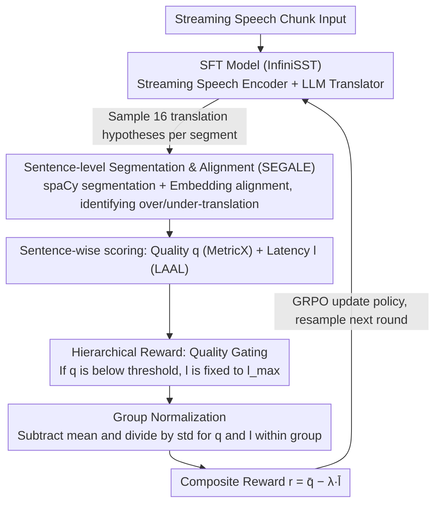

# Hierarchical Policy Optimization for Simultaneous Translation of Unbounded Speech

**Conference**: ACL 2026 Oral  
**arXiv**: [2604.21045](https://arxiv.org/abs/2604.21045)  
**Code**: [https://github.com/owaski/HPO](https://github.com/owaski/HPO)  
**Area**: Image Segmentation  
**Keywords**: Simultaneous Speech Translation, Reinforcement Learning, Hierarchical Reward, LLM-based Speech Translation, GRPO

## TL;DR
This paper proposes Hierarchical Policy Optimization (HPO), which post-trains LLM-based simultaneous speech translation models using a hierarchical reward design. By suppressing latency optimization when translation quality fails to meet a threshold, it achieves a +7 COMET translation quality improvement at a 1.5-second latency.

## Background & Motivation

**Background**: Simultaneous Speech Translation (SST) requires generating translations while receiving partial speech input. Recently, LLM-based methods have become the mainstream approach for handling unbounded long speech (e.g., InfiniSST) by modeling SST as a multi-turn dialogue task and utilizing KV cache reuse to eliminate redundant computation.

**Limitations of Prior Work**: These methods rely heavily on synthetic read-write trajectory data for supervised fine-tuning (SFT). However, existing trajectory synthesis methods have significant flaws. Methods based on word alignment tools ignore the future context required for translation timing; methods simulating interpreters via LLMs have unstable segmentation and fail to guarantee the generation of valid read-write trajectories. This results in suboptimal SFT data quality, causing models to learn erroneous behaviors.

**Key Challenge**: There is an inherent trade-off between translation quality and latency. When jointly optimizing both using reinforcement learning, the latency reward is easier to optimize (latency can be reduced simply by translating early, regardless of accuracy), leading the model to over-optimize for latency at the expense of translation quality.

**Goal**: Design a post-training method to correct the erroneous behaviors of SFT models while stably balancing the optimization of translation quality and latency.

**Key Insight**: The author observes that the fundamental reason latency rewards dominate optimization is the difference in reward scales and the asymmetry in optimization difficulty. By introducing a "quality gating" mechanism—allowing latency optimization only after translation quality reaches a certain standard—an effective hierarchical constraint can be established.

**Core Idea**: Constrain GRPO training with a hierarchical reward structure: if translation quality does not exceed a threshold, the latency reward is set to its worst possible value, ensuring the model prioritizes accuracy before pursuing speed.

## Method

### Overall Architecture
The system consists of a streaming speech encoder and an LLM translator. Speech is divided into fixed-duration chunks; the encoder incrementally encodes each new chunk and reuses previous KV caches, while the LLM decodes the next translation segment based on interleaved speech features and previously generated translations. Based on this SFT model, HPO samples multiple translation hypotheses, calculates hierarchical rewards, and optimizes using GRPO.

### Key Designs

**1. Sentence-level Segmentation & Alignment (SEGALE): Segmenting long translations and aligning with references to prevent gibberish from obtaining high scores.**

Traditional mwersegmenter forces alignment by minimizing the Word Error Rate. Even if the hypothesis is meaningless gibberish, it will force an alignment, which—when paired with non-robust neural metrics—can result in falsely high scores, essentially creating a backdoor for reward hacking. SEGALE takes a different path: it uses spaCy for sentence segmentation, followed by an embedding-based aligner with adaptive search to align hypothesis sentences with reference sentences, explicitly identifying over-translation ($R_k=\phi$) and under-translation ($H_k=\phi$) anomalies. This ensures that reward signals are built on the basis that "sentences actually correspond," preventing gibberish from passing through and making subsequent quality/latency scoring meaningful.

**2. Hierarchical Reward: Locking latency optimization with a quality gate to enforce "quality first, then speed."**

Translation quality and latency are naturally in conflict, and latency rewards are easier to "game"—latency decreases as long as one speaks early, regardless of accuracy. Direct weighted combinations of the two drive the model toward "translating early but poorly." HPO calculates a quality score $q^{j,k}$ (MetricX) and a latency score $l^{j,k}$ (LAAL) for each aligned sentence pair. The critical step is a gate: if the quality score is below a threshold $q_{\text{thres}}$, the latency score is fixed at the worst value $l_{\max}$. Essentially, "if it's not translated well, speed is irrelevant." Subsequently, sentences within a hypothesis are averaged, and samples within a group undergo group normalization to produce the final reward $r^j=\bar{q}^j-\lambda\cdot\bar{l}^j$. This hard constraint replaces "weighted balance" with "hierarchical priority," rewarding low latency only when translation is sufficiently good.

**3. Group Normalization: Bringing disparate scales of quality and latency scores to the same level to stabilize training.**

The range for the quality metric MetricX is -25 to 0, while the latency metric is in seconds. Their scales are vastly different; a direct addition would let one term dominate the gradient and cause training to diverge. For $n$ hypotheses sampled from the same prompt, the author applies group normalization (subtracting the mean and dividing by the standard deviation) to quality and latency scores separately before combining them, ensuring both rewards fall on comparable scales. This step is the prerequisite for the hierarchical reward to work stably—otherwise, the gating and weighting would be overwhelmed by scale differences.

### Loss & Training
The GRPO framework is adopted, sampling 16 translation trajectories for each speech segment, using clipped importance sampling and on-policy KL divergence regularization. MetricX serves as the quality reward model with a quality threshold $q_{\text{thres}} = -5$, a latency weight $\lambda = 0.5$, and a KL penalty weight of 0.01. Training takes approximately 20 hours (500 steps) on 3 8×H100 nodes, with one node dedicated to reward calculation.

## Key Experimental Results

### Main Results
On the ACL 60/60 dev set for En→Zh/De/Ja directions, HPO significantly outperforms the InfiniSST baseline across COMET, MetricX, and BLEURT metrics.

| Direction | Latency(s) | COMET Gain | MetricX Gain | BLEURT Gain |
|-----------|------------|------------|--------------|-------------|
| En→Zh     | ~1.5s      | +7         | +1.25        | +4          |
| En→De     | ~1.5s      | Significant Gain | Significant Gain | Significant Gain |
| En→Ja     | ~1.5s      | Significant Gain | Significant Gain | Significant Gain |

### Ablation Study

| Configuration | StreamLAAL | COMET | MetricX |
|---------------|------------|-------|---------|
| SFT (Baseline)| 1216       | 0.7348| -4.52   |
| Normalize     | 1555       | 0.7977| -3.41   |
| Normalize + Truncation (SeqPO) | 1805 | 0.8058 | -3.39 |
| Normalize + Hierarchical-Doc | 1544 | 0.8157 | -3.27 |
| Normalize + Hierarchical-Sent (HPO) | 1383 | 0.8234 | -3.21 |

### Key Findings
- Sentence-level hierarchical rewards (Hierarchical-Sent) consistently outperform document-level rewards and simple truncation methods, achieving better translation quality at lower latency.
- MetricX is the only one among six quality reward functions that performs consistently across all automatic metrics and human evaluations.
- BLEU is the sole exception; HPO does not necessarily outperform the baseline on BLEU. Gemini evaluation also confirms that optimization based on neural rewards can lead to reward hacking.
- Models using mwersegmenter exploit weaknesses in segmentation and metrics for reward hacking, where gibberish hypotheses still receive high scores.

## Highlights & Insights
- The design of the hierarchical reward is ingenious: rather than a simple weighted balance of two objectives, it establishes a "quality first" hard constraint, allowing speed optimization only when translation is sufficiently accurate. This approach can be generalized to all multi-objective RL scenarios involving a "primary goal + auxiliary goal."
- It exposes the reward hacking vulnerability of the mwersegmenter + neural metric combination, where gibberish text can receive near-perfect MetricX scores after segmentation. This is a significant finding for the translation evaluation field.
- HPO even surpasses offline translation models in quality under certain settings, indicating that RL post-training can not only correct SFT errors but also discover strategies superior to full offline translation.

## Limitations & Future Work
- Only one architecture (InfiniSST), one data synthesis method, and three directions with English as the source language were validated.
- MetricX as a reward model is still imperfect, sometimes favoring fluency over accuracy, which may lead to reward hacking.
- BLEU and Gemini evaluations show a risk of overfitting in neural reward optimization, necessitating more robust quality reward models.
- The effect of applying HPO to offline translation models (standard GRPO) has not been explored.

## Related Work & Insights
- **vs InfiniSST (SFT)**: InfiniSST only uses synthetic trajectories for SFT. HPO uses RL post-training on top of it to correct erroneous behaviors, significantly outperforming SFT at all latency levels.
- **vs SeqPO-SiMT**: SeqPO uses truncation and normalization for latency rewards but is limited to text translation and does not support unbounded speech. HPO's hierarchical reward outperformed truncation methods in ablations.
- **vs Traditional RL-SST**: Previous RL methods were based on Encoder-Decoder Transformer text translation. HPO is the first to extend RL to LLM-based unbounded speech simultaneous translation.

## Rating
- Novelty: ⭐⭐⭐⭐ The hierarchical reward idea is simple and effective, though the GRPO framework itself is not a new contribution.
- Experimental Thoroughness: ⭐⭐⭐⭐⭐ Trilingual directions, six reward functions, multi-dimensional ablations, human evaluation, and reward hacking analysis make it very comprehensive.
- Writing Quality: ⭐⭐⭐⭐⭐ Clear motivation, rigorous logical description of methods, and well-designed charts.
- Value: ⭐⭐⭐⭐ Has direct guiding significance for RL training in simultaneous translation; the hierarchical reward concept has broad applicability.

<!-- RELATED:START -->

## Related Papers

- [\[ACL 2025\] SeqPO-SiMT: Sequential Policy Optimization for Simultaneous Machine Translation](../../ACL2025/multilingual_mt/seqpo-simt_sequential_policy_optimization_for_simultaneous_machine_translation.md)
- [\[ACL 2026\] TLPO: Token-Level Policy Optimization for Mitigating Language Confusion in Large Language Models](tlpo_token-level_policy_optimization_for_mitigating_language_confusion_in_large_.md)
- [\[ACL 2026\] Efficient Training for Cross-lingual Speech Language Models](efficient_training_for_cross-lingual_speech_language_models.md)
- [\[ACL 2026\] NiuTrans.LMT: Toward Inclusive and Scalable Multilingual Machine Translation with LLMs](niutranslmt_toward_inclusive_and_scalable_multilingual_machine_translation_with_.md)
- [\[ACL 2026\] NeoAMT: Neologism-Aware Agentic Machine Translation with Reinforcement Learning](neoamt_neologism-aware_agentic_machine_translation_with_reinforcement_learning.md)

<!-- RELATED:END -->
