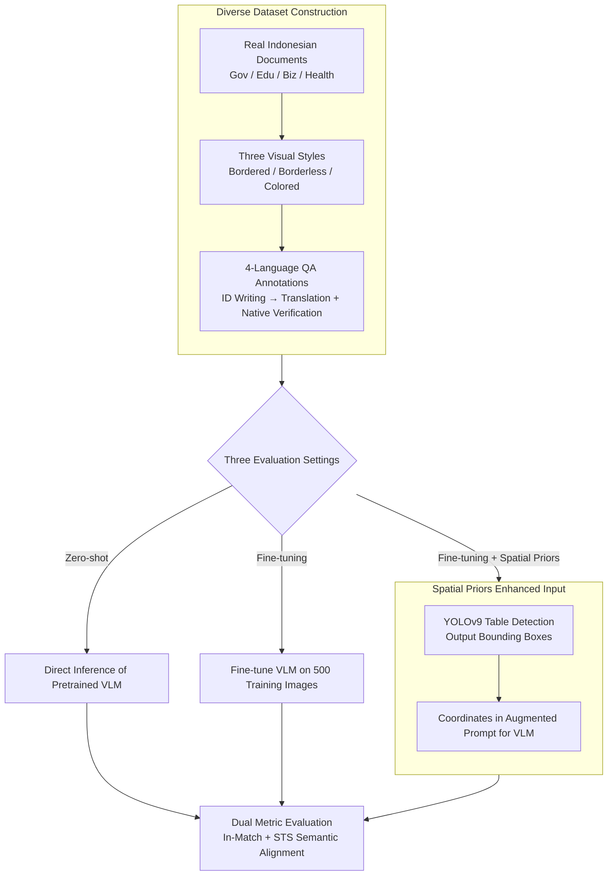

# IndoTabVQA: A Benchmark for Cross-Lingual Table Understanding in Bahasa Indonesia Documents

**Conference**: ACL 2026 Findings  
**arXiv**: [2604.11970](https://arxiv.org/abs/2604.11970)  
**Code**: [https://huggingface.co/datasets/NusaBharat/INDOTABVQA](https://huggingface.co/datasets/NusaBharat/INDOTABVQA)  
**Area**: Document Understanding / Cross-lingual VQA  
**Keywords**: Cross-lingual Table Understanding, Visual Question Answering, Indonesian Documents, Spatial Priors, Low-resource Languages

## TL;DR

IndoTabVQA is proposed as a cross-lingual visual question answering benchmark for Indonesian (Bahasa Indonesia) document tables, featuring 1,593 document images and QA annotations in four languages (Indonesian/English/Hindi/Arabic). It reveals a significant performance gap in VLMs for low-resource languages and cross-lingual table understanding, where fine-tuning combined with spatial priors yields an In-Match accuracy of up to 48.5%.

## Background & Motivation

**Background**: Vision-Language Models (VLMs) have demonstrated excellence in text-dense visual understanding tasks, with benchmarks such as TextVQA and DocVQA driving field progress. Table-specific datasets like TableVQA-Bench further evaluate structure-aware numerical reasoning capabilities.

**Limitations of Prior Work**: Existing benchmarks share a critical limitation—they are English-centric and monolingual, failing to reveal the true capabilities of VLMs in low-resource languages. Languages such as Indonesian, Hindi, and Arabic cover billions of users globally, yet VLMs may fail significantly on documents in these languages. For table VQA, models must simultaneously tackle linguistic variation and structural complexity, a combined challenge that remains understudied.

**Key Challenge**: Existing VQA benchmarks cannot assess two critical abilities: (1) whether VLMs can understand tables in low-resource languages, and (2) whether VLMs can correctly answer when the document and question are in different languages. This gap limits the understanding of real-world multilingual capabilities.

**Goal**: Build a cross-lingual table visual question answering benchmark to systematically evaluate VLM capabilities in low-resource language document understanding and cross-lingual visual reasoning.

**Key Insight**: Utilize Indonesian documents as visual content (representing over 200 million speakers but severely underrepresented in vision-language research) paired with QA annotations in four languages to isolate two challenges: visual-language understanding (monolingual setting) and cross-lingual alignment (cross-lingual setting).

**Core Idea**: Construct a benchmark using real-world Indonesian document tables and four-language QA annotations. Introduce spatial priors (table detection coordinates) as additional input to prove that targeted fine-tuning and spatial information significantly enhance VLM performance on specialized document tasks.

## Method

### Overall Architecture

The evaluation pipeline for IndoTabVQA includes three settings: (1) Zero-shot evaluation—direct inference with pretrained VLMs on the test set; (2) Fine-tuning evaluation—evaluation on 1,043 test images after fine-tuning on 500 training images; (3) Fine-tuning + Spatial Priors—using YOLOv9 to detect table regions to obtain bounding box coordinates, followed by including coordinate information in the prompt for the VLM. The input consists of a document image $I$ + a question $Q$ (in one of the four languages), and the output is a short text or numerical answer $A$, scored using a dual-metric system.

### Key Designs

**1. Diverse Dataset Construction: Forcing VLM failure modes via real Indonesian documents with three visual styles**

VLMs fail on tables for diverse reasons, and single-style tables cannot provide a comprehensive assessment. The authors collected 1,593 document images from Indonesian government reports, educational records, business documents, and public health data, categorized into three styles: 500 bordered tables, 602 borderless tables, and 491 colored tables. These categories test different abilities—borderless tables force models to infer row/column structures from whitespace and alignment, while colored tables introduce visual interference through background colors. QA annotations were human-authored in Indonesian, then expanded to English, Hindi, and Arabic via automatic translation and native speaker verification, with quality checks for internal consistency and cross-lingual equivalence.

**2. Spatial Priors Enhanced Input: Telling the model where the table is before reading it**

Zero-shot VLMs often exhibit scattered attention on full-page documents, becoming distracted by layouts outside the table. The authors adopt the "detect region first, then process" pipeline used in professional document workflows. Stage 1 uses YOLOv9, pretrained on TableBank and PubLayNet, to detect table regions, outputting coordinates and table counts. Stage 2 prepends these coordinates to the raw input in an augmented prompt. Knowing precise locations allows the model to concentrate attention on relevant content. This design also isolates "spatial localization" as a variable to quantify the exact contribution of spatial information.

**3. Dual-Metric Evaluation: In-Match for "correctness" and STS for "understanding"**

VLMs often generate redundant context, causing strict string matching to fail on correct answers. Two parallel metrics are used: In-Match accuracy uses loose matching, normalized so that the true answer is considered correct if it appears as a substring in the prediction, addressing false negatives from verbose responses. STS accuracy calculates cosine similarity using a multilingual sentence embedding model to capture semantically equivalent answers phrased differently. Together, these metrics prevent the underestimation or overestimation of model understanding.

### Loss & Training

Full instruction fine-tuning is performed on Qwen2.5-VL 3B, while LoRA is used for parameter-efficient fine-tuning on the 7B version. Each language variant is trained independently to isolate language-specific patterns. The training set contains 500 images, with 50 for validation and 1,043 for testing.

## Key Experimental Results

### Main Results

Cross-lingual In-Match Accuracy (%):

| Model | Indonesian | English | Hindi | Arabic | Average |
|------|--------|------|--------|---------|------|
| GPT-4o (Zero-shot) | 72.2 | 44.6 | 26.0 | 21.4 | 41.1 |
| Qwen2.5-VL 7B | 54.8 | 36.2 | 17.3 | 23.0 | 32.9 |
| LLaMA-3.2 11B | 57.4 | 30.8 | 15.5 | 19.4 | 30.7 |
| IndoTabVQA 7B+SP | **78.3** | **58.4** | **29.4** | **32.8** | **48.5** |
| IndoTabVQA 3B+SP | 73.1 | 54.8 | 27.2 | 31.1 | 46.6 |
| GPT-4o+SP | 72.6 | 52.7 | 27.2 | 25.5 | 44.6 |

### Ablation Study

| Configuration | In-Match Avg | STS Avg | Description |
|------|-------------|---------|------|
| Qwen2.5-VL 3B Zero-shot | 21.9% | 26.5% | Baseline |
| Fine-tuned 3B | 39.7% | 46.7% | +17.8% Gain |
| Fine-tuned 3B + Spatial Priors | 46.6% | 53.1% | Further +6.9% |
| Fine-tuned 7B | 44.5% | 54.9% | Larger Model |
| Fine-tuned 7B + Spatial Priors | 48.5% | 58.3% | Best Configuration |

### Key Findings
- **Severe cross-lingual performance degradation**: GPT-4o performance drops from 72.2% in Indonesian to 26.0% in Hindi and 21.4% in Arabic, a gap of 30-50 percentage points.
- **Hindi is the most difficult**: Nearly all models show the lowest accuracy (4-29%), likely due to Devanagari script tokenization difficulties and training data scarcity.
- **Significant gains from small-scale targeted fine-tuning**: Fine-tuning on 500 images yields a +28.6 gain for Indonesian and +17.4 for English.
- **Spatial priors are effective across all model scales**: GPT-4o +3.5%, 3B +6.9%, 7B +4.0%.
- **Fine-tuned 7B+SP (48.5%) outperforms GPT-4o+SP (44.6%)**, demonstrating that domain adaptation and spatial information are more critical than raw model scale.
- **Borderless tables are the most challenging** (requiring structural inference), whereas bordered tables are the easiest, and colored tables benefit larger models (where color aids visual grouping).

## Highlights & Insights
- **Quantification of the Cross-lingual Gap**: This study provides the first systematic quantification of performance loss in cross-lingual transfer for table VQA. The 30-50 percentage point gap serves as a reminder that current VLM multilingual capabilities are severely overestimated.
- **Effectiveness of Small-data Fine-tuning**: The fact that 500 training images bring 17-28 point gains proves that the marginal utility of domain adaptation is extremely high. This is encouraging for research into low-resource languages with limited data.
- **Simple yet Effective Spatial Priors**: Using off-the-shelf object detection models to provide table coordinates as additional input is a simple strategy with zero extra training cost, yet it consistently yields 4-7% gains. This approach could be generalized to other document understanding tasks requiring spatial localization.

## Limitations & Future Work
- The dataset scale (1,593 images) may not fully cover the diversity of Indonesian documents.
- Each image contains only one QA pair, limiting the evaluation of complex multi-hop reasoning.
- While translated QA underwent human verification, complete semantic equivalence across languages is difficult to guarantee.
- Spatial priors rely on the accuracy of external detection models; detection failures propagate errors.
- Future work could extend to more low-resource languages (e.g., Burmese, Khmer) and more complex document types.

## Related Work & Insights
- **vs TableVQA-Bench**: Primarily English-supported; IndoTabVQA extends this to four languages and cross-lingual settings.
- **vs DocVQA**: Focuses on general document understanding; IndoTabVQA focuses on table structure reasoning, a more challenging subtask.
- **vs TabComp**: Addresses comparative reasoning but remains English-centric; IndoTabVQA fills the gap for low-resource languages.

## Rating
- Novelty: ⭐⭐⭐⭐ First cross-lingual table VQA benchmark for Indonesian, addressing low-resource language representation.
- Experimental Thoroughness: ⭐⭐⭐⭐ Comprehensive analysis involving six models, three settings, table types, and linguistic variables.
- Writing Quality: ⭐⭐⭐⭐ Clear structure, deep analysis, and well-designed research questions.
- Value: ⭐⭐⭐⭐ Provides crucial evaluation resources for cross-lingual document AI and highlights deficiencies in multilingual VLMs.

<!-- RELATED:START -->

## Related Papers

- [\[CVPR 2026\] SEA-Vision: A Multilingual Benchmark for Document and Scene Text Understanding in Southeast Asia](../../CVPR2026/multilingual_mt/sea-vision_a_multilingual_benchmark_for_comprehensive_document_and_scene_text_un.md)
- [\[ACL 2026\] Efficient Training for Cross-lingual Speech Language Models](efficient_training_for_cross-lingual_speech_language_models.md)
- [\[ACL 2025\] EXECUTE: A Multilingual Benchmark for LLM Token Understanding](../../ACL2025/multilingual_mt/execute_a_multilingual_benchmark_for_llm_token_understanding.md)
- [\[ACL 2025\] CruxEval-X: A Benchmark for Multilingual Code Reasoning, Understanding and Execution](../../ACL2025/multilingual_mt/cruxeval-x_a_benchmark_for_multilingual_code_reasoning_understanding_and_executi.md)
- [\[ACL 2026\] XQ-MEval: A Dataset with Cross-lingual Parallel Quality for Benchmarking Translation Metrics](xq-meval_a_dataset_with_cross-lingual_parallel_quality_for_benchmarking_translat.md)

<!-- RELATED:END -->
