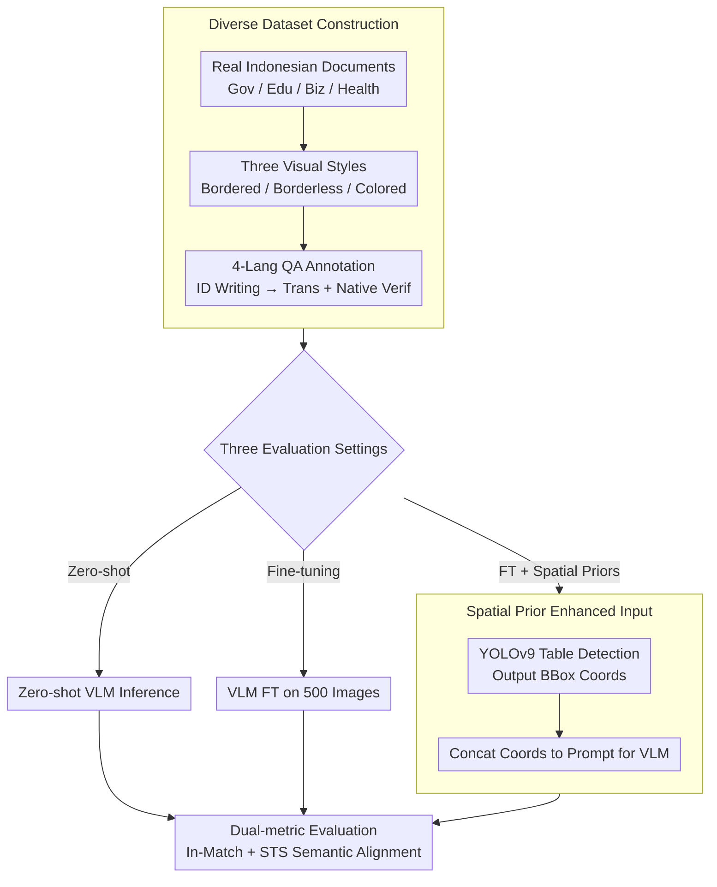

# IndoTabVQA: A Benchmark for Cross-Lingual Table Understanding in Bahasa Indonesia Documents

**Conference**: ACL 2026 Findings  
**arXiv**: [2604.11970](https://arxiv.org/abs/2604.11970)  
**Code**: [https://huggingface.co/datasets/NusaBharat/INDOTABVQA](https://huggingface.co/datasets/NusaBharat/INDOTABVQA)  
**Area**: Document Understanding / Cross-Lingual VQA  
**Keywords**: Cross-lingual Table Understanding, Visual Question Answering, Bahasa Indonesia Documents, Spatial Priors, Low-resource Languages

## TL;DR

This paper proposes IndoTabVQA, a cross-lingual Visual Question Answering benchmark for tables in Bahasa Indonesia documents. It consists of 1,593 document images with QA annotations in four languages (Indonesian, English, Hindi, and Arabic), revealing significant performance gaps in VLMs for low-resource languages and cross-lingual table understanding. Fine-tuning combined with spatial priors achieves an In-Match accuracy of up to 48.5%.

## Background & Motivation

**Background**: Vision-Language Models (VLMs) have demonstrated excellent performance in text-intensive visual understanding tasks. Benchmarks such as TextVQA and DocVQA have driven progress in the field, while table-specific datasets like TableVQA-Bench further evaluate structure-aware numerical reasoning capabilities.

**Limitations of Prior Work**: Existing benchmarks share a critical limitation: they are English-centric and monolingual, failing to reveal the true capabilities of VLMs in low-resource languages. Languages such as Indonesian, Hindi, and Arabic cover billions of users worldwide, yet VLMs may significantly fail on documents in these languages. For table VQA, models must simultaneously handle linguistic variations and structural complexity—a combined challenge that remains understudied.

**Key Challenge**: Current VQA benchmarks cannot test two critical capabilities: (1) whether VLMs can understand tables in low-resource languages, and (2) whether VLMs can answer correctly when the document and the question use different languages. This gap restricts the understanding of true multilingual capabilities.

**Goal**: The goal is to construct a cross-lingual table visual question answering benchmark to systematically evaluate VLM capabilities in low-resource language document understanding and cross-lingual visual reasoning.

**Key Insight**: Using Bahasa Indonesia documents as visual content (representing over 200 million users yet severely underrepresented in vision-language research), paired with QA annotations in four languages, isolates two challenges: vision-language understanding (monolingual setting) and cross-lingual alignment (cross-lingual setting).

**Core Idea**: The benchmark is constructed using real-world Indonesian document tables and four-language QA annotations. It introduces spatial priors (table detection coordinates) as additional inputs, demonstrating that targeted fine-tuning and spatial information significantly improve VLM performance on specialized document tasks.

## Method

### Overall Architecture

The evaluation pipeline of IndoTabVQA includes three settings: (1) Zero-shot evaluation—direct inference using pre-trained VLMs on the test set; (2) Fine-tuning evaluation—evaluating on 1,043 test images after fine-tuning on 500 training images; (3) Fine-tuning + Spatial Priors—using YOLOv9 to detect table regions and obtain bounding box coordinates, which are added to the prompt before processing by the VLM. The input consists of a document image $I$ and a question $Q$ (in one of the four languages), and the output is a short text or numerical answer $A$, scored via dual metrics.

### Key Designs

**1. Diverse Dataset Construction: Exposing VLM failure modes with three visual styles of real Indonesian documents**

VLMs fail on tables for various reasons, and a single-style dataset cannot capture the full picture. The authors collected 1,593 document images from sources such as Indonesian government reports, educational records, business documents, and public health data. These are categorized into three styles: 500 bordered tables, 602 borderless tables, and 491 colored tables. These categories test different capabilities: borderless tables force the model to infer row/column structures from whitespace and alignment, while colored tables introduce visual interference via background colors. QA annotations were first written by humans in Indonesian and then expanded to English, Hindi, and Arabic through automated translation and native-speaker verification, ensuring cross-lingual equivalence.

**2. Spatial Priors: Telling the model where the table is before it reads it**

Zero-shot VLMs often suffer from distracted attention when faced with full-page documents, becoming confused by non-table layout elements. The authors adopted the approach of "detect region first, then process specialized content" from real-world document processing pipelines. Stage 1 utilizes YOLOv9 (pre-trained on TableBank + PubLayNet) to detect table regions and output bounding box coordinates and table counts. Stage 2 concatenates these coordinates and counts into an augmented prompt for the VLM. Knowing the precise location allows the model to focus its attention on relevant content. This design also isolates "spatial localization" as a variable to quantify its specific contribution.

**3. Dual-metric Evaluation: In-Match for "accuracy" and STS for "understanding"**

VLMs often generate answers with redundant context, causing strict string matching to fail even when the answer is conceptually correct. Consequently, the authors use two parallel metrics: In-Match accuracy uses relaxed matching, where a normalized ground-truth answer counts as correct if it appears as a substring in the prediction. STS (Semantic Textual Similarity) accuracy uses a multilingual sentence embedding model to calculate the cosine similarity between the prediction and the ground truth, capturing semantically equivalent but phrased-differently responses. Together, these metrics prevent the underestimation or overestimation of true model understanding.

### Loss & Training

The authors performed full instruction fine-tuning on Qwen2.5-VL 3B and utilized LoRA for parameter-efficient fine-tuning on the 7B version. Each language variant was trained independently to isolate language-specific learning patterns. The training set consists of 500 images, the validation set has 50 images, and the test set contains 1,043 images.

## Key Experimental Results

### Main Results

Cross-lingual In-Match Accuracy (%):

| Model | Indonesian | English | Hindi | Arabic | Average |
|-------|------------|---------|-------|--------|---------|
| GPT-4o (Zero-shot) | 72.2 | 44.6 | 26.0 | 21.4 | 41.1 |
| Qwen2.5-VL 7B | 54.8 | 36.2 | 17.3 | 23.0 | 32.9 |
| LLaMA-3.2 11B | 57.4 | 30.8 | 15.5 | 19.4 | 30.7 |
| Ours (7B + SP) | **78.3** | **58.4** | **29.4** | **32.8** | **48.5** |
| Ours (3B + SP) | 73.1 | 54.8 | 27.2 | 31.1 | 46.6 |
| GPT-4o + SP | 72.6 | 52.7 | 27.2 | 25.5 | 44.6 |

### Ablation Study

| Configuration | Avg In-Match | Avg STS | Description |
|---------------|--------------|---------|-------------|
| Qwen2.5-VL 3B Zero-shot | 21.9% | 26.5% | Baseline |
| FT 3B | 39.7% | 46.7% | +17.8% Gain |
| FT 3B + Spatial Priors | 46.6% | 53.1% | +6.9% Additional Gain |
| FT 7B | 44.5% | 54.9% | Larger model |
| FT 7B + Spatial Priors | 48.5% | 58.3% | Best configuration |

### Key Findings
- **Severe cross-lingual performance drop**: GPT-4o dropped from 72.2% in Indonesian to 26.0% in Hindi and 21.4% in Arabic, a gap of 30-50 percentage points.
- **Hindi is the most difficult**: Nearly all models showed the lowest accuracy (4-29%) in Hindi, likely due to tokenization difficulties of the Devanagari script and scarce training data.
- **Targeted fine-tuning with only 500 images yields significant gains**: +28.6 points for Indonesian and +17.4 for English.
- **Spatial priors are effective across all model scales**: GPT-4o +3.5%, 3B +6.9%, 7B +4.0%.
- **Ours (7B+SP) outperformed GPT-4o+SP (48.5% vs 44.6%)**, indicating that domain adaptation and spatial information are more important than pure model scale.
- **Borderless tables are the most difficult** (requiring structure inference), while bordered tables are the easiest; colored tables benefit larger models as color assists in visual grouping.

## Highlights & Insights
- **Quantifying the cross-lingual gap**: This work systematically quantifies the performance loss in cross-lingual transfer for table VQA. The 30-50 point gap is a wake-up call, showing that the multilingual capabilities of current VLMs are significantly overestimated.
- **Effectiveness of small-data fine-tuning**: The fact that 500 training images can yield an 17-28 point improvement proves the high marginal utility of domain adaptation, which is encouraging for low-resource language research.
- **Simplicity and effectiveness of spatial priors**: Providing table coordinates from off-the-shelf detection models as inputs is a simple strategy with zero extra training cost, yet it consistently yields a 4-7% improvement. This approach can be generalized to other document understanding tasks requiring spatial localization.

## Limitations & Future Work
- The dataset size (1,593 images) may not fully cover the diversity of all Indonesian documents.
- Each image contains only one QA pair, limiting the evaluation of complex multi-hop reasoning.
- While verified, full semantic equivalence across languages in translated QA is difficult to guarantee.
- Spatial priors depend on the accuracy of the external object detection model; detection failures can propagate errors.
- Future work could extend to more low-resource languages (e.g., Burmese, Khmer) and more complex document types.

## Related Work & Insights
- **vs. TableVQA-Bench**: Only supports English; IndoTabVQA extends to four languages and cross-lingual settings.
- **vs. DocVQA**: Focuses on general document understanding; IndoTabVQA focuses on the more challenging sub-task of table structure reasoning.
- **vs. TabComp**: Focuses on table comparative reasoning but remains English-centric; IndoTabVQA fills the gap for low-resource languages.

## Rating
- **Novelty**: ⭐⭐⭐⭐ First cross-lingual table VQA benchmark for Indonesian, addressing representation in low-resource languages.
- **Experimental Thoroughness**: ⭐⭐⭐⭐ Comprehensive analysis across six models, three settings, table types, and languages.
- **Writing Quality**: ⭐⭐⭐⭐ Clear structure, deep analysis, and well-designed research questions.
- **Value**: ⭐⭐⭐⭐ Provides a vital evaluation resource for cross-lingual document AI and highlights deficiencies in multilingual VLMs.

<!-- RELATED:START -->

## Related Papers

- [\[ACL 2025\] EXECUTE: A Multilingual Benchmark for LLM Token Understanding](../../ACL2025/multilingual_mt/execute_a_multilingual_benchmark_for_llm_token_understanding.md)
- [\[ACL 2026\] Efficient Training for Cross-lingual Speech Language Models](efficient_training_for_cross-lingual_speech_language_models.md)
- [\[ACL 2025\] CruxEval-X: A Benchmark for Multilingual Code Reasoning, Understanding and Execution](../../ACL2025/multilingual_mt/cruxeval-x_a_benchmark_for_multilingual_code_reasoning_understanding_and_executi.md)
- [\[ACL 2026\] XQ-MEval: A Dataset with Cross-lingual Parallel Quality for Benchmarking Translation Metrics](xq-meval_a_dataset_with_cross-lingual_parallel_quality_for_benchmarking_translat.md)
- [\[ACL 2026\] Why Low-Resource NLP Needs More Than Cross-Lingual Transfer: Lessons Learned from Luxembourgish](why_low-resource_nlp_needs_more_than_cross-lingual_transfer_lessons_learned_from.md)

<!-- RELATED:END -->
