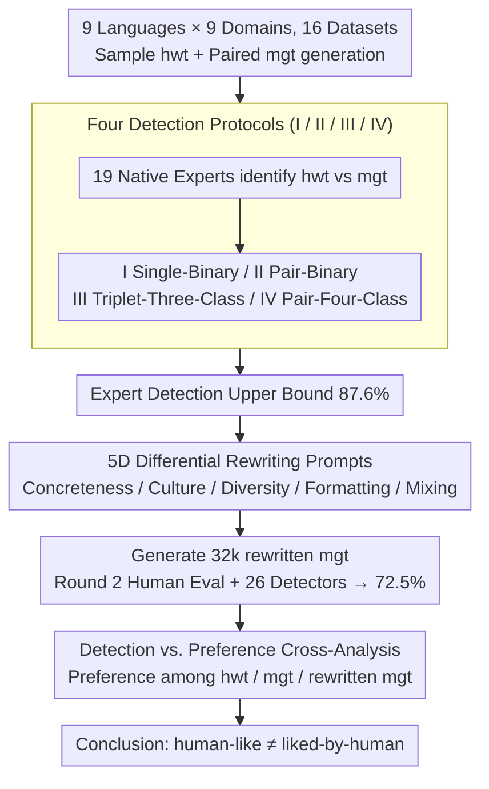

# Is Human-Like Text Liked by Humans? Multilingual Human Detection and Preference Against AI

**Conference**: ACL 2026  
**arXiv**: [2502.11614](https://arxiv.org/abs/2502.11614)  
**Code**: https://github.com/xnlp-lab/HumanEval-MGT  
**Area**: Multilingual / AIGC Detection / Human-AI Preference  
**Keywords**: MGT Detection, Multilingual, Human Evaluation, Prompting Rewriting, Preference Analysis

## TL;DR
The authors organized 19 native experts to conduct 8.8k human-machine text discrimination trials across 16 datasets involving 9 languages, 9 domains, and 11 SOTA LLMs. They found that the average expert accuracy reached 87.6% (significantly higher than the "near random" conclusions of early studies) and further revealed that while machine text rewritten with prompts explicitly addressing differences can lower detection accuracy to 72.5%, humans tend to prefer machine text when they cannot distinguish its source, challenging the implicit assumption that "human-like equals liked-by-human."

## Background & Motivation
**Background**: Existing MGT (Machine-Generated Text) detection research mostly bases human evaluation conclusions on GPT-3.5-turbo + English + approximately 300 samples, generally reporting that "humans struggle to distinguish LLM from human-written text, with accuracy close to random guessing" (Guo et al. 2023; Chein et al. 2024; Wang et al. 2024a). These findings are widely cited to argue that LLMs have passed an informal Turing Test.

**Limitations of Prior Work**: The aforementioned conclusions have three insufficiently tested limitations: (1) narrow language coverage, focusing almost exclusively on English and some Chinese; (2) outdated models, failing to cover the new generation such as GPT-4o, Claude-3.5, or Llama-4; (3) vague annotator profiles, often including laymen unfamiliar with LLMs who do not reflect the "expert upper bound."

**Key Challenge**: To determine whether LLMs have truly passed the Turing Test, the upper bound of human identification capability must first be measured. If even trained native experts cannot identify the text, the conclusion becomes truly credible. Conversely, if experts can identify it, LLM personification is significantly overestimated, necessitating a revision of existing detector evaluations and the "AI is unrecognizable" narrative.

**Goal**: The authors decompose the problem into four research questions: (i) What is the upper bound for expert detection across multiple languages, models, and domains? (ii) Which linguistic features drive discrimination decisions? (iii) Can explicit prompting to bridge differences truly reduce the gap? (iv) Which type of text do humans actually prefer?

**Key Insight**: Moving beyond the old setting of small-scale English GPT-3.5, the study constructs a four-dimensional matrix of "large-scale + multilingual + new models + native experts" and designs four detection protocols (single-binary, pair-binary, triplet-three-class, pair-four-class) to isolate "task difficulty" from "recognition ability."

**Core Idea**: By conducting full-factorial human evaluations with 19 native NLP experts across 9 languages × 9 domains × 11 LLMs (16 datasets), the authors establish a reusable multilingual benchmark for the "human detection upper bound." They integrate prompting gap-bridging and human-AI preference into the same framework to investigate "human-like vs. liked-by-human."

## Method
Strictly speaking, this is not an "algorithmic paper"; the methodology consists of a carefully designed large-scale human evaluation protocol, a prompting rewriting experiment, and a preference comparison study.

### Overall Architecture
The overall pipeline is divided into four stages:

1.  **Data Construction**: 16 datasets across 9 languages and 9 domains are used. For each, 300–600 human-written texts (hwt) are sampled, and paired machine-generated texts (mgt) are generated using a multilingual SOTA model (GPT-4o / Claude / Llama3-405B) and a language-specific model (Qwen / ChatGLM / AceGPT / Anita).
2.  **Human Detection (Round 1)**: 19 native NLP experts (BSc/MSc/PhD/Postdoc) identify hwt vs. mgt under four annotation protocols to create a fine-grained map of the "expert detection upper bound."
3.  **Prompting Gap-Bridging**: Annotators write "rewriting prompts" targeting perceived differences (concreteness, cultural flavor, length diversity, formatting, code-switching). The same LLM generates 32k rewritten mgt samples for a second round of human evaluation and assessment by 26 automatic detectors.
4.  **Preference Experiment**: 10 annotators select their preference among original hwt, original mgt, and rewritten mgt (plus a "none" option) across 6 datasets to analyze whether humans truly prefer human-written text.

### Key Designs

**1. Hierarchical Design of Four Detection Protocols (I/II/III/IV)**  
Previous studies used inconsistent protocols, making a "60% accuracy" and "90% accuracy" incomparable. The authors set four protocols: I. Single-Binary (judge 1 segment); II. Pair-Binary (choose between hwt and mgt); III. Triplet-Three-Class (choose from hwt and two mgt from different LLMs); IV. Pair-Four-Class (A/B could each be hwt or mgt). The theoretical difficulty is I > IV > III > II. Protocol I is the hardest without a reference, while Protocol II is the easiest.

**2. 5D Differential Rewriting Prompt Templates**  
The authors identified 5 systematic categories of differences: concreteness, cultural/religious nuance, length/structure/emotional variety, Markdown formatting, and code-switching. These were used to create prompts explicitly instructing models to "include specific names/dates," "avoid bullets," or "write purely in the native language." This tests if LLM defects are surface-level alignment issues or deeply embedded in training data.

**3. Cross-Analysis of Detection Capability vs. Preference**  
To test if "imitating human preferences = imitating human writing," the authors collected both "which is human" and "which do you prefer" labels on the same samples. If the annotator's detection accuracy is $p$ and the probability of preferring human text is $q$, the results show $q$ correlates with $p$ but is far from 1: when $p \approx 1$, $q \approx 0.6$; however, when $p \approx 0.5$ (meaning machine/human are indistinguishable), $q < 0.5$, indicating a preference for machine text.

## Loss & Training
This paper is an evaluation/analysis study and does not involve specific training loss. Key parameters include sample sizes (approx. 9k initial detection instances, 13.5k second-round instances, 5k preference instances) and the reproduction settings of 26 automatic detectors. Annotation included zero-shot and few-shot (3–5 labeled examples) settings for expert calibration.

## Key Experimental Results

### Main Results: Human Detection Accuracy across 9 Languages × 16 Datasets

| Language | Dataset (Model) | Protocol / Shot | Avg Accuracy | Key Observation |
| :--- | :--- | :--- | :--- | :--- |
| Chinese | Zhihu-QA (GPT-4o) | II / Zero | 99.6% | High accuracy, low variance |
| Russian | News | II / Few | 100.0% | 100% achieved by single annotator |
| English | Peersum | II / Few | 99.8% | Peer reviews are easily identifiable |
| Arabic | Dialect Tweet | I / Zero | 50.1% | Short text + Dialect = Hardest |
| Vietnamese | Wikipedia | II / Zero | 50.7% | Wiki is highly similar to training data |
| **Total** | **16 Datasets / 8,778 cases** | – | **87.6%** | **Much higher than "near random"** |

### Ablation Study: Accuracy Drop After Prompt Rewriting

| Dataset | Original Acc | Improved Acc | Gain (Drop) | Interpretation |
| :--- | :--- | :--- | :--- | :--- |
| Kazakh Wikipedia | 79.7 | ↓ | – | Rewriting with specific names is effective |
| Chinese Zhihu-QA | 99.6 | ~92 | -7.6 | Structural markers remain hard to remove |
| English Peersum | 99.8 | ~88 | -11.8 | Variance in length/structure remains low |
| Italian DICE (GPT-4o) | 100.0 | ~85 | -15 | Formatting easy to fix, nuances difficult |
| **Total Mean** | **87.6** | **72.5** | **-15.1** | **Prompting fills roughly half the gap** |

### Key Findings
- **Experts are not guessing randomly**: Accuracy jumps to 87.6% when using SOTA models, paired protocols, and native experts.
- **Protocols matter significantly**: The same Arabic dataset yielded 50.1% accuracy under Protocol I but 92.7% under Protocol II.
- **Prompting fills half the gap**: 50% of differences can be mitigated via prompts, but "cultural nuance" and "diversity" are harder to address, suggesting deficiencies in original training data.
- **Humans do not necessarily prefer humans**: When machine-generated text is indistinguishable from human text, humans often prefer the machine version ($q > 0.5$).

## Highlights & Insights
- **Protocol Decoupling**: Provides a "conversion table" for how to read previous small-scale studies.
- **Empirical Separation of "Human-Like" vs. "Liked-by-Human"**: Proves that "liked-by-human" is an optimization goal independent of "human-like."
- **5D Prompting Templates**: A transferable trick for instruction tuning or distillation to generate text with low detectability.

## Limitations & Future Work
- The conclusions represent the "expert upper bound"; studies involving laymen are needed for general user scenarios.
- The preference experiment has a limited sample size and should be expanded to more diverse annotator profiles.
- Since prompting was done using the same LLM, it is unclear if the improvement stems from the prompt or the model's inherent capability.

## Related Work & Insights
- **vs. Guo et al. (2023)**: Proves that low accuracy in previous work was a result of GPT-3.5 and non-expert annotators.
- **vs. RLHF / Alignment**: Challenges the assumption that RLHF aligns with human *writing style*; it may actually align with a specific machine style that humans happen to prefer.

## Rating
- **Novelty**: ⭐⭐⭐⭐ The experimental design for "multilingual + multi-protocol + preference cross-analysis" is pioneering.
- **Experimental Thoroughness**: ⭐⭐⭐⭐⭐ Rare scale and granularity.
- **Writing Quality**: ⭐⭐⭐⭐ Clear charts and protocols.
- **Value**: ⭐⭐⭐⭐⭐ Directly counters the "failed Turing Test" narrative and provides a major multilingual resource.

<!-- RELATED:START -->

## Related Papers

- [\[NeurIPS 2025\] HelpSteer3-Preference: Open Human-Annotated Preference Data across Diverse Tasks and Languages](../../NeurIPS2025/multilingual_mt/helpsteer3-preference_open_human-annotated_preference_data_across_diverse_tasks_.md)
- [\[ACL 2026\] Evaluating Robustness of Large Language Models Against Multilingual Typographical Errors](evaluating_robustness_of_large_language_models_against_multilingual_typographica.md)
- [\[ACL 2025\] Has Machine Translation Evaluation Achieved Human Parity?](../../ACL2025/multilingual_mt/mt_eval_human_parity.md)
- [\[ACL 2026\] Lingo_Research_Group at SemEval-2026 Task 9: Evaluating Prompt Variants for Polarization Detection](lingo_research_group_at_semeval-2026_task_9_evaluating_prompt_variants_for_polar.md)
- [\[ACL 2026\] CLewR: Curriculum Learning with Restarts for Machine Translation Preference Learning](clewr_curriculum_learning_with_restarts_for_machine_translation_preference_learn.md)

<!-- RELATED:END -->
