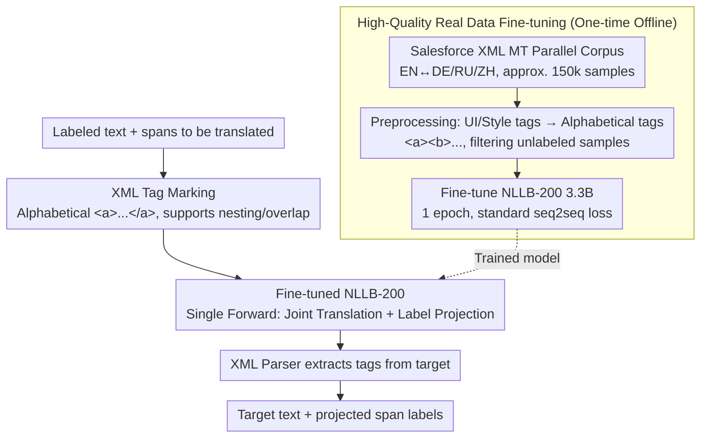

# Just Use XML: Revisiting Joint Translation and Label Projection

**Conference**: ACL 2026 Findings  
**arXiv**: [2603.12021](https://arxiv.org/abs/2603.12021)  
**Code**: [https://github.com/thennal10/LabelPigeon](https://github.com/thennal10/LabelPigeon)  
**Area**: Multilingual Translation / Cross-lingual Transfer  
**Keywords**: Label Projection, XML Tags, Joint Translation, Cross-lingual Transfer, NER

## TL;DR

LabelPigeon is proposed as a joint translation and label projection method based on XML tags. By fine-tuning the NLLB-200 translation model on high-quality XML-tagged parallel corpora, it outperforms all baselines across 11 languages and actively improves translation quality, achieving up to a +40.2 F1 gain in downstream cross-lingual NER tasks.

## Background & Motivation

**Background**: Many NLP tasks rely on span-level labels (e.g., entities in NER, arguments in event extraction). The common practice for extending these tasks to low-resource languages is to machine translate the training data and then perform label projection. Label projection traditionally uses word alignment models (e.g., Awesome-align) as an independent step after translation.

**Limitations of Prior Work**: EasyProject (Chen et al., 2023) attempted joint translation and label projection (inserting square brackets around spans before translation) but reported a decline in translation quality. Subsequent works (T-Projection, CLaP, Codec) consequently abandoned joint methods in favor of complex multi-stage pipelines: separating translation from label projection, introducing LLM context for translation, or using constrained decoding, which significantly increases computational and engineering overhead.

**Key Challenge**: The field consensus is that "inserting markers inherently harms translation quality," leading mainstream methods to choose complex multi-stage pipelines. However, is this assumption actually true? Or is it merely a result of poor training data and marker selection?

**Goal**: To re-verify whether joint translation and label projection necessarily reduce translation quality and to propose a simple yet effective alternative.

**Key Insight**: The authors start from three observations: (1) XML tags offer natural advantages over square brackets by providing direct correspondence between source and target labels, elegantly handling nesting and overlap; (2) High-quality XML-tagged parallel corpora already exist in the field of structured document translation (e.g., Salesforce Localization XML MT dataset); (3) Label-aware translation can guide the model to prioritize the continuity and integrity of labeled spans, avoiding pronoun omission and ambiguous assignment during translation.

**Core Idea**: Use XML tags instead of square brackets for markers and fine-tune translation models using existing high-quality XML parallel corpora (rather than synthetic data). This allows translation and label projection to be completed simultaneously in a single forward pass without the need for multi-stage pipelines.

## Method

### Overall Architecture

The workflow of LabelPigeon is highly concise: (1) Mark all spans in the text to be translated with alphabetical XML tags (`<a>`, `<b>`, etc.); (2) Translate using the fine-tuned NLLB-200 3.3B model; (3) Extract tags from the translated text using a standard XML parser. Inference requires only one model forward pass with no additional computational overhead. This is possible because the model is pre-fine-tuned on real XML parallel corpora—thus, the complete framework consists of "one-time offline fine-tuning" and "online single-forward joint translation + projection."

### Key Designs

**1. XML Tags instead of Square Brackets: Precise correspondence for labeled spans**  
EasyProject uses square brackets to insert markers around spans, but brackets do not carry intrinsic correspondence information. Once multiple pairs of brackets appear in the translation, an additional fuzzy string matching step is required to guess which pair corresponds to which source span, which is slow and error-prone during nesting. XML tags are naturally named; `<a>...</a>` corresponds one-to-one between source and target. Nested and overlapping spans (e.g., `<a><b>...</b>...</a>`) are handled elegantly, and tag names like `<PER>` can even carry semantic meaning. A practical reason for choosing XML is that the field of structured document translation has long accumulated data and practices for XML-tagged translation that can be directly utilized.

**2. High-Quality Real Data Fine-tuning: Teaching the model not to lose tags during translation**  
EasyProject's decline in translation quality was largely due to training on synthetically generated marker data, which introduced noise and distribution shifts. The authors instead use the Salesforce Localization XML MT dataset, which contains approximately 100,000 pairs of real XML-tagged parallel sentences between English and seven languages. During preprocessing, original UI/style tags are replaced with universal alphabetical tags (`<a>`, `<b>`, etc.), and unlabeled samples are removed. Each language pair retains about 25,000 samples. After ablation, only English-German, English-Russian, and English-Chinese pairs are selected for training, totaling approximately 150,000 samples for bidirectional translation. One epoch takes 5.5 hours on a single A100. Using real corpora instead of synthetic data is the key prerequisite for the translation quality improvement.

**3. Mechanism for Label-Aware Translation: How translation choices affect label integrity**  
Separated methods assume that "translating first and rebuilding label mappings" will always succeed, but linguistic shifts during translation often invalidate this assumption. The authors illustrate this with three minimal examples: (a) translation might split a labeled span across different positions (e.g., in Malayalam); (b) the target language might omit words corresponding to the labels (e.g., pronoun-dropping in Japanese); (c) translation might cause ambiguity in tag assignment (e.g., in French). Joint translation uses tags to constrain the translation—guiding the model to choose versions that keep spans continuous and intact, binding label integrity and translation quality together for optimization rather than post-hoc correction.

### Loss & Training

Standard seq2seq translation training loss was employed. Key training strategy choices include: (1) Training only on three high-resource language pairs to avoid catastrophic forgetting; (2) Training for one full epoch (9,091 steps, effective batch size of 16); (3) Replacing labels with universal alphabetical tags to allow the model to generalize to any label type.

## Key Experimental Results

### Main Results

Direct Label Projection Evaluation (XQuAD + MLQA, average across 11 languages):

| Method | COMET Translation Quality | Label Match F1 |
|------|---------------|----------------|
| Awesome-align | 82.3 (Baseline) | 50.6% |
| Gemma 3 27B | 69.6 (-12.7) | 78.1% |
| EasyProject | 80.8 (-1.5) | 77.7% |
| **Ours** | **82.4 (+0.1)** | **79.2%** |

Downstream NER Tasks (UNER, average F1 across 16 datasets):

| Method | Average F1 | Max Gain |
|------|---------|---------|
| EasyProject | 62.5% | - |
| **Ours** | **76.7%** | Tagalog +40.2 F1 |

### Ablation Study

| Configuration | BLEU (unlabeled) | BLEU (complex labels) | Projection Rate |
|------|-------------|---------------|--------|
| NLLB Baseline | 17.4 | - | - |
| EasyProject | 17.7 | 14.9 | 47.7% |
| Ours | 17.6 | 15.5 | 69.3% |
| Non-Fine-tuned (NF) | 17.9 | - | - |

### Key Findings
- LabelPigeon is the only method where translation quality increases after inserting markers—COMET improved from 82.3 to 82.4.
- The improvement in translation quality is attributed to the additional fine-tuning itself (the non-labeled fine-tuned model also showed improvement), with positive transfer even to languages not seen during training.
- EasyProject degrades translation quality across all marker configurations, whereas LabelPigeon maintains BLEU comparable to the baseline in single-marker scenarios.
- Low-resource languages saw the largest gains in downstream NER: Cebuano +30.7, Tagalog +40.2, Swedish +22.
- On coreference resolution tasks, EasyProject failed significantly with F1 < 1.0 in 11/16 languages, while LabelPigeon only scored 0 on two historical languages.
- LabelPigeon generalizes to tag counts unseen during training: it was trained on up to 6 tags but successfully processed an average of 9 tags (max 24) in XQuAD testing.

## Highlights & Insights
- **Challenging Field Consensus**: Overturns the widespread assumption that "joint translation and label projection necessarily degrade translation quality," proving with rigorous experiments that the issue lies in marker selection and training data rather than the method itself.
- **Victory of Minimalism**: Compared to complex multi-stage pipelines (T-Projection requiring additional LLMs, Codec requiring constrained decoding), LabelPigeon requires only one fine-tuning session and one forward pass, yet achieves SOTA in both label projection and translation quality—a classic example of "less is more."
- **Theoretical Insight into Label-Aware Translation**: Elegantly demonstrates via minimal examples why translation and label projection should be joint rather than separated—translation choices affect label integrity, and conversely, label constraints can guide more suitable translations.

## Limitations & Future Work
- Direct label projection evaluation only uses QA datasets (XQuAD, MLQA) with simple label types.
- Synthetic marker insertion on Flores-200 may not fully reflect the distribution of real-world annotated labels.
- Verified only on NLLB-200 3.3B; the effects on larger translation models or LLM-based translation are unknown.
- Overall performance on coreference resolution tasks remains low, and translation quality still declines in scenarios with nested or high-frequency tags.
- Training data is limited to English to three high-resource language pairs; expansion to more language pairs might provide further improvements.

## Related Work & Insights
- **vs EasyProject**: Uses square brackets + synthetic data, resulting in decreased translation quality and label correspondence relying on fuzzy matching. LabelPigeon uses XML + real data, resulting in increased translation quality and precise label correspondence.
- **vs T-Projection / CLaP**: Requires additional LLMs for label projection or context-aware translation, entailing high computational costs. LabelPigeon has zero additional inference cost.
- **vs Awesome-align**: Word alignment methods achieve only 50.6% Label Match F1, far below LabelPigeon's 79.2%.

## Rating
- Novelty: ⭐⭐⭐⭐ The key contribution is challenging field consensus and proposing a simpler, more effective alternative. The combination of XML and real data is simple but yields striking results.
- Experimental Thoroughness: ⭐⭐⭐⭐⭐ Comprehensive experiments covering direct evaluation, translation quality, and three downstream tasks across 203 languages for translation and 27 for downstream tasks.
- Writing Quality: ⭐⭐⭐⭐⭐ Clear argumentative logic, progressing from theory to experiment, with intuitive minimal examples.
- Value: ⭐⭐⭐⭐⭐ Provides a minimalist yet highly efficient label projection solution for cross-lingual NLP, directly applicable to production systems.

<!-- RELATED:START -->

## Related Papers

- [\[ACL 2025\] Probing LLMs for Multilingual Discourse Generalization Through a Unified Label Set](../../ACL2025/multilingual_mt/probing_llms_for_multilingual_discourse_generalization_through_a_unified_label_s.md)
- [\[ACL 2025\] Just Go Parallel: Improving the Multilingual Capabilities of Large Language Models](../../ACL2025/multilingual_mt/just_go_parallel_improving_the_multilingual_capabilities_of_large_language_model.md)
- [\[ACL 2025\] CC-Tuning: A Cross-Lingual Connection Mechanism for Improving Joint Multilingual Supervised Fine-Tuning](../../ACL2025/multilingual_mt/cc-tuning_a_cross-lingual_connection_mechanism_for_improving_joint_multilingual_.md)
- [\[ACL 2026\] Syntax as a Rosetta Stone: Universal Dependencies for In-Context Coptic Translation](syntax_as_a_rosetta_stone_universal_dependencies_for_in-context_coptic_translati.md)
- [\[ACL 2026\] Lost in Translation: Do LVLM Judges Generalize Across Languages?](lost_in_translation_do_lvlm_judges_generalize_across_languages.md)

<!-- RELATED:END -->
