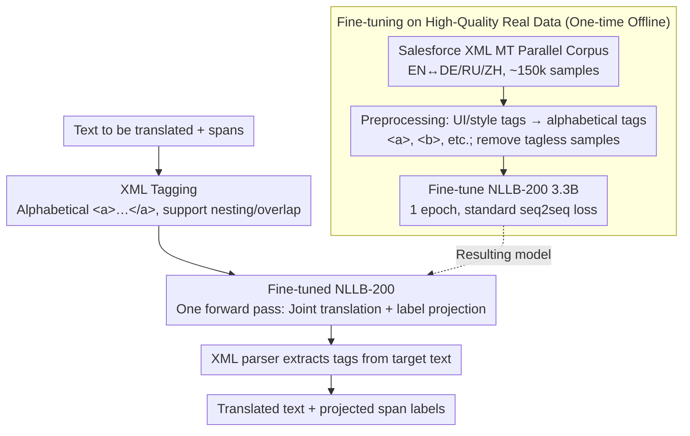

# Just Use XML: Revisiting Joint Translation and Label Projection

**Conference**: ACL 2026 Findings  
**arXiv**: [2603.12021](https://arxiv.org/abs/2603.12021)  
**Code**: [https://github.com/thennal10/LabelPigeon](https://github.com/thennal10/LabelPigeon)  
**Area**: Multilingual Translation / Cross-lingual Transfer  
**Keywords**: Label Projection, XML tagging, Joint Translation, Cross-lingual Transfer, NER

## TL;DR

LabelPigeon is proposed as a joint translation and label projection method based on XML tags. By fine-tuning the NLLB-200 translation model on high-quality XML-tagged parallel corpora, it outperforms all baselines across 11 languages and actively improves translation quality, achieving up to a +40.2 F1 gain in downstream cross-lingual NER tasks.

## Background & Motivation

**Background**: Many NLP tasks rely on span-level labels (e.g., entities in NER, arguments in event extraction). A common practice to extend these tasks to low-resource languages is to machine translate the training data followed by label projection. Traditionally, label projection uses word alignment models (e.g., Awesome-align) as a standalone step after translation.

**Limitations of Prior Work**: EasyProject (Chen et al., 2023) attempted joint translation and label projection by inserting square brackets around spans before translation but reported a decline in translation quality. Subsequent works (T-Projection, CLaP, Codec) abandoned joint methods in favor of complex multi-stage pipelines: separating translation from label projection and introducing LLM context for translation or constrained decoding, which significantly increases computational and engineering overhead.

**Key Challenge**: The consensus in the field is that "inserting markers inherently damages translation quality," leading mainstream methods toward complex multi-stage pipelines. However, is this assumption truly valid, or is it merely due to improper training data and marker selection?

**Goal**: To re-validate whether joint translation and label projection necessarily degrade translation quality and to propose a simple yet effective alternative.

**Key Insight**: Three observations are made: (1) XML tags offer a natural advantage over brackets by providing a direct correspondence between source and target labels, elegantly handling nesting and overlap; (2) High-quality XML-tagged parallel corpora already exist in structured document translation (e.g., Salesforce Localization XML MT dataset); (3) Tag-aware translation can guide the model to prioritize the continuity and integrity of labeled spans, avoiding pronoun omission and ambiguous assignment during translation.

**Core Idea**: Use XML tags instead of square brackets for markers and fine-tune the translation model using existing high-quality XML parallel corpora (rather than synthetic data). This achieves joint translation and label projection in a single forward pass without the need for multi-stage pipelines.

## Method

### Overall Architecture

The workflow of LabelPigeon is straightforward: (1) Mark all spans in the labeled text using alphabetical XML tags (`<a>`, `<b>`, etc.); (2) Translate using the fine-tuned NLLB-200 3.3B model; (3) Extract tags from the translated text using a standard XML parser. Inference requires only a single model forward pass with no additional computational overhead. This is possible because the model is pre-fine-tuned on real XML parallel corpora—thus, the framework consists of "one-time offline fine-tuning" and "online single-forward-pass joint translation + projection."

### Key Designs

**1. XML Tags Instead of Brackets: Providing Precise Correspondence**

EasyProject uses brackets to insert markers around spans, but brackets do not carry intrinsic correspondence information. When multiple bracket pairs appear in the translation, extra fuzzy string matching is required to guess the mapping to the source, which is slow and error-prone for nested spans. XML tags are inherently named; `<a>...</a>` in the source directly corresponds to `<a>...</a>` in the target. Nested and overlapping spans (e.g., `<a><b>...</b>...</a>`) are handled elegantly, and tag names (e.g., `<PER>`) can even carry semantic information. Practically, structured document translation has long accumulated data and practices for XML-tagged translation that can be leveraged.

**2. Fine-tuning on High-Quality Real Data: Teaching Models Tag Retention**

The drop in translation quality in EasyProject was largely due to training on synthetically generated marker data, which introduced noise and distribution shifts. LabelPigeon utilizes the Salesforce Localization XML MT dataset, containing approximately 100k pairs of real XML-tagged parallel sentences for English and seven languages. Preprocessing replaces original UI/style tags with generic alphabetical tags and removes tagless samples. After ablation, only EN-DE, EN-RU, and EN-ZH pairs are used for training, totaling approximately 150k samples for bidirectional translation, completing one epoch in 5.5 hours on a single A100. Using real corpora instead of synthetic data is the key prerequisite for improving translation quality.

**3. Advantage of Tag-Aware Translation: Translation Choices Affecting Tag Integrity**

Separated methods assume that "mapping reconstruction after translation" will always succeed, but linguistic shifts often invalidate this. The authors highlight problems using minimal examples: (a) translation might split a tagged span into different positions (e.g., Malayalam); (b) the target language might omit words corresponding to the tag (e.g., pro-drop in Japanese); (c) translation might create ambiguity regarding tag assignment (e.g., French). Joint translation uses tags as constraints—guiding the model to select translations that keep spans continuous and complete, optimizing tag integrity and translation quality together rather than as an afterthought.

### Loss & Training

Standard seq2seq translation training loss is used. Key training strategy choices include: (1) Training only on three high-resource language pairs to avoid catastrophic forgetting; (2) Training for one full epoch (9091 steps, effective batch size 16); (3) Replacing tags with generic alphabetical tags to ensure generalization to arbitrary tag types.

## Key Experimental Results

### Main Results

Direct label projection evaluation (average across 11 languages for XQuAD + MLQA):

| Method | COMET Quality | Label Match F1 |
|------|---------------|----------------|
| Awesome-align | 82.3 (Baseline) | 50.6% |
| Gemma 3 27B | 69.6 (-12.7) | 78.1% |
| EasyProject | 80.8 (-1.5) | 77.7% |
| **LabelPigeon** | **82.4 (+0.1)** | **79.2%** |

Downstream NER tasks (average F1 across 16 UNER datasets):

| Method | Avg F1 | Max Gain |
|------|---------|---------|
| EasyProject | 62.5% | - |
| **LabelPigeon** | **76.7%** | Tagalog +40.2 F1 |

### Ablation Study

| Configuration | BLEU (No tags) | BLEU (Complex tags) | Projection Rate |
|------|-------------|---------------|--------|
| NLLB Baseline | 17.4 | - | - |
| EasyProject | 17.7 | 14.9 | 47.7% |
| LabelPigeon | 17.6 | 15.5 | 69.3% |
| No-Tag FT (NF) | 17.9 | - | - |

### Key Findings
- LabelPigeon is the only method where translation quality improves after inserting markers (COMET increased from 82.3 to 82.4).
- Translation quality gains are attributed to the additional fine-tuning itself (even the no-tag fine-tuned model showed improvement), with positive transfer observed even in untrained languages.
- EasyProject degrades translation quality across all marker configurations, while LabelPigeon maintains BLEU comparable to the baseline in single-marker scenarios.
- The largest gains in downstream NER occur in low-resource languages: Cebuano +30.7, Tagalog +40.2, Swedish +22.
- In coreference resolution, EasyProject failed almost completely (F1 < 1.0) in 11/16 languages, while LabelPigeon only scored 0 in 2 historical languages.
- LabelPigeon generalizes to tag counts unseen during training: it was trained with up to 6 tags but tested on XQuAD with an average of 9 tags (max 24).

## Highlights & Insights
- **Challenging Industry Consensus**: Overturns the widespread assumption that joint translation and label projection must degrade quality, demonstrating that the issue lies in marker selection and training data rather than the method itself.
- **Victory of Simplicity**: Compared to complex multi-stage pipelines (T-Projection requires an extra LLM, Codec requires constrained decoding), LabelPigeon requires only one-time fine-tuning and a single forward pass while achieving optimal results in both projection and quality.
- **Theoretical Insight on Tag-Aware Translation**: Successfully argues why translation and label projection should be joint—translation choices affect tag integrity, and conversely, tag constraints can guide more suitable translations.

## Limitations & Future Work
- Direct label projection evaluation is limited to QA datasets (XQuAD, MLQA) with simple tag types.
- Synthetic marker insertion in Flores-200 may not fully reflect the distribution of real-world annotations.
- Effectiveness on larger translation models or LLM-based translation is unknown, as it was only validated on NLLB-200 3.3B.
- Performance on coreference resolution remains relatively low, and translation quality still declines in scenarios with nested or high-frequency tags.
- Training data is limited to English-to-three high-resource pairs; expansion to more pairs might further improve performance.

## Related Work & Insights
- **vs EasyProject**: Uses brackets + synthetic data, resulting in degraded translation quality and reliance on fuzzy matching. LabelPigeon uses XML + real data, improving quality with precise mapping.
- **vs T-Projection / CLaP**: Requires additional LLMs for projection or contextual translation, leading to high overhead. LabelPigeon has zero additional inference cost.
- **vs Awesome-align**: Word alignment methods achieve a Label Match F1 of only 50.6%, far below LabelPigeon's 79.2%.

## Rating
- Novelty: ⭐⭐⭐⭐ Key contribution lies in challenging consensus and proposing a simpler, more effective alternative.
- Experimental Thoroughness: ⭐⭐⭐⭐⭐ Comprehensive evaluation covering direct projection, translation quality, and three downstream tasks across over 200 languages.
- Writing Quality: ⭐⭐⭐⭐⭐ Logical argumentation from theory to experiment with intuitive examples.
- Value: ⭐⭐⭐⭐⭐ Provides a minimalist yet highly efficient label projection solution for cross-lingual NLP.

<!-- RELATED:START -->

## Related Papers

- [\[ACL 2026\] Massively Multilingual Joint Segmentation and Glossing](massively_multilingual_joint_segmentation_and_glossing.md)
- [\[ACL 2025\] Probing LLMs for Multilingual Discourse Generalization Through a Unified Label Set](../../ACL2025/multilingual_mt/probing_llms_for_multilingual_discourse_generalization_through_a_unified_label_s.md)
- [\[ACL 2025\] Just Go Parallel: Improving the Multilingual Capabilities of Large Language Models](../../ACL2025/multilingual_mt/just_go_parallel_improving_the_multilingual_capabilities_of_large_language_model.md)
- [\[ACL 2026\] Syntax as a Rosetta Stone: Universal Dependencies for In-Context Coptic Translation](syntax_as_a_rosetta_stone_universal_dependencies_for_in-context_coptic_translati.md)
- [\[ACL 2025\] CC-Tuning: A Cross-Lingual Connection Mechanism for Improving Joint Multilingual Supervised Fine-Tuning](../../ACL2025/multilingual_mt/cc-tuning_a_cross-lingual_connection_mechanism_for_improving_joint_multilingual_.md)

<!-- RELATED:END -->
