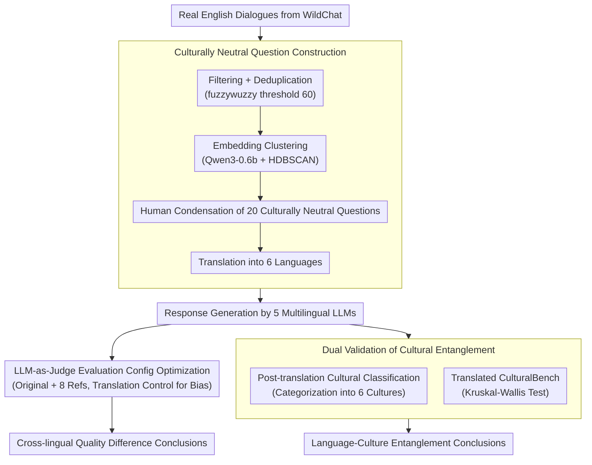

# Language Models Entangle Language and Culture

**Conference**: ACL 2026  
**arXiv**: [2601.15337](https://arxiv.org/abs/2601.15337)  
**Code**: None  
**Area**: Multilingual / Cultural Bias  
**Keywords**: Multilingual LLMs, Cultural Bias, Language-Culture Entanglement, LLM Evaluation, Fairness

## TL;DR

This paper evaluates multilingual LLMs using general advice-seeking questions constructed from the WildChat dataset. It discovers systematic differences in response quality and cultural context across different language queries—response quality in low-resource languages is significantly lower than in English. Furthermore, the choice of language implicitly alters the cultural information utilized in responses. This entanglement between language and culture in LLMs is verified through a translated version of CulturalBench.

## Background & Motivation

**Background**: LLMs such as ChatGPT are utilized by hundreds of millions for daily queries (health, finance, education, etc.) across multiple languages. Existing multilingual evaluations, such as MMMLU and BenchMAX, primarily focus on MCQ tasks like knowledge QA and mathematical reasoning, assessing only accuracy while neglecting variations in response style and cultural context.

**Limitations of Prior Work**: (1) Current multilingual benchmarks evaluate "correctness" rather than "quality"—lacking assessment for open-ended advice-seeking responses; (2) existing bias research triggers bias by embedding cultural cues (names, nationalities, etc.) in prompts, which does not reflect actual user behavior; (3) no systematic work has established the relationship between language selection and cultural context.

**Key Challenge**: LLMs implicitly bind language and culture during the training process—when querying in a specific language, the model may not only produce lower-quality responses but also apply the cultural framework associated with that language. Consequently, the same problem receives fundamentally different advice depending on the language. This creates systematic disadvantages for users of low-resource languages.

**Goal**: (1) Construct a dataset of general advice-seeking questions to evaluate response quality differences across languages; (2) verify whether language choice alters the cultural context of responses; (3) further validate the language-culture entanglement hypothesis via a translated version of CulturalBench.

**Key Insight**: Using culturally neutral open-ended questions (containing no cultural cues) allows the observation of whether changing only the query language leads to shifts in cultural context—this reflects real-world user interaction scenarios more accurately than methods using embedded cultural cues.

**Core Idea**: Language and culture are entangled in LLMs—selecting different languages not only affects response quality but also implicitly activates different cultural information, causing even culturally neutral general questions to yield culturally biased responses.

## Method

### Overall Architecture

The evaluation is divided into three parts: (1) constructing 20 culturally neutral advice-seeking questions based on WildChat, translated into 6 languages (English, Chinese, Hindi, Brazilian Portuguese, Swahili, Hebrew); (2) generating responses from 5 multilingual LLMs and evaluating quality differences using LLM-as-Judge; (3) performing cultural classification of responses and verifying language-culture entanglement on the translated CulturalBench.

### Key Designs

**1. WildChat-based culturally neutral question construction: Ensuring evaluation questions are close to real queries without cultural suggestions**

Existing bias studies often embed cultural cues like names or nationalities in prompts to "fish" for bias, but real users do not typically query this way. These conclusions might not reflect the model's intrinsic tendencies. Ours reverses this: first filtering English queries from WildChat, removing high-frequency programming questions, keeping items between 40–400 characters, deduplicating with fuzzywuzzy (threshold 60), generating embeddings with Qwen3-0.6b, and clustering with HDBSCAN. After human analysis, 20 questions covering health, education, investment, and job searching were condensed. Crucially, these questions are designed to be culturally neutral—mentioning no countries, ethnicities, or cultural references—ensuring that any cultural color in the responses arises from the model itself.

**2. LLM-as-Judge evaluation config optimization: Eliminating judge bias before assessing cross-lingual quality**

Using an LLM to score multilingual responses carries the risk of linguistic bias—if the judge naturally prefers English, the "lower quality in low-resource languages" becomes a circular argument. To address this, 6 judging configurations (original vs. translation, varying reference counts) were tested and aligned with human annotations using Pearson correlation and Cohen's Kappa. The final setup used "original language query + original language response + 8 random reference responses" with Cohere Command-A as the judge. A critical control experiment showed that English responses translated into Hindi still scored higher than native Hindi responses translated into English—proving the score gap stems from content quality, not linguistic preference of the judge.

**3. Mechanism (Dual Validation of Cultural Entanglement): Proving "switching language = switching culture" rather than just quality degradation**

Quality differences only indicate that low-resource languages result in "poorer" responses, which is insufficient to prove language and culture are entangled. Two independent validations were added. First, post-translation classification: all non-English responses were translated into English and classified by an LLM-as-Judge into six cultures (Western, Indian, Chinese, African, Latin American, Jewish). Even without the original language, the model identified the cultural source; Hindi queries most frequently resulted in Indian culture labels, and Chinese queries in Chinese labels. Second, Qwen3-14B was evaluated on a translated CulturalBench (750+ questions, 29 regions). Accuracy for the same cultural knowledge question varied significantly across languages (Kruskal-Wallis $H=45.52$, $p=1.14\times10^{-8}$). To rule out general sensitivity to perturbation, a random string control was used, showing no significant performance change ($H=1.02$, $p=0.80$). These two pieces of evidence from content and accuracy dimensions confirm that language choice alters cultural content.

### Loss & Training

This is an evaluation study and does not involve model training. Cross-lingual differences were validated for statistical significance using the Kruskal-Wallis non-parametric test.

## Key Experimental Results

### Main Results

**Kruskal-Wallis Test for Cross-lingual Quality Differences**

| Model | H-statistic | p-value | Significance |
|------|---------|------|-----------|
| Cohere-Aya-32B | 712.80 | $8.39\times10^{-152}$ | Highly Significant |
| Cohere-Aya-8B | 721.13 | $1.33\times10^{-153}$ | Highly Significant |
| Magistral-Small | 610.81 | $9.33\times10^{-130}$ | Highly Significant |
| Qwen3-14B | 928.91 | $1.48\times10^{-198}$ | Highly Significant |
| Sarvam-m | 899.84 | $2.89\times10^{-192}$ | Highly Significant |

All models performed best in English, while Hindi, Swahili, and Hebrew consistently showed poorer performance.

### Ablation Study

**Translated CulturalBench vs. Random Perturbation (Qwen3-14B)**

| Condition | H-statistic | p-value | Conclusion |
|------|---------|------|------|
| Cross-lingual | 45.52 | $1.14\times10^{-8}$ | Significant Difference |
| Random String | 1.02 | 0.80 | No Significant Difference |

### Key Findings

- All 5 models performed significantly worse in at least one language; English was consistently superior.
- Cohere-Aya-32B showed better cross-lingual consistency than Cohere-Aya-8B, suggesting larger models are more stable across languages.
- Although Sarvam-m and Magistral share the same base (Mistral-small-3.1-24B), different fine-tuning strategies led to varying language strengths—Sarvam-m performed better in English and Hindi, while Magistral was stronger in Chinese and Portuguese.
- Cultural classification experiments showed that Hindi queries led to the highest proportion of Indian culture classifications and Chinese queries to Chinese culture; cultural traits remained identifiable even after translation to English.

## Highlights & Insights

- Using culturally neutral questions to reveal language-culture entanglement is an ingenious experimental design—it eliminates confounding factors like manually injected cultural cues, making the findings more persuasive.
- The control experiment for judge bias (evaluating translated responses) is a methodological strength, addressing a potential confounder often overlooked in multilingual evaluations.
- The discovery of language-culture entanglement has direct practical implications for LLM deployment: users may receive culturally biased advice simply by using their native language, such as investment advice implicitly favoring habits associated with that language's culture.

## Limitations & Future Work

- Evaluation was limited to small-to-medium-scale open-source models (up to 32B); larger models may exhibit different behaviors.
- The 20 questions have limited coverage; although based on real distributions, the sample size is small.
- Reliance on LLM-as-Judge remains a factor; despite validation, systematic biases may persist.
- Only 6 languages were covered; the performance of more low-resource languages needs exploration.
- Mechanism not fully explored—the root cause of language-culture entanglement (training data distribution? tokenizer?) requires interpretability analysis.

## Related Work & Insights

- **vs MMMLU/BenchMAX**: While they evaluate MCQ accuracy, Ours assesses open-ended response quality and cultural context—revealing a crucial dimension missed by existing benchmarks.
- **vs Bąk et al. / Schlicht et al.**: They evaluate multilingual bias in specific domains (email/medical), whereas Ours covers broader general queries.
- **vs IndQA (OpenAI)**: Similar focus but limited to Indian languages; Ours covers multiple regions/languages and establishes a general conclusion of language-culture entanglement.

## Rating

- Novelty: ⭐⭐⭐⭐ Systematically reveals entanglement via neutral questions for the first time, though the method focuses on evaluation rather than a solution.
- Experimental Thoroughness: ⭐⭐⭐⭐ Comprehensive approach involving multiple models, languages, statistical tests, judge bias controls, and random perturbation controls.
- Writing Quality: ⭐⭐⭐⭐ Logical flow with step-by-step experimental progression.
- Value: ⭐⭐⭐⭐ Direct guidance for multilingual LLM fairness and deployment, though the lack of a proposed solution slightly reduces practical utility.

<!-- RELATED:START -->

## Related Papers

- [\[ACL 2025\] Disentangling Language and Culture for Evaluating Multilingual Large Language Models](../../ACL2025/multilingual_mt/disentangle_language_culture.md)
- [\[ACL 2026\] The GaoYao Benchmark: A Comprehensive Framework for Evaluating Multilingual and Multicultural Abilities of Large Language Models](the_gaoyao_benchmark_a_comprehensive_framework_for_evaluating_multilingual_and_m.md)
- [\[ACL 2026\] Language on Demand, Knowledge at Core: Composing LLMs with Encoder-Decoder Translation Models for Extensible Multilinguality](language_on_demand_knowledge_at_core_composing_llms_with_encoder-decoder_transla.md)
- [\[ACL 2026\] LLM-XTM: Enhancing Cross-Lingual Topic Models with Large Language Models](llm-xtm_enhancing_cross-lingual_topic_models_with_large_language_models.md)
- [\[ACL 2026\] Multilingual Language Models Encode Script Over Linguistic Structure](multilingual_language_models_encode_script_over_linguistic_structure.md)

<!-- RELATED:END -->
