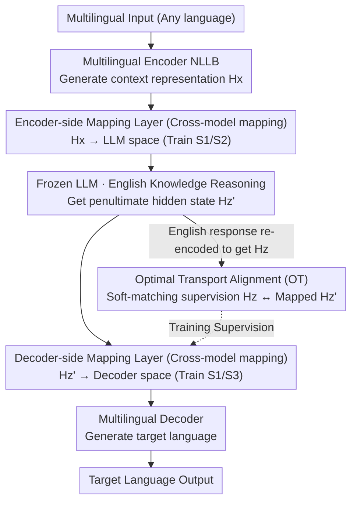

# Language on Demand, Knowledge at Core: Composing LLMs with Encoder-Decoder Translation Models for Extensible Multilinguality

**Conference**: ACL 2026  
**arXiv**: [2603.17512](https://arxiv.org/abs/2603.17512)  
**Code**: [GitHub](https://github.com/ictnlp/XBridge)  
**Area**: Multilingual Translation  
**Keywords**: Multilingual LLMs, Model Composition, Encoder-Decoder Translation Models, Optimal Transport Alignment, Low-Resource Languages

## TL;DR

This paper proposes XBridge, an architecture that composes pretrained multilingual encoder-decoder translation models (e.g., NLLB) with English-centric LLMs. The encoder handles multilingual understanding, the LLM performs knowledge reasoning, and the decoder executes multilingual generation. Cross-model semantic bridging is achieved through lightweight mapping layers and optimal transport alignment, significantly outperforming baselines on low-resource and unseen languages.

## Background & Motivation

**Background**: LLMs have demonstrated powerful general intelligence and reasoning capabilities, but their multilingual performance is severely imbalanced—performing excellently in English and a few high-resource languages while often failing in low-resource and unseen languages. Meanwhile, pretrained encoder-decoder translation models (e.g., NLLB) have already achieved balanced translation capabilities across hundreds of languages.

**Limitations of Prior Work**: (1) Data-level methods (multilingual fine-tuning using translated instruction data) may introduce translation noise and interfere with existing language capabilities, making it difficult to balance performance between high- and low-resource languages; (2) Existing encoder-enhancement methods (e.g., MindMerger, LayAlign) only inject multilingual encoder representations at the input side to improve understanding, but generation still relies on the LLM's original language distribution (typically English); (3) A natural extension is to add a multilingual decoder, but inserting a frozen LLM between the encoder and decoder introduces representation space mismatch—the LLM's output no longer meets the cross-attention expectations of the decoder.

**Key Challenge**: The core limitation of LLMs is not a lack of knowledge, but rather the inability to effectively interface knowledge within its unified semantic space with diverse language representation spaces. Encoder-decoder translation models provide complementary multilingual understanding and generation capabilities, but their representation spaces are heterogeneous and unaligned with LLMs.

**Goal**: To construct an Encoder-LLM-Decoder composite architecture that offloads multilingual understanding and generation tasks to an external translation model while keeping the LLM frozen as an English-centric knowledge core.

**Key Insight**: Leverage the modular nature of translation model encoders and decoders—the encoder maps multilingual input to a shared semantic space, and the decoder projects shared representations to target languages. This naturally corresponds to the input-processing-output pipeline of LLMs. The critical challenge lies in aligning cross-model representations.

**Core Idea**: Build a "Semantic Bridge" that transforms representations from the multilingual encoder space to the LLM input space using lightweight mapping layers, and then maps them to the decoder generation space after LLM knowledge processing. Token-level fine-grained semantic alignment is achieved using an optimal transport objective.

## Method

### Overall Architecture

XBridge adopts a three-stage Encoder-LLM-Decoder architecture: (1) A multilingual encoder (e.g., NLLB encoder) receives input in any language and generates context representations $H_x$; (2) An encoder-side mapping layer projects $H_x$ into the LLM representation space, which is then fed into the frozen LLM alongside English instructions for knowledge processing; (3) While the LLM generates an English response, its penultimate layer hidden states are projected via a decoder-side mapping layer into the decoder representation space, serving as the cross-attention input for the multilingual decoder. During training, optimal transport alignment pulls the representations actually seen by the decoder back into the shared semantic space of the encoder-decoder, with the entire bridge being aligned through a three-stage progressive training process.

### Key Designs

**1. Cross-Model Mapping: Using two lightweight projections to connect heterogeneous Encoder, LLM, and Decoder spaces into a single pipeline.**

The encoder, frozen LLM, and decoder each have their own representation spaces, making direct connection impossible. XBridge inserts a linear mapping at each of the two interfaces. The encoder-side $\text{Mapping}_{enc}$ projects encoder representations $H_x \in \mathbb{R}^{n \times d_e}$ to the LLM dimension $\tilde{H}_x \in \mathbb{R}^{n \times d_l}$, allowing multilingual understanding results to be fed in a format the LLM can process. The decoder-side $\text{Mapping}_{dec}$ projects LLM hidden states $H_{z'} \in \mathbb{R}^{m \times d_l}$ to the decoder dimension $\tilde{H}_{z'} \in \mathbb{R}^{m \times d_d}$, serving as input for the decoder's cross-attention. A notable detail is the use of the LLM's penultimate layer rather than the final layer—the final layer is often over-aligned with the output vocabulary space, whereas the penultimate layer retains richer semantic information. The entire bridge introduces only these two projections, keeping parameter overhead minimal.

**2. Optimal Transport Alignment: Using soft-matching for token-level semantic alignment between ends with inconsistent tokenizers.**

Since the LLM and the translation model use different tokenizers, the number of tokens generated for the same sentence does not match. A simple linear projection cannot guarantee that the representations received by the decoder still fall within the shared semantic space of the encoder-decoder. XBridge addresses this by re-encoding the English sequence $z$ generated by the LLM through the encoder to obtain $H_z$, and then calculating the Optimal Transport (OT) distance between $H_z$ and the mapped $\tilde{H}_{z'}$, using cosine distance as the transport cost. OT naturally supports many-to-many soft matching and is robust to sequence length differences. Thus, even if the token counts differ, it provides fine-grained, differentiable alignment supervision to pull the representations seen by the decoder back to the shared semantic space.

**3. Three-Stage Progressive Training Strategy: Decoupling "space alignment" and "task adaptation" to prevent conflicting optimization objectives.**

Optimizing the mapping layers, decoder cross-attention, and downstream adaptation simultaneously from scratch can lead to instability as the encoder-side and decoder-side objectives compete. XBridge employs a three-stage progression: Stage 1 uses trilingual translation data (Source-English-Target) to train both mapping layers and decoder cross-attention, establishing a coarse-grained cross-model alignment. Stage 2 freezes the decoder-side and fine-tunes only the encoder-side mapping layer using task instruction data, teaching the LLM how to use multilingual representations to execute tasks. Stage 3 freezes the encoder-side and fine-tunes the decoder-side mapping layer using OT loss plus decoder generation loss, focusing on multilingual generation quality. By stabilizing the LLM's conditional distribution first before optimizing the decoder output, the optimization objectives are decoupled, enabling training convergence.

### Loss & Training

The total loss consists of three components: LLM English generation cross-entropy $\mathcal{L}_{CE\_LLM}$, decoder multilingual generation cross-entropy $\mathcal{L}_{CE\_Dec}$, and optimal transport alignment loss $\mathcal{L}_{OT}$, with different subsets used in different stages. The LLM remains frozen throughout, with only the mapping layers and decoder cross-attention parameters being trained.

## Key Experimental Results

### Main Results

| System (LLM=LLaMA3-8B) | Low-res X→En | Low-res En→X | High-res X→En | High-res En→X |
|----------------------|------------|------------|------------|------------|
| LLaMA3-8B Original | 29.83 | 13.18 | 45.28 | 36.24 |
| MindMerger | 33.86 | - | 42.52 | - |
| LayAlign | 32.95 | - | 41.29 | - |
| **Ours (XBridge)** | **37.09** | **28.42** | **45.75** | **35.45** |
| NLLB-200-1.3B | 37.78 | 32.83 | 46.23 | 39.91 |

### Ablation Study

| Configuration | Low-res BLEU | High-res BLEU | Description |
|------|-----------|-----------|------|
| Full XBridge | 37.09 / 28.42 | 45.75 / 35.45 | Complete model |
| w/o OT Alignment | - ~2-3 pts | - ~1-2 pts | Token-level alignment is important |
| w/o 3-Stage Training | Unstable | Unstable | Progressive training is necessary |
| Using Final Layer | - ~1-2 pts | - ~1 pt | Penultimate layer is superior |

### Key Findings

- XBridge shows the most significant improvement in low-resource languages (compared to original LLaMA3-8B, En→X increased from 13.18 to 28.42), proving the effectiveness of model composition.
- It is consistently effective across four different LLMs (MetaMath-7B, LLaMA3-8B, Aya-23-8B, Qwen2.5-7B).
- Low-resource language generation performance approaches that of the specialized NLLB translation model (28.42 vs 32.83), significantly narrowing the gap.
- Existing methods (MindMerger, LayAlign) only support the X→En direction and cannot perform multilingual generation.

## Highlights & Insights

- The "Language on Demand, Knowledge at Core" design philosophy is elegant—LLMs only need to master English reasoning, while multilingual capabilities are outsourced to translation models, leveraging the strengths of both.
- Optimal Transport alignment cleverly solves the sequence length mismatch caused by heterogeneous tokenizers, providing finer precision than simple linear projections.
- The decoupling idea in the three-stage training can be transferred to other model composition scenarios—align representation spaces first, then adapt the input and output sides separately.

## Limitations & Future Work

- Keeping the LLM frozen throughout means its internal latent multilingual knowledge cannot be fully utilized.
- Maintaining an additional translation model increases computational overhead and deployment complexity during inference.
- Current evaluation is limited to translation and simple tasks; performance in joint scenarios of complex reasoning and multilingual generation remains unknown.
- The computational complexity of OT alignment grows with sequence length, which may become a bottleneck for long-text scenarios.

## Related Work & Insights

- **vs MindMerger/LayAlign**: These methods only add a multilingual encoder at the input; generation still depends on the LLM's English distribution. XBridge adds a decoder to achieve true multilingual generation.
- **vs Data-level Enhancement**: Multilingual fine-tuning with translated instructions can damage high-resource language performance. XBridge does not modify LLM parameters, avoiding such degradation.
- **vs NLLB**: NLLB has balanced multilingual capabilities but lacks general reasoning; XBridge combines the advantages of both.

## Rating

- Novelty: ⭐⭐⭐⭐ The Encoder-LLM-Decoder composition approach is novel, though OT alignment and mapping layers are applications of existing techniques.
- Experimental Thoroughness: ⭐⭐⭐⭐ Evaluated across four LLMs, multiple tasks, and many languages, but lacks complex reasoning tasks.
- Writing Quality: ⭐⭐⭐⭐⭐ Clear motivation, precise methodological description, and intuitive diagrams.
- Value: ⭐⭐⭐⭐ Provides an elegant solution for LLM multilinguality without modifying LLM parameters.

<!-- RELATED:START -->

## Related Papers

- [\[ACL 2026\] Language Models Entangle Language and Culture](language_models_entangle_language_and_culture.md)
- [\[ICML 2026\] Optimizing Language Models for Crosslingual Knowledge Consistency](../../ICML2026/multilingual_mt/optimizing_language_models_for_crosslingual_knowledge_consistency.md)
- [\[ACL 2026\] DFKI-MLT at SemEval-2026 TASK 7: Steering Multilingual Models Towards Cultural Knowledge](dfki-mlt_at_semeval-2026_task_7_steering_multilingual_models_towards_cultural_kn.md)
- [\[ACL 2026\] NiuTrans.LMT: Toward Inclusive and Scalable Multilingual Machine Translation with LLMs](niutranslmt_toward_inclusive_and_scalable_multilingual_machine_translation_with_.md)
- [\[ACL 2026\] EMCEE: Improving Multilingual Capability of LLMs via Bridging Knowledge and Reasoning with Extracted Synthetic Multilingual Context](emcee_improving_multilingual_capability_of_llms_via_bridging_knowledge_and_reaso.md)

<!-- RELATED:END -->
