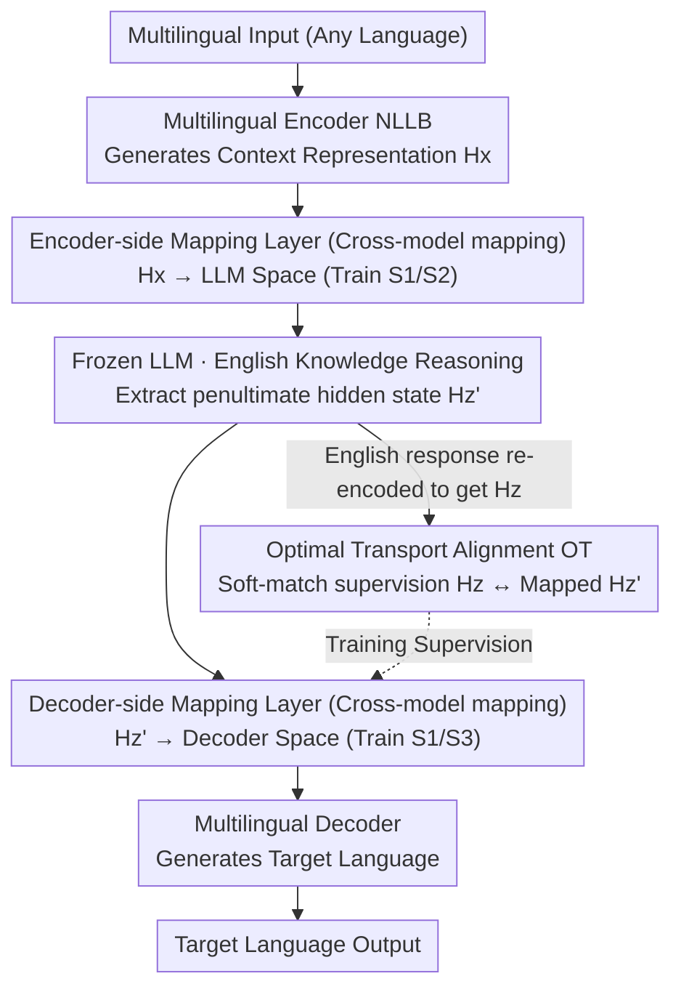

# Language on Demand, Knowledge at Core: Composing LLMs with Encoder-Decoder Translation Models for Extensible Multilinguality

**Conference**: ACL 2026  
**arXiv**: [2603.17512](https://arxiv.org/abs/2603.17512)  
**Code**: [GitHub](https://github.com/ictnlp/XBridge)  
**Area**: Multilingual Translation  
**Keywords**: Multilingual LLM, Model Composition, Encoder-Decoder Translation Models, Optimal Transport Alignment, Low-resource Languages

## TL;DR

This paper proposes XBridge, an architecture that composes a pre-trained multilingual encoder-decoder translation model (such as NLLB) with an English-centric LLM. The encoder handles multilingual understanding, the LLM performs knowledge reasoning, and the decoder executes multilingual generation. This cross-model semantic bridging is achieved through lightweight mapping layers and Optimal Transport alignment, significantly outperforming baselines on low-resource and unseen languages.

## Background & Motivation

**Background**: LLMs demonstrate powerful general intelligence and reasoning capabilities, but their multilingual performance is severely unbalanced—excelling in English and a few high-resource languages while often failing in low-resource and unseen languages. Meanwhile, pre-trained encoder-decoder translation models (e.g., NLLB) already support balanced translation across hundreds of languages.

**Limitations of Prior Work**: (1) Data-level methods (multilingual fine-tuning via translated instruction data) may introduce translation noise and interfere with existing language capabilities, making it difficult to balance high- and low-resource performance; (2) Existing encoder-enhancement methods (e.g., MindMerger, LayAlign) only inject multilingual encoder representations at the input side to improve understanding, but generation still relies on the LLM's original language distribution (typically English); (3) A natural extension is to include a multilingual decoder, but inserting a frozen LLM between the encoder and decoder introduces representation space mismatches—LLM outputs no longer align with the decoder's cross-attention expectations.

**Key Challenge**: The core limitation of LLMs is not a lack of knowledge, but the inability to effectively interface knowledge in their unified semantic space with diverse linguistic representation spaces. Encoder-decoder translation models provide complementary multilingual understanding and generation capabilities, but their representation spaces are heterogeneous and unaligned.

**Goal**: Construct an encoder-LLM-decoder composition architecture to offload multilingual understanding and generation tasks to an external translation model while maintaining the frozen LLM as an English-centric knowledge core.

**Key Insight**: Leverage the modular nature of translation model encoders and decoders—the encoder maps multilingual inputs to a shared semantic space, and the decoder projects shared representations to target languages—which naturally corresponds to the LLM's input-processing-output flow. The key challenge lies in cross-model representation alignment.

**Core Idea**: Build a "Semantic Bridge" that converts representations from the multilingual encoder space to the LLM input space using lightweight mapping layers, and then maps them to the decoder generation space after LLM knowledge processing. Token-level fine-grained semantic alignment is achieved using an Optimal Transport objective.

## Method

### Overall Architecture

XBridge adopts a three-stage Encoder-LLM-Decoder architecture: (1) A multilingual encoder (e.g., NLLB encoder) receives input in any language and generates context representations $H_x$; (2) An encoder-side mapping layer projects $H_x$ into the LLM representation space, where it is fed into a frozen LLM alongside English instructions for knowledge processing; (3) While the LLM generates an English response, its penultimate hidden states are projected via a decoder-side mapping layer into the decoder representation space to serve as cross-attention input for the multilingual decoder. During training, Optimal Transport alignment pulls the representations actually seen by the decoder back toward the encoder-decoder shared semantic space. The entire bridge is aligned through a three-stage progressive training process.

### Key Designs

**1. Cross-Model Mapping: Connecting three heterogeneous spaces into a pipeline using two lightweight projections**

The encoder, frozen LLM, and decoder each have their own representation spaces. XBridge inserts a linear mapping at each interface to bridge them. The encoder-side $\text{Mapping}_{enc}$ projects encoder representations $H_x \in \mathbb{R}^{n \times d_e}$ into the LLM dimension $\tilde{H}_x \in \mathbb{R}^{n \times d_l}$, allowing multilingual understanding results to be fed in a format the LLM can process. The decoder-side $\text{Mapping}_{dec}$ projects LLM hidden states $H_{z'} \in \mathbb{R}^{m \times d_l}$ into the decoder dimension $\tilde{H}_{z'} \in \mathbb{R}^{m \times d_d}$ to serve as cross-attention input. Notably, the penultimate layer of the LLM is used instead of the final layer, as the final layer is overly aligned with the output vocabulary space, whereas the penultimate layer retains richer semantic information. This bridge introduces minimal parameter overhead.

**2. Optimal Transport Alignment: Token-level semantic alignment across inconsistent tokenizers**

Since the LLM and the translation model use different tokenizers, the number of tokens generated for the same sentence does not match. XBridge passes the English sequence $z$ generated by the LLM back through the encoder to obtain $H_z$, then calculates the Optimal Transport (OT) distance between $H_z$ and the mapped $\tilde{H}_{z'}$, using cosine distance as the transport cost. OT naturally supports many-to-many soft matching and is robust to sequence length differences, providing fine-grained, differentiable alignment supervision that pulls the decoder's input back into the shared semantic space even when token counts differ.

**3. Mechanism (Three-stage progressive training): Decoupling "space alignment" and "task adaptation" to avoid objective conflict**

Optimizing mapping layers, decoder cross-attention, and downstream adaptation simultaneously from scratch can lead to unstable training. XBridge utilizes three stages: Stage 1 uses trilingual translation data (Source-English-Target) to train both mapping layers and decoder cross-attention, establishing coarse cross-model alignment. Stage 2 freezes the decoder side and fine-tunes only the encoder-side mapping layer with task instruction data to teach the LLM how to use multilingual representations. Stage 3 freezes the encoder side and fine-tunes the decoder-side mapping layer using OT loss and decoder generation loss to refine multilingual generation quality.

### Loss & Training

The total loss includes three terms: LLM English generation cross-entropy $\mathcal{L}_{CE\_LLM}$, decoder multilingual generation cross-entropy $\mathcal{L}_{CE\_Dec}$, and Optimal Transport alignment loss $\mathcal{L}_{OT}$. Different subsets are used across stages. The LLM remains frozen throughout, with only the mapping layers and decoder cross-attention parameters being trained.

## Key Experimental Results

### Main Results

| System (LLM=LLaMA3-8B) | Low-resource X→En | Low-resource En→X | High-resource X→En | High-resource En→X |
|----------------------|------------|------------|------------|------------|
| LLaMA3-8B Original | 29.83 | 13.18 | 45.28 | 36.24 |
| MindMerger | 33.86 | - | 42.52 | - |
| LayAlign | 32.95 | - | 41.29 | - |
| **Ours (XBridge)** | **37.09** | **28.42** | **45.75** | **35.45** |
| NLLB-200-1.3B | 37.78 | 32.83 | 46.23 | 39.91 |

### Ablation Study

| Configuration | Low-resource BLEU | High-resource BLEU | Note |
|------|-----------|-----------|------|
| Full Ours | 37.09 / 28.42 | 45.75 / 35.45 | Complete model |
| w/o OT Alignment | Decreased ~2-3 pts | Decreased ~1-2 pts | Token-level alignment is critical |
| w/o Three-stage Training | Unstable training | Unstable training | Progressive training is necessary |
| Using Final Layer Hidden States | Decreased ~1-2 pts | Decreased ~1 pt | Penultimate layer is superior |

### Key Findings

- XBridge shows the most significant gains on low-resource languages (En→X improved from 13.18 to 28.42 compared to LLaMA3-8B original), proving the effectiveness of model composition.
- Consistently effective across four different LLMs (MetaMath-7B, LLaMA3-8B, Aya-23-8B, Qwen2.5-7B).
- Low-resource language generation performance approaches that of the specialized NLLB translation model (28.42 vs 32.83), greatly narrowing the gap.
- Existing methods (MindMerger, LayAlign) only support the X→En direction and cannot perform multilingual generation.

## Highlights & Insights

- The "Language on Demand, Knowledge at Core" design philosophy is elegant—LLMs only need to master English reasoning, while multilingual capabilities are outsourced to translation models.
- Optimal Transport alignment elegantly solves the sequence length mismatch caused by heterogeneous tokenizers, providing more precision than simple linear projections.
- The decoupling idea in three-stage training is transferable to other model composition scenarios—aligning representation spaces first, then adapting input and output ends separately.

## Limitations & Future Work

- Freezing the LLM throughout means potential internal multilingual knowledge within the LLM remains unexploited.
- Requires maintaining an additional translation model, increasing computational overhead and deployment complexity during inference.
- Currently evaluated only on translation and simple tasks; performance in joint scenarios (complex reasoning + multilingual generation) remains unknown.
- The computational complexity of OT alignment grows with sequence length, which may become a bottleneck for long-text scenarios.

## Related Work & Insights

- **vs MindMerger/LayAlign**: These only add a multilingual encoder at the input; generation still depends on the LLM's English distribution. XBridge adds a decoder for true multilingual generation.
- **vs Data-level Augmentation**: Fine-tuning with translated instructions can hurt high-resource performance; XBridge avoids this by not modifying LLM parameters.
- **vs NLLB**: NLLB has balanced multilingual capabilities but lacks general reasoning; XBridge combines the strengths of both.

## Rating

- Novelty: ⭐⭐⭐⭐ The Encoder-LLM-Decoder composition is novel, though OT alignment and mapping layers are applications of existing techniques.
- Experimental Thoroughness: ⭐⭐⭐⭐ Evaluation across four LLMs, multiple tasks, and languages, though complex reasoning tasks are missing.
- Writing Quality: ⭐⭐⭐⭐⭐ Clear motivation, precise method description, and intuitive diagrams.
- Value: ⭐⭐⭐⭐ Provides an elegant solution for LLM multilingualism without modifying LLM parameters.

<!-- RELATED:START -->

## Related Papers

- [\[ACL 2026\] Language Models Entangle Language and Culture](language_models_entangle_language_and_culture.md)
- [\[ICML 2026\] Optimizing Language Models for Crosslingual Knowledge Consistency](../../ICML2026/multilingual_mt/optimizing_language_models_for_crosslingual_knowledge_consistency.md)
- [\[ACL 2026\] DFKI-MLT at SemEval-2026 TASK 7: Steering Multilingual Models Towards Cultural Knowledge](dfki-mlt_at_semeval-2026_task_7_steering_multilingual_models_towards_cultural_kn.md)
- [\[ACL 2026\] LLM-XTM: Enhancing Cross-Lingual Topic Models with Large Language Models](llm-xtm_enhancing_cross-lingual_topic_models_with_large_language_models.md)
- [\[ACL 2026\] NiuTrans.LMT: Toward Inclusive and Scalable Multilingual Machine Translation with LLMs](niutranslmt_toward_inclusive_and_scalable_multilingual_machine_translation_with_.md)

<!-- RELATED:END -->
