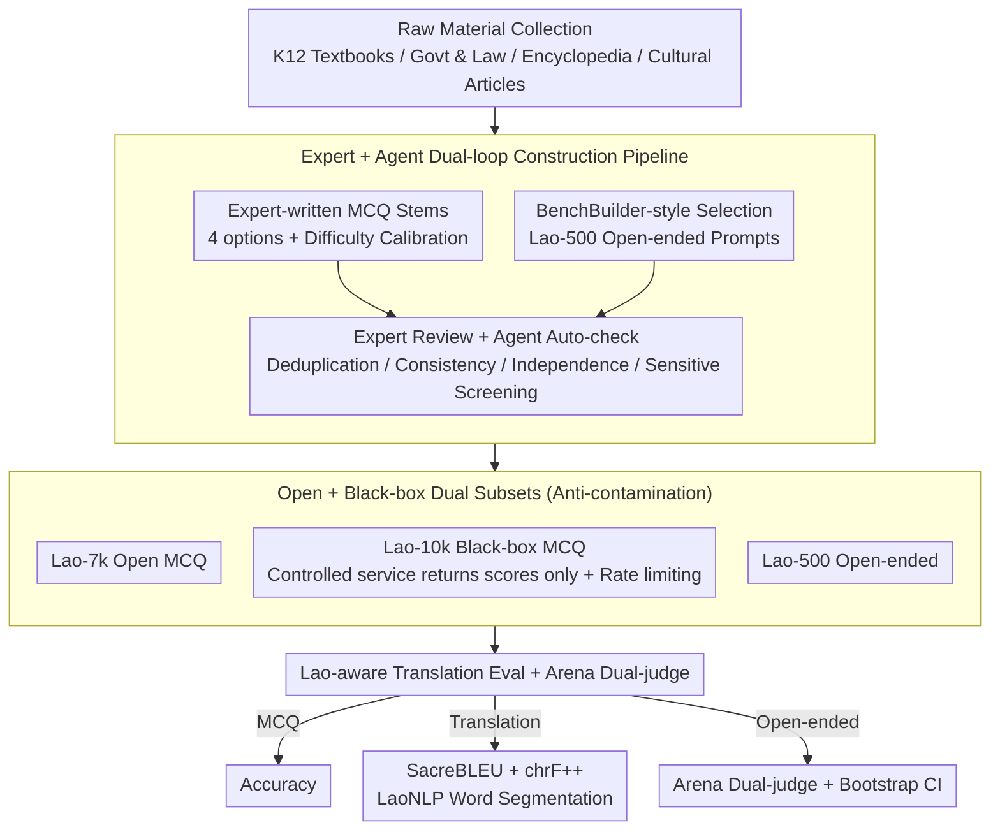

# LaoBench: A Large-Scale Multidimensional Lao Benchmark for Large Language Models

**Conference**: ACL 2026  
**arXiv**: [2511.11334](https://arxiv.org/abs/2511.11334)  
**Code**: https://huggingface.co/datasets/BAAI/LaoBench  
**Area**: Multilingual Evaluation / Low-resource Languages / Southeast Asian Languages / Datasets  
**Keywords**: Lao, Low-resource NLP, Cultural Reasoning, Black-box Evaluation, Expert + Agent Collaborative Construction  

## TL;DR
LaoBench is the first large-scale, multidimensional Lao evaluation benchmark for LLMs, containing 17,000+ expert-curated samples. It covers three dimensions: Culture-Knowledge Application, Lao K12 Curriculum, and Lao-Chinese-English trilingual translation. It features a unique three-part design—Open-source 7k + Black-box 10k + Open-ended 500. The 10k black-box set prevents contamination via a controlled scoring service. Mainstream closed-source models (GPT-5-High, Gemini-2.5-Pro, etc.) still lag behind human experts by ~10-20 percentage points, indicating that Lao cultural reasoning and translation fidelity remain significant unsolved challenges.

## Background & Motivation

**Background**: LLM evaluation is heavily biased toward high-resource languages. Although Southeast Asian (SEA) benchmarks like SeaEval, SEA-HELM, and SeaExam exist, Lao is almost entirely absent. The few existing Lao resources are task-specific (morphology, bilingual MT) and lack systematic, reproducible "general LLM capability evaluation."

**Limitations of Prior Work**: (1) Most SEA benchmarks are either translated from English (losing local cultural anchoring) or only test high-level multilingual reasoning while skipping curriculum-aligned native proficiency. (2) Lao is *scriptio continua* (continuous writing without clear word boundaries), making traditional BLEU and tokenizers inaccurate. (3) Public benchmarks are increasingly plagued by contamination and leaderboard overfitting; low-resource languages like Lao particularly lack black-box evaluation services.

**Key Challenge**: To measure the true capability of LLMs in low-resource languages, a benchmark must simultaneously possess: native expert authorship, multidimensional coverage (knowledge/education/translation), a black-box mechanism to counter data contamination, and reproducible statistical protocols—none of the existing Lao resources integrate all these elements.

**Goal**: (1) Construct the first large-scale Lao benchmark authored by local native speakers; (2) Cover Culture-Knowledge Application, K12 curriculum, and Lao↔Zh↔En trilingual translation; (3) Design open + black-box dual subsets to combat contamination; (4) Use an Expert + Agent collaborative pipeline to balance quality and scale; (5) Systematically evaluate mainstream open/closed-source LLMs to quantify the gap with human experts.

**Key Insight**: Benchmark construction is re-envisioned as an integrated engineering problem involving **software + workflow + evaluation protocol**. Beyond providing data, this work standardizes the entire process of "how to fairly evaluate a Lao model" by providing Lao-aware SacreBLEU configurations, Arena-style open-ended evaluation, bootstrap CI, multi-judge aggregation, and a black-box service API.

**Core Idea**: Utilize three dimensions × three subsets (Lao-7k Open MCQ / Lao-10k Black-box MCQ / Lao-500 Open-ended prompts) constructed via an Expert + Agent dual-loop, supported by an Arena dual-judge + bootstrap CI evaluation protocol.

## Method

### Overall Architecture
The LaoBench construction pipeline consists of three stages (Figure 1): (A) **Raw Material Collection**—collecting K12 textbooks, government/legal documents, encyclopedia educational publications, and local cultural articles from authoritative Lao sources; (B) **Dataset Construction**—the MCQ subsets (Lao-7k Open + Lao-10k Black-box) were handwritten by 11 Lao native experts (question stems, 4 options, and difficulty calibration); the Lao-500 open-ended prompts were selected from a large candidate pool using a BenchBuilder-style pipeline (LLM scoring for specificity/clarity/domain depth + topic clustering + diversity sampling); (C) **Multi-stage Verification**—expert review + automated agent checks (duplication detection, semantic consistency, context independence, and sensitive content screening). The 17,000+ samples are organized into Knowledge Application, K12, and Translation dimensions, each further divided into subdomains. For evaluation, accuracy is used for MCQs, SacreBLEU + chrF++ (standardized with LaoNLP word segmentation) for translation, and Arena dual-judge pairwise evaluation for Lao-500.

### Key Designs

**1. Expert + Agent dual-loop construction pipeline: Outsourcing mechanical tasks to Agents while reserving cultural judgment for native experts to balance fidelity and scale.**

Writing 17k+ questions manually is cost-prohibitive, while pure Agent generation is prone to errors. Therefore, LaoBench adopts a Hendrycks-style hybrid pipeline. On the human side, 55 contributors were divided by roles—25 domain experts wrote questions, 11 translation experts handled bilingual alignment, 10 senior reviewers provided final audits, and 9 NLP data curators managed the process. Each question was reviewed by at least 2 independent experts, with discrepancies resolved by senior reviewers. For the open-ended Lao-500, a BenchBuilder-style pipeline was used to select high-quality prompts from a candidate pool. On the Agent side, mechanical steps were executed: duplicate detection (character n-gram + embedding retrieval), semantic consistency (verifying the unique correct answer), context independence (removing questions reliant on external info), and sensitivity screening. A sample test of 500 questions yielded a Fleiss $\kappa{=}0.87$, indicating substantial agreement and proving that this division of labor controls costs while maintaining native fidelity.

**2. Open + Black-box dual subsets for anti-contamination: Keeping half of the questions private so low-resource benchmarks are not "absorbed" by pre-training corpora.**

Once a low-resource benchmark is fully public, it is almost inevitably absorbed into the pre-training data of next-generation models, leading to distorted scores. LaoBench addresses this by splitting the MCQ dataset: Lao-7k is open for reproducibility, while the Lao-10k questions are never released. Evaluators must either submit an item ID to answer dictionary or provide an inference API endpoint for the controlled service to run standardized prompts. The service returns only overall and subdomain accuracy, with submission rate limits to prevent leaderboard overfitting. Even the open subset underwent web overlap retrieval and n-gram overlap checks, identifying 6.2% of candidate samples with suspected overlap (mostly common-sense statements rather than direct leaks). This black-box service is viewed as the only realistic path for low-resource benchmarks to maintain long-term discriminative power.

**3. Lao-aware translation evaluation + Arena dual-judge for open-ended prompts: Addressing the pain points of Lao's lack of word boundaries and MCQ's inability to measure generation quality.**

Lao is *scriptio continua*, meaning scores from standard BLEU are uninterpretable. Furthermore, MCQs cannot measure the quality of generated responses. LaoBench splits the evaluation into two tracks. Translation evaluation uses SacreBLEU paired with Lao-aware word segmentation (LaoNLP v0.7), alongside chrF++ (character n-gram), which is insensitive to segmentation errors. The open-ended Lao-500 uses Arena pairwise evaluation: with GPT-5-High as the fixed baseline $B$, for each prompt $x_i$, candidate model $M$ and baseline $B$ generate responses $y_i^M, y_i^B$. Gemini-2.5-Pro + Qwen3-Max act as dual judges to determine the winner based on correctness, completeness, reasoning, clarity, and Lao fluency, outputting strict JSON to prevent leakage. To eliminate position bias, each pair is evaluated twice (swapping A/B) and averaged (ties count as 0.5), with bootstrap resampling of prompts to provide 95% CI. The final score is the average of the two judges:

$$S(M)=\frac{1}{|\mathcal{J}|}\sum_{J}\frac{1}{N}\sum_i w_i^J(M)$$

This converts "generation quality" into a standardized protocol that both humans and LLMs can judge, while bootstrap CI makes gaps between models statistically clear.

### Loss & Training
LaoBench is a dataset and evaluation protocol, not a trained model. All evaluated LLMs are tested in a zero-shot setting with a decoding temperature of 0 (when supported). MCQ outputs are post-processed for A/B/C/D labels. Both CoT (Thinking) and direct answer (Non-Thinking) variants are evaluated. The Arena judge models for Lao-500 are Gemini-2.5-Pro + Qwen3-Max; to avoid self-preference, judge models skip evaluations where they are the candidate.

## Key Experimental Results

### Main Results
Comparison of the three major dimensions on Lao-7k (K12 Avg / Translation BLEU for Social & Law / Knowledge Application Avg) (selected):

| Model | K12 Avg ↑ | Translation Soc.&Law BLEU ↑ | Knowledge App Avg ↑ |
|------|-----------|------------------------------|---------------------|
| Random Choice | 25.00 | – | 25.00 |
| Ministral-8B-Instruct | 28.29 | 0.83 | 24.15 |
| Ling-mini-2.0 | 36.91 | 0.69 | 30.25 |
| Qwen3-Next-80B-A3B-Instruct | 79.80 | 16.03 | 63.05 |
| DeepSeek-V3.2-Exp (Thinking) | 85.12 | 20.57 | 69.11 |
| Qwen3-235B-A22B-Instruct-2507 | 86.18 | 21.81 | 67.42 |
| Qwen3-Max (Closed) | 86.78 | 21.70 | 69.06 |
| Gemini-2.5-Pro | 89.56 | **26.22** | 73.68 |
| Claude-Opus-4.1 | 87.95 | 24.78 | 73.40 |
| **GPT-5-High** | **89.46** | 20.96 | **74.89** |
| **Human Experts** | **98.52** | – | **98.74** |

The gap between GPT-5-High and humans remains ~9 points in K12 and as high as ~24 points in Knowledge Application; the strongest translation BLEU is only in the mid-30s.

### Ablation Study
**Lao-500 Dual-judge Arena Cross-judge Bias Analysis** (selected):

| Model | Gemini Judge Win Rate | Qwen3-Max Judge Win Rate | Δ(G−Q) | Gap |
|------|-------------------|----------------------|--------|-----|
| Gemini-2.5-Pro | 54.22 | 48.85 | +5.37 | 5.37 |
| Qwen3-Max | 45.16 | 52.80 | −7.64 | 7.64 |
| Qwen3-235B-A22B-Instruct-2507 | 45.53 | 51.75 | −6.22 | 6.22 |
| Claude-Sonnet-4.5 thinking | 50.50 | 50.08 | +0.42 | 0.42 |
| GPT-5-High (Baseline) | 49.94 | 49.94 | 0.00 | 0.00 |

**Annotator Consistency**: Fleiss $\kappa{=}0.87$ on 500 samples; Spearman $\rho{=}0.83$ / Kendall $\tau{=}0.71$ between Lao-500 Arena judges; human sanity check on 50 questions showed 84% agreement with LLM judges.

### Key Findings
- **Closed-source ≫ Open-source remains true**: GPT-5-High, Gemini-2.5-Pro, and Claude-Opus lead in almost every subdomain, though the gap with the strongest open-source models (Qwen3-235B / DeepSeek-V3.2) has narrowed to 1-3 points.
- **K12 is significantly easier than Knowledge Application**: Structured, curriculum-aligned content is easier to handle (90%+ for strong models), whereas cultural reasoning is the true differentiator—GPT-5 drops from 89.5 in K12 to 74.9 in Knowledge App.
- **Translation BLEU is generally stuck below the mid-30s**: Culture & History and Society & Law subdomains are the hardest (specialized terminology + cultural expressions), indicating "translation fidelity" is a long-term challenge for Lao.
- **CoT (Thinking) primarily benefits cultural reasoning**: Gains are minimal in factual subdomains like K12, but stable in Knowledge Application and Translation, aligning with the intuition that CoT is effective for multi-step reasoning.
- **Judge models prefer in-family models**: Qwen3-Max judge favors the Qwen family (Δ -6 to -8), as does Gemini-2.5-Pro for its own. Dual-judge averaging + human sampling is necessary to mitigate bias.
- **Massive Human-AI Gap**: Humans (97%+) vs. strongest models (89% K12 / 75% Knowledge App) clearly points to significant headroom for improvement.

## Highlights & Insights
- Successfully implemented an anti-contamination "Open + Black-box Service" engineering plan and quantified that only 6.2% of candidates overlapped via n-gram checks, providing a template for long-term usability in low-resource benchmarks.
- Employed Lao-aware tokenization using LaoNLP v0.7 before calculating SacreBLEU + chrF++, and shared comprehensive details in the appendix (translation prompts, judge prompts, JSON specs, bootstrap processes), ensuring high reproducibility.
- The Arena dual-judge + bootstrap CI + cross-judge gap reporting for Lao-500 serves as a rare "statistical rigor model" for low-resource open-ended evaluation.
- Detailed the roles and backgrounds of 55 contributors (PhD/Master/Bachelor distribution) alongside double-blind review and senior final audits, providing an exceptionally thorough quality assurance process for the benchmark.

## Limitations & Future Work
- The majority of the benchmark consists of MCQs, which can be influenced by "test-taking tricks" and do not fully reflect open-ended reasoning.
- Translation evaluation still relies heavily on reference translations + BLEU/chrF++, which may penalize legitimate paraphrasing; integration of more LLM-as-judge or human ratings is needed.
- Arena evaluation depends on LLM judges and a fixed baseline, introducing self-preference and anchoring biases; the authors mitigate this only partially with dual judges.
- The black-box service is not yet formally launched (listed as "upon publication"), so its actual anti-contamination effectiveness remains to be seen.
- Task coverage is limited to three categories, lacking complex tasks like coding, agents, or long-context reasoning; the number of comparable models in the Lao domain remains small.

## Related Work & Insights
- **vs. SeaEval / SEA-HELM / SeaExam**: These provide broad SEA multilingual coverage but Lao is often missing or marginal; LaoBench provides monolingual depth.
- **vs. VMLU (Vietnamese) / LoRaXBench (Indonesian)**: Similar philosophy (local native K12 + culture), but LaoBench adds translation and black-box services, serving as an "ideal template" for future language benchmarks.
- **vs. M3Exam / MiLiC-Eval / CIF-Bench**: M3Exam is multilingual K12 but not SEA-specific; CIF-Bench focuses on Chinese instruction following. LaoBench is the first to combine SEA + native + held-out elements.
- **vs. ScholarQA-CS2 / BenchBuilder**: Methodologically, Lao-500 utilize BenchBuilder-style LLM scoring + topic clustering to pick high-quality open prompts, successfully porting English community best practices to Lao.

## Rating
- Novelty: ⭐⭐⭐⭐ First multi-dimensional + black-box benchmark for Lao; substantial engineering synergy.
- Experimental Thoroughness: ⭐⭐⭐⭐ 14 SOTA models × 13 subdomains × dual protocols (Translation + Open-ended) × cross-judge bias + bootstrap CI + human sanity check.
- Writing Quality: ⭐⭐⭐⭐ Visual pipeline and comparison tables are clear; appendix is exceptionally detailed.
- Value: ⭐⭐⭐⭐⭐ Vital infrastructure for the Lao NLP community; provides a transferable engineering template for other low-resource languages.

<!-- RELATED:START -->

## Related Papers

- [\[ACL 2026\] The GaoYao Benchmark: A Comprehensive Framework for Evaluating Multilingual and Multicultural Abilities of Large Language Models](the_gaoyao_benchmark_a_comprehensive_framework_for_evaluating_multilingual_and_m.md)
- [\[ACL 2026\] LLM-XTM: Enhancing Cross-Lingual Topic Models with Large Language Models](llm-xtm_enhancing_cross-lingual_topic_models_with_large_language_models.md)
- [\[ACL 2026\] TransLaw: A Large-Scale Dataset and Multi-Agent Benchmark Simulating Professional Translation of Hong Kong Case Law](translaw_a_large-scale_dataset_and_multi-agent_benchmark_simulating_professional.md)
- [\[ACL 2026\] Evaluating Robustness of Large Language Models Against Multilingual Typographical Errors](evaluating_robustness_of_large_language_models_against_multilingual_typographica.md)
- [\[ACL 2026\] TLPO: Token-Level Policy Optimization for Mitigating Language Confusion in Large Language Models](tlpo_token-level_policy_optimization_for_mitigating_language_confusion_in_large_.md)

<!-- RELATED:END -->
