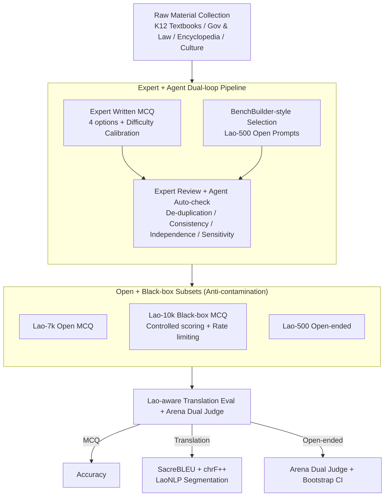

# LaoBench: A Large-Scale Multidimensional Lao Benchmark for Large Language Models

**Conference**: ACL 2026  
**arXiv**: [2511.11334](https://arxiv.org/abs/2511.11334)  
**Code**: https://huggingface.co/datasets/BAAI/LaoBench  
**Area**: Multilingual Evaluation / Low-resource Languages / Southeast Asian Languages / Datasets  
**Keywords**: Lao, Low-resource NLP, Cultural Reasoning, Black-box Evaluation, Expert+Agent Collaborative Construction

## TL;DR
LaoBench is the first large-scale, multidimensional Lao LLM evaluation benchmark. It contains 17,000+ expert-curated samples covering three dimensions: Culture-Knowledge Application, Lao K12 curriculum, and Lao-Chinese-English trilingual translation. It introduces a three-segment design: "7k Open + 10k Black-box + 500 Open-ended." The 10k black-box set prevents contamination through a controlled scoring service. Mainstream closed-source models (GPT-5-High, Gemini-2.5-Pro, etc.) still lag behind human experts by approximately 10-20 percentage points, highlighting that Lao cultural reasoning and translation fidelity remain significant unsolved challenges.

## Background & Motivation

**Background**: LLM evaluation is heavily biased toward high-resource languages. Although Southeast Asia has benchmarks like SeaEval, SEA-HELM, and SeaExam, Lao is almost entirely absent. Existing Lao resources are task-specific (morphology, bilingual MT) and lack systematic, reproducible "General LLM Capability Evaluation."

**Limitations of Prior Work**: (1) Most SEA benchmarks are either translated from English (losing local cultural anchoring) or only test high-level multilingual reasoning, skipping native language proficiency aligned with local curricula. (2) Lao is *scriptio continua* (continuous writing without clear word boundaries), making traditional BLEU/Tokenizers inaccurate. (3) Public benchmarks are increasingly plagued by contamination and leaderboard overfitting; low-resource languages like Lao particularly lack available black-box evaluation services.

**Key Challenge**: To assess the true ability of LLMs in low-resource languages, a benchmark must simultaneously possess: native expert authorship, multidimensional coverage (knowledge/education/translation), a black-box mechanism to counter data contamination, and reproducible statistical protocols—none of the existing Lao resources provide all these.

**Goal**: (1) Build the first large-scale, native-authored Lao benchmark; (2) simultaneously cover cultural-knowledge application, K12 curriculum, and Lao↔Zh↔En trilingual translation; (3) design a dual open + black-box subset to counter contamination; (4) utilize an Expert + Agent collaborative pipeline to balance quality and scale; (5) systematically evaluate mainstream open/closed-source LLMs to quantify the gap with human experts.

**Key Insight**: Treat "benchmark construction" as a holistic engineering problem involving **software + process + evaluation protocol**. This includes not just data, but also Lao-aware SacreBLEU configurations, Arena-style open-ended evaluation, bootstrap CI, multi-judge aggregation, and a black-box service API—standardizing the process of "how to fairly evaluate a Lao model."

**Core Idea**: A three-dimension × three-subset (Lao-7k Open MCQ / Lao-10k Black-box MCQ / Lao-500 Open-ended Prompt) design using an Expert + Agent double-loop construction, supported by an Arena dual-judge + bootstrap CI evaluation protocol.

## Method

### Overall Architecture
The LaoBench construction pipeline consists of three stages (Figure 1): (A) **Raw Material Collection**—collecting K12 textbooks, government/legal documents, encyclopedic educational publications, and local cultural articles from authoritative Lao sources; (B) **Dataset Construction**—the MCQ subsets (Lao-7k open + Lao-10k black-box) are written by 11 native Lao experts (question stems, 4-choice options, difficulty calibration). The Lao-500 open-ended prompts use a BenchBuilder-style pipeline (LLM scoring for specificity/clarity/domain depth + topic clustering + diversity sampling) to select 500 entries from a large candidate pool; (C) **Multi-stage Verification**—expert review + automated Agent checks (duplication detection, semantic consistency, context independence, sensitivity screening). The 17,000+ samples are organized into Knowledge Application / K12 / Translation dimensions, further subdivided into subdomains. For evaluation, MCQ uses Accuracy, translation uses SacreBLEU + chrF++ (unified via LaoNLP segmentation), and Lao-500 uses Arena-style pairwise evaluation with dual judges.

### Key Designs

**1. Expert + Agent Dual-loop Construction Pipeline: Offloading mechanical tasks to Agents while reserving cultural judgment for native experts to balance fidelity and scale.**

Writing 17k+ questions manually is cost-prohibitive, while pure Agent generation suffers from high failure rates. LaoBench adopts a Hendrycks-style hybrid pipeline. On the human side, 55 contributors are divided by roles—25 domain experts write questions, 11 translation experts perform bilingual alignment, 10 senior reviewers conduct final audits, and 9 NLP data curators manage the set. Each question is reviewed by at least 2 independent experts, with disputes resolved by senior reviewers. For the open-ended Lao-500, a BenchBuilder-style pipeline picks high-quality prompts based on LLM-rated specificity/clarity/domain depth. The Agent side handles mechanical tasks: duplicate detection (character n-gram + embedding retrieval), semantic consistency (verifying unique correct answers), context independence (removing questions reliant on external info), and sensitivity screening. A random sample of 500 questions yielded a Fleiss $\kappa{=}0.87$, indicating substantial agreement and demonstrating that this division of labor controls costs while maintaining native fidelity.

**2. Open + Black-box Dual Subsets to Counter Data Contamination: Keeping half the questions hidden to prevent low-resource benchmarks from being "absorbed" by pre-training corpora.**

Once a low-resource benchmark is fully public, it is almost inevitably absorbed into the pre-training data of next-generation models, leading to distorted scores. LaoBench splits the MCQ set into two: Lao-7k is open for reproduction research, while the Lao-10k question stems are never disclosed. Evaluators must either submit an item-ID-to-answer dictionary or provide an inference API endpoint for the controlled service to run standardized prompts. The service returns only overall and subdomain accuracy with submission rate limits to prevent leaderboard overfitting. Even the open subset underwent web/n-gram overlap checks, finding only 6.2% suspected overlap (mostly common knowledge statements rather than direct leaks). This black-box service is viewed as the only realistic path for low-resource benchmarks to maintain long-term discriminative power.

**3. Lao-aware Translation Evaluation + Arena Dual Judge for Open-ended Evaluation: Addressing the lack of word boundaries and the limitations of MCQ in assessing generation quality.**

Lao is *scriptio continua*; scores from standard BLEU are uninterpretable. Furthermore, pure MCQ cannot measure generation quality. LaoBench splits evaluation into two tracks. Translation evaluation uses SacreBLEU paired with Lao-aware LaoNLP v0.7 segmentation, additionally reporting chrF++ (character n-gram) which is insensitive to segmentation errors. The Lao-500 uses Arena pairwise evaluation: with GPT-5-High as a fixed baseline $B$, for each prompt $x_i$, candidate model $M$ and $B$ both generate answers $y_i^M, y_i^B$. Gemini-2.5-Pro + Qwen3-Max act as dual judges to determine the winner based on correctness, completeness, reasoning, clarity, and Lao fluency, outputting strict JSON to prevent leakage. Each pair is evaluated twice (swapping A/B positions) to eliminate position bias, with ties scored as 0.5. Bootstrap resampling of prompts provides a 95% CI. The final score is the average of both judges:

$$S(M)=\frac{1}{|\mathcal{J}|}\sum_{J}\frac{1}{N}\sum_i w_i^J(M)$$

By transforming "generation quality" into a standardized protocol manageable by both humans and LLMs, the bootstrap CI makes performance gaps between models statistically clear.

### Loss & Training
LaoBench is a dataset and evaluation protocol, and does not involve model training. All evaluated LLMs are tested in a zero-shot setting with a temperature of 0 (when supported). MCQ outputs are post-processed for A/B/C/D labels. Both CoT (Thinking) and direct answer (Non-Thinking) variants are evaluated. The Lao-500 Arena judges are Gemini-2.5-Pro and Qwen3-Max; to avoid self-preference, if a candidate model is used as a judge, that specific comparison is skipped.

## Key Experimental Results

### Main Results
Comparison of results on Lao-7k across three dimensions (K12 Average / Translation BLEU for Social & Law / Knowledge Application Average):

| Model | K12 Avg ↑ | Translation Soc.&Law BLEU ↑ | Knowledge App Avg ↑ |
|------|-----------|------------------------------|---------------------|
| Random Choice | 25.00 | – | 25.00 |
| Ministral-8B-Instruct | 28.29 | 0.83 | 24.15 |
| Ling-mini-2.0 | 36.91 | 0.69 | 30.25 |
| Qwen3-Next-80B-A3B-Instruct | 79.80 | 16.03 | 63.05 |
| DeepSeek-V3.2-Exp (Thinking) | 85.12 | 20.57 | 69.11 |
| Qwen3-235B-A22B-Instruct-2507 | 86.18 | 21.81 | 67.42 |
| Qwen3-Max (Closed) | 86.78 | 21.70 | 69.06 |
| Gemini-2.5-Pro | 89.56 | **26.22** | 73.68 |
| Claude-Opus-4.1 | 87.95 | 24.78 | 73.40 |
| **GPT-5-High** | **89.46** | 20.96 | **74.89** |
| **Human Experts** | **98.52** | – | **98.74** |

The gap between GPT-5-High and humans is ~9 points on K12 and ~24 points on Knowledge Application. The highest translation BLEU remains in the mid-30s.

### Ablation Study
**Lao-500 Dual Judge Arena Inter-judge Bias Analysis (Selected)**:

| Model | Gemini Win Rate | Qwen3-Max Win Rate | Δ(G−Q) | Gap |
|------|-------------------|----------------------|--------|-----|
| Gemini-2.5-Pro | 54.22 | 48.85 | +5.37 | 5.37 |
| Qwen3-Max | 45.16 | 52.80 | −7.64 | 7.64 |
| Qwen3-235B-A22B-Instruct-2507 | 45.53 | 51.75 | −6.22 | 6.22 |
| Claude-Sonnet-4.5 thinking | 50.50 | 50.08 | +0.42 | 0.42 |
| GPT-5-High（baseline） | 49.94 | 49.94 | 0.00 | 0.00 |

**Annotator Consistency**: Fleiss $\kappa{=}0.87$ on 500 samples. Lao-500 Arena inter-judge Spearman $\rho{=}0.83$ / Kendall $\tau{=}0.71$. Human sanity check agreement with LLM judges is 84% on 50 questions.

### Key Findings
- **Closed-source ≫ Open-source remains true**: GPT-5-High, Gemini-2.5-Pro, and Claude-Opus lead in almost all subdomains, though the gap with the strongest open-source models (Qwen3-235B / DeepSeek-V3.2) has narrowed to 1-3 points.
- **K12 is significantly easier than Knowledge Application**: Structured content aligned with curricula is easier to handle (90%+ for strong models), whereas cultural-anchored reasoning is the true differentiator—GPT-5 drops from 89.5 in K12 to 74.9 in Knowledge App.
- **Translation BLEU is stuck below mid-30s**: Culture & History and Society & Law are the most difficult (specialized terminology + cultural expressions), indicating translation fidelity is a long-term challenge for Lao.
- **CoT (Thinking) primarily benefits cultural reasoning**: Gains are minimal in factual subdomains like K12, but stable in Knowledge Application and translation, consistent with the intuition that CoT is effective for multi-step reasoning.
- **Judges prefer models from the same family**: Qwen3-Max judge favors Qwen models (Δ -6 to -8), and Gemini-2.5-Pro judge shows the opposite; dual-judge averaging + human sampling is necessary to mitigate bias.
- **Massive Human-AI Gap**: Humans (97%+) vs strongest models (89% K12 / 75% Knowledge App) indicates significant headroom for improvement.

## Highlights & Insights
- Successfully implements an "Open + Black-box Service" engineering solution for benchmark anti-contamination, quantifying that only 6.2% of candidates overlap with web data. This provides a template for the long-term viability of low-resource benchmarks.
- Utilizes LaoNLP for Lao-aware tokenization before calculating SacreBLEU + chrF++. Includes translation prompts, judge prompts, JSON specifications, and bootstrap processes in the appendix, ensuring high reproducibility.
- The Lao-500 Arena dual-judge + bootstrap CI protocol serves as a rare "statistical rigor template" for low-resource open-ended evaluation, ready for adoption by other language benchmarks.
- Detailing the distribution of 55 contributors (PhD/Master/Bachelor), double-blind cross-checking, and senior review processes sets a high standard for quality assurance in benchmark creation.

## Limitations & Future Work
- The majority of the benchmark is MCQ, which might benefit from "test-taking tricks" and may not fully reflect open-ended reasoning.
- Translation evaluation still relies on reference translations + BLEU/chrF++, which penalizes valid paraphrasing; future work should incorporate LLM-as-a-judge or human evaluation.
- Arena evaluation depends on LLM judges and a fixed baseline, introducing self-preference and anchoring biases, mitigated only partially by dual judges.
- The black-box service was not officially live at the time of writing (noted as "upon publication"), so its actual anti-contamination effectiveness is yet to be fully observed.
- Task coverage is limited to three types, missing code, agents, long context, and other complex tasks; the number of comparable Lao models is currently small.

## Related Work & Insights
- **vs SeaEval / SEA-HELM / SeaExam**: These focus on broad SEA multilingual coverage where Lao is either absent or marginal; LaoBench provides monolingual depth.
- **vs VMLU (Vietnamese) / LoRaXBench (Indonesian)**: Shares the philosophy of native K12 + culture. LaoBench adds translation and black-box services, serving as a "standard template" for subsequent language benchmarks.
- **vs M3Exam / MiLiC-Eval / CIF-Bench**: M3Exam is multilingual K12 but not SEA-specific; CIF-Bench focuses on Chinese instruction following. LaoBench is the first to combine SEA + native + held-out datasets.
- **vs ScholarQA-CS2 / BenchBuilder**: Methodologically, Lao-500 employs a BenchBuilder-style pipeline for LLM scoring + topic clustering, porting English community best practices to Lao.

## Rating
- Novelty: ⭐⭐⭐⭐ The first truly multidimensional + black-box benchmark for Lao. While individual techniques are not original, the combination is a substantial innovation for the language.
- Experimental Thoroughness: ⭐⭐⭐⭐ Evaluates 14 SOTA open/closed models across 13 subdomains with dual translation and open-ended protocols, inter-judge bias analysis, bootstrap CI, and human sanity checks.
- Writing Quality: ⭐⭐⭐⭐ Clear pipeline diagrams and comparison tables. The comprehensive appendix ensures excellent reproducibility.
- Value: ⭐⭐⭐⭐⭐ A zero-to-one infrastructure for the Lao NLP community, providing an engineering template directly applicable to other Southeast Asian or low-resource languages.

<!-- RELATED:START -->

## Related Papers

- [\[ACL 2026\] The GaoYao Benchmark: A Comprehensive Framework for Evaluating Multilingual and Multicultural Abilities of Large Language Models](the_gaoyao_benchmark_a_comprehensive_framework_for_evaluating_multilingual_and_m.md)
- [\[ACL 2026\] LLM-XTM: Enhancing Cross-Lingual Topic Models with Large Language Models](llm-xtm_enhancing_cross-lingual_topic_models_with_large_language_models.md)
- [\[ACL 2026\] Evaluating Robustness of Large Language Models Against Multilingual Typographical Errors](evaluating_robustness_of_large_language_models_against_multilingual_typographica.md)
- [\[ACL 2026\] TransLaw: A Large-Scale Dataset and Multi-Agent Benchmark Simulating Professional Translation of Hong Kong Case Law](translaw_a_large-scale_dataset_and_multi-agent_benchmark_simulating_professional.md)
- [\[ACL 2026\] TLPO: Token-Level Policy Optimization for Mitigating Language Confusion in Large Language Models](tlpo_token-level_policy_optimization_for_mitigating_language_confusion_in_large_.md)

<!-- RELATED:END -->
