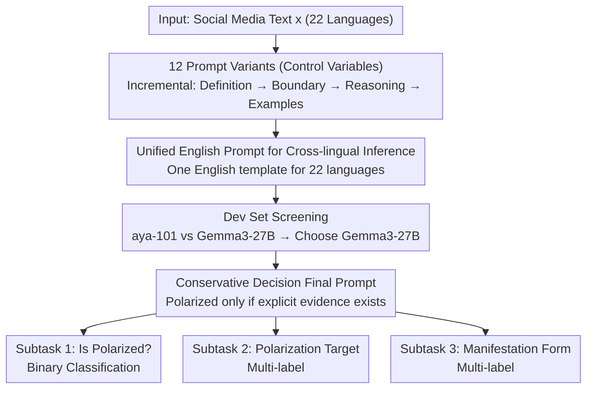

# Lingo_Research_Group at SemEval-2026 Task 9: Evaluating Prompt Variants for Polarization Detection

**Conference**: ACL 2026  
**arXiv**: [2606.03334](https://arxiv.org/abs/2606.03334)  
**Code**: None  
**Area**: Multilingual NLP / Social Issue Text Classification / Prompting  
**Keywords**: Multilingual Classification, Polarization Detection, Prompt Engineering, SemEval, Social Issues

## TL;DR
This SemEval-2026 Task 9 system paper utilizes Gemma3-27B and 12 types of English prompt variants to perform online polarization detection across 22 languages. It finds that prompt-only methods effectively complete coarse-grained binary classification but exhibit significant degradation in fine-grained multi-label tasks such as identifying polarization targets and manifestations.

## Background & Motivation
**Background**: Polarization detection in online socio-political discussions involves identifying whether text exhibits in-group/out-group opposition, hostility, exclusion, stigmatization, or denial of different groups. SemEval-2026 Task 9 extends this problem to multilingual, multicultural, and multi-event scenarios, divided into three task layers: whether polarized, type of polarization target, and manifestation of polarization.

**Limitations of Prior Work**: Polarization does not always manifest as direct hate or explicit attacks; it is often expressed through irony, cultural allusions, rhetorical questions, or ideological dog-whistles. Multilingual scenarios further amplify difficulties due to differences in discourse patterns, cultural backgrounds, and label distributions across languages.

**Key Challenge**: LLMs can perform complex classification via prompting, but prompt-only methods lack task-specific fine-tuning and language-specific adaptation. There is a distinct trade-off between high-precision conservative judgments and high-recall fine-grained identification. Coarse-grained judgments need to avoid false positives, whereas fine-grained multi-label tasks must capture implicit targets and rhetorical expressions.

**Goal**: Instead of training a new model, the authors systematically compare the impact of prompt design on multilingual polarization detection and submit a SemEval system covering all three subtasks.

**Key Insight**: The paper designs 12 short prompts ranging from simple to complex, progressively adding terminological clarity, task definitions, reasoning steps, and in-context examples, while comparing aya-101 and Gemma3-27B. Ultimately, based on development phase performance, Gemma3-27B and the most instructional prompt are selected for test submission.

**Core Idea**: Multilingual polarization analysis is unified as an instruction-following classification problem, using prompt variants as control variables to observe how task complexity and language differences affect the classification boundaries of LLMs.

## Method
The methodology of this paper is lightweight: no fine-tuning, no external data, and no data augmentation. Instead, all three subtasks are encapsulated as prompt-based inference. Its value lies primarily in the systematic comparison of prompt structures and reporting of cross-lingual error patterns.

### Overall Architecture
The input is a social media text $x$. Subtask 1 outputs a binary label determining if the text expresses attitude polarization; Subtask 2 outputs a multi-label vector marking target types (political, racial/ethnic, religious, gender/sexual orientation, or other); Subtask 3 outputs a multi-label vector marking manifestations (stereotype, vilification, dehumanization, extreme language, lack of empathy, invalidation, etc.).

The system evaluates different prompt and model combinations on training data first, then fixes the selected prompt with Gemma3-27B for submission on the official held-out test set. Evaluation metrics use macro-averaged F1 because class imbalance exists across all three tasks, particularly in multi-label tasks where minority labels significantly impact macro F1.

### Key Designs

**1. 12 prompt variants as control variables: Using stepped prompts to isolate the roles of "Definition/Reasoning/Examples"**

Polarization judgment depends heavily on boundary definitions. The same sentence may be categorized differently under loose vs. strict criteria. The authors investigated which specific information in a prompt influences the model. They designed a 12-level ladder of prompts with progressively increasing information: Prompts 1-2 provide almost no context (weakest baseline); Prompts 3-4 add a short task definition; Prompts 5-6 explicitly state the polarized/non-polarized decision boundaries; Prompts 7-8 require the model to analyze step-by-step before concluding; Prompts 9-12 incorporate in-context examples. Since each level adds only one type of information, comparing adjacent levels allows for isolating the contributions of terminology clarity, task definition, reasoning steps, and examples as controlled variables.

**2. Unified English prompt for cross-lingual inference: One English template for 22 languages**

Covering 22 languages in a short SemEval window makes per-language prompt customization costly. The authors used a single set of English prompts without modification for any language, relying on the multilingual pre-training of Gemma3-27B to understand diverse language inputs and output binary or multi-label sets. This simplifies localization engineering and turns "language" into a controlled variable: since the prompt is identical, cross-lingual score differences are attributed solely to the model's multilingual capability and language-specific discourse patterns. This clearly exposed the weaknesses of prompt-only methods (e.g., Subtask 1 macro F1 dropped from 0.92 in Chinese to 0.35 in Italian).

**3. Conservative decision-style final prompt: Preferring false negatives over false positives for coarse-grained tasks**

The official evaluation uses macro F1, sensitive to both false positives and false negatives. Since the cost of false positives in coarse-grained binary classification is more intuitive, the authors injected a conservative bias into the final prompt: a text is judged as polarized only when explicit, unambiguous evidence exists. This rule reduced false positives and raised macro F1 in Subtask 1, but the cost appeared in fine-grained tasks—Subtask 2/3 require capturing weak explicit signals like irony and ideological dog-whistles. The conservative boundary discarded these as "insufficient evidence," systematically suppressing recall and causing the performance degradation curve seen as tasks became more granular.

### Loss & Training
Ours involves no model training or loss functions. The strategy fixed the generation configuration, used training data to select the prompt and model, and then evaluated on the official test set. It is explicitly stated that no external data or augmentation was used. Subtask 1 outputs a single binary label, while Subtask 2/3 output a set of binary judgments for each category.

## Key Experimental Results

### Main Results
Official test set results show that as task granularity increases, performance decreases. Subtask 1 is 22-language binary classification; Subtask 2 is 22-language target multi-label; Subtask 3 is 18-language manifestation multi-label.

| Subtask | Task Format | Languages | Avg Macro F1 | Avg Accuracy | Main Conclusion |
|---------|-------------|-----------|--------------|--------------|-----------------|
| Subtask 1 | Binary Polarization | 22 | 0.762 | 0.819 | Prompt-only is effective for coarse detection |
| Subtask 2 | Target Multi-label | 22 | 0.587 | 0.678 | Significant drop when moving to target ID |
| Subtask 3 | Manifestation Multi-label | 18 | 0.444 | 0.498 | Identifying abstract rhetoric causes the most drop |

### Ablation Study
The paper does not report individual dev set scores for all 12 prompts, so an exact numerical ablation table cannot be constructed. Differences can be inferred from the methodology:

| Prompt Group | Information Added | Observed Effect in Text | Specific Score |
|--------------|-------------------|--------------------------|----------------|
| Prompts 1-2 | Minimal context | Weakest definition baseline | Not reported |
| Prompts 3-4 | Short task definition | Helps model understand polarized label | Not reported |
| Prompts 5-6 | Explicit boundaries | Improves boundary judgment, lowers FP | Not reported |
| Prompts 7-8 | Step-by-step reasoning | Strengthens analysis, but no recall guarantee | Not reported |
| Prompts 9-12 | In-context examples | Improves performance, may introduce bias | Not reported |
| Final Prompt | Def + Examples + Conservative | Best for Subtask 1, recall suppressed in 2/3 | Refer to Main Results |

### Key Findings
- In Subtask 1, Chinese macro F1 was 0.9211 and Nepali was 0.9180, while Italian was only 0.3459. Figures show significant cross-lingual variance from ~0.92 to 0.35.
- Hausa achieved 0.8936 accuracy in Subtask 1, but a positive F1 of 0.0000 and macro F1 of 0.4719, indicating high accuracy stemmed from systematic negative class prediction.
- In Subtask 2, Chinese macro F1 was 0.8250, Urdu 0.7978, and Hindi 0.7704; Hausa was 0.3022 and Italian 0.3409.
- In Subtask 3, Hindi macro F1 reached 0.7186 (among the highest); Hausa was 0.1111 and Bengali 0.1609, showing manifestation identification is sensitive to language and label sparsity.
- Analysis suggests English performance is not necessarily superior because English polarization often relies on irony and implicit framing, which conservative prompts tend to miss.

## Highlights & Insights
- The practical value of this system paper lies in demonstrating the boundaries of prompt-only multilingual classification: binary classification is acceptable, but multi-label refinement degrades rapidly.
- The "conservative prompt" is a double-edged sword. It reduces false positives in Subtask 1 but misses irony, cultural allusions, and implicit exclusion in Subtasks 2/3.
- Language performance is not solely determined by pre-training resource volume. Nepali and Chinese performed well in Subtask 1/2 perhaps because polarization is often expressed via explicit group references; Hindi's strength in Subtask 3 might suggest that rhetoric in its corpora maps more directly to labels.
- This paper serves as a reminder that multilingual social NLP tasks cannot rely on average scores. Hausa's high accuracy but low F1 is a classic case where macro F1 and per-language recall are necessary to reveal if the system truly identifies the positive class.

## Limitations & Future Work
- The authors admit the final prompt is conservative, favoring precision over recall, especially in fine-grained tasks.
- All prompts were in English without per-language localization; future work could compare native-language, bilingual, or culture-specific prompts.
- Translation-based reasoning might stabilize model behavior but could weaken emotional and rhetorical intensity, particularly hindering manifestation identification.
- In-context examples improve performance but may introduce representation bias if primarily sourced from English/Western contexts.
- There is a lack of full numerical ablation for each prompt variant, making it difficult to pinpoint which prompt element contributes the most.

## Related Work & Insights
- **vs. task-specific fine-tuning**: Fine-tuning depends on annotation and training costs; Ours demonstrates a fast prompt-only baseline. Pros: simple/scalable; Cons: insufficient fine-grained recall.
- **vs. prompt tuning / PEFT**: This paper utilizes no parameter updates, only natural language prompt modification, resulting in lower deployment costs but no ability to learn task-specific boundaries.
- **vs. multilingual hate-speech detection**: Polarization detection is more subtle than hate speech; many samples lack explicit insults, requiring focus on framing, group boundaries, and rhetorical dismissal.
- **Inspiration for future work**: Consistently conservative prompts could be ensembled with recall-boosted prompts, or native prompts could be automatically selected by language to mitigate recall suppression in Subtasks 2/3.

## Rating
- Novelty: ⭐⭐⭐ (System entry solution, limited method innovation)
- Experimental Thoroughness: ⭐⭐⭐⭐ (Covers 3 subtasks and 22 languages, though prompt ablation lacks full numbers)
- Writing Quality: ⭐⭐⭐ (Complete structure, but some expressions and table descriptions are a bit rough)
- Value: ⭐⭐⭐⭐ (Strong reference for prompt baselines, error analysis, and task difficulty in multilingual social NLP)

<!-- RELATED:START -->

<!-- RELATED:END -->

## Related Papers

- [\[ACL 2026\] DFKI-MLT at SemEval-2026 TASK 7: Steering Multilingual Models Towards Cultural Knowledge](dfki-mlt_at_semeval-2026_task_7_steering_multilingual_models_towards_cultural_kn.md)
- [\[ACL 2026\] Is Human-Like Text Liked by Humans? Multilingual Human Detection and Preference Against AI](is_human-like_text_liked_by_humans_multilingual_human_detection_and_preference_a.md)
- [\[ACL 2026\] BhashaSutra: A Task-Centric Unified Survey of Indian NLP Datasets, Corpora, and Resources](bhashasutra_a_task-centric_unified_survey_of_indian_nlp_datasets_corpora_and_res.md)
- [\[ACL 2026\] MORPHOGEN: A Multilingual Benchmark for Evaluating Gender-Aware Morphological Generation](morphogen_a_multilingual_benchmark_for_evaluating_gender-aware_morphological_gen.md)
- [\[ACL 2026\] Evaluating the Impact of Verbal Multiword Expressions on Machine Translation](evaluating_the_impact_of_verbal_multiword_expressions_on_machine_translation.md)

<!-- RELATED:END -->
